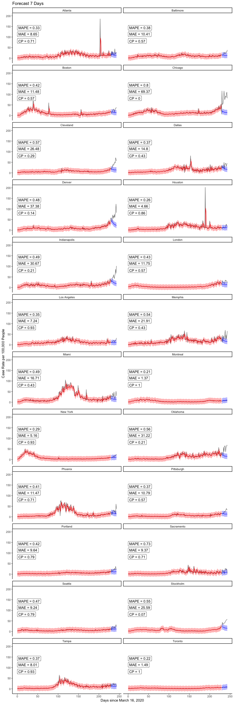
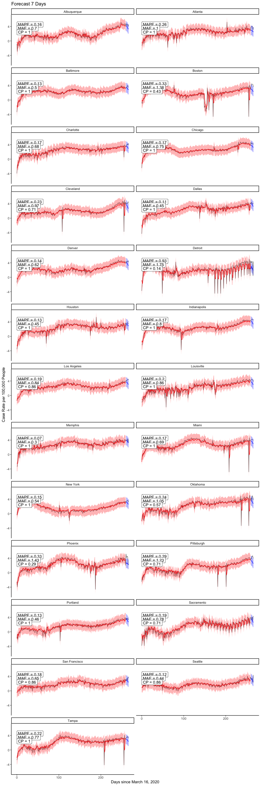

# Downloading and getting data in shape

<br />

## Initial work

- First need to read in all.csv off Ken's GitHub page; to do this, load RCurl package to use getURL function w/in read.csv, as the csv file is embedded within an html file (typical for GitHub).


```r
alldata <-
  read.csv(text=getURL("https://raw.githubusercontent.com/kentranz/socialMobilityCOVID/master/data/all.csv"), 
           header=T)
## the above file has already been updated for standardized 
##    Apple mobility data, and various indicator variables for
##    dates of interest, as well as lagged cases variables, etc.
##    --> it has longitudinal data for 24 cities,
##          20 in US, and Toronto, Montreal, London, and Stockholm

str(alldata)
```

```
## 'data.frame':	6216 obs. of  43 variables:
##  $ city                   : Factor w/ 24 levels "Atlanta","Baltimore",..: 1 1 1 1 1 1 1 1 1 1 ...
##  $ date                   : Factor w/ 259 levels "2020-03-01","2020-03-02",..: 1 2 3 4 5 6 7 8 9 10 ...
##  $ newCases               : int  0 2 0 0 0 0 4 4 5 4 ...
##  $ casesTminus1           : int  0 0 2 0 0 0 0 4 4 5 ...
##  $ casesTminus2           : int  0 0 0 2 0 0 0 0 4 4 ...
##  $ drivingMinus7          : num  6.73 3.59 7.82 13.01 15.97 ...
##  $ transitMinus7          : num  4.81 -2.85 3.34 4.61 12.06 ...
##  $ walkingMinus7          : num  4.54 -11.14 4.76 8.71 27.63 ...
##  $ drivingMinus8          : num  12.09 6.73 3.59 7.82 13.01 ...
##  $ transitMinus8          : num  7.51 4.81 -2.85 3.34 4.61 ...
##  $ walkingMinus8          : num  23.44 4.54 -11.14 4.76 8.71 ...
##  $ drivingMinus9          : num  7.82 12.09 6.73 3.59 7.82 ...
##  $ transitMinus9          : num  2.84 7.51 4.81 -2.85 3.34 ...
##  $ walkingMinus9          : num  5.55 23.44 4.54 -11.14 4.76 ...
##  $ drivingMinus10         : num  3.31 7.82 12.09 6.73 3.59 ...
##  $ transitMinus10         : num  -1.88 2.84 7.51 4.81 -2.85 ...
##  $ walkingMinus10         : num  1.55 5.55 23.44 4.54 -11.14 ...
##  $ drivingMinus11         : num  7.4 3.31 7.82 12.09 6.73 ...
##  $ transitMinus11         : num  2.76 -1.88 2.84 7.51 4.81 ...
##  $ walkingMinus11         : num  2.39 1.55 5.55 23.44 4.54 ...
##  $ drivingMinus12         : num  4.48 7.4 3.31 7.82 12.09 ...
##  $ transitMinus12         : num  1.55 2.76 -1.88 2.84 7.51 ...
##  $ walkingMinus12         : num  -8.78 2.39 1.55 5.55 23.44 ...
##  $ drivingMinus13         : num  7.27 4.48 7.4 3.31 7.82 ...
##  $ transitMinus13         : num  5.24 1.55 2.76 -1.88 2.84 7.51 4.81 -2.85 3.34 4.61 ...
##  $ walkingMinus13         : num  6.26 -8.78 2.39 1.55 5.55 ...
##  $ drivingMinus14         : num  8.11 7.27 4.48 7.4 3.31 ...
##  $ transitMinus14         : num  4.49 5.24 1.55 2.76 -1.88 2.84 7.51 4.81 -2.85 3.34 ...
##  $ walkingMinus14         : num  19.55 6.26 -8.78 2.39 1.55 ...
##  $ driving                : num  16.99 8.03 3.64 8.07 8.83 ...
##  $ walking                : num  26.35 -3.94 -0.85 -5.03 6.17 ...
##  $ transit                : num  12.27 3.27 -2.91 -4.81 1.56 ...
##  $ anomalousWeekend       : int  0 0 0 0 0 0 0 0 0 0 ...
##  $ longWeekend            : int  0 0 0 0 0 0 0 0 0 0 ...
##  $ weekend                : int  1 0 0 0 0 0 1 1 0 0 ...
##  $ sumDrivingMinus7_14    : num  8.17 7.53 7.61 8.82 10.05 ...
##  $ sumTransitMinus7_14    : num  3.9 2.85 2.58 3.02 4.35 ...
##  $ sumWalkingMinus7_14    : num  7.79 3.4 3.19 5.69 9.29 ...
##  $ Population             : int  5950000 5950000 5950000 5950000 5950000 5950000 5950000 5950000 5950000 5950000 ...
##  $ LandAreakm             : int  21694 21694 21694 21694 21694 21694 21694 21694 21694 21694 ...
##  $ Poverty.rate           : num  13.9 13.9 13.9 13.9 13.9 13.9 13.9 13.9 13.9 13.9 ...
##  $ Median.age             : num  36.6 36.6 36.6 36.6 36.6 36.6 36.6 36.6 36.6 36.6 ...
##  $ Median.household.income: num  69464 69464 69464 69464 69464 ...
```

- Code to read in data and output from `str` call hidden from this output.  Most R code below for data manipulation will also be hidden from output, and only selective dataset elements will be displayed. Alternatively, R code for data analyses and resulting output will more generally be displayed.

- Will output variable names though:


```
##  [1] "city"                    "date"                   
##  [3] "newCases"                "casesTminus1"           
##  [5] "casesTminus2"            "drivingMinus7"          
##  [7] "transitMinus7"           "walkingMinus7"          
##  [9] "drivingMinus8"           "transitMinus8"          
## [11] "walkingMinus8"           "drivingMinus9"          
## [13] "transitMinus9"           "walkingMinus9"          
## [15] "drivingMinus10"          "transitMinus10"         
## [17] "walkingMinus10"          "drivingMinus11"         
## [19] "transitMinus11"          "walkingMinus11"         
## [21] "drivingMinus12"          "transitMinus12"         
## [23] "walkingMinus12"          "drivingMinus13"         
## [25] "transitMinus13"          "walkingMinus13"         
## [27] "drivingMinus14"          "transitMinus14"         
## [29] "walkingMinus14"          "driving"                
## [31] "walking"                 "transit"                
## [33] "anomalousWeekend"        "longWeekend"            
## [35] "weekend"                 "sumDrivingMinus7_14"    
## [37] "sumTransitMinus7_14"     "sumWalkingMinus7_14"    
## [39] "Population"              "LandAreakm"             
## [41] "Poverty.rate"            "Median.age"             
## [43] "Median.household.income"
```

- Here, *newCases* will be converted into a rate, and this, and the first two days of lagged case rate values, will serve as the primary response and two predictors, respectively.

- The time variable will be a converted version of *date*.  This, and the previous bullet point will be worked on in the next subsection.


<br />

## Additional data manipulation

- Creating a US city indicator variable, i.e., 1 if US city, 0 for non-US city.


### Play with dates

- First, note that not all 24 cities had counts available to us starting at earlier date in our dataset of March 1, 2019, while all cities had observations starting March 13th.  As of the November 14th end dataset (the one being worked on here), these earlier dates in March, for cities where they were not originally collected, were entered in original dataset as 0's.  This seems a reasonable choice given the very low or non-existent case counts in many cities at that time.  In addition, we will not be use data earlier than March 13th in our analyses, so those 0's are irrelevant for our work here.

- Dates are in character form, and need to change to numeric for modeling.

- Need to align all new day variable to min of observed dates, so day 0 will 2020-03-01, but will have a second new day variable that will be about 2 days after 2020-03-13 (make this the midpoint of March, i.e., March 16th), to allow for two days of lagged cases as predictors; the lagged 7-day mobility data is actually available since near Feb 1, if we ever need it.

- Aside from March 16th start date, we will make one for April 1st, and one that is based on a French study (Prague et al., 2020), which is dynamic based on specifically starting on the first day of cases for which it is followed by
at least 3 consecutive days of cases as well; this took longer to program.

- Will use *chron* package in R to help with dates and specifying initial origin at March 1st (day 0). As suggested on *chron* help page, use `options` argument to set default first day --- could do this twice to help create two sets of two columns, one where 03-01-20 is default and one for 03-16-20;
a 2nd option is to subset data when modeling such that all dates are
at least 03-16-20 when we want to have the later start/default date, which
will only affect the intercept interpretation; will take the 2nd approach
where day 15 (16th day), i.e., 03-16-20, will be first day w/ all complete data that accounts for two lagged cases days.


- Here is where French start day will be defined, which will be the 1st day that at least 4 consecutive days of cases start.  Code will identify sequences in a vector.  Output prints first day of French method in each city.


```
##         city.FM startdate.FM
## 1       Atlanta     03/07/20
## 2     Baltimore     03/13/20
## 3        Boston     03/05/20
## 4       Chicago     03/08/20
## 5     Cleveland     03/13/20
## 6        Dallas     03/09/20
## 7        Denver     03/09/20
## 8       Houston     03/12/20
## 9  Indianapolis     03/08/20
## 10       London     03/01/20
## 11  Los Angeles     03/03/20
## 12      Memphis     03/18/20
## 13        Miami     03/10/20
## 14     Montreal     03/08/20
## 15     New York     03/04/20
## 16     Oklahoma     03/15/20
## 17      Phoenix     03/16/20
## 18   Pittsburgh     03/13/20
## 19     Portland     03/12/20
## 20   Sacramento     03/12/20
## 21      Seattle     03/01/20
## 22    Stockholm     03/01/20
## 23        Tampa     03/15/20
## 24      Toronto     03/01/20
```

- Dec 17 2020:  The above all provided, it should be mentioned that the use of the French method and start dates other than 03-16-20 will be put off for potential future use.


### Creating case rates

- Making another column in dataset, which is a rate, i.e.,
    number of cases per 100000 people in population.  This will
    be the longitudinal response variable in our graphing and modeling.
    To do this, taking *newCases*, divide by Population (in city), and      multiplying by 100000; will do this for *caseTminus1* and *caseTminus2*         variables as well:


<br />

---

# Start longitudinal work

<br />

## Initial graphing

- Start with using *nlme* library, created so-called groupedData objects, which benefit both graphing and modeling using the `lme` function (and other modeling functions) within *nlme*.


- Create plots from groupedData objects; nlme generic plotting on these objects uses Trellis graphs here.

<!-- --><!-- -->


## Data Partition

- We used start date as 2020-03-16, because that was the first date that allowed for at least 2 lagged observerations in all cities.
- Train set used data until 2020-10-31
- Test sets: 
  - test7: first 7 days in November
  - test14: first 14 days in November
  


```r
cutOff <- as.Date("2020-10-31")

train <- alldata.groupedR %>% 
  filter(day031620 >= 0 & as.Date(date) <= cutOff)


test7 <- alldata.groupedR %>% 
  filter(day031620 >= 0 & as.Date(date) > cutOff & as.Date(date) <= (cutOff + 7)) %>%
  select(city, day031620, date, weekend, case.rate, casesTminus1.rate, casesTminus2.rate, walkingMinus7, walkingMinus14) %>%
  
  # retained lag case rates for first 2 days only, zero out the rest
  mutate(
    casesTminus1.rate = case_when(as.Date(date) == (cutOff + 1) ~ casesTminus1.rate
                                    , TRUE ~ 0
                                  ) 
    , casesTminus2.rate = case_when(as.Date(date) == (cutOff + 1) | as.Date(date) == (cutOff + 2) ~ casesTminus2.rate
                                    , TRUE ~ 0
                                  ) 
  )
  
  
test14 <- alldata.groupedR %>% 
  filter(day031620 >= 0 & as.Date(date) > cutOff) %>%
  select(city, day031620, date, weekend, case.rate, casesTminus1.rate, casesTminus2.rate, walkingMinus7, walkingMinus14) %>%
  
  # retained lag case rates for first 2 days only, zero out the rest
  mutate(
    casesTminus1.rate = case_when(as.Date(date) == (cutOff + 1) ~ casesTminus1.rate
                                    , TRUE ~ 0
                                  ) 
    , casesTminus2.rate = case_when(as.Date(date) == (cutOff + 1) | as.Date(date) == (cutOff + 2) ~ casesTminus2.rate
                                    , TRUE ~ 0
                                  ) 
  )


nrow(train)
```

```
## [1] 5520
```

```r
nrow(test7)
```

```
## [1] 168
```

```r
nrow(test14)
```

```
## [1] 336
```
  


## Automate extracting 95% CI for prediction band, metrics, and plotting

Predict one day at a time, feedforward the prediction as lag case.rate. 


```r
forecastLME <- function(model, test) # provide model obj and test set
{
  for (i in 1:nrow(test))
  {
    
    pred <- predict(model, newdata = test[i,])
    test[i, 'pred'] <- pred
    
    # if second day or later, use pred case.rate as lag-1
    if ( i <= (nrow(test)-1) & as.Date(test[i+1,'date']) > cutOff+1)
    {
      test[i+1, 'casesTminus1.rate'] <- pred
    }
    
    # if third day or later, use pred case.rate as lag-2
    if (i <= (nrow(test)-2) & as.Date(test[i+2,'date']) > (cutOff + 2))
    {
      test[i+2, 'casesTminus2.rate'] <- pred
    }
  
  }
  
  return(test)
}

#forecast(model = case.rate.lme20201031
#         , test = test14
#         )
```


Extract 95% CI for prediction band. References from the web:

- https://stackoverflow.com/questions/14358811/extract-prediction-band-from-lme-fit and 
- http://bbolker.github.io/mixedmodels-misc/glmmFAQ.html#predictions-andor-confidence-or-prediction-intervals-on-predictions

SE: This approach takes into account the uncertainty of the random effect in the prediction. 

SE2: This takes into account both random effect uncertainty and within-group error


```r
#model <- case.rate.lme20201031

metricsFuncLME <- function(model)
{
  results7 <- forecastLME(model, test = test7)
  
  # create design mateix
  # [-2] drops response from formula
  Designmat <- model.matrix(formula(model)[-2], results7)
  
  # compute XVX′ to get the variance-covariance matrix of the predictions
  # extract the diagonal of this matrix to get variances of predictions
  predvar <- diag(Designmat %*% vcov(model) %*% t(Designmat)) 
  results7$SE <- sqrt(predvar) 
  results7$SE2 <- sqrt(predvar + model$sigma^2) # sigma is the estimated within-group error standard deviation
  
  
  results14 <- forecastLME(model, test = test14)
  
  Designmat <- model.matrix(formula(model)[-2], results14)
  predvar <- diag(Designmat %*% vcov(model) %*% t(Designmat)) 
  results14$SE <- sqrt(predvar) 
  results14$SE2 <- sqrt(predvar + model$sigma^2)


  # CALCULATE MAE, MAPE, CP
  perform7 <- results7 %>% 
  group_by(city) %>% 
  summarize(MAE = round(mean(abs(case.rate - pred)) , 2)
            , MAPE = round(mean(abs(case.rate - pred)/case.rate) , 2)
            , CP = round(sum(case.rate >= (pred - 1.96*SE2) & case.rate <= (pred + 1.96*SE2) ) / n() , 2)
            ) #%>%
  #as.data.frame() %>%
  #print()


  perform14 <- results14 %>% 
    group_by(city) %>% 
    summarize(MAE = round(mean(abs(case.rate - pred)) , 2)
              , MAPE = round(mean(abs(case.rate - pred)/case.rate) , 2)
              , CP = round(sum(case.rate >= (pred - 1.96*SE2) & case.rate <= (pred + 1.96*SE2) ) / n() , 2)
              ) #%>%
    #as.data.frame() %>%
    #print()
  
  metrics <- perform7 %>%
    left_join(perform14 
              , by = "city"
              , suffix = c("_7d", "_14d")
              ) #%>%
    #as.data.frame() %>%
    #print()
  
  return(list(performMetrics = metrics
              , results7 = results7
              , results14 = results14))
}


plotFuncLME <- function(model
                     , forecastLength # only 7 or 14 as numeric arg
                     )
{
  
  if(forecastLength == 7)
  { results = output$results7
    
    perform <- output$performMetrics %>% 
      select(city, contains("7d"))
  }
  
  if(forecastLength == 14)
  { results = output$results14
    
    perform <- output$performMetrics %>% 
      select(city, contains("14d")) 
  }
  
  perform <- setNames(perform, gsub("_.*", "", names(perform)))
  
  perform <- perform %>%
    mutate(MAPE = paste0("MAPE = ", MAPE)
                      , MAE = paste0("MAE = ", MAE)
                      , CP = paste0("CP = ", CP)
                      )
  
  
  Designmat <- model.matrix(formula(model)[-2], train)
  predvar <- diag(Designmat %*% vcov(model) %*% t(Designmat)) 
  
  plotDF <- train %>% 
    select(city, day031620, case.rate) %>%
    mutate(city = as.character(city)
           , SE2 = sqrt(predvar + model$sigma^2)
           , upperCI.fitted = case.rate + 1.96*SE2
           , lowerCI.fitted = case.rate - 1.96*SE2
           , fitted = predict(model, data = train)
           ) %>%
    reshape::melt(id = c('city', 'day031620')) %>%
    
    # bring into forecasted case rates
    rbind(results %>% 
            select(city, day031620, case.rate, pred, SE2) %>% 
            #rename(case.rate = pred) %>% 
            mutate(upperCI.pred = pred + 1.96*SE2
                   , lowerCI.pred = pred - 1.96*SE2
                   ) %>%
            reshape2::melt(id = c('city', 'day031620'))
          ) 
      
  
  p <- ggplot(plotDF 
              , aes(day031620, value, group = variable, colour = variable)) +
    
    geom_line(data = filter(plotDF, variable == 'case.rate'), linetype = "solid", color = 'black', alpha = 0.6) + 
    geom_line(data = filter(plotDF, variable == 'fitted'), linetype = "solid", color = 'red') +
    geom_line(data = filter(plotDF, variable == 'pred'), linetype = "solid", color = 'blue') +
    
    # uncertainty band for fitted model
    geom_ribbon(data = filter(plotDF, variable == 'lowerCI.fitted')
      , aes(ymin = filter(plotDF, variable == 'lowerCI.fitted')$value
                    , ymax =  filter(plotDF, variable == 'upperCI.fitted')$value
                    )
                , alpha = 0.3
                , color = NA
                , fill = "red") +
    
    # prediction band for forecast
    geom_ribbon(data = filter(plotDF, variable == 'lowerCI.pred')
      , aes(ymin = filter(plotDF, variable == 'lowerCI.pred')$value
                    , ymax =  filter(plotDF, variable == 'upperCI.pred')$value
                    )
                , alpha = 0.3
                , color = NA
                , fill = "blue") +
    
    facet_wrap(. ~ city, ncol = 2) +
    ggtitle(paste0('Forecast ', forecastLength, ' Days')) +
    ylab('Case Rate per 100,000 People') +
    xlab('Days since March 16, 2020') +
    #ylim(-15,100) +
    
    # add performance metrics
    geom_label(data = perform 
               , aes(label = MAPE), 
              x = 0, y = 155, hjust="inward", vjust="inward",
              inherit.aes = FALSE) +
    geom_label(data = perform 
               , aes(label = MAE), 
              x = 0, y = 100, hjust="inward", vjust="inward",
              inherit.aes = FALSE) +
    geom_label(data = perform 
                , aes(label = CP), 
               x = 0, y = 70, hjust="inward", vjust="inward",
               inherit.aes = FALSE) +
     
    theme_classic() +
    theme(legend.position = 'none') 
    
  p
}
```


## Initial modeling, using `lme` function
- Aside from dealing with heteroskedasticity, the following was the best model from earlier runs, through June 30th end data at the time, starting with March 16th data.  This is a linear mixed effects model, with case rate as the response, the fixed effects being the first two lagged case rate variables and the weekend indicator variable, and the random effects being the time-varying lagged case rate variables; there is no random intercept, shown not to be needed due to the relatively low levels across all cities near March 16th. 


```r
case.rate.lme20201031 <- 
  lme(fixed = case.rate ~ casesTminus1.rate + casesTminus2.rate + weekend,
      random = ~ casesTminus1.rate + casesTminus2.rate - 1 | city,
      data = train
      )

summary(case.rate.lme20201031)
```

```
## Linear mixed-effects model fit by REML
##  Data: train 
##        AIC      BIC    logLik
##   36173.54 36226.46 -18078.77
## 
## Random effects:
##  Formula: ~casesTminus1.rate + casesTminus2.rate - 1 | city
##  Structure: General positive-definite, Log-Cholesky parametrization
##                   StdDev     Corr  
## casesTminus1.rate 0.07906328 cssT1.
## casesTminus2.rate 0.04288122 -0.435
## Residual          6.36425583       
## 
## Fixed effects: case.rate ~ casesTminus1.rate + casesTminus2.rate + weekend 
##                        Value  Std.Error   DF   t-value p-value
## (Intercept)        2.0832864 0.13890398 5493 14.998033       0
## casesTminus1.rate  0.4925348 0.02381341 5493 20.683084       0
## casesTminus2.rate  0.3444545 0.01836626 5493 18.754750       0
## weekend           -1.6611547 0.19088747 5493 -8.702272       0
##  Correlation: 
##                   (Intr) cssT1. cssT2.
## casesTminus1.rate -0.216              
## casesTminus2.rate -0.163 -0.613       
## weekend           -0.340 -0.010 -0.028
## 
## Standardized Within-Group Residuals:
##         Min          Q1         Med          Q3         Max 
## -10.4156308  -0.3069059  -0.1145507   0.1803790  30.2216519 
## 
## Number of Observations: 5520
## Number of Groups: 24
```


```r
output <- metricsFuncLME(model = case.rate.lme20201031)

allMetrics <- output$performMetrics %>%
  rename_at(vars(-city), function(x) {paste0(x, "_lme")})

plotFuncLME(model = case.rate.lme20201031
         , forecastLength = 7)
```

<!-- -->

```r
plotFuncLME(model = case.rate.lme20201031
         , forecastLength = 14)
```

<!-- -->

## Weighted Residual LME

Use weights to account for within-group heteroskedasticity


```r
case.rate.lme20201031.reweighed <- 
  lme(fixed = case.rate ~ casesTminus1.rate + casesTminus2.rate + weekend
      , random = ~ casesTminus1.rate + casesTminus2.rate - 1 | city
      , data = train
      , weights = varPower(form = ~ fitted(.))
      , control = lmeControl(maxIter = 1e4) 
      )

summary(case.rate.lme20201031.reweighed)
```

```
## Linear mixed-effects model fit by REML
##  Data: train 
##        AIC      BIC    logLik
##   31729.13 31788.67 -15855.56
## 
## Random effects:
##  Formula: ~casesTminus1.rate + casesTminus2.rate - 1 | city
##  Structure: General positive-definite, Log-Cholesky parametrization
##                   StdDev     Corr  
## casesTminus1.rate 0.04657375 cssT1.
## casesTminus2.rate 0.05341980 -1    
## Residual          1.23431651       
## 
## Variance function:
##  Structure: Power of variance covariate
##  Formula: ~fitted(.) 
##  Parameter estimates:
##     power 
## 0.6615344 
## Fixed effects: case.rate ~ casesTminus1.rate + casesTminus2.rate + weekend 
##                        Value  Std.Error   DF   t-value p-value
## (Intercept)        0.6067771 0.05237126 5493 11.586069       0
## casesTminus1.rate  0.5251840 0.02241606 5493 23.428912       0
## casesTminus2.rate  0.4529136 0.02316685 5493 19.550074       0
## weekend           -0.6734462 0.06969851 5493 -9.662275       0
##  Correlation: 
##                   (Intr) cssT1. cssT2.
## casesTminus1.rate -0.118              
## casesTminus2.rate -0.085 -0.909       
## weekend           -0.638  0.065 -0.013
## 
## Standardized Within-Group Residuals:
##         Min          Q1         Med          Q3         Max 
## -3.53641049 -0.39252818 -0.09136324  0.25386495 30.15586818 
## 
## Number of Observations: 5520
## Number of Groups: 24
```

```r
output <- metricsFuncLME(model = case.rate.lme20201031.reweighed)

allMetrics <- allMetrics %>% left_join(
    output$performMetrics %>%
      rename_at(vars(-city), function(x) {paste0(x, "_lmeWt")})
    , by = "city"
    )


plotFuncLME(model = case.rate.lme20201031.reweighed
         , forecastLength = 7)
```

<!-- -->

```r
plotFuncLME(model = case.rate.lme20201031.reweighed
         , forecastLength = 14)
```

<!-- -->


## LME Weighted Residual + Walking-7

```r
case.rate.lme20201031.reweighed.walking7 <- 
  lme(fixed = case.rate ~ casesTminus1.rate + casesTminus2.rate + weekend + walkingMinus7
      , random = ~ casesTminus1.rate + casesTminus2.rate - 1 | city
      , data = train
      , weights = varPower(form = ~ fitted(.))
      , control = lmeControl(maxIter = 1e4) 
      )

summary(case.rate.lme20201031.reweighed.walking7)
```

```
## Linear mixed-effects model fit by REML
##  Data: train 
##        AIC      BIC    logLik
##   31699.57 31765.72 -15839.78
## 
## Random effects:
##  Formula: ~casesTminus1.rate + casesTminus2.rate - 1 | city
##  Structure: General positive-definite, Log-Cholesky parametrization
##                   StdDev       Corr  
## casesTminus1.rate 5.229531e-05 cssT1.
## casesTminus2.rate 3.820032e-06 0     
## Residual          1.209377e+00       
## 
## Variance function:
##  Structure: Power of variance covariate
##  Formula: ~fitted(.) 
##  Parameter estimates:
##     power 
## 0.6704094 
## Fixed effects: case.rate ~ casesTminus1.rate + casesTminus2.rate + weekend +      walkingMinus7 
##                        Value  Std.Error   DF   t-value p-value
## (Intercept)        0.6707064 0.05589633 5492 11.999115   0e+00
## casesTminus1.rate  0.5166564 0.01955352 5492 26.422681   0e+00
## casesTminus2.rate  0.4551779 0.01951942 5492 23.319233   0e+00
## weekend           -0.6332936 0.07090597 5492 -8.931457   0e+00
## walkingMinus7      0.0038909 0.00112549 5492  3.457094   6e-04
##  Correlation: 
##                   (Intr) cssT1. cssT2. weeknd
## casesTminus1.rate -0.156                     
## casesTminus2.rate -0.108 -0.870              
## weekend           -0.506  0.056 -0.023       
## walkingMinus7      0.367 -0.058 -0.057  0.186
## 
## Standardized Within-Group Residuals:
##         Min          Q1         Med          Q3         Max 
## -3.53352794 -0.39377854 -0.08448579  0.25238647 30.29984032 
## 
## Number of Observations: 5520
## Number of Groups: 24
```

```r
output <- metricsFuncLME(model = case.rate.lme20201031.reweighed.walking7)

allMetrics <- allMetrics %>% left_join(
    output$performMetrics %>%
      rename_at(vars(-city), function(x) {paste0(x, "_lmeWtWk7")})
    , by = "city"
    )


plotFuncLME(model = case.rate.lme20201031.reweighed.walking7
         , forecastLength = 7)
```

<!-- -->


```r
plotFuncLME(model = case.rate.lme20201031.reweighed.walking7
         , forecastLength = 14)
```

<!-- -->

## Naive Multiple Regression

Automate some functions specific to LM object

```r
forecastLM <- function(model, test) # provide model obj and test set
{
  for (i in 1:nrow(test))
  {
    
    pred <- predict(model, newdata = test[i,], interval = "prediction", level = 0.95) %>% as.data.frame()
    test[i, 'pred'] <- pred$fit
    test[i, 'lowerCI'] <- pred$lwr
    test[i, 'upperCI'] <- pred$upr
    
    
    # if second day or later, use pred case.rate as lag-1
    if ( i <= (nrow(test)-1) & as.Date(test[i+1,'date']) > cutOff+1)
    {
      test[i+1, 'casesTminus1.rate'] <- pred$fit
    }
    
    # if third day or later, use pred case.rate as lag-2
    if (i <= (nrow(test)-2) & as.Date(test[i+2,'date']) > (cutOff + 2))
    {
      test[i+2, 'casesTminus2.rate'] <- pred$fit
    }
  
  }
  
  return(test)
}

# 
# 
# temp <- forecastLM(model = case.rate.lm
#         , test = test14
#         )


metricsFuncLM <- function(model)
{
  results7 <- forecastLM(model, test = test7)
  
  results14 <- forecastLM(model, test = test14)
  
  metrics <- results7 %>% 
    group_by(city) %>% 
    summarize(MAE = round(mean(abs(case.rate - pred)) , 2)
              , MAPE = round(mean(abs(case.rate - pred)/case.rate) , 2)
              , CP = round(sum(case.rate >= lowerCI & case.rate <= upperCI ) / n() , 2)
              ) %>%
    left_join( results14 %>% 
                 group_by(city) %>% 
                 summarize(MAE = round(mean(abs(case.rate - pred)) , 2)
                           , MAPE = round(mean(abs(case.rate - pred)/case.rate) , 2)
                           , CP = round(sum(case.rate >= lowerCI & case.rate <= upperCI ) / n() , 2)
                           )
               , by = "city"
               , suffix = c("_7d", "_14d")
               ) 
  
  return(list(performMetrics = metrics
              , results7 = results7
              , results14 = results14))
}


plotFuncLM <- function(model, forecastLength)
{
  
  
  if(forecastLength == 7)
  { results = output$results7
    
    metrics <- output$performMetrics %>% 
      select(city, contains("7d"))
  }
  
  if(forecastLength == 14)
  { results = output$results14
    
    metrics <- output$performMetrics %>% 
      select(city, contains("14d")) 
  }
  
  metrics <- setNames(metrics, gsub("_.*", "", names(metrics)))

  pred <- predict(model, newdata = train, interval = "prediction", level = 0.95)

  plotDF <- train %>% 
    select(city, day031620, case.rate) %>%
    mutate(city = as.character(city)) %>%
    cbind(pred) %>%
    rename(fitted = fit
           , lowerCI.fitted = lwr
           , upperCI.fitted = upr
           ) %>%
    reshape::melt(id = c('city', 'day031620')) %>%
    
    # bring into forecasted case rates
    rbind(results %>% 
            select(city, day031620, case.rate, pred, upperCI, lowerCI) %>% 
            rename(upperCI.pred = upperCI
                   , lowerCI.pred = lowerCI
                   ) %>%
            reshape2::melt(id = c('city', 'day031620'))
          ) 
      
  
  p <- ggplot(plotDF 
              , aes(day031620, value, group = variable, colour = variable)) +
    
    geom_line(data = filter(plotDF, variable == 'case.rate'), linetype = "solid", color = 'black', alpha = 0.6) + 
    geom_line(data = filter(plotDF, variable == 'fitted'), linetype = "solid", color = 'red') +
    geom_line(data = filter(plotDF, variable == 'pred'), linetype = "solid", color = 'blue') +
    
    # uncertainty band for fitted model
    geom_ribbon(data = filter(plotDF, variable == 'lowerCI.fitted')
      , aes(ymin = filter(plotDF, variable == 'lowerCI.fitted')$value
                    , ymax =  filter(plotDF, variable == 'upperCI.fitted')$value
                    )
                , alpha = 0.3, color = NA
                , fill = "red") +
    
    # prediction band for forecast
    geom_ribbon(data = filter(plotDF, variable == 'lowerCI.pred')
      , aes(ymin = filter(plotDF, variable == 'lowerCI.pred')$value
                    , ymax =  filter(plotDF, variable == 'upperCI.pred')$value
                    )
                , alpha = 0.3, color = NA
                , fill = "blue") +
    
    facet_wrap(. ~ city, ncol = 2) +
    ggtitle('Forecast 7 Days') +
    ylab('Case Rate per 100,000 People') +
    xlab('Days since March 16, 2020') +
    #ylim(-15,100) +
    
    # add performance metrics
    geom_label(data = metrics %>% mutate(MAPE = paste0("MAPE = ", MAPE))
               , aes(label = MAPE), 
              x = 0, y = 155, hjust="inward", vjust="inward",
              inherit.aes = FALSE) +
    geom_label(data = metrics %>% mutate(MAE = paste0("MAE = ", MAE))
               , aes(label = MAE), 
              x = 0, y = 125, hjust="inward", vjust="inward",
              inherit.aes = FALSE) +
    geom_label(data = metrics %>% mutate(CP = paste0("CP = ", CP))
                , aes(label = CP), 
               x = 0, y = 70, hjust="inward", vjust="inward",
               inherit.aes = FALSE) +
     
    theme_classic() +
    theme(legend.position = 'none') 
    
  p
}
```


```r
case.rate.lm <- 
  lm( case.rate ~ casesTminus1.rate + casesTminus2.rate + weekend
       , data = train
       )

summary(case.rate.lm)
```

```
## 
## Call:
## lm(formula = case.rate ~ casesTminus1.rate + casesTminus2.rate + 
##     weekend, data = train)
## 
## Residuals:
##     Min      1Q  Median      3Q     Max 
## -92.542  -1.812  -0.682   1.141 190.769 
## 
## Coefficients:
##                   Estimate Std. Error t value Pr(>|t|)    
## (Intercept)        1.83578    0.12889  14.243   <2e-16 ***
## casesTminus1.rate  0.47969    0.01239  38.730   <2e-16 ***
## casesTminus2.rate  0.39510    0.01242  31.810   <2e-16 ***
## weekend           -1.67100    0.19383  -8.621   <2e-16 ***
## ---
## Signif. codes:  0 '***' 0.001 '**' 0.01 '*' 0.05 '.' 0.1 ' ' 1
## 
## Residual standard error: 6.473 on 5516 degrees of freedom
## Multiple R-squared:  0.6782,	Adjusted R-squared:  0.678 
## F-statistic:  3875 on 3 and 5516 DF,  p-value: < 2.2e-16
```

```r
output <- metricsFuncLM(model = case.rate.lm)

allMetrics <- allMetrics %>% left_join(
    output$performMetrics %>%
      rename_at(vars(-city), function(x) {paste0(x, "_lm")})
    , by = "city"
    )

plotFuncLM(model = case.rate.lm
         , forecastLength = 7)
```

<!-- -->


```r
plotFuncLM(model = case.rate.lm
         , forecastLength = 14)
```

<!-- -->


## Naive Multiple Regression with Walking-7


```r
case.rate.lm.walking7 <-
  lm( case.rate ~ casesTminus1.rate + casesTminus2.rate + weekend + walkingMinus7
       , data = train
       )

summary(case.rate.lm.walking7)
```

```
## 
## Call:
## lm(formula = case.rate ~ casesTminus1.rate + casesTminus2.rate + 
##     weekend + walkingMinus7, data = train)
## 
## Residuals:
##     Min      1Q  Median      3Q     Max 
## -92.169  -1.811  -0.622   1.093 190.565 
## 
## Coefficients:
##                    Estimate Std. Error t value Pr(>|t|)    
## (Intercept)        1.890943   0.129546  14.597  < 2e-16 ***
## casesTminus1.rate  0.476399   0.012400  38.418  < 2e-16 ***
## casesTminus2.rate  0.391947   0.012433  31.524  < 2e-16 ***
## weekend           -1.619760   0.194059  -8.347  < 2e-16 ***
## walkingMinus7      0.008028   0.002107   3.810 0.000141 ***
## ---
## Signif. codes:  0 '***' 0.001 '**' 0.01 '*' 0.05 '.' 0.1 ' ' 1
## 
## Residual standard error: 6.465 on 5515 degrees of freedom
## Multiple R-squared:  0.679,	Adjusted R-squared:  0.6788 
## F-statistic:  2917 on 4 and 5515 DF,  p-value: < 2.2e-16
```


```r
output <- metricsFuncLM(model = case.rate.lm.walking7)

allMetrics <- allMetrics %>% left_join(
    output$performMetrics %>%
      rename_at(vars(-city), function(x) {paste0(x, "_lmWk7")})
    , by = "city"
    )

plotFuncLM(model = case.rate.lm.walking7
         , forecastLength = 7)
```

<!-- -->


```r
plotFuncLM(model = case.rate.lm.walking7
         , forecastLength = 14)
```

<!-- -->


## Summary Metrics

```r
allMetrics %>% select(city, starts_with("MAPE_7d")) %>%
  arrange(as.character(city)) %>%
  as.data.frame() %>%
  print()
```

```
##            city MAPE_7d_lme MAPE_7d_lmeWt MAPE_7d_lmeWtWk7 MAPE_7d_lm
## 1       Atlanta        0.48          0.31             0.32       0.32
## 2     Baltimore        0.26          0.19             0.18       0.24
## 3        Boston        0.36          0.36             0.36       0.36
## 4       Chicago        0.75          0.71             0.71       0.76
## 5     Cleveland        0.46          0.35             0.34       0.41
## 6        Dallas        0.19          0.22             0.22       0.18
## 7        Denver        0.27          0.22             0.23       0.30
## 8       Houston        0.31          0.24             0.25       0.17
## 9  Indianapolis        0.31          0.28             0.28       0.31
## 10       London        0.35          0.27             0.28       0.33
## 11  Los Angeles        0.24          0.23             0.22       0.25
## 12      Memphis        0.47          0.45             0.44       0.48
## 13        Miami        0.36          0.35             0.38       0.46
## 14     Montreal        0.16          0.10             0.09       0.21
## 15     New York        0.12          0.19             0.20       0.18
## 16     Oklahoma        0.38          0.31             0.31       0.40
## 17      Phoenix        0.40          0.41             0.40       0.40
## 18   Pittsburgh        0.23          0.16             0.16       0.18
## 19     Portland        0.38          0.32             0.32       0.33
## 20   Sacramento        0.69          0.71             0.75       0.74
## 21      Seattle        0.51          0.50             0.49       0.49
## 22    Stockholm        0.46          0.32             0.32       0.42
## 23        Tampa        0.30          0.27             0.28       0.34
## 24      Toronto        0.16          0.19             0.20       0.12
##    MAPE_7d_lmWk7
## 1           0.30
## 2           0.22
## 3           0.37
## 4           0.76
## 5           0.39
## 6           0.19
## 7           0.30
## 8           0.20
## 9           0.30
## 10          0.35
## 11          0.24
## 12          0.46
## 13          0.47
## 14          0.16
## 15          0.21
## 16          0.40
## 17          0.40
## 18          0.17
## 19          0.32
## 20          0.80
## 21          0.48
## 22          0.42
## 23          0.34
## 24          0.14
```


```r
allMetrics %>% select(city, starts_with("MAE_7d")) %>%
  arrange(as.character(city)) %>% 
  as.data.frame() %>%
  print()
```

```
##            city MAE_7d_lme MAE_7d_lmeWt MAE_7d_lmeWtWk7 MAE_7d_lm MAE_7d_lmWk7
## 1       Atlanta      11.27         6.32            6.44      7.13         6.68
## 2     Baltimore       6.18         4.51            4.31      5.70         5.30
## 3        Boston       7.76         6.56            6.61      7.51         7.66
## 4       Chicago      62.24        58.81           59.09     62.57        62.68
## 5     Cleveland      15.35        11.25           11.06     13.65        12.88
## 6        Dallas       6.94         6.12            6.21      6.66         6.74
## 7        Denver      16.53        12.71           12.90     18.82        18.79
## 8       Houston       3.73         2.38            2.47      1.76         1.95
## 9  Indianapolis      15.09        11.95           11.79     14.90        14.58
## 10       London       8.51         6.55            6.74      8.14         8.62
## 11  Los Angeles       4.07         4.01            3.83      4.37         4.22
## 12      Memphis      12.80        10.90           10.86     13.69        13.05
## 13        Miami      11.61        11.35           12.21     14.63        14.70
## 14     Montreal       0.95         0.59            0.54      1.24         0.96
## 15     New York       1.50         2.45            2.59      2.27         2.69
## 16     Oklahoma      17.62        15.32           15.09     18.43        18.56
## 17      Phoenix       6.94         6.57            6.54      7.70         7.61
## 18   Pittsburgh       4.88         3.10            3.04      3.78         3.55
## 19     Portland       7.31         5.69            5.63      5.99         5.86
## 20   Sacramento       7.07         7.42            7.02      6.55         6.24
## 21      Seattle       8.94         7.44            7.41      7.74         7.63
## 22    Stockholm      17.44        12.36           12.33     16.17        16.17
## 23        Tampa       6.32         5.78            5.99      7.17         7.14
## 24      Toronto       1.21         1.43            1.54      0.90         1.03
```


```r
allMetrics %>% select(city, starts_with("CP_7d")) %>%
  arrange(as.character(city)) %>%
  as.data.frame() %>%
  print()
```

```
##            city CP_7d_lme CP_7d_lmeWt CP_7d_lmeWtWk7 CP_7d_lm CP_7d_lmWk7
## 1       Atlanta      0.57        0.14           0.14     0.71        0.71
## 2     Baltimore      0.71        0.57           0.43     0.71        0.86
## 3        Boston      0.71        0.14           0.14     0.86        0.86
## 4       Chicago      0.00        0.00           0.00     0.00        0.00
## 5     Cleveland      0.43        0.14           0.14     0.57        0.57
## 6        Dallas      0.86        0.43           0.43     0.86        0.86
## 7        Denver      0.43        0.00           0.00     0.29        0.29
## 8       Houston      1.00        0.43           0.43     1.00        1.00
## 9  Indianapolis      0.43        0.00           0.00     0.43        0.43
## 10       London      0.86        0.14           0.14     0.86        0.86
## 11  Los Angeles      1.00        0.29           0.29     1.00        1.00
## 12      Memphis      0.57        0.29           0.14     0.57        0.57
## 13        Miami      0.57        0.00           0.00     0.43        0.43
## 14     Montreal      1.00        1.00           1.00     1.00        1.00
## 15     New York      1.00        0.71           0.57     1.00        1.00
## 16     Oklahoma      0.43        0.29           0.29     0.43        0.43
## 17      Phoenix      1.00        0.14           0.14     0.86        0.86
## 18   Pittsburgh      0.86        0.43           0.43     0.86        1.00
## 19     Portland      0.86        0.14           0.14     1.00        1.00
## 20   Sacramento      0.86        0.14           0.14     0.86        0.86
## 21      Seattle      0.71        0.00           0.00     1.00        1.00
## 22    Stockholm      0.14        0.14           0.14     0.14        0.14
## 23        Tampa      1.00        0.14           0.14     1.00        1.00
## 24      Toronto      1.00        1.00           0.86     1.00        1.00
```


```r
allMetrics %>% select(city, starts_with("MAPE_14d")) %>%
  arrange(as.character(city)) %>%
  as.data.frame() %>%
  print()
```

```
##            city MAPE_14d_lme MAPE_14d_lmeWt MAPE_14d_lmeWtWk7 MAPE_14d_lm
## 1       Atlanta         0.58           0.29              0.29        0.33
## 2     Baltimore         0.41           0.29              0.27        0.38
## 3        Boston         0.44           0.36              0.37        0.42
## 4       Chicago         0.79           0.74              0.74        0.80
## 5     Cleveland         0.62           0.48              0.47        0.57
## 6        Dallas         0.39           0.26              0.27        0.37
## 7        Denver         0.43           0.31              0.32        0.48
## 8       Houston         0.49           0.25              0.25        0.26
## 9  Indianapolis         0.49           0.37              0.36        0.49
## 10       London         0.44           0.32              0.33        0.43
## 11  Los Angeles         0.32           0.31              0.29        0.35
## 12      Memphis         0.50           0.41              0.41        0.54
## 13        Miami         0.35           0.36              0.38        0.49
## 14     Montreal         0.12           0.08              0.07        0.21
## 15     New York         0.19           0.30              0.32        0.29
## 16     Oklahoma         0.54           0.47              0.46        0.56
## 17      Phoenix         0.37           0.36              0.36        0.41
## 18   Pittsburgh         0.44           0.29              0.28        0.37
## 19     Portland         0.52           0.38              0.38        0.42
## 20   Sacramento         0.70           0.73              0.76        0.73
## 21      Seattle         0.56           0.43              0.42        0.47
## 22    Stockholm         0.59           0.43              0.43        0.55
## 23        Tampa         0.31           0.29              0.30        0.37
## 24      Toronto         0.15           0.17              0.17        0.22
##    MAPE_14d_lmWk7
## 1            0.30
## 2            0.35
## 3            0.43
## 4            0.80
## 5            0.54
## 6            0.36
## 7            0.48
## 8            0.24
## 9            0.47
## 10           0.46
## 11           0.33
## 12           0.50
## 13           0.49
## 14           0.13
## 15           0.34
## 16           0.56
## 17           0.40
## 18           0.35
## 19           0.41
## 20           0.78
## 21           0.46
## 22           0.56
## 23           0.36
## 24           0.19
```


```r
allMetrics %>% select(city, starts_with("MAE_14d")) %>%
  arrange(as.character(city)) %>% 
  as.data.frame() %>%
  print()
```

```
##            city MAE_14d_lme MAE_14d_lmeWt MAE_14d_lmeWtWk7 MAE_14d_lm
## 1       Atlanta       14.43          6.72             6.75       8.65
## 2     Baltimore       11.15          8.03             7.51      10.41
## 3        Boston       12.08          9.05             9.15      11.48
## 4       Chicago       68.45         64.14            64.51      69.37
## 5     Cleveland       28.91         22.34            21.86      26.48
## 6        Dallas       15.37          9.62             9.64      14.80
## 7        Denver       32.93         24.20            24.54      37.38
## 8       Houston        8.44          4.12             4.06       4.66
## 9  Indianapolis       30.87         22.67            22.26      30.67
## 10       London       12.25          8.90             9.27      11.75
## 11  Los Angeles        6.69          6.49             6.12       7.24
## 12      Memphis       20.14         15.70            15.70      21.91
## 13        Miami       12.22         12.54            13.48      16.71
## 14     Montreal        0.75          0.53             0.51       1.37
## 15     New York        3.50          5.20             5.49       5.16
## 16     Oklahoma       29.87         26.49            25.91      31.22
## 17      Phoenix        9.68          8.73             8.72      11.47
## 18   Pittsburgh       12.78          8.21             8.14      10.79
## 19     Portland       11.90          8.56             8.45       9.64
## 20   Sacramento       10.32         10.58             9.86       9.37
## 21      Seattle       11.46          8.16             8.10       9.24
## 22    Stockholm       27.17         19.93            20.00      25.59
## 23        Tampa        6.72          6.35             6.53       8.01
## 24      Toronto        1.05          1.24             1.25       1.49
##    MAE_14d_lmWk7
## 1           7.90
## 2           9.57
## 3          11.82
## 4          69.40
## 5          25.02
## 6          14.27
## 7          37.19
## 8           4.21
## 9          29.94
## 10         12.56
## 11          6.99
## 12         20.54
## 13         16.74
## 14          0.86
## 15          5.88
## 16         30.94
## 17         11.31
## 18         10.25
## 19          9.45
## 20          8.70
## 21          9.07
## 22         25.78
## 23          7.86
## 24          1.33
```


```r
allMetrics %>% select(city, starts_with("CP_14d")) %>%
  arrange(as.character(city)) %>%
  as.data.frame() %>%
  print()
```

```
##            city CP_14d_lme CP_14d_lmeWt CP_14d_lmeWtWk7 CP_14d_lm CP_14d_lmWk7
## 1       Atlanta       0.43         0.14            0.21      0.71         0.71
## 2     Baltimore       0.50         0.29            0.21      0.57         0.64
## 3        Boston       0.43         0.07            0.07      0.57         0.57
## 4       Chicago       0.00         0.00            0.00      0.00         0.00
## 5     Cleveland       0.21         0.07            0.07      0.29         0.29
## 6        Dallas       0.43         0.21            0.21      0.43         0.43
## 7        Denver       0.21         0.00            0.00      0.14         0.14
## 8       Houston       0.71         0.43            0.43      0.86         0.86
## 9  Indianapolis       0.21         0.00            0.00      0.21         0.21
## 10       London       0.57         0.07            0.07      0.57         0.57
## 11  Los Angeles       0.93         0.21            0.21      0.93         0.93
## 12      Memphis       0.43         0.29            0.21      0.43         0.43
## 13        Miami       0.57         0.07            0.07      0.43         0.43
## 14     Montreal       1.00         1.00            1.00      1.00         1.00
## 15     New York       1.00         0.43            0.29      0.93         0.93
## 16     Oklahoma       0.21         0.14            0.14      0.21         0.21
## 17      Phoenix       0.86         0.29            0.21      0.71         0.71
## 18   Pittsburgh       0.43         0.21            0.21      0.57         0.64
## 19     Portland       0.57         0.07            0.07      0.79         0.79
## 20   Sacramento       0.64         0.07            0.07      0.71         0.71
## 21      Seattle       0.57         0.07            0.07      0.79         0.86
## 22    Stockholm       0.07         0.07            0.07      0.07         0.07
## 23        Tampa       0.93         0.07            0.07      0.93         0.93
## 24      Toronto       1.00         1.00            0.93      1.00         1.00
```

