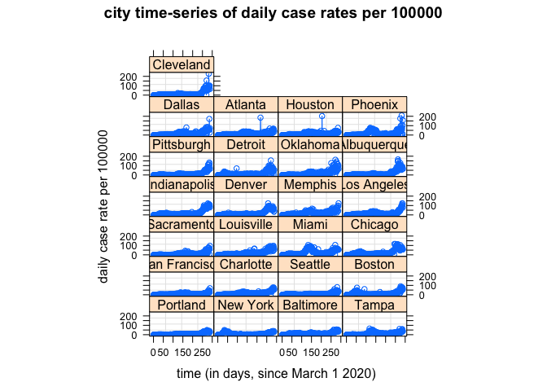
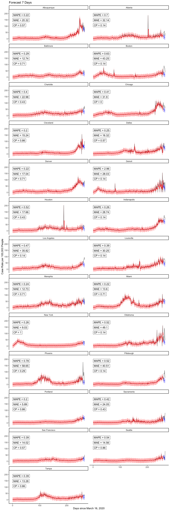

# Downloading and getting data in shape

<br />

## Initial work

- First need to read in all.csv off Ken's GitHub page; to do this, load RCurl package to use getURL function w/in read.csv, as the csv file is embedded within an html file (typical for GitHub).


```r
alldata <-
  read.csv(text=getURL("https://raw.githubusercontent.com/kentranz/socialMobilityCOVID/master/data/all.csv"), 
           header=T)
## the above file has already been updated for standardized 
##    Apple mobility data, and various indicator variables for
##    dates of interest, as well as lagged cases variables, etc.
##    --> it has longitudinal data for 24 cities,
##          20 in US, and Toronto, Montreal, London, and Stockholm

str(alldata)
```

```
## 'data.frame':	6936 obs. of  43 variables:
##  $ city                   : Factor w/ 24 levels "Atlanta","Baltimore",..: 1 1 1 1 1 1 1 1 1 1 ...
##  $ date                   : Factor w/ 289 levels "2020-03-01","2020-03-02",..: 1 2 3 4 5 6 7 8 9 10 ...
##  $ newCases               : int  0 2 0 0 0 0 4 4 5 4 ...
##  $ casesTminus1           : int  0 0 2 0 0 0 0 4 4 5 ...
##  $ casesTminus2           : int  0 0 0 2 0 0 0 0 4 4 ...
##  $ drivingMinus7          : num  6.73 3.59 7.82 13.01 15.97 ...
##  $ transitMinus7          : num  4.81 -2.85 3.34 4.61 12.06 ...
##  $ walkingMinus7          : num  4.54 -11.14 4.76 8.71 27.63 ...
##  $ drivingMinus8          : num  12.09 6.73 3.59 7.82 13.01 ...
##  $ transitMinus8          : num  7.51 4.81 -2.85 3.34 4.61 ...
##  $ walkingMinus8          : num  23.44 4.54 -11.14 4.76 8.71 ...
##  $ drivingMinus9          : num  7.82 12.09 6.73 3.59 7.82 ...
##  $ transitMinus9          : num  2.84 7.51 4.81 -2.85 3.34 ...
##  $ walkingMinus9          : num  5.55 23.44 4.54 -11.14 4.76 ...
##  $ drivingMinus10         : num  3.31 7.82 12.09 6.73 3.59 ...
##  $ transitMinus10         : num  -1.88 2.84 7.51 4.81 -2.85 ...
##  $ walkingMinus10         : num  1.55 5.55 23.44 4.54 -11.14 ...
##  $ drivingMinus11         : num  7.4 3.31 7.82 12.09 6.73 ...
##  $ transitMinus11         : num  2.76 -1.88 2.84 7.51 4.81 ...
##  $ walkingMinus11         : num  2.39 1.55 5.55 23.44 4.54 ...
##  $ drivingMinus12         : num  4.48 7.4 3.31 7.82 12.09 ...
##  $ transitMinus12         : num  1.55 2.76 -1.88 2.84 7.51 ...
##  $ walkingMinus12         : num  -8.78 2.39 1.55 5.55 23.44 ...
##  $ drivingMinus13         : num  7.27 4.48 7.4 3.31 7.82 ...
##  $ transitMinus13         : num  5.24 1.55 2.76 -1.88 2.84 7.51 4.81 -2.85 3.34 4.61 ...
##  $ walkingMinus13         : num  6.26 -8.78 2.39 1.55 5.55 ...
##  $ drivingMinus14         : num  8.11 7.27 4.48 7.4 3.31 ...
##  $ transitMinus14         : num  4.49 5.24 1.55 2.76 -1.88 2.84 7.51 4.81 -2.85 3.34 ...
##  $ walkingMinus14         : num  19.55 6.26 -8.78 2.39 1.55 ...
##  $ driving                : num  16.99 8.03 3.64 8.07 8.83 ...
##  $ walking                : num  26.35 -3.94 -0.85 -5.03 6.17 ...
##  $ transit                : num  12.27 3.27 -2.91 -4.81 1.56 ...
##  $ anomalousWeekend       : int  0 0 0 0 0 0 0 0 0 0 ...
##  $ longWeekend            : int  0 0 0 0 0 0 0 0 0 0 ...
##  $ weekend                : int  1 0 0 0 0 0 1 1 0 0 ...
##  $ sumDrivingMinus7_14    : num  8.17 7.53 7.61 8.82 10.05 ...
##  $ sumTransitMinus7_14    : num  3.9 2.85 2.58 3.02 4.35 ...
##  $ sumWalkingMinus7_14    : num  7.79 3.4 3.19 5.69 9.29 ...
##  $ Population             : int  5950000 5950000 5950000 5950000 5950000 5950000 5950000 5950000 5950000 5950000 ...
##  $ LandAreakm             : int  21694 21694 21694 21694 21694 21694 21694 21694 21694 21694 ...
##  $ Poverty.rate           : num  13.9 13.9 13.9 13.9 13.9 13.9 13.9 13.9 13.9 13.9 ...
##  $ Median.age             : num  36.6 36.6 36.6 36.6 36.6 36.6 36.6 36.6 36.6 36.6 ...
##  $ Median.household.income: num  69464 69464 69464 69464 69464 ...
```

- Code to read in data and output from `str` call hidden from this output.  Most R code below for data manipulation will also be hidden from output, and only selective dataset elements will be displayed. Alternatively, R code for data analyses and resulting output will more generally be displayed.

- Will output variable names though:


```
##  [1] "city"                    "date"                   
##  [3] "newCases"                "casesTminus1"           
##  [5] "casesTminus2"            "drivingMinus7"          
##  [7] "transitMinus7"           "walkingMinus7"          
##  [9] "drivingMinus8"           "transitMinus8"          
## [11] "walkingMinus8"           "drivingMinus9"          
## [13] "transitMinus9"           "walkingMinus9"          
## [15] "drivingMinus10"          "transitMinus10"         
## [17] "walkingMinus10"          "drivingMinus11"         
## [19] "transitMinus11"          "walkingMinus11"         
## [21] "drivingMinus12"          "transitMinus12"         
## [23] "walkingMinus12"          "drivingMinus13"         
## [25] "transitMinus13"          "walkingMinus13"         
## [27] "drivingMinus14"          "transitMinus14"         
## [29] "walkingMinus14"          "driving"                
## [31] "walking"                 "transit"                
## [33] "anomalousWeekend"        "longWeekend"            
## [35] "weekend"                 "sumDrivingMinus7_14"    
## [37] "sumTransitMinus7_14"     "sumWalkingMinus7_14"    
## [39] "Population"              "LandAreakm"             
## [41] "Poverty.rate"            "Median.age"             
## [43] "Median.household.income"
```

- Here, *newCases* will be converted into a rate, and this, and the first two days of lagged case rate values, will serve as the primary response and two predictors, respectively.

- The time variable will be a converted version of *date*.  This, and the previous bullet point will be worked on in the next subsection.


<br />

## Additional data manipulation

- Creating a US city indicator variable, i.e., 1 if US city, 0 for non-US city.


### Play with dates

- First, note that not all 24 cities had counts available to us starting at earlier date in our dataset of March 1, 2019, while all cities had observations starting March 13th.  As of the November 14th end dataset (the one being worked on here), these earlier dates in March, for cities where they were not originally collected, were entered in original dataset as 0's.  This seems a reasonable choice given the very low or non-existent case counts in many cities at that time.  In addition, we will not be use data earlier than March 13th in our analyses, so those 0's are irrelevant for our work here.

- Dates are in character form, and need to change to numeric for modeling.

- Need to align all new day variable to min of observed dates, so day 0 will 2020-03-01, but will have a second new day variable that will be about 2 days after 2020-03-13 (make this the midpoint of March, i.e., March 16th), to allow for two days of lagged cases as predictors; the lagged 7-day mobility data is actually available since near Feb 1, if we ever need it.

- Aside from March 16th start date, we will make one for April 1st, and one that is based on a French study (Prague et al., 2020), which is dynamic based on specifically starting on the first day of cases for which it is followed by
at least 3 consecutive days of cases as well; this took longer to program.

- Will use *chron* package in R to help with dates and specifying initial origin at March 1st (day 0). As suggested on *chron* help page, use `options` argument to set default first day --- could do this twice to help create two sets of two columns, one where 03-01-20 is default and one for 03-16-20;
a 2nd option is to subset data when modeling such that all dates are
at least 03-16-20 when we want to have the later start/default date, which
will only affect the intercept interpretation; will take the 2nd approach
where day 15 (16th day), i.e., 03-16-20, will be first day w/ all complete data that accounts for two lagged cases days.


- Here is where French start day will be defined, which will be the 1st day that at least 4 consecutive days of cases start.  Code will identify sequences in a vector.  Output prints first day of French method in each city.


```
##         city.FM startdate.FM
## 1       Atlanta     03/07/20
## 2     Baltimore     03/13/20
## 3        Boston     03/05/20
## 4       Chicago     03/08/20
## 5     Cleveland     03/13/20
## 6        Dallas     03/09/20
## 7        Denver     03/09/20
## 8       Houston     03/12/20
## 9  Indianapolis     03/08/20
## 10       London     03/01/20
## 11  Los Angeles     03/03/20
## 12      Memphis     03/18/20
## 13        Miami     03/10/20
## 14     Montreal     03/09/20
## 15     New York     03/04/20
## 16     Oklahoma     03/15/20
## 17      Phoenix     03/16/20
## 18   Pittsburgh     03/13/20
## 19     Portland     03/12/20
## 20   Sacramento     03/12/20
## 21      Seattle     03/01/20
## 22    Stockholm     03/01/20
## 23        Tampa     03/15/20
## 24      Toronto     03/01/20
```

- Dec 17 2020:  The above all provided, it should be mentioned that the use of the French method and start dates other than 03-16-20 will be put off for potential future use.


### Creating case rates

- Making another column in dataset, which is a rate, i.e.,
    number of cases per 100000 people in population.  This will
    be the longitudinal response variable in our graphing and modeling.
    To do this, taking *newCases*, divide by Population (in city), and      multiplying by 100000; will do this for *caseTminus1* and *caseTminus2*         variables as well:


<br />

---

# Start longitudinal work

<br />

## Initial graphing

- Start with using *nlme* library, created so-called groupedData objects, which benefit both graphing and modeling using the `lme` function (and other modeling functions) within *nlme*.


- Create plots from groupedData objects; nlme generic plotting on these objects uses Trellis graphs here.

<!-- --><!-- -->


## Data Partition

- We used start date as 2020-03-16, because that was the first date that allowed for at least 2 lagged observerations in all cities.
- Train set used data until 2020-11-30
- Test sets: 
  - test7: first 7 days in December
  - test14: first 14 days in December
  


```r
cutOff <- as.Date("2020-11-30")

train <- alldata.groupedR %>% 
  filter(day031620 >= 0 & as.Date(date) <= cutOff)


test7 <- alldata.groupedR %>% 
  filter(day031620 >= 0 & as.Date(date) > cutOff & as.Date(date) <= (cutOff + 7)) %>%
  select(city, day031620, date, weekend, case.rate, casesTminus1.rate, casesTminus2.rate, walkingMinus7, walkingMinus14) %>%
  
  # retained lag case rates for first 2 days only, zero out the rest
  mutate(
    casesTminus1.rate = case_when(as.Date(date) == (cutOff + 1) ~ casesTminus1.rate
                                    , TRUE ~ 0
                                  ) 
    , casesTminus2.rate = case_when(as.Date(date) == (cutOff + 1) | as.Date(date) == (cutOff + 2) ~ casesTminus2.rate
                                    , TRUE ~ 0
                                  ) 
  )
  
  
test14 <- alldata.groupedR %>% 
  filter(day031620 >= 0 & as.Date(date) > cutOff) %>%
  select(city, day031620, date, weekend, case.rate, casesTminus1.rate, casesTminus2.rate, walkingMinus7, walkingMinus14) %>%
  
  # retained lag case rates for first 2 days only, zero out the rest
  mutate(
    casesTminus1.rate = case_when(as.Date(date) == (cutOff + 1) ~ casesTminus1.rate
                                    , TRUE ~ 0
                                  ) 
    , casesTminus2.rate = case_when(as.Date(date) == (cutOff + 1) | as.Date(date) == (cutOff + 2) ~ casesTminus2.rate
                                    , TRUE ~ 0
                                  ) 
  )


nrow(train)
```

```
## [1] 6240
```

```r
nrow(test7)
```

```
## [1] 168
```

```r
nrow(test14)
```

```
## [1] 336
```
  


## Automate extracting 95% CI for prediction band, metrics, and plotting

Predict one day at a time, feedforward the prediction as lag case.rate. 


```r
forecastLME <- function(model, test) # provide model obj and test set
{
  for (i in 1:nrow(test))
  {
    
    pred <- predict(model, newdata = test[i,])
    test[i, 'pred'] <- pred
    
    # if second day or later, use pred case.rate as lag-1
    if ( i <= (nrow(test)-1) & as.Date(test[i+1,'date']) > cutOff+1)
    {
      test[i+1, 'casesTminus1.rate'] <- pred
    }
    
    # if third day or later, use pred case.rate as lag-2
    if (i <= (nrow(test)-2) & as.Date(test[i+2,'date']) > (cutOff + 2))
    {
      test[i+2, 'casesTminus2.rate'] <- pred
    }
  
  }
  
  return(test)
}

#forecast(model = case.rate.lme20201031
#         , test = test14
#         )
```


Extract 95% CI for prediction band. References from the web:

- https://stackoverflow.com/questions/14358811/extract-prediction-band-from-lme-fit and 
- http://bbolker.github.io/mixedmodels-misc/glmmFAQ.html#predictions-andor-confidence-or-prediction-intervals-on-predictions

SE: This approach takes into account the uncertainty of the random effect in the prediction. 

SE2: This takes into account both random effect uncertainty and within-group error


```r
#model <- case.rate.lme20201031

metricsFuncLME <- function(model)
{
  results7 <- forecastLME(model, test = test7)
  
  # create design mateix
  # [-2] drops response from formula
  Designmat <- model.matrix(formula(model)[-2], results7)
  
  # compute XVX′ to get the variance-covariance matrix of the predictions
  # extract the diagonal of this matrix to get variances of predictions
  predvar <- diag(Designmat %*% vcov(model) %*% t(Designmat)) 
  results7$SE <- sqrt(predvar) 
  results7$SE2 <- sqrt(predvar + model$sigma^2) # sigma is the estimated within-group error standard deviation
  
  
  results14 <- forecastLME(model, test = test14)
  
  Designmat <- model.matrix(formula(model)[-2], results14)
  predvar <- diag(Designmat %*% vcov(model) %*% t(Designmat)) 
  results14$SE <- sqrt(predvar) 
  results14$SE2 <- sqrt(predvar + model$sigma^2)


  # CALCULATE MAE, MAPE, CP
  perform7 <- results7 %>% 
  group_by(city) %>% 
  summarize(MAE = round(mean(abs(case.rate - pred)) , 2)
            , MAPE = round(mean(abs(case.rate - pred)/case.rate) , 2)
            , CP = round(sum(case.rate >= (pred - 1.96*SE2) & case.rate <= (pred + 1.96*SE2) ) / n() , 2)
            ) #%>%
  #as.data.frame() %>%
  #print()


  perform14 <- results14 %>% 
    group_by(city) %>% 
    summarize(MAE = round(mean(abs(case.rate - pred)) , 2)
              , MAPE = round(mean(abs(case.rate - pred)/case.rate) , 2)
              , CP = round(sum(case.rate >= (pred - 1.96*SE2) & case.rate <= (pred + 1.96*SE2) ) / n() , 2)
              ) #%>%
    #as.data.frame() %>%
    #print()
  
  metrics <- perform7 %>%
    left_join(perform14 
              , by = "city"
              , suffix = c("_7d", "_14d")
              ) #%>%
    #as.data.frame() %>%
    #print()
  
  return(list(performMetrics = metrics
              , results7 = results7
              , results14 = results14))
}


plotFuncLME <- function(model
                     , forecastLength # only 7 or 14 as numeric arg
                     )
{
  
  if(forecastLength == 7)
  { results = output$results7
    
    perform <- output$performMetrics %>% 
      select(city, contains("7d"))
  }
  
  if(forecastLength == 14)
  { results = output$results14
    
    perform <- output$performMetrics %>% 
      select(city, contains("14d")) 
  }
  
  perform <- setNames(perform, gsub("_.*", "", names(perform)))
  
  perform <- perform %>%
    mutate(MAPE = paste0("MAPE = ", MAPE)
                      , MAE = paste0("MAE = ", MAE)
                      , CP = paste0("CP = ", CP)
                      )
  
  
  Designmat <- model.matrix(formula(model)[-2], train)
  predvar <- diag(Designmat %*% vcov(model) %*% t(Designmat)) 
  
  plotDF <- train %>% 
    select(city, day031620, case.rate) %>%
    mutate(city = as.character(city)
           , SE2 = sqrt(predvar + model$sigma^2)
           , upperCI.fitted = case.rate + 1.96*SE2
           , lowerCI.fitted = case.rate - 1.96*SE2
           , fitted = predict(model, data = train)
           ) %>%
    reshape::melt(id = c('city', 'day031620')) %>%
    
    # bring into forecasted case rates
    rbind(results %>% 
            select(city, day031620, case.rate, pred, SE2) %>% 
            #rename(case.rate = pred) %>% 
            mutate(upperCI.pred = pred + 1.96*SE2
                   , lowerCI.pred = pred - 1.96*SE2
                   ) %>%
            reshape2::melt(id = c('city', 'day031620'))
          ) 
      
  
  p <- ggplot(plotDF 
              , aes(day031620, value, group = variable, colour = variable)) +
    
    geom_line(data = filter(plotDF, variable == 'case.rate'), linetype = "solid", color = 'black', alpha = 0.6) + 
    geom_line(data = filter(plotDF, variable == 'fitted'), linetype = "solid", color = 'red') +
    geom_line(data = filter(plotDF, variable == 'pred'), linetype = "solid", color = 'blue') +
    
    # uncertainty band for fitted model
    geom_ribbon(data = filter(plotDF, variable == 'lowerCI.fitted')
      , aes(ymin = filter(plotDF, variable == 'lowerCI.fitted')$value
                    , ymax =  filter(plotDF, variable == 'upperCI.fitted')$value
                    )
                , alpha = 0.3
                , color = NA
                , fill = "red") +
    
    # prediction band for forecast
    geom_ribbon(data = filter(plotDF, variable == 'lowerCI.pred')
      , aes(ymin = filter(plotDF, variable == 'lowerCI.pred')$value
                    , ymax =  filter(plotDF, variable == 'upperCI.pred')$value
                    )
                , alpha = 0.3
                , color = NA
                , fill = "blue") +
    
    facet_wrap(. ~ city, ncol = 2) +
    ggtitle(paste0('Forecast ', forecastLength, ' Days')) +
    ylab('Case Rate per 100,000 People') +
    xlab('Days since March 16, 2020') +
    #ylim(-15,100) +
    
    # add performance metrics
    geom_label(data = perform 
               , aes(label = MAPE), 
              x = 0, y = max(filter(plotDF, variable == 'case.rate')$value), hjust="inward", vjust="inward",
              inherit.aes = FALSE) +
    geom_label(data = perform 
               , aes(label = MAE), 
              x = 0, y = max(filter(plotDF, variable == 'case.rate')$value)*4/5, hjust="inward", vjust="inward",
              inherit.aes = FALSE) +
    geom_label(data = perform 
                , aes(label = CP), 
               x = 0, y = max(filter(plotDF, variable == 'case.rate')$value)*3/5, hjust="inward", vjust="inward",
               inherit.aes = FALSE) +
     
    theme_classic() +
    theme(legend.position = 'none') 
    
  p
}
```


## Initial modeling, using `lme` function
- Aside from dealing with heteroskedasticity, the following was the best model from earlier runs, through June 30th end data at the time, starting with March 16th data.  This is a linear mixed effects model, with case rate as the response, the fixed effects being the first two lagged case rate variables and the weekend indicator variable, and the random effects being the time-varying lagged case rate variables; there is no random intercept, shown not to be needed due to the relatively low levels across all cities near March 16th. 


```r
case.rate.lme20201031 <- 
  lme(fixed = case.rate ~ casesTminus1.rate + casesTminus2.rate + weekend,
      random = ~ casesTminus1.rate + casesTminus2.rate - 1 | city,
      data = train
      )

summary(case.rate.lme20201031)
```

```
## Linear mixed-effects model fit by REML
##  Data: train 
##        AIC      BIC    logLik
##   43819.97 43873.87 -21901.98
## 
## Random effects:
##  Formula: ~casesTminus1.rate + casesTminus2.rate - 1 | city
##  Structure: General positive-definite, Log-Cholesky parametrization
##                   StdDev    Corr  
## casesTminus1.rate 0.1268574 cssT1.
## casesTminus2.rate 0.1272289 -0.864
## Residual          8.0348648       
## 
## Fixed effects: case.rate ~ casesTminus1.rate + casesTminus2.rate + weekend 
##                        Value  Std.Error   DF  t-value p-value
## (Intercept)        2.0852857 0.15259698 6213 13.66531       0
## casesTminus1.rate  0.5090977 0.03196774 6213 15.92536       0
## casesTminus2.rate  0.3781391 0.03215449 6213 11.76007       0
## weekend           -1.7129147 0.22635058 6213 -7.56753       0
##  Correlation: 
##                   (Intr) cssT1. cssT2.
## casesTminus1.rate -0.090              
## casesTminus2.rate -0.076 -0.870       
## weekend           -0.387  0.007 -0.021
## 
## Standardized Within-Group Residuals:
##        Min         Q1        Med         Q3        Max 
## -9.5142870 -0.2703168 -0.1133118  0.1430545 23.8971761 
## 
## Number of Observations: 6240
## Number of Groups: 24
```


## Experiment with bootstrap prediction interval

Easy Method by Bolker + sigma

```r
test <- test14
model <- case.rate.lme20201031

for (i in 1:nrow(test))
{
  
  pred <- predict(model, newdata = test[i,])
  test[i, 'pred'] <- pred
  
  # if second day or later, use pred case.rate as lag-1
  if ( i <= (nrow(test)-1) & as.Date(test[i+1,'date']) > cutOff+1)
  {
    test[i+1, 'casesTminus1.rate'] <- pred
  }
  
  # if third day or later, use pred case.rate as lag-2
  if (i <= (nrow(test)-2) & as.Date(test[i+2,'date']) > (cutOff + 2))
  {
    test[i+2, 'casesTminus2.rate'] <- pred
  }
  
}

Designmat <- model.matrix(formula(model)[-2], test)
predvar <- diag(Designmat %*% vcov(model) %*% t(Designmat)) 
test$SE <- sqrt(predvar + model$sigma^2)
test <- test %>% 
  mutate(lowerCI = pred - SE
         , upperCI = pred + SE
         )

test %>% select(city, date, weekend, case.rate, pred, lowerCI, upperCI)
```

```
##             city       date weekend  case.rate      pred    lowerCI  upperCI
## 1        Atlanta 2020-12-01       0  44.521008 15.638704  7.5978915 23.67952
## 2        Atlanta 2020-12-02       0  50.352941 15.553064  7.5120014 23.59413
## 3        Atlanta 2020-12-03       0  49.462185 13.822243  5.7834560 21.86103
## 4        Atlanta 2020-12-04       0  61.445378 13.151014  5.1123892 21.18964
## 5        Atlanta 2020-12-05       1  45.193277 10.526413  2.4870574 18.56577
## 6        Atlanta 2020-12-06       1  22.084034  9.300844  1.2616108 17.34008
## 7        Atlanta 2020-12-07       0  43.310924  9.554673  1.5176223 17.59172
## 8        Atlanta 2020-12-08       0  59.647059  9.178038  1.1411973 17.21488
## 9        Atlanta 2020-12-09       0  49.176471  9.136521  1.0996814 17.17336
## 10       Atlanta 2020-12-10       0  69.075630  8.976692  0.9399084 17.01348
## 11       Atlanta 2020-12-11       0  53.798319  8.901814  0.8650471 16.93858
## 12       Atlanta 2020-12-12       1  58.773109  7.099955 -0.9381946 15.13810
## 13       Atlanta 2020-12-13       1  48.588235  6.406655 -1.6315264 14.44484
## 14       Atlanta 2020-12-14       0  34.974790  7.172486 -0.8639393 15.20891
## 15     Baltimore 2020-12-01       0  34.108882 30.142106 22.0926972 38.19151
## 16     Baltimore 2020-12-02       0  34.251597 29.669260 21.6199930 37.71853
## 17     Baltimore 2020-12-03       0  31.575691 28.847155 20.7989615 36.89535
## 18     Baltimore 2020-12-04       0  56.051312 28.240814 20.1931564 36.28847
## 19     Baltimore 2020-12-05       1  49.379386 25.904076 17.8559112 33.95224
## 20     Baltimore 2020-12-06       1  38.033544 24.455861 16.4085657 32.50316
## 21     Baltimore 2020-12-07       0  34.786778 24.539564 16.4950883 32.58404
## 22     Baltimore 2020-12-08       0  33.645059 24.042980 15.9991591 32.08680
## 23     Baltimore 2020-12-09       0  42.529067 23.814526 15.7708251 31.85823
## 24     Baltimore 2020-12-10       0  52.269365 23.509774 15.4663445 31.55320
## 25     Baltimore 2020-12-11       0  39.389337 23.265166 15.2219166 31.30842
## 26     Baltimore 2020-12-12       1  52.626152 21.310627 13.2663503 29.35490
## 27     Baltimore 2020-12-13       1  41.101917 20.197249 12.1534442 28.24105
## 28     Baltimore 2020-12-14       0  32.788769 20.598658 12.5571787 28.64014
## 29        Boston 2020-12-01       0  39.256978 26.203746 18.1326420 34.27485
## 30        Boston 2020-12-02       0  63.615594 22.118272 14.0727850 30.16376
## 31        Boston 2020-12-03       0  90.354665 22.904964 14.8602930 30.94964
## 32        Boston 2020-12-04       0  78.226660 21.718517 13.6760259 29.76101
## 33        Boston 2020-12-05       1  73.773568 19.730757 11.6870871 27.77443
## 34        Boston 2020-12-06       1  69.607773 18.308451 10.2655798 26.35132
## 35        Boston 2020-12-07       0  38.415611 18.566298 10.5257405 26.60686
## 36        Boston 2020-12-08       0  54.155340 18.145456 10.1053501 26.18556
## 37        Boston 2020-12-09       0  77.487898 18.039825  9.9997422 26.07991
## 38        Boston 2020-12-10       0  74.779105 17.826833  9.7868986 25.86677
## 39        Boston 2020-12-11       0  78.985943 17.682687  9.6428280 25.72255
## 40        Boston 2020-12-12       1  71.803537 15.817874  7.7768134 23.85894
## 41        Boston 2020-12-13       1  71.577804 14.855652  6.8148399 22.89646
## 42        Boston 2020-12-14       0  56.782048 15.384457  7.3457090 23.42321
## 43       Chicago 2020-12-01       0 103.409205 47.803475 39.7312320 55.87572
## 44       Chicago 2020-12-02       0  68.900704 45.978314 37.9102143 54.04641
## 45       Chicago 2020-12-03       0  80.096937 46.250500 38.1821235 54.31888
## 46       Chicago 2020-12-04       0  78.553358 45.437847 37.3708654 53.50483
## 47       Chicago 2020-12-05       1  73.341137 43.513488 35.4458987 51.58108
## 48       Chicago 2020-12-06       1  60.601325 42.270350 34.2044470 50.33625
## 49       Chicago 2020-12-07       0  71.628398 42.467208 34.4045158 50.52990
## 50       Chicago 2020-12-08       0  56.382915 41.918642 33.8567788 49.98051
## 51       Chicago 2020-12-09       0  59.522935 41.782597 33.7209210 49.84427
## 52       Chicago 2020-12-10       0  82.274863 41.444489 33.3832871 49.50569
## 53       Chicago 2020-12-11       0  62.736962 41.229504 33.1685933 49.29041
## 54       Chicago 2020-12-12       1  67.187966 39.251698 31.1901661 47.31323
## 55       Chicago 2020-12-13       1  56.742379 38.290045 30.2296050 46.35048
## 56       Chicago 2020-12-14       0  59.036602 38.580947 30.5234747 46.63842
## 57     Cleveland 2020-12-01       0  72.737959 73.713567 65.5350473 81.89209
## 58     Cleveland 2020-12-02       0  55.749496 54.088383 45.9637977 62.21297
## 59     Cleveland 2020-12-03       0  52.185824 66.265569 58.1441552 74.38698
## 60     Cleveland 2020-12-04       0  68.197939 54.939489 46.8409569 63.03802
## 61     Cleveland 2020-12-05       1  70.541175 59.437010 51.3371243 67.53689
## 62     Cleveland 2020-12-06       1  66.245242 52.352059 44.2654094 60.43871
## 63     Cleveland 2020-12-07       0 101.393786 55.729737 47.6439009 63.81557
## 64     Cleveland 2020-12-08       0 227.001014 51.420111 43.3402390 59.49998
## 65     Cleveland 2020-12-09       0  86.992647 52.889563 44.8097092 60.96942
## 66     Cleveland 2020-12-10       0  92.411381 50.141276 42.0649944 58.21756
## 67     Cleveland 2020-12-11       0  78.547233 50.591238 42.5154898 58.66699
## 68     Cleveland 2020-12-12       1  93.338912 47.020128 38.9459024 55.09435
## 69     Cleveland 2020-12-13       1 101.589056 46.566245 38.4935482 54.63894
## 70     Cleveland 2020-12-14       0  64.487815 45.639506 37.5715114 53.70750
## 71        Dallas 2020-12-01       0  49.628647 61.967238 53.8547219 70.07975
## 72        Dallas 2020-12-02       0  86.193634 57.863604 49.7673590 65.95985
## 73        Dallas 2020-12-03       0  81.684350 54.852172 46.7611440 62.94320
## 74        Dallas 2020-12-04       0  46.936340 51.820695 43.7366730 59.90472
## 75        Dallas 2020-12-05       1  56.684350 47.419637 39.3400067 55.49927
## 76        Dallas 2020-12-06       1  54.098143 43.952288 35.8779365 52.02664
## 77        Dallas 2020-12-07       0  59.655172 42.279928 34.2127014 50.34716
## 78        Dallas 2020-12-08       0  57.347480 40.210541 32.1474613 48.27362
## 79        Dallas 2020-12-09       0  58.779841 38.499999 30.4392494 46.56075
## 80        Dallas 2020-12-10       0  66.525199 36.862995 28.8046791 44.92131
## 81        Dallas 2020-12-11       0 172.068966 35.384000 27.3276747 43.44033
## 82        Dallas 2020-12-12       1  54.734748 32.305114 24.2495422 40.36069
## 83        Dallas 2020-12-13       1  25.198939 30.087814 22.0341722 38.14146
## 84        Dallas 2020-12-14       0  73.289125 29.550030 21.5003285 37.59973
## 85        Denver 2020-12-01       0  78.726385 63.125853 55.0265174 71.22519
## 86        Denver 2020-12-02       0  53.045946 63.379928 55.2790496 71.48081
## 87        Denver 2020-12-03       0  78.726385 62.582327 54.4860479 70.67861
## 88        Denver 2020-12-04       0  69.525913 62.091987 53.9961605 70.18781
## 89        Denver 2020-12-05       1  82.366132 59.831116 51.7358932 67.92634
## 90        Denver 2020-12-06       1  92.442840 58.128338 50.0354093 66.22127
## 91        Denver 2020-12-07       0  68.615976 58.069922 49.9815852 66.15826
## 92        Denver 2020-12-08       0  56.213874 57.589113 49.5026440 65.67558
## 93        Denver 2020-12-09       0  52.338217 57.238845 49.1528322 65.32486
## 94        Denver 2020-12-10       0  67.267921 56.870408 48.7851579 64.95566
## 95        Denver 2020-12-11       0  71.649099 56.523043 48.4384361 64.60765
## 96        Denver 2020-12-12       1  70.806565 54.472757 46.3880104 62.55750
## 97        Denver 2020-12-13       1  32.993635 52.953731 44.8707757 61.03669
## 98        Denver 2020-12-14       0  41.452677 53.077834 44.9988380 61.15683
## 99       Houston 2020-12-01       0  18.100403 30.293226 22.2322155 38.35424
## 100      Houston 2020-12-02       0  32.620351 25.885534 17.8336269 33.93744
## 101      Houston 2020-12-03       0  40.630381 22.637043 14.5891723 30.68491
## 102      Houston 2020-12-04       0  45.866619 19.847359 11.8030017 27.89172
## 103      Houston 2020-12-05       1  35.181862 15.925213  7.8818045 23.96862
## 104      Houston 2020-12-06       1  34.969582 13.436683  5.3946238 21.47874
## 105      Houston 2020-12-07       0  34.828062 12.822992  4.7841679 20.86182
## 106      Houston 2020-12-08       0  24.964121 11.720716  3.6828300 19.75860
## 107      Houston 2020-12-09       0  39.597285 11.080514  3.0428467 19.11818
## 108      Houston 2020-12-10       0  30.242816 10.449568  2.4122114 18.48693
## 109      Houston 2020-12-11       0  76.788731  9.982739  1.9455532 18.01992
## 110      Houston 2020-12-12       1  24.129153  7.869786 -0.1686374 15.90821
## 111      Houston 2020-12-13       1  28.813464  6.889088 -1.1493214 14.92750
## 112      Houston 2020-12-14       0  34.247831  7.488036 -0.5485051 15.52458
## 113 Indianapolis 2020-12-01       0  76.306183 75.774844 67.6307015 83.91899
## 114 Indianapolis 2020-12-02       0 100.263336 78.377989 70.2374016 86.51858
## 115 Indianapolis 2020-12-03       0 117.664809 76.273306 68.1461728 84.40044
## 116 Indianapolis 2020-12-04       0 122.147737 76.095826 67.9679353 84.22372
## 117 Indianapolis 2020-12-05       1 103.926804 73.458552 65.3332812 81.58382
## 118 Indianapolis 2020-12-06       1 107.108237 71.890438 63.7679835 80.01289
## 119 Indianapolis 2020-12-07       0  88.887304 71.680358 63.5636470 79.79707
## 120 Indianapolis 2020-12-08       0  80.451686 70.947419 62.8329570 79.06188
## 121 Indianapolis 2020-12-09       0  83.874137 70.448717 62.3352610 78.56217
## 122 Indianapolis 2020-12-10       0 111.301944 69.878543 61.7664983 77.99059
## 123 Indianapolis 2020-12-11       0 113.085474 69.359405 61.2485402 77.47027
## 124 Indianapolis 2020-12-12       1 106.577998 67.128390 59.0181237 75.23866
## 125 Indianapolis 2020-12-13       1  99.395672 65.657458 57.5498137 73.76510
## 126 Indianapolis 2020-12-14       0  80.933722 65.661561 57.5586583 73.76446
## 127       London 2020-12-01       0  27.845131 25.535652 17.4836185 33.58769
## 128       London 2020-12-02       0  31.714090 26.582013 18.5337618 34.63026
## 129       London 2020-12-03       0  27.890648 25.493977 17.4489597 33.53899
## 130       London 2020-12-04       0  33.238916 25.227128 17.1820709 33.27219
## 131       London 2020-12-05       1  25.865134 23.004333 14.9586802 31.04998
## 132       London 2020-12-06       1  27.537890 21.664445 13.6193663 29.70952
## 133       London 2020-12-07       0  42.160281 21.888178 13.8456868 29.93067
## 134       London 2020-12-08       0  42.069247 21.571310 13.5293084 29.61331
## 135       London 2020-12-09       0  50.205442 21.466824 13.4248375 29.50881
## 136       London 2020-12-10       0  56.828190 21.303256 13.2614097 29.34510
## 137       London 2020-12-11       0  62.256113 21.176614 13.1348479 29.21838
## 138       London 2020-12-12       1  53.027506 19.338324 11.2953996 27.38125
## 139       London 2020-12-13       1  62.517837 18.261298 10.2187280 26.30387
## 140       London 2020-12-14       0  94.630203 18.760137 10.7197535 26.80052
## 141  Los Angeles 2020-12-01       0  62.588920 42.421231 34.3559958 50.48647
## 142  Los Angeles 2020-12-02       0  52.955781 41.031805 32.9686441 49.09497
## 143  Los Angeles 2020-12-03       0  66.614710 39.714441 31.6532409 47.77564
## 144  Los Angeles 2020-12-04       0  75.271671 38.496084 30.4366067 46.55556
## 145  Los Angeles 2020-12-05       1  81.681152 35.644309 27.5853970 43.70322
## 146  Los Angeles 2020-12-06       1  94.356335 33.674223 25.6172268 41.73122
## 147  Los Angeles 2020-12-07       0  75.619765 33.276478 25.2234009 41.32956
## 148  Los Angeles 2020-12-08       0  76.580809 32.330335 24.2787477 40.38192
## 149  Los Angeles 2020-12-09       0  87.507952 31.679127 23.6281524 39.73010
## 150  Los Angeles 2020-12-10       0 107.220700 30.980150 22.9299913 39.03031
## 151  Los Angeles 2020-12-11       0 124.042749 30.365779 22.3162585 38.41530
## 152  Los Angeles 2020-12-12       1 100.871757 28.065647 20.0156281 36.11567
## 153  Los Angeles 2020-12-13       1 119.131589 26.614012 18.5649627 34.66306
## 154  Los Angeles 2020-12-14       0  79.433671 26.697556 18.6514102 34.74370
## 155      Memphis 2020-12-01       0  52.301372 49.850858 41.7601946 57.94152
## 156      Memphis 2020-12-02       0  50.072620 52.344453 44.2561714 60.43273
## 157      Memphis 2020-12-03       0  45.615117 48.565210 40.4904300 56.63999
## 158      Memphis 2020-12-04       0  79.640725 48.035093 39.9605877 56.10960
## 159      Memphis 2020-12-05       1  47.843869 44.332867 36.2617532 52.40398
## 160      Memphis 2020-12-06       1  25.482060 42.434789 34.3658689 50.50371
## 161      Memphis 2020-12-07       0  70.131385 41.583621 33.5201276 49.64711
## 162      Memphis 2020-12-08       0  58.764752 40.323476 32.2620018 48.38495
## 163      Memphis 2020-12-09       0  81.126560 39.366348 31.3061555 47.42654
## 164      Memphis 2020-12-10       0  38.111653 38.354774 30.2960084 46.41354
## 165      Memphis 2020-12-11       0  98.882281 37.459436 29.4018494 45.51702
## 166      Memphis 2020-12-12       1  42.792031 34.877806 26.8203369 42.93527
## 167      Memphis 2020-12-13       1  95.390570 33.310443 25.2545348 41.36635
## 168      Memphis 2020-12-14       0 123.844299 33.126574 25.0741822 41.17896
## 169        Miami 2020-12-01       0  56.580645 49.948808 41.8742614 58.02335
## 170        Miami 2020-12-02       0  61.596774 49.288638 41.2151970 57.36208
## 171        Miami 2020-12-03       0  65.967742 48.575941 40.5036926 56.64819
## 172        Miami 2020-12-04       0  68.500000 47.936089 39.8648859 56.00729
## 173        Miami 2020-12-05       1  64.241935 45.586109 37.5150500 53.65717
## 174        Miami 2020-12-06       1  55.403226 44.278213 36.2089901 52.34744
## 175        Miami 2020-12-07       0  52.016129 44.222910 36.1574370 52.28838
## 176        Miami 2020-12-08       0  54.241935 43.517592 35.4532075 51.58198
## 177        Miami 2020-12-09       0  58.080645 43.196387 35.1324672 51.26031
## 178        Miami 2020-12-10       0  64.338710 42.695250 34.6320587 50.75844
## 179        Miami 2020-12-11       0  61.806452 42.319943 34.2572838 50.38260
## 180        Miami 2020-12-12       1  56.967742 40.189998 32.1269610 48.25303
## 181        Miami 2020-12-13       1  57.951613 39.111331 31.0495926 47.17307
## 182        Miami 2020-12-14       0  53.645161 39.265845 31.2072972 47.32439
## 183     Montreal 2020-12-01       0   7.465368 10.650417  2.6133414 18.68749
## 184     Montreal 2020-12-02       0   9.417099 10.797355  2.7603030 18.83441
## 185     Montreal 2020-12-03       0   9.099942 11.174009  3.1368664 19.21115
## 186     Montreal 2020-12-04       0  11.051673 11.414986  3.3777701 19.45220
## 187     Montreal 2020-12-05       1  15.369876  9.951982  1.9133045 17.99066
## 188     Montreal 2020-12-06       1  12.539867  9.290927  1.2522804 17.32957
## 189     Montreal 2020-12-07       0  11.515209 10.172709  2.1357941 18.20962
## 190     Montreal 2020-12-08       0  12.003141 10.396422  2.3594796 18.43336
## 191     Montreal 2020-12-09       0  11.661589 10.808669  2.7716338 18.84570
## 192     Montreal 2020-12-10       0  15.809015 11.093718  3.0566003 19.13084
## 193     Montreal 2020-12-11       0  12.491074 11.378059  3.3408548 19.41526
## 194     Montreal 2020-12-12       1  15.930999  9.906040  1.8673763 17.94470
## 195     Montreal 2020-12-13       1  18.248678  9.255097  1.2164588 17.29374
## 196     Montreal 2020-12-14       0  13.466939 10.138959  2.1020535 18.17586
## 197     New York 2020-12-01       0  28.267842 25.233225 17.1846806 33.28177
## 198     New York 2020-12-02       0  30.822980 24.116312 16.0725364 32.16009
## 199     New York 2020-12-03       0  32.758849 24.371996 16.3279470 32.41604
## 200     New York 2020-12-04       0  37.608928 24.126692 16.0830514 32.17033
## 201     New York 2020-12-05       1  35.470105 22.365309 14.3204474 30.41017
## 202     New York 2020-12-06       1  37.405974 21.293314 13.2489359 29.33769
## 203     New York 2020-12-07       0  24.016217 21.793022 13.7508951 29.83515
## 204     New York 2020-12-08       0  36.021724 21.700036 13.6581732 29.74190
## 205     New York 2020-12-09       0  30.286974 21.821778 13.7797908 29.86376
## 206     New York 2020-12-10       0  33.815250 21.857627 13.8156351 29.89962
## 207     New York 2020-12-11       0  27.955605 21.920057 13.8780152 29.96210
## 208     New York 2020-12-12       1  38.811040 20.254584 12.2112705 28.29790
## 209     New York 2020-12-13       1  31.187257 19.343363 11.3003530 27.38637
## 210     New York 2020-12-14       0  32.326921 19.966493 11.9255910 28.00740
## 211     Oklahoma 2020-12-01       0  61.322261 38.602124 30.5321800 46.67207
## 212     Oklahoma 2020-12-02       0  81.621065 35.930982 27.8729996 43.98896
## 213     Oklahoma 2020-12-03       0  32.222577 33.921942 25.8657930 41.97809
## 214     Oklahoma 2020-12-04       0 142.943327 32.035556 23.9821863 40.08893
## 215     Oklahoma 2020-12-05       1 124.064019 28.654853 20.6024477 36.70726
## 216     Oklahoma 2020-12-06       1  75.872103 26.021191 17.9707697 34.07161
## 217     Oklahoma 2020-12-07       0  46.985344 25.286294 17.2398317 33.33276
## 218     Oklahoma 2020-12-08       0  66.219525 24.252913 16.2081942 32.29763
## 219     Oklahoma 2020-12-09       0  58.838142 23.415074 15.3709690 31.45918
## 220     Oklahoma 2020-12-10       0  59.334966 22.645087 14.6016705 30.68850
## 221     Oklahoma 2020-12-11       0 113.204869 21.960640 13.9177777 30.00350
## 222     Oklahoma 2020-12-12       1  91.699493 19.634088 11.5904838 27.67769
## 223     Oklahoma 2020-12-13       1  98.229178 17.948846  9.9058432 25.99185
## 224     Oklahoma 2020-12-14       0  66.574399 18.061596 10.0211057 26.10209
## 225      Phoenix 2020-12-01       0 176.932919 19.924423 11.8165631 28.03228
## 226      Phoenix 2020-12-02       0  68.125742 15.837734  7.7909158 23.88455
## 227      Phoenix 2020-12-03       0  73.117453 17.625736  9.5848396 25.66663
## 228      Phoenix 2020-12-04       0  98.399358 17.262276  9.2228338 25.30172
## 229      Phoenix 2020-12-05       1  71.076308 15.943223  7.9023014 23.98415
## 230      Phoenix 2020-12-06       1  11.398077 15.082118  7.0414769 23.12276
## 231      Phoenix 2020-12-07       0   7.962487 15.871288  7.8324795 23.91010
## 232      Phoenix 2020-12-08       0 208.580772 16.025954  7.9871938 24.06471
## 233      Phoenix 2020-12-09       0  56.586199 16.376467  8.3375337 24.41540
## 234      Phoenix 2020-12-10       0  72.874941 16.624705  8.5856590 24.66375
## 235      Phoenix 2020-12-11       0 105.755564 16.881059  8.8418824 24.92023
## 236      Phoenix 2020-12-12       1 101.673274 15.394862  7.3542608 23.43546
## 237      Phoenix 2020-12-13       1  10.832215 14.647216  6.6067472 22.68768
## 238      Phoenix 2020-12-14       0 157.168168 15.444135  7.4055398 23.48273
## 239   Pittsburgh 2020-12-01       0  53.558886 34.933963 26.8657644 43.00216
## 240   Pittsburgh 2020-12-02       0  44.604112 33.211930 25.1600155 41.26384
## 241   Pittsburgh 2020-12-03       0  88.232111 33.095671 25.0432669 41.14808
## 242   Pittsburgh 2020-12-04       0  83.309107 32.529339 24.4780925 40.58059
## 243   Pittsburgh 2020-12-05       1 111.446620 30.424828 22.3727998 38.47686
## 244   Pittsburgh 2020-12-06       1  71.256236 28.931208 20.8801860 36.98223
## 245   Pittsburgh 2020-12-07       0  52.243256 29.096861 21.0487235 37.14500
## 246   Pittsburgh 2020-12-08       0  61.367789 28.774261 20.7268796 36.82164
## 247   Pittsburgh 2020-12-09       0  63.659532 28.617550 20.5702187 36.66488
## 248   Pittsburgh 2020-12-10       0 108.390963 28.426081 20.3789647 36.47320
## 249   Pittsburgh 2020-12-11       0 132.793783 28.260092 20.2131215 36.30706
## 250   Pittsburgh 2020-12-12       1 119.722360 26.387362 18.3393904 34.43533
## 251   Pittsburgh 2020-12-13       1  82.545193 25.154955 17.1075825 33.20233
## 252   Pittsburgh 2020-12-14       0  63.277575 25.552208 17.5073304 33.59709
## 253     Portland 2020-12-01       0  26.290323 45.185475 37.1168325 53.25412
## 254     Portland 2020-12-02       0  43.548387 44.068908 36.0016699 52.13615
## 255     Portland 2020-12-03       0  30.685484 42.763987 34.6989711 50.82900
## 256     Portland 2020-12-04       0  41.209677 41.647997 33.5845951 49.71140
## 257     Portland 2020-12-05       1  38.588710 38.840699 30.7779698 46.90343
## 258     Portland 2020-12-06       1  29.032258 36.954168 28.8934697 45.01487
## 259     Portland 2020-12-07       0  37.580645 36.576580 28.5199451 44.63322
## 260     Portland 2020-12-08       0  30.241935 35.628436 27.5733430 43.68353
## 261     Portland 2020-12-09       0  34.959677 34.991006 26.9365854 43.04543
## 262     Portland 2020-12-10       0  39.193548 34.284816 26.2312955 42.33834
## 263     Portland 2020-12-11       0  39.919355 33.667606 25.6147907 41.72042
## 264     Portland 2020-12-12       1  35.645161 31.355634 23.3024415 39.40883
## 265     Portland 2020-12-13       1  22.177419 29.922685 21.8706221 37.97475
## 266     Portland 2020-12-14       0  30.040323 29.975883 21.9268906 38.02488
## 267   Sacramento 2020-12-01       0  52.247930 37.576549 29.4900466 45.66305
## 268   Sacramento 2020-12-02       0  27.160462 35.222529 27.1472118 43.29785
## 269   Sacramento 2020-12-03       0  51.994094 30.777805 22.7227355 38.83287
## 270   Sacramento 2020-12-04       0  55.886248 27.717691 19.6652951 35.77009
## 271   Sacramento 2020-12-05       1  22.295271 23.234928 15.1855980 31.28426
## 272   Sacramento 2020-12-06       1  55.928554 19.987581 11.9406046 28.03456
## 273   Sacramento 2020-12-07       0  78.731496 18.816090 10.7734935 26.85869
## 274   Sacramento 2020-12-08       0  72.004840 17.392804  9.3520836 25.43352
## 275   Sacramento 2020-12-09       0  47.805798 16.314833  8.2747491 24.35492
## 276   Sacramento 2020-12-10       0  73.908611 15.372553  7.3331286 23.41198
## 277   Sacramento 2020-12-11       0  57.240040 14.587893  6.5489355 22.62685
## 278   Sacramento 2020-12-12       1   7.615083 12.211095  4.1711919 20.25100
## 279   Sacramento 2020-12-13       1  60.793745 10.686030  2.6463908 18.72567
## 280   Sacramento 2020-12-14       0  96.330799 10.980578  2.9430822 19.01807
## 281      Seattle 2020-12-01       0  31.910790 31.695662 23.6059502 39.78537
## 282      Seattle 2020-12-02       0  31.232372 35.199007 27.1293153 43.26870
## 283      Seattle 2020-12-03       0  20.930463 31.274551 23.2223821 39.32672
## 284      Seattle 2020-12-04       0  34.222438 30.803935 22.7515763 38.85629
## 285      Seattle 2020-12-05       1  13.216595 27.315948 19.2656061 35.36629
## 286      Seattle 2020-12-06       1  10.000389 25.479775 17.4304338 33.52912
## 287      Seattle 2020-12-07       0  80.882547 24.944295 16.8988119 32.98978
## 288      Seattle 2020-12-08       0  31.935917 23.964627 15.9202572 32.00900
## 289      Seattle 2020-12-09       0  39.046747 23.289365 15.2454944 31.33324
## 290      Seattle 2020-12-10       0  44.649980 22.582390 14.5391350 30.62565
## 291      Seattle 2020-12-11       0  41.031749 21.980831 13.9380386 30.02362
## 292      Seattle 2020-12-12       1  31.433385 19.703680 11.6600966 27.74726
## 293      Seattle 2020-12-13       1  29.850409 18.388500 10.3454853 26.43151
## 294      Seattle 2020-12-14       0  39.122127 18.578462 10.5379101 26.61901
## 295    Stockholm 2020-12-01       0  66.510144 66.834796 58.7309373 74.93865
## 296    Stockholm 2020-12-02       0  69.454932 66.792401 58.6884326 74.89637
## 297    Stockholm 2020-12-03       0  71.852831 66.653655 58.5500740 74.75724
## 298    Stockholm 2020-12-04       0  67.267375 66.555248 58.4518516 74.65864
## 299    Stockholm 2020-12-05       1  67.267375 64.732286 56.6284876 72.83608
## 300    Stockholm 2020-12-06       1  67.267375 63.609192 55.5071177 71.71127
## 301    Stockholm 2020-12-07       0  63.397082 63.977457 55.8791965 72.07572
## 302    Stockholm 2020-12-08       0  61.672278 63.781004 55.6836473 71.87836
## 303    Stockholm 2020-12-09       0  62.261236 63.800299 55.7027461 71.89785
## 304    Stockholm 2020-12-10       0  65.752913 63.739038 55.6416765 71.83640
## 305    Stockholm 2020-12-11       0  68.319085 63.709668 55.6123437 71.80699
## 306    Stockholm 2020-12-12       1  68.319085 61.956556 53.8586327 70.05448
## 307    Stockholm 2020-12-13       1  68.319085 60.900669 52.8042610 68.99708
## 308    Stockholm 2020-12-14       0  68.108743 61.334866 53.2420350 69.42770
## 309        Tampa 2020-12-01       0  26.073367 20.845459 12.8025770 28.88834
## 310        Tampa 2020-12-02       0  32.333479 19.838266 11.7972020 27.87933
## 311        Tampa 2020-12-03       0  37.404169 20.217418 12.1761948 28.25864
## 312        Tampa 2020-12-04       0  32.114375 19.960940 11.9199746 28.00190
## 313        Tampa 2020-12-05       1  41.066335 18.291886 10.2496180 26.33415
## 314        Tampa 2020-12-06       1  33.460299 17.408745  9.3668255 25.45067
## 315        Tampa 2020-12-07       0  27.012383 17.996539  9.9566649 26.03641
## 316        Tampa 2020-12-08       0  35.745240 17.889924  9.8501743 25.92967
## 317        Tampa 2020-12-09       0  28.546111 18.092712 10.0528522 26.13257
## 318        Tampa 2020-12-10       0  56.497511 18.140905 10.1010244 26.18078
## 319        Tampa 2020-12-11       0  59.158059 18.250227 10.2102835 26.29017
## 320        Tampa 2020-12-12       1  47.702054 16.608626  8.5673529 24.64990
## 321        Tampa 2020-12-13       1  36.997262 15.895135  7.8540612 23.93621
## 322        Tampa 2020-12-14       0  34.868824 16.573288  8.5341795 24.61240
## 323      Toronto 2020-12-01       0  12.263750  9.987754  1.9505706 18.02494
## 324      Toronto 2020-12-02       0   6.916283 10.704116  2.6670708 18.74116
## 325      Toronto 2020-12-03       0   6.680117 10.871436  2.8343644 18.90851
## 326      Toronto 2020-12-04       0  10.678066 11.209670  3.1725102 19.24683
## 327      Toronto 2020-12-05       1   8.501967  9.721214  1.6825983 17.75983
## 328      Toronto 2020-12-06       1   9.581582  9.118766  1.0801664 17.15736
## 329      Toronto 2020-12-07       0  10.138258 10.005011  1.9681445 18.04188
## 330      Toronto 2020-12-08       0   9.918961 10.219902  2.1829964 18.25681
## 331      Toronto 2020-12-09       0   8.721264 10.642184  2.6051906 18.67918
## 332      Toronto 2020-12-10       0   8.367015 10.924568  2.8874924 18.96164
## 333      Toronto 2020-12-11       0   7.911553 11.213297  3.1761364 19.25046
## 334      Toronto 2020-12-12       1   8.805609  9.742030  1.7034089 17.78065
## 335      Toronto 2020-12-13       1   7.692256  9.130188  1.0915885 17.16879
## 336      Toronto 2020-12-14       0   9.176726 10.018029  1.9811583 18.05490
```

Using lmeresampler package. The problem currently is lower CI < prediction. Not sure why?


```r
## Define custom function to resample both fixed and random effects
mySumm <- function(.) { 
  c(beta = fixef(.)
    , random = ranef(.)
    #, sigma = as.numeric(.$sigma) # the estimated within-group error standard deviation.
    #, sig01 = as.numeric(VarCorr(.)[1,2]) #among city stdev
    )
}

set.seed(107)
lme_par_boot <- lmeresampler::bootstrap(case.rate.lme20201031
                           , fn = mySumm
                           #, fn = fixef
                           , type = "parametric"
                           , B = 200)


#t(apply(lme_par_boot$t , 2, quantile, c(0.025,0.975), na.rm=TRUE))

## Y_hat based on bootstrap fixed effects betas
## Has to be a for-loop because predictions are sequential, so can't use apply

test <- test14
model <- case.rate.lme20201031
bootSamp <- lme_par_boot$t %>% as.data.frame() # 200 bootstrap samples for coefficients


for (i in 1:nrow(test))
{
  
  pred <- lme_par_boot$t0$`beta.(Intercept)` + # access value within nested list
    lme_par_boot$t0$beta.casesTminus1.rate * test[i, 'casesTminus1.rate'] + 
    lme_par_boot$t0$beta.casesTminus2.rate * test[i, 'casesTminus2.rate'] +
    lme_par_boot$t0$beta.weekend * test[i, 'weekend'] +
    
    ## random effects
    ## extract the coef for the city
    (lme_par_boot$t0$random.casesTminus1.rate[as.integer(test[i, 'city'])] * test[i, 'casesTminus1.rate'] + 
       lme_par_boot$t0$random.casesTminus2.rate[as.integer(test[i, 'city'])] * test[i, 'casesTminus2.rate'])
  
  
  test[i, 'pred'] <- pred
  
  # if second day or later, use pred case.rate as lag-1
  if ( i <= (nrow(test)-1) & as.Date(test[i+1,'date']) > cutOff+1)
  {
    test[i+1, 'casesTminus1.rate'] <- pred
  }
  
  # if third day or later, use pred case.rate as lag-2
  if (i <= (nrow(test)-2) & as.Date(test[i+2,'date']) > (cutOff + 2))
  {
    test[i+2, 'casesTminus2.rate'] <- pred
  }
  
  ## Calculate yhat for each bootstrap iteration
  for (j in 1:nrow(bootSamp))
  {
    bootSamp[j, 'yHat'] <- 
      bootSamp[j,'beta.(Intercept)'][[1]] + # access coef value within nested list
      bootSamp[j,'beta.casesTminus1.rate'][[1]] * test[i, 'casesTminus1.rate'] + 
      bootSamp[j,'beta.casesTminus2.rate'][[1]] * test[i, 'casesTminus2.rate'] +
      bootSamp[j,'beta.weekend'][[1]] * test[i, 'weekend'] +
      
      ## random effects
      ## extract the coef for the city
      (bootSamp[j,'random.casesTminus1.rate'][[1]][as.integer(test[i, 'city'])] * test[i, 'casesTminus1.rate'] + 
         bootSamp[j,'random.casesTminus2.rate'][[1]][as.integer(test[i, 'city'])] * test[i, 'casesTminus2.rate']
       )
  }
  
  ## Confidence interval of yhat
  test[i, 'lowerCI'] <- quantile(bootSamp$yHat, c(0.025))
  test[i, 'upperCI'] <- quantile(bootSamp$yHat, c(0.975))
}

test %>% select(city, date, weekend, case.rate, pred, lowerCI, upperCI)
```

```
##             city       date weekend  case.rate      pred   lowerCI   upperCI
## 1        Atlanta 2020-12-01       0  44.521008 15.638704 16.339405 20.521508
## 2        Atlanta 2020-12-02       0  50.352941 15.553064 15.108669 20.073036
## 3        Atlanta 2020-12-03       0  49.462185 13.822243 14.262061 17.666828
## 4        Atlanta 2020-12-04       0  61.445378 13.151014 13.478183 16.629916
## 5        Atlanta 2020-12-05       1  45.193277 10.526413 10.819052 14.002837
## 6        Atlanta 2020-12-06       1  22.084034  9.300844  9.120685 12.287505
## 7        Atlanta 2020-12-07       0  43.310924  9.554673  9.707528 11.931647
## 8        Atlanta 2020-12-08       0  59.647059  9.178038  9.473738 11.629222
## 9        Atlanta 2020-12-09       0  49.176471  9.136521  9.401076 11.477920
## 10       Atlanta 2020-12-10       0  69.075630  8.976692  9.249693 11.305689
## 11       Atlanta 2020-12-11       0  53.798319  8.901814  9.166602 11.194069
## 12       Atlanta 2020-12-12       1  58.773109  7.099955  7.286247  9.448699
## 13       Atlanta 2020-12-13       1  48.588235  6.406655  6.342741  8.531337
## 14       Atlanta 2020-12-14       0  34.974790  7.172486  7.276919  8.863250
## 15     Baltimore 2020-12-01       0  34.108882 30.142106 26.307807 32.659763
## 16     Baltimore 2020-12-02       0  34.251597 29.669260 25.681713 32.274127
## 17     Baltimore 2020-12-03       0  31.575691 28.847155 24.947915 31.315452
## 18     Baltimore 2020-12-04       0  56.051312 28.240814 24.365829 30.672580
## 19     Baltimore 2020-12-05       1  49.379386 25.904076 22.260969 28.454000
## 20     Baltimore 2020-12-06       1  38.033544 24.455861 20.715221 26.969142
## 21     Baltimore 2020-12-07       0  34.786778 24.539564 21.240276 26.663300
## 22     Baltimore 2020-12-08       0  33.645059 24.042980 20.896443 25.985909
## 23     Baltimore 2020-12-09       0  42.529067 23.814526 20.626588 25.808344
## 24     Baltimore 2020-12-10       0  52.269365 23.509774 20.402396 25.440621
## 25     Baltimore 2020-12-11       0  39.389337 23.265166 20.193329 25.182071
## 26     Baltimore 2020-12-12       1  52.626152 21.310627 18.317301 23.441514
## 27     Baltimore 2020-12-13       1  41.101917 20.197249 17.091359 22.293851
## 28     Baltimore 2020-12-14       0  32.788769 20.598658 17.871100 22.337864
## 29        Boston 2020-12-01       0  39.256978 26.203746 21.013171 32.159901
## 30        Boston 2020-12-02       0  63.615594 22.118272 19.964720 25.762701
## 31        Boston 2020-12-03       0  90.354665 22.904964 20.341485 26.234727
## 32        Boston 2020-12-04       0  78.226660 21.718517 19.787697 25.027291
## 33        Boston 2020-12-05       1  73.773568 19.730757 17.723176 22.949884
## 34        Boston 2020-12-06       1  69.607773 18.308451 16.338820 21.310470
## 35        Boston 2020-12-07       0  38.415611 18.566298 16.774535 21.232053
## 36        Boston 2020-12-08       0  54.155340 18.145456 16.480866 20.800244
## 37        Boston 2020-12-09       0  77.487898 18.039825 16.369343 20.650761
## 38        Boston 2020-12-10       0  74.779105 17.826833 16.146944 20.411606
## 39        Boston 2020-12-11       0  78.985943 17.682687 16.025143 20.237895
## 40        Boston 2020-12-12       1  71.803537 15.817874 14.259750 18.418880
## 41        Boston 2020-12-13       1  71.577804 14.855652 13.228164 17.245348
## 42        Boston 2020-12-14       0  56.782048 15.384457 13.948959 17.502954
## 43       Chicago 2020-12-01       0 103.409205 47.803475 37.601188 50.487684
## 44       Chicago 2020-12-02       0  68.900704 45.978314 37.632146 49.061361
## 45       Chicago 2020-12-03       0  80.096937 46.250500 36.989170 49.123390
## 46       Chicago 2020-12-04       0  78.553358 45.437847 36.973676 48.348396
## 47       Chicago 2020-12-05       1  73.341137 43.513488 34.413326 46.239025
## 48       Chicago 2020-12-06       1  60.601325 42.270350 33.075519 45.008321
## 49       Chicago 2020-12-07       0  71.628398 42.467208 34.122372 45.081224
## 50       Chicago 2020-12-08       0  56.382915 41.918642 34.120383 44.597951
## 51       Chicago 2020-12-09       0  59.522935 41.782597 33.781754 44.401867
## 52       Chicago 2020-12-10       0  82.274863 41.444489 33.636702 44.071286
## 53       Chicago 2020-12-11       0  62.736962 41.229504 33.401675 43.828122
## 54       Chicago 2020-12-12       1  67.187966 39.251698 31.169800 41.742782
## 55       Chicago 2020-12-13       1  56.742379 38.290045 29.925195 40.793996
## 56       Chicago 2020-12-14       0  59.036602 38.580947 31.082818 40.964864
## 57     Cleveland 2020-12-01       0  72.737959 73.713567 48.196117 70.843086
## 58     Cleveland 2020-12-02       0  55.749496 54.088383 49.812634 65.594322
## 59     Cleveland 2020-12-03       0  52.185824 66.265569 48.828584 65.289459
## 60     Cleveland 2020-12-04       0  68.197939 54.939489 48.529505 62.479227
## 61     Cleveland 2020-12-05       1  70.541175 59.437010 45.332690 60.080093
## 62     Cleveland 2020-12-06       1  66.245242 52.352059 44.629309 57.082041
## 63     Cleveland 2020-12-07       0 101.393786 55.729737 44.339498 57.372046
## 64     Cleveland 2020-12-08       0 227.001014 51.420111 43.632127 55.638539
## 65     Cleveland 2020-12-09       0  86.992647 52.889563 42.865117 54.765624
## 66     Cleveland 2020-12-10       0  92.411381 50.141276 42.121442 53.659316
## 67     Cleveland 2020-12-11       0  78.547233 50.591238 41.458495 52.793611
## 68     Cleveland 2020-12-12       1  93.338912 47.020128 38.985771 50.017721
## 69     Cleveland 2020-12-13       1 101.589056 46.566245 37.343414 48.461061
## 70     Cleveland 2020-12-14       0  64.487815 45.639506 38.075998 48.280658
## 71        Dallas 2020-12-01       0  49.628647 61.967238 54.305544 70.184326
## 72        Dallas 2020-12-02       0  86.193634 57.863604 50.213475 64.880725
## 73        Dallas 2020-12-03       0  81.684350 54.852172 47.807614 61.731990
## 74        Dallas 2020-12-04       0  46.936340 51.820695 45.094724 58.182470
## 75        Dallas 2020-12-05       1  56.684350 47.419637 41.374627 53.337978
## 76        Dallas 2020-12-06       1  54.098143 43.952288 38.520347 49.524466
## 77        Dallas 2020-12-07       0  59.655172 42.279928 36.926325 47.484631
## 78        Dallas 2020-12-08       0  57.347480 40.210541 34.974769 44.983782
## 79        Dallas 2020-12-09       0  58.779841 38.499999 33.540214 43.116858
## 80        Dallas 2020-12-10       0  66.525199 36.862995 32.097178 41.218688
## 81        Dallas 2020-12-11       0 172.068966 35.384000 30.817231 39.545375
## 82        Dallas 2020-12-12       1  54.734748 32.305114 28.220886 36.199115
## 83        Dallas 2020-12-13       1  25.198939 30.087814 26.395047 33.878921
## 84        Dallas 2020-12-14       0  73.289125 29.550030 25.851064 33.004724
## 85        Denver 2020-12-01       0  78.726385 63.125853 49.505407 66.092274
## 86        Denver 2020-12-02       0  53.045946 63.379928 51.348808 68.235956
## 87        Denver 2020-12-03       0  78.726385 62.582327 50.612375 67.018373
## 88        Denver 2020-12-04       0  69.525913 62.091987 50.324458 66.724318
## 89        Denver 2020-12-05       1  82.366132 59.831116 47.811165 64.197312
## 90        Denver 2020-12-06       1  92.442840 58.128338 46.493969 62.792489
## 91        Denver 2020-12-07       0  68.615976 58.069922 47.040928 62.442507
## 92        Denver 2020-12-08       0  56.213874 57.589113 46.644296 61.758366
## 93        Denver 2020-12-09       0  52.338217 57.238845 46.420818 61.497091
## 94        Denver 2020-12-10       0  67.267921 56.870408 46.107895 61.077205
## 95        Denver 2020-12-11       0  71.649099 56.523043 45.831999 60.710181
## 96        Denver 2020-12-12       1  70.806565 54.472757 43.540221 58.405504
## 97        Denver 2020-12-13       1  32.993635 52.953731 42.325198 57.224495
## 98        Denver 2020-12-14       0  41.452677 53.077834 43.029718 57.071743
## 99       Houston 2020-12-01       0  18.100403 30.293226 30.360436 41.210720
## 100      Houston 2020-12-02       0  32.620351 25.885534 26.207701 35.106534
## 101      Houston 2020-12-03       0  40.630381 22.637043 22.816213 30.576012
## 102      Houston 2020-12-04       0  45.866619 19.847359 20.048190 26.729569
## 103      Houston 2020-12-05       1  35.181862 15.925213 16.178509 21.987818
## 104      Houston 2020-12-06       1  34.969582 13.436683 13.393130 18.595753
## 105      Houston 2020-12-07       0  34.828062 12.822992 12.853901 16.950667
## 106      Houston 2020-12-08       0  24.964121 11.720716 11.889270 15.562526
## 107      Houston 2020-12-09       0  39.597285 11.080514 11.208445 14.611311
## 108      Houston 2020-12-10       0  30.242816 10.449568 10.566135 13.760263
## 109      Houston 2020-12-11       0  76.788731  9.982739 10.101203 13.100122
## 110      Houston 2020-12-12       1  24.129153  7.869786  8.105032 10.964254
## 111      Houston 2020-12-13       1  28.813464  6.889088  6.766865  9.536681
## 112      Houston 2020-12-14       0  34.247831  7.488036  7.524074  9.577260
## 113 Indianapolis 2020-12-01       0  76.306183 75.774844 60.744476 79.146962
## 114 Indianapolis 2020-12-02       0 100.263336 78.377989 62.866129 83.171939
## 115 Indianapolis 2020-12-03       0 117.664809 76.273306 61.801319 79.727213
## 116 Indianapolis 2020-12-04       0 122.147737 76.095826 61.167992 79.755345
## 117 Indianapolis 2020-12-05       1 103.926804 73.458552 58.911622 77.073460
## 118 Indianapolis 2020-12-06       1 107.108237 71.890438 57.475672 75.561950
## 119 Indianapolis 2020-12-07       0  88.887304 71.680358 57.630048 75.102642
## 120 Indianapolis 2020-12-08       0  80.451686 70.947419 57.133168 74.262883
## 121 Indianapolis 2020-12-09       0  83.874137 70.448717 56.630687 73.768395
## 122 Indianapolis 2020-12-10       0 111.301944 69.878543 56.218494 73.158821
## 123 Indianapolis 2020-12-11       0 113.085474 69.359405 55.787653 72.618942
## 124 Indianapolis 2020-12-12       1 106.577998 67.128390 53.761464 70.462230
## 125 Indianapolis 2020-12-13       1  99.395672 65.657458 52.493062 69.012746
## 126 Indianapolis 2020-12-14       0  80.933722 65.661561 52.829869 68.794172
## 127       London 2020-12-01       0  27.845131 25.535652 22.032827 28.260653
## 128       London 2020-12-02       0  31.714090 26.582013 23.996891 29.574064
## 129       London 2020-12-03       0  27.890648 25.493977 22.857290 27.765791
## 130       London 2020-12-04       0  33.238916 25.227128 22.783724 27.487105
## 131       London 2020-12-05       1  25.865134 23.004333 20.526968 25.544038
## 132       London 2020-12-06       1  27.537890 21.664445 19.491485 24.140691
## 133       London 2020-12-07       0  42.160281 21.888178 19.731555 23.814741
## 134       London 2020-12-08       0  42.069247 21.571310 19.451049 23.458641
## 135       London 2020-12-09       0  50.205442 21.466824 19.401425 23.330178
## 136       London 2020-12-10       0  56.828190 21.303256 19.245171 23.152515
## 137       London 2020-12-11       0  62.256113 21.176614 19.132754 23.009726
## 138       London 2020-12-12       1  53.027506 19.338324 17.269826 21.494367
## 139       London 2020-12-13       1  62.517837 18.261298 16.447458 20.364053
## 140       London 2020-12-14       0  94.630203 18.760137 16.915017 20.374844
## 141  Los Angeles 2020-12-01       0  62.588920 42.421231 36.428442 46.627101
## 142  Los Angeles 2020-12-02       0  52.955781 41.031805 35.257588 45.097085
## 143  Los Angeles 2020-12-03       0  66.614710 39.714441 34.121695 43.630046
## 144  Los Angeles 2020-12-04       0  75.271671 38.496084 33.081305 42.279704
## 145  Los Angeles 2020-12-05       1  81.681152 35.644309 30.438367 39.314833
## 146  Los Angeles 2020-12-06       1  94.356335 33.674223 28.912782 37.274975
## 147  Los Angeles 2020-12-07       0  75.619765 33.276478 28.748297 36.573579
## 148  Los Angeles 2020-12-08       0  76.580809 32.330335 27.807935 35.485812
## 149  Los Angeles 2020-12-09       0  87.507952 31.679127 27.264240 34.726889
## 150  Los Angeles 2020-12-10       0 107.220700 30.980150 26.634614 33.956361
## 151  Los Angeles 2020-12-11       0 124.042749 30.365779 26.120847 33.270433
## 152  Los Angeles 2020-12-12       1 100.871757 28.065647 23.944610 30.953458
## 153  Los Angeles 2020-12-13       1 119.131589 26.614012 22.904956 29.438926
## 154  Los Angeles 2020-12-14       0  79.433671 26.697556 23.113664 29.271344
## 155      Memphis 2020-12-01       0  52.301372 49.850858 43.649936 57.320249
## 156      Memphis 2020-12-02       0  50.072620 52.344453 44.123753 58.308007
## 157      Memphis 2020-12-03       0  45.615117 48.565210 42.449518 54.094976
## 158      Memphis 2020-12-04       0  79.640725 48.035093 41.051912 53.375145
## 159      Memphis 2020-12-05       1  47.843869 44.332867 38.353575 49.383941
## 160      Memphis 2020-12-06       1  25.482060 42.434789 36.212259 47.262062
## 161      Memphis 2020-12-07       0  70.131385 41.583621 35.727374 46.232462
## 162      Memphis 2020-12-08       0  58.764752 40.323476 34.805852 44.819347
## 163      Memphis 2020-12-09       0  81.126560 39.366348 33.914920 43.777491
## 164      Memphis 2020-12-10       0  38.111653 38.354774 33.089934 42.636104
## 165      Memphis 2020-12-11       0  98.882281 37.459436 32.308566 41.643741
## 166      Memphis 2020-12-12       1  42.792031 34.877806 30.135345 38.831053
## 167      Memphis 2020-12-13       1  95.390570 33.310443 28.515136 37.149580
## 168      Memphis 2020-12-14       0 123.844299 33.126574 28.480881 36.834952
## 169        Miami 2020-12-01       0  56.580645 49.948808 39.946297 53.265793
## 170        Miami 2020-12-02       0  61.596774 49.288638 39.399086 52.551524
## 171        Miami 2020-12-03       0  65.967742 48.575941 38.855989 51.788830
## 172        Miami 2020-12-04       0  68.500000 47.936089 38.345371 51.099926
## 173        Miami 2020-12-05       1  64.241935 45.586109 36.258666 48.785985
## 174        Miami 2020-12-06       1  55.403226 44.278213 34.861553 47.320731
## 175        Miami 2020-12-07       0  52.016129 44.222910 35.351107 47.153528
## 176        Miami 2020-12-08       0  54.241935 43.517592 34.928404 46.387818
## 177        Miami 2020-12-09       0  58.080645 43.196387 34.605375 46.031241
## 178        Miami 2020-12-10       0  64.338710 42.695250 34.250936 45.492011
## 179        Miami 2020-12-11       0  61.806452 42.319943 33.935484 45.085690
## 180        Miami 2020-12-12       1  56.967742 40.189998 31.986507 43.004308
## 181        Miami 2020-12-13       1  57.951613 39.111331 30.788149 41.799878
## 182        Miami 2020-12-14       0  53.645161 39.265845 31.463286 41.843357
## 183     Montreal 2020-12-01       0   7.465368 10.650417 10.153535 11.883949
## 184     Montreal 2020-12-02       0   9.417099 10.797355 10.327991 11.932246
## 185     Montreal 2020-12-03       0   9.099942 11.174009 10.749719 12.405237
## 186     Montreal 2020-12-04       0  11.051673 11.414986 10.961234 12.661027
## 187     Montreal 2020-12-05       1  15.369876  9.951982  9.431049 11.339236
## 188     Montreal 2020-12-06       1  12.539867  9.290927  8.847889 10.669669
## 189     Montreal 2020-12-07       0  11.515209 10.172709  9.709767 11.331742
## 190     Montreal 2020-12-08       0  12.003141 10.396422  9.945349 11.485554
## 191     Montreal 2020-12-09       0  11.661589 10.808669 10.393957 11.993560
## 192     Montreal 2020-12-10       0  15.809015 11.093718 10.651025 12.299852
## 193     Montreal 2020-12-11       0  12.491074 11.378059 10.933478 12.626752
## 194     Montreal 2020-12-12       1  15.930999  9.906040  9.384736 11.285729
## 195     Montreal 2020-12-13       1  18.248678  9.255097  8.811548 10.629780
## 196     Montreal 2020-12-14       0  13.466939 10.138959  9.678081 11.293340
## 197     New York 2020-12-01       0  28.267842 25.233225 21.787469 27.584827
## 198     New York 2020-12-02       0  30.822980 24.116312 20.643227 25.787405
## 199     New York 2020-12-03       0  32.758849 24.371996 21.035532 26.324484
## 200     New York 2020-12-04       0  37.608928 24.126692 20.806413 26.023051
## 201     New York 2020-12-05       1  35.470105 22.365309 18.905176 24.077481
## 202     New York 2020-12-06       1  37.405974 21.293314 18.132614 23.032790
## 203     New York 2020-12-07       0  24.016217 21.793022 18.840073 23.517010
## 204     New York 2020-12-08       0  36.021724 21.700036 18.714993 23.365455
## 205     New York 2020-12-09       0  30.286974 21.821778 18.855429 23.527373
## 206     New York 2020-12-10       0  33.815250 21.857627 18.872968 23.565452
## 207     New York 2020-12-11       0  27.955605 21.920057 18.931644 23.634290
## 208     New York 2020-12-12       1  38.811040 20.254584 17.105783 21.756698
## 209     New York 2020-12-13       1  31.187257 19.343363 16.481202 20.926122
## 210     New York 2020-12-14       0  32.326921 19.966493 17.286262 21.535688
## 211     Oklahoma 2020-12-01       0  61.322261 38.602124 35.163133 46.619524
## 212     Oklahoma 2020-12-02       0  81.621065 35.930982 31.931834 41.933988
## 213     Oklahoma 2020-12-03       0  32.222577 33.921942 30.417481 39.930992
## 214     Oklahoma 2020-12-04       0 142.943327 32.035556 28.674304 37.624303
## 215     Oklahoma 2020-12-05       1 124.064019 28.654853 25.304670 34.128945
## 216     Oklahoma 2020-12-06       1  75.872103 26.021191 23.035050 31.011083
## 217     Oklahoma 2020-12-07       0  46.985344 25.286294 22.730019 29.698730
## 218     Oklahoma 2020-12-08       0  66.219525 24.252913 21.642176 28.167363
## 219     Oklahoma 2020-12-09       0  58.838142 23.415074 20.923113 27.308396
## 220     Oklahoma 2020-12-10       0  59.334966 22.645087 20.220631 26.342931
## 221     Oklahoma 2020-12-11       0 113.204869 21.960640 19.605585 25.516522
## 222     Oklahoma 2020-12-12       1  91.699493 19.634088 17.278858 23.247076
## 223     Oklahoma 2020-12-13       1  98.229178 17.948846 15.942322 21.365912
## 224     Oklahoma 2020-12-14       0  66.574399 18.061596 16.217289 21.043090
## 225      Phoenix 2020-12-01       0 176.932919 19.924423 13.895451 29.352926
## 226      Phoenix 2020-12-02       0  68.125742 15.837734 12.331215 18.425186
## 227      Phoenix 2020-12-03       0  73.117453 17.625736 15.357254 20.490608
## 228      Phoenix 2020-12-04       0  98.399358 17.262276 14.944538 19.484176
## 229      Phoenix 2020-12-05       1  71.076308 15.943223 13.769842 18.402756
## 230      Phoenix 2020-12-06       1  11.398077 15.082118 13.058141 17.528390
## 231      Phoenix 2020-12-07       0   7.962487 15.871288 13.902181 18.137267
## 232      Phoenix 2020-12-08       0 208.580772 16.025954 14.000372 18.099558
## 233      Phoenix 2020-12-09       0  56.586199 16.376467 14.294487 18.557336
## 234      Phoenix 2020-12-10       0  72.874941 16.624705 14.513187 18.809658
## 235      Phoenix 2020-12-11       0 105.755564 16.881059 14.724706 19.119753
## 236      Phoenix 2020-12-12       1 101.673274 15.394862 13.236370 17.708754
## 237      Phoenix 2020-12-13       1  10.832215 14.647216 12.651051 17.058439
## 238      Phoenix 2020-12-14       0 157.168168 15.444135 13.522508 17.632801
## 239   Pittsburgh 2020-12-01       0  53.558886 34.933963 31.673295 39.543249
## 240   Pittsburgh 2020-12-02       0  44.604112 33.211930 28.435418 35.447106
## 241   Pittsburgh 2020-12-03       0  88.232111 33.095671 28.806476 36.386475
## 242   Pittsburgh 2020-12-04       0  83.309107 32.529339 28.156745 35.420700
## 243   Pittsburgh 2020-12-05       1 111.446620 30.424828 26.073584 33.042187
## 244   Pittsburgh 2020-12-06       1  71.256236 28.931208 24.992524 31.717070
## 245   Pittsburgh 2020-12-07       0  52.243256 29.096861 25.333104 31.965914
## 246   Pittsburgh 2020-12-08       0  61.367789 28.774261 24.945064 31.287880
## 247   Pittsburgh 2020-12-09       0  63.659532 28.617550 24.825383 31.246734
## 248   Pittsburgh 2020-12-10       0 108.390963 28.426081 24.660796 30.996210
## 249   Pittsburgh 2020-12-11       0 132.793783 28.260092 24.520347 30.825925
## 250   Pittsburgh 2020-12-12       1 119.722360 26.387362 22.587207 28.590933
## 251   Pittsburgh 2020-12-13       1  82.545193 25.154955 21.750191 27.557076
## 252   Pittsburgh 2020-12-14       0  63.277575 25.552208 22.246715 28.044814
## 253     Portland 2020-12-01       0  26.290323 45.185475 39.027080 49.373617
## 254     Portland 2020-12-02       0  43.548387 44.068908 38.057251 48.084472
## 255     Portland 2020-12-03       0  30.685484 42.763987 36.920446 46.681092
## 256     Portland 2020-12-04       0  41.209677 41.647997 35.976898 45.445576
## 257     Portland 2020-12-05       1  38.588710 38.840699 33.267523 42.496246
## 258     Portland 2020-12-06       1  29.032258 36.954168 31.516292 40.342837
## 259     Portland 2020-12-07       0  37.580645 36.576580 31.659107 39.843117
## 260     Portland 2020-12-08       0  30.241935 35.628436 30.813305 38.867203
## 261     Portland 2020-12-09       0  34.959677 34.991006 30.250209 38.141034
## 262     Portland 2020-12-10       0  39.193548 34.284816 29.640871 37.378214
## 263     Portland 2020-12-11       0  39.919355 33.667606 29.106672 36.696463
## 264     Portland 2020-12-12       1  35.645161 31.355634 26.845659 34.286826
## 265     Portland 2020-12-13       1  22.177419 29.922685 25.542074 32.640970
## 266     Portland 2020-12-14       0  30.040323 29.975883 25.985996 32.604758
## 267   Sacramento 2020-12-01       0  52.247930 37.576549 31.666956 46.664792
## 268   Sacramento 2020-12-02       0  27.160462 35.222529 35.036313 44.933574
## 269   Sacramento 2020-12-03       0  51.994094 30.777805 29.947464 37.698468
## 270   Sacramento 2020-12-04       0  55.886248 27.717691 27.176337 34.260308
## 271   Sacramento 2020-12-05       1  22.295271 23.234928 22.497624 29.009469
## 272   Sacramento 2020-12-06       1  55.928554 19.987581 19.614072 25.161915
## 273   Sacramento 2020-12-07       0  78.731496 18.816090 18.470783 23.112720
## 274   Sacramento 2020-12-08       0  72.004840 17.392804 16.967191 21.102312
## 275   Sacramento 2020-12-09       0  47.805798 16.314833 15.959112 19.783453
## 276   Sacramento 2020-12-10       0  73.908611 15.372553 14.989519 18.601728
## 277   Sacramento 2020-12-11       0  57.240040 14.587893 14.205883 17.625434
## 278   Sacramento 2020-12-12       1   7.615083 12.211095 11.697144 15.177746
## 279   Sacramento 2020-12-13       1  60.793745 10.686030 10.384214 13.374187
## 280   Sacramento 2020-12-14       0  96.330799 10.980578 10.795371 13.207438
## 281      Seattle 2020-12-01       0  31.910790 31.695662 27.593690 38.801066
## 282      Seattle 2020-12-02       0  31.232372 35.199007 30.469626 40.220911
## 283      Seattle 2020-12-03       0  20.930463 31.274551 28.549563 35.488230
## 284      Seattle 2020-12-04       0  34.222438 30.803935 27.643685 34.919718
## 285      Seattle 2020-12-05       1  13.216595 27.315948 24.400803 30.915595
## 286      Seattle 2020-12-06       1  10.000389 25.479775 22.629477 29.001207
## 287      Seattle 2020-12-07       0  80.882547 24.944295 22.550566 28.159666
## 288      Seattle 2020-12-08       0  31.935917 23.964627 21.726543 27.044043
## 289      Seattle 2020-12-09       0  39.046747 23.289365 21.120231 26.262553
## 290      Seattle 2020-12-10       0  44.649980 22.582390 20.505809 25.457098
## 291      Seattle 2020-12-11       0  41.031749 21.980831 19.962421 24.766931
## 292      Seattle 2020-12-12       1  31.433385 19.703680 17.658466 22.291702
## 293      Seattle 2020-12-13       1  29.850409 18.388500 16.292189 20.893138
## 294      Seattle 2020-12-14       0  39.122127 18.578462 16.849259 20.912392
## 295    Stockholm 2020-12-01       0  66.510144 66.834796 53.515896 68.727570
## 296    Stockholm 2020-12-02       0  69.454932 66.792401 53.532556 68.641203
## 297    Stockholm 2020-12-03       0  71.852831 66.653655 53.402915 68.513052
## 298    Stockholm 2020-12-04       0  67.267375 66.555248 53.331808 68.405484
## 299    Stockholm 2020-12-05       1  67.267375 64.732286 51.683991 66.723577
## 300    Stockholm 2020-12-06       1  67.267375 63.609192 50.876472 65.453574
## 301    Stockholm 2020-12-07       0  63.397082 63.977457 51.355988 65.792707
## 302    Stockholm 2020-12-08       0  61.672278 63.781004 51.090290 65.591437
## 303    Stockholm 2020-12-09       0  62.261236 63.800299 51.147125 65.572973
## 304    Stockholm 2020-12-10       0  65.752913 63.739038 51.082594 65.524697
## 305    Stockholm 2020-12-11       0  68.319085 63.709668 51.065178 65.489081
## 306    Stockholm 2020-12-12       1  68.319085 61.956556 49.476319 63.878320
## 307    Stockholm 2020-12-13       1  68.319085 60.900669 48.722131 62.677375
## 308    Stockholm 2020-12-14       0  68.108743 61.334866 49.251398 63.066991
## 309        Tampa 2020-12-01       0  26.073367 20.845459 17.893216 23.082406
## 310        Tampa 2020-12-02       0  32.333479 19.838266 17.662563 22.252165
## 311        Tampa 2020-12-03       0  37.404169 20.217418 17.607134 22.476155
## 312        Tampa 2020-12-04       0  32.114375 19.960940 17.604247 22.248241
## 313        Tampa 2020-12-05       1  41.066335 18.291886 15.916535 20.744235
## 314        Tampa 2020-12-06       1  33.460299 17.408745 14.919844 19.680394
## 315        Tampa 2020-12-07       0  27.012383 17.996539 15.680031 19.961020
## 316        Tampa 2020-12-08       0  35.745240 17.889924 15.822066 19.939728
## 317        Tampa 2020-12-09       0  28.546111 18.092712 15.888667 20.105757
## 318        Tampa 2020-12-10       0  56.497511 18.140905 15.980451 20.187459
## 319        Tampa 2020-12-11       0  59.158059 18.250227 16.051539 20.296532
## 320        Tampa 2020-12-12       1  47.702054 16.608626 14.499447 18.852886
## 321        Tampa 2020-12-13       1  36.997262 15.895135 13.598317 17.966229
## 322        Tampa 2020-12-14       0  34.868824 16.573288 14.459479 18.352223
## 323      Toronto 2020-12-01       0  12.263750  9.987754  9.767847 11.094381
## 324      Toronto 2020-12-02       0   6.916283 10.704116 10.545800 11.822383
## 325      Toronto 2020-12-03       0   6.680117 10.871436 10.693327 12.044453
## 326      Toronto 2020-12-04       0  10.678066 11.209670 11.022719 12.437344
## 327      Toronto 2020-12-05       1   8.501967  9.721214  9.433687 11.020698
## 328      Toronto 2020-12-06       1   9.581582  9.118766  8.888254 10.308493
## 329      Toronto 2020-12-07       0  10.138258 10.005011  9.853291 11.063388
## 330      Toronto 2020-12-08       0   9.918961 10.219902 10.036595 11.284648
## 331      Toronto 2020-12-09       0   8.721264 10.642184 10.480836 11.788513
## 332      Toronto 2020-12-10       0   8.367015 10.924568 10.757466 12.123322
## 333      Toronto 2020-12-11       0   7.911553 11.213297 11.031293 12.447456
## 334      Toronto 2020-12-12       1   8.805609  9.742030  9.453872 11.047771
## 335      Toronto 2020-12-13       1   7.692256  9.130188  8.899700 10.321039
## 336      Toronto 2020-12-14       0   9.176726 10.018029  9.866046 11.078214
```


```r
output <- metricsFuncLME(model = case.rate.lme20201031)

allMetrics <- output$performMetrics %>%
  rename_at(vars(-city), function(x) {paste0(x, "_lme")})

plotFuncLME(model = case.rate.lme20201031
         , forecastLength = 7)
```

<!-- -->

```r
plotFuncLME(model = case.rate.lme20201031
         , forecastLength = 14)
```

<!-- -->

## Weighted Residual LME

Use weights to account for within-group heteroskedasticity


```r
case.rate.lme20201031.reweighed <- 
  lme(fixed = case.rate ~ casesTminus1.rate + casesTminus2.rate + weekend
      , random = ~ casesTminus1.rate + casesTminus2.rate - 1 | city
      , data = train
      , weights = varPower(form = ~ fitted(.))
      , control = lmeControl(maxIter = 1e4) 
      )

summary(case.rate.lme20201031.reweighed)
```

```
## Linear mixed-effects model fit by REML
##  Data: train 
##        AIC     BIC    logLik
##   37697.56 37758.2 -18839.78
## 
## Random effects:
##  Formula: ~casesTminus1.rate + casesTminus2.rate - 1 | city
##  Structure: General positive-definite, Log-Cholesky parametrization
##                   StdDev     Corr  
## casesTminus1.rate 0.09794967 cssT1.
## casesTminus2.rate 0.10004408 -1    
## Residual          1.23848273       
## 
## Variance function:
##  Structure: Power of variance covariate
##  Formula: ~fitted(.) 
##  Parameter estimates:
##     power 
## 0.6728657 
## Fixed effects: case.rate ~ casesTminus1.rate + casesTminus2.rate + weekend 
##                        Value  Std.Error   DF   t-value p-value
## (Intercept)        0.5718284 0.05104391 6213 11.202676       0
## casesTminus1.rate  0.5174367 0.02791028 6213 18.539288       0
## casesTminus2.rate  0.4789660 0.02836144 6213 16.887928       0
## weekend           -0.6309909 0.07068373 6213 -8.926961       0
##  Correlation: 
##                   (Intr) cssT1. cssT2.
## casesTminus1.rate -0.077              
## casesTminus2.rate -0.056 -0.954       
## weekend           -0.627  0.040 -0.010
## 
## Standardized Within-Group Residuals:
##        Min         Q1        Med         Q3        Max 
## -3.4475290 -0.3985840 -0.0935731  0.2570361 30.0974341 
## 
## Number of Observations: 6240
## Number of Groups: 24
```

```r
output <- metricsFuncLME(model = case.rate.lme20201031.reweighed)

allMetrics <- allMetrics %>% left_join(
    output$performMetrics %>%
      rename_at(vars(-city), function(x) {paste0(x, "_lmeWt")})
    , by = "city"
    )


plotFuncLME(model = case.rate.lme20201031.reweighed
         , forecastLength = 7)
```

<!-- -->

```r
plotFuncLME(model = case.rate.lme20201031.reweighed
         , forecastLength = 14)
```

<!-- -->


<!-- ## LME Weighted Residual + Walking-7 -->
<!-- ```{r} -->
<!-- case.rate.lme20201031.reweighed.walking7 <-  -->
<!--   lme(fixed = case.rate ~ casesTminus1.rate + casesTminus2.rate + weekend + walkingMinus7 -->
<!--       , random = ~ casesTminus1.rate + casesTminus2.rate - 1 | city -->
<!--       , data = train -->
<!--       , weights = varPower(form = ~ fitted(.)) -->
<!--       , control = lmeControl(maxIter = 1e4)  -->
<!--       ) -->

<!-- summary(case.rate.lme20201031.reweighed.walking7) -->
<!-- ``` -->
<!-- ``` {r fig.width=10, fig.height=30} -->

<!-- output <- metricsFuncLME(model = case.rate.lme20201031.reweighed.walking7) -->

<!-- allMetrics <- allMetrics %>% left_join( -->
<!--     output$performMetrics %>% -->
<!--       rename_at(vars(-city), function(x) {paste0(x, "_lmeWtWk7")}) -->
<!--     , by = "city" -->
<!--     ) -->


<!-- plotFuncLME(model = case.rate.lme20201031.reweighed.walking7 -->
<!--          , forecastLength = 7) -->
<!-- ``` -->

<!-- ``` {r fig.width=10, fig.height=30} -->

<!-- plotFuncLME(model = case.rate.lme20201031.reweighed.walking7 -->
<!--          , forecastLength = 14) -->
<!-- ``` -->

## Naive Multiple Regression

Automate some functions specific to LM object

```r
forecastLM <- function(model, test) # provide model obj and test set
{
  for (i in 1:nrow(test))
  {
    
    pred <- predict(model, newdata = test[i,], interval = "prediction", level = 0.95) %>% as.data.frame()
    test[i, 'pred'] <- pred$fit
    test[i, 'lowerCI'] <- pred$lwr
    test[i, 'upperCI'] <- pred$upr
    
    
    # if second day or later, use pred case.rate as lag-1
    if ( i <= (nrow(test)-1) & as.Date(test[i+1,'date']) > cutOff+1)
    {
      test[i+1, 'casesTminus1.rate'] <- pred$fit
    }
    
    # if third day or later, use pred case.rate as lag-2
    if (i <= (nrow(test)-2) & as.Date(test[i+2,'date']) > (cutOff + 2))
    {
      test[i+2, 'casesTminus2.rate'] <- pred$fit
    }
  
  }
  
  return(test)
}

# 
# 
# temp <- forecastLM(model = case.rate.lm
#         , test = test14
#         )


metricsFuncLM <- function(model)
{
  results7 <- forecastLM(model, test = test7)
  
  results14 <- forecastLM(model, test = test14)
  
  metrics <- results7 %>% 
    group_by(city) %>% 
    summarize(MAE = round(mean(abs(case.rate - pred)) , 2)
              , MAPE = round(mean(abs(case.rate - pred)/case.rate) , 2)
              , CP = round(sum(case.rate >= lowerCI & case.rate <= upperCI ) / n() , 2)
              ) %>%
    left_join( results14 %>% 
                 group_by(city) %>% 
                 summarize(MAE = round(mean(abs(case.rate - pred)) , 2)
                           , MAPE = round(mean(abs(case.rate - pred)/case.rate) , 2)
                           , CP = round(sum(case.rate >= lowerCI & case.rate <= upperCI ) / n() , 2)
                           )
               , by = "city"
               , suffix = c("_7d", "_14d")
               ) 
  
  return(list(performMetrics = metrics
              , results7 = results7
              , results14 = results14))
}


plotFuncLM <- function(model, forecastLength)
{
  
  
  if(forecastLength == 7)
  { results = output$results7
    
    metrics <- output$performMetrics %>% 
      select(city, contains("7d"))
  }
  
  if(forecastLength == 14)
  { results = output$results14
    
    metrics <- output$performMetrics %>% 
      select(city, contains("14d")) 
  }
  
  metrics <- setNames(metrics, gsub("_.*", "", names(metrics)))

  pred <- predict(model, newdata = train, interval = "prediction", level = 0.95)

  plotDF <- train %>% 
    select(city, day031620, case.rate) %>%
    mutate(city = as.character(city)) %>%
    cbind(pred) %>%
    rename(fitted = fit
           , lowerCI.fitted = lwr
           , upperCI.fitted = upr
           ) %>%
    reshape::melt(id = c('city', 'day031620')) %>%
    
    # bring into forecasted case rates
    rbind(results %>% 
            select(city, day031620, case.rate, pred, upperCI, lowerCI) %>% 
            rename(upperCI.pred = upperCI
                   , lowerCI.pred = lowerCI
                   ) %>%
            reshape2::melt(id = c('city', 'day031620'))
          ) 
      
  
  p <- ggplot(plotDF 
              , aes(day031620, value, group = variable, colour = variable)) +
    
    geom_line(data = filter(plotDF, variable == 'case.rate'), linetype = "solid", color = 'black', alpha = 0.6) + 
    geom_line(data = filter(plotDF, variable == 'fitted'), linetype = "solid", color = 'red') +
    geom_line(data = filter(plotDF, variable == 'pred'), linetype = "solid", color = 'blue') +
    
    # uncertainty band for fitted model
    geom_ribbon(data = filter(plotDF, variable == 'lowerCI.fitted')
      , aes(ymin = filter(plotDF, variable == 'lowerCI.fitted')$value
                    , ymax =  filter(plotDF, variable == 'upperCI.fitted')$value
                    )
                , alpha = 0.3, color = NA
                , fill = "red") +
    
    # prediction band for forecast
    geom_ribbon(data = filter(plotDF, variable == 'lowerCI.pred')
      , aes(ymin = filter(plotDF, variable == 'lowerCI.pred')$value
                    , ymax =  filter(plotDF, variable == 'upperCI.pred')$value
                    )
                , alpha = 0.3, color = NA
                , fill = "blue") +
    
    facet_wrap(. ~ city, ncol = 2) +
    ggtitle('Forecast 7 Days') +
    ylab('Case Rate per 100,000 People') +
    xlab('Days since March 16, 2020') +
    #ylim(-15,100) +
    
    # add performance metrics
    geom_label(data = metrics %>% mutate(MAPE = paste0("MAPE = ", MAPE))
               , aes(label = MAPE), 
              x = 0, y = max(filter(plotDF, variable == 'case.rate')$value), hjust="inward", vjust="inward",
              inherit.aes = FALSE) +
    geom_label(data = metrics %>% mutate(MAE = paste0("MAE = ", MAE))
               , aes(label = MAE),
              x = 0, y = max(filter(plotDF, variable == 'case.rate')$value)*4/5, hjust="inward", vjust="inward",
              inherit.aes = FALSE) +
    geom_label(data = metrics %>% mutate(CP = paste0("CP = ", CP))
                , aes(label = CP),
               x = 0, y = max(filter(plotDF, variable == 'case.rate')$value)*3/5, hjust="inward", vjust="inward",
               inherit.aes = FALSE) +

    theme_classic() +
    theme(legend.position = 'none') 
  
  
  p
}
```


```r
case.rate.lm <- 
  lm( case.rate ~ casesTminus1.rate + casesTminus2.rate + weekend
       , data = train
       )

summary(case.rate.lm)
```

```
## 
## Call:
## lm(formula = case.rate ~ casesTminus1.rate + casesTminus2.rate + 
##     weekend, data = train)
## 
## Residuals:
##     Min      1Q  Median      3Q     Max 
## -92.502  -2.042  -0.817   1.221 190.235 
## 
## Coefficients:
##                   Estimate Std. Error t value Pr(>|t|)    
## (Intercept)        1.86141    0.14962  12.441  < 2e-16 ***
## casesTminus1.rate  0.47764    0.01146  41.689  < 2e-16 ***
## casesTminus2.rate  0.43352    0.01155  37.541  < 2e-16 ***
## weekend           -1.71297    0.23078  -7.422  1.3e-13 ***
## ---
## Signif. codes:  0 '***' 0.001 '**' 0.01 '*' 0.05 '.' 0.1 ' ' 1
## 
## Residual standard error: 8.214 on 6236 degrees of freedom
## Multiple R-squared:  0.738,	Adjusted R-squared:  0.7378 
## F-statistic:  5854 on 3 and 6236 DF,  p-value: < 2.2e-16
```

```r
output <- metricsFuncLM(model = case.rate.lm)

allMetrics <- allMetrics %>% left_join(
    output$performMetrics %>%
      rename_at(vars(-city), function(x) {paste0(x, "_lm")})
    , by = "city"
    )

plotFuncLM(model = case.rate.lm
         , forecastLength = 7)
```

<!-- -->


```r
plotFuncLM(model = case.rate.lm
         , forecastLength = 14)
```

<!-- -->


<!-- ## Naive Multiple Regression with Walking-7 -->

<!-- ```{r } -->
<!-- case.rate.lm.walking7 <- -->
<!--   lm( case.rate ~ casesTminus1.rate + casesTminus2.rate + weekend + walkingMinus7 -->
<!--        , data = train -->
<!--        ) -->

<!-- summary(case.rate.lm.walking7) -->


<!-- ``` -->


<!-- ```{r fig.width=10, fig.height=30} -->

<!-- output <- metricsFuncLM(model = case.rate.lm.walking7) -->

<!-- allMetrics <- allMetrics %>% left_join( -->
<!--     output$performMetrics %>% -->
<!--       rename_at(vars(-city), function(x) {paste0(x, "_lmWk7")}) -->
<!--     , by = "city" -->
<!--     ) -->

<!-- plotFuncLM(model = case.rate.lm.walking7 -->
<!--          , forecastLength = 7) -->


<!-- ``` -->


<!-- ```{r fig.width=10, fig.height=30} -->
<!-- plotFuncLM(model = case.rate.lm.walking7 -->
<!--          , forecastLength = 14) -->
<!-- ``` -->


## Summary Metrics

```r
allMetrics %>% select(city, starts_with("MAPE_7d")) %>%
  arrange(as.character(city)) %>%
  as.data.frame() %>%
  print()
```

```
##            city MAPE_7d_lme MAPE_7d_lmeWt MAPE_7d_lm
## 1       Atlanta        0.71          0.52       0.56
## 2     Baltimore        0.28          0.16       0.26
## 3        Boston        0.63          0.54       0.60
## 4       Chicago        0.40          0.35       0.46
## 5     Cleveland        0.19          0.13       0.24
## 6        Dallas        0.24          0.25       0.20
## 7        Denver        0.21          0.18       0.30
## 8       Houston        0.53          0.25       0.28
## 9  Indianapolis        0.25          0.21       0.36
## 10       London        0.20          0.11       0.19
## 11  Los Angeles        0.46          0.36       0.45
## 12      Memphis        0.24          0.32       0.24
## 13        Miami        0.22          0.14       0.28
## 14     Montreal        0.22          0.18       0.23
## 15     New York        0.26          0.20       0.26
## 16     Oklahoma        0.52          0.43       0.48
## 17      Phoenix        0.76          0.87       0.79
## 18   Pittsburgh        0.51          0.43       0.52
## 19     Portland        0.21          0.40       0.20
## 20   Sacramento        0.42          0.40       0.42
## 21      Seattle        0.58          0.92       0.68
## 22    Stockholm        0.03          0.02       0.18
## 23        Tampa        0.40          0.32       0.39
## 24      Toronto        0.23          0.28       0.33
```


```r
allMetrics %>% select(city, starts_with("MAE_7d")) %>%
  arrange(as.character(city)) %>% 
  as.data.frame() %>%
  print()
```

```
##            city MAE_7d_lme MAE_7d_lmeWt MAE_7d_lm
## 1       Atlanta      32.69        25.45     26.84
## 2     Baltimore      12.34         7.63     11.67
## 3        Boston      43.39        37.77     41.12
## 4       Chicago      31.83        27.80     36.19
## 5     Cleveland      14.38         9.44     18.63
## 6        Dallas      15.60        14.79     13.35
## 7        Denver      16.70        14.18     23.88
## 8       Houston      17.96         6.41      7.87
## 9  Indianapolis      27.54        23.45     38.27
## 10       London       6.69         3.75      6.44
## 11  Los Angeles      34.98        27.57     34.60
## 12      Memphis      12.61        13.23     12.65
## 13        Miami      13.50         8.65     17.49
## 14     Montreal       2.43         1.84      2.32
## 15     New York       9.01         6.97      9.06
## 16     Oklahoma      49.71        40.77     45.74
## 17      Phoenix      58.95        58.32     58.19
## 18   Pittsburgh      40.35        34.80     40.43
## 19     Portland       5.87        12.75      5.73
## 20   Sacramento      24.13        15.96     19.91
## 21      Seattle      14.78        18.05     15.48
## 22    Stockholm       2.24         1.69     12.15
## 23        Tampa      13.56        10.99     13.16
## 24      Toronto       1.80         2.28      2.67
```


```r
allMetrics %>% select(city, starts_with("CP_7d")) %>%
  arrange(as.character(city)) %>%
  as.data.frame() %>%
  print()
```

```
##            city CP_7d_lme CP_7d_lmeWt CP_7d_lm
## 1       Atlanta      0.14        0.14     0.14
## 2     Baltimore      0.71        0.57     0.71
## 3        Boston      0.14        0.00     0.14
## 4       Chicago      0.00        0.00     0.00
## 5     Cleveland      0.86        0.29     0.43
## 6        Dallas      0.57        0.00     0.71
## 7        Denver      0.57        0.00     0.29
## 8       Houston      0.29        0.14     0.86
## 9  Indianapolis      0.14        0.14     0.14
## 10       London      0.86        0.57     0.86
## 11  Los Angeles      0.14        0.00     0.14
## 12      Memphis      0.57        0.14     0.57
## 13        Miami      0.57        0.14     0.43
## 14     Montreal      1.00        0.71     1.00
## 15     New York      0.86        0.29     0.86
## 16     Oklahoma      0.14        0.00     0.29
## 17      Phoenix      0.29        0.00     0.29
## 18   Pittsburgh      0.14        0.00     0.14
## 19     Portland      0.86        0.00     0.86
## 20   Sacramento      0.43        0.00     0.57
## 21      Seattle      0.86        0.14     0.57
## 22    Stockholm      1.00        0.71     0.86
## 23        Tampa      0.57        0.00     0.71
## 24      Toronto      1.00        0.57     1.00
```


```r
allMetrics %>% select(city, starts_with("MAPE_14d")) %>%
  arrange(as.character(city)) %>%
  as.data.frame() %>%
  print()
```

```
##            city MAPE_14d_lme MAPE_14d_lmeWt MAPE_14d_lm
## 1       Atlanta         0.78           0.55        0.61
## 2     Baltimore         0.37           0.17        0.34
## 3        Boston         0.69           0.56        0.65
## 4       Chicago         0.38           0.27        0.48
## 5     Cleveland         0.33           0.21        0.41
## 6        Dallas         0.34           0.33        0.30
## 7        Denver         0.22           0.24        0.29
## 8       Houston         0.62           0.31        0.26
## 9  Indianapolis         0.26           0.19        0.43
## 10       London         0.42           0.30        0.41
## 11  Los Angeles         0.58           0.44        0.57
## 12      Memphis         0.34           0.34        0.34
## 13        Miami         0.25           0.11        0.36
## 14     Montreal         0.23           0.15        0.18
## 15     New York         0.31           0.18        0.32
## 16     Oklahoma         0.62           0.42        0.54
## 17      Phoenix         0.76           0.84        0.78
## 18   Pittsburgh         0.59           0.48        0.60
## 19     Portland         0.17           0.47        0.17
## 20   Sacramento         0.59           0.69        0.63
## 21      Seattle         0.49           0.53        0.47
## 22    Stockholm         0.05           0.03        0.28
## 23        Tampa         0.48           0.37        0.47
## 24      Toronto         0.21           0.37        0.41
```


```r
allMetrics %>% select(city, starts_with("MAE_14d")) %>%
  arrange(as.character(city)) %>% 
  as.data.frame() %>%
  print()
```

```
##            city MAE_14d_lme MAE_14d_lmeWt MAE_14d_lm
## 1       Atlanta       39.00         28.75      31.46
## 2     Baltimore       16.00          8.23      15.06
## 3        Boston       47.97         39.53      44.97
## 4       Chicago       27.44         20.54      34.04
## 5     Cleveland       35.77         24.84      43.21
## 6        Dallas       27.43         20.58      24.03
## 7        Denver       14.04         13.54      20.61
## 8       Houston       22.79          9.74       9.86
## 9  Indianapolis       27.81         20.33      43.89
## 10       London       23.32         17.33      22.65
## 11  Los Angeles       52.35         40.44      51.89
## 12      Memphis       26.49         21.33      27.05
## 13        Miami       15.09          6.63      21.17
## 14     Montreal        3.12          1.84       2.24
## 15     New York       10.47          6.30      10.77
## 16     Oklahoma       53.87         38.08      47.86
## 17      Phoenix       73.03         71.17      72.27
## 18   Pittsburgh       51.64         43.35      52.45
## 19     Portland        4.98         14.33       5.24
## 20   Sacramento       35.45         20.10      27.70
## 21      Seattle       15.15         11.29      12.75
## 22    Stockholm        3.32          1.95      18.50
## 23        Tampa       19.50         15.25      18.93
## 24      Toronto        1.71          3.06       3.42
```


```r
allMetrics %>% select(city, starts_with("CP_14d")) %>%
  arrange(as.character(city)) %>%
  as.data.frame() %>%
  print()
```

```
##            city CP_14d_lme CP_14d_lmeWt CP_14d_lm
## 1       Atlanta       0.07         0.07      0.07
## 2     Baltimore       0.50         0.43      0.57
## 3        Boston       0.07         0.00      0.07
## 4       Chicago       0.07         0.00      0.00
## 5     Cleveland       0.43         0.14      0.21
## 6        Dallas       0.36         0.07      0.64
## 7        Denver       0.64         0.00      0.43
## 8       Houston       0.21         0.14      0.86
## 9  Indianapolis       0.29         0.21      0.07
## 10       London       0.43         0.29      0.43
## 11  Los Angeles       0.07         0.00      0.07
## 12      Memphis       0.43         0.14      0.43
## 13        Miami       0.50         0.21      0.21
## 14     Montreal       1.00         0.64      1.00
## 15     New York       0.86         0.21      0.86
## 16     Oklahoma       0.07         0.00      0.14
## 17      Phoenix       0.21         0.00      0.21
## 18   Pittsburgh       0.07         0.00      0.07
## 19     Portland       0.93         0.00      0.93
## 20   Sacramento       0.29         0.07      0.36
## 21      Seattle       0.71         0.29      0.71
## 22    Stockholm       1.00         0.71      0.50
## 23        Tampa       0.36         0.00      0.43
## 24      Toronto       1.00         0.36      1.00
```


## Change training period to August 31st

```r
cutOff <- as.Date("2020-08-31")

train <- alldata.groupedR %>% 
  filter(day031620 >= 0 & as.Date(date) <= cutOff)


test7 <- alldata.groupedR %>% 
  filter(day031620 >= 0 & as.Date(date) > cutOff & as.Date(date) <= (cutOff + 7)) %>%
  select(city, day031620, date, weekend, case.rate, casesTminus1.rate, casesTminus2.rate, walkingMinus7, walkingMinus14) %>%
  
  # retained lag case rates for first 2 days only, zero out the rest
  mutate(
    casesTminus1.rate = case_when(as.Date(date) == (cutOff + 1) ~ casesTminus1.rate
                                    , TRUE ~ 0
                                  ) 
    , casesTminus2.rate = case_when(as.Date(date) == (cutOff + 1) | as.Date(date) == (cutOff + 2) ~ casesTminus2.rate
                                    , TRUE ~ 0
                                  ) 
  )
  
  
test14 <- alldata.groupedR %>% 
  filter(day031620 >= 0 & as.Date(date) > cutOff & as.Date(date) <= (cutOff + 14)) %>%
  select(city, day031620, date, weekend, case.rate, casesTminus1.rate, casesTminus2.rate, walkingMinus7, walkingMinus14) %>%
  
  # retained lag case rates for first 2 days only, zero out the rest
  mutate(
    casesTminus1.rate = case_when(as.Date(date) == (cutOff + 1) ~ casesTminus1.rate
                                    , TRUE ~ 0
                                  ) 
    , casesTminus2.rate = case_when(as.Date(date) == (cutOff + 1) | as.Date(date) == (cutOff + 2) ~ casesTminus2.rate
                                    , TRUE ~ 0
                                  ) 
  )


nrow(train)
```

```
## [1] 4056
```

```r
nrow(test7)
```

```
## [1] 168
```

```r
nrow(test14)
```

```
## [1] 336
```
  
### LME

```r
case.rate.lme20200831 <- 
  lme(fixed = case.rate ~ casesTminus1.rate + casesTminus2.rate + weekend,
      random = ~ casesTminus1.rate + casesTminus2.rate - 1 | city,
      data = train
      )

summary(case.rate.lme20200831)
```

```
## Linear mixed-effects model fit by REML
##  Data: train 
##        AIC      BIC   logLik
##   24414.39 24464.85 -12199.2
## 
## Random effects:
##  Formula: ~casesTminus1.rate + casesTminus2.rate - 1 | city
##  Structure: General positive-definite, Log-Cholesky parametrization
##                   StdDev     Corr  
## casesTminus1.rate 0.09651580 cssT1.
## casesTminus2.rate 0.08933135 -0.974
## Residual          4.87101061       
## 
## Fixed effects: case.rate ~ casesTminus1.rate + casesTminus2.rate + weekend 
##                        Value  Std.Error   DF   t-value p-value
## (Intercept)        1.2995259 0.11479454 4029 11.320450       0
## casesTminus1.rate  0.5685702 0.02836010 4029 20.048241       0
## casesTminus2.rate  0.3434502 0.02685485 4029 12.789129       0
## weekend           -1.5831726 0.17021316 4029 -9.301117       0
##  Correlation: 
##                   (Intr) cssT1. cssT2.
## casesTminus1.rate -0.121              
## casesTminus2.rate -0.068 -0.938       
## weekend           -0.379 -0.004 -0.016
## 
## Standardized Within-Group Residuals:
##          Min           Q1          Med           Q3          Max 
## -10.01502410  -0.29413284  -0.09581821   0.20998284  10.59264387 
## 
## Number of Observations: 4056
## Number of Groups: 24
```


```r
output <- metricsFuncLME(model = case.rate.lme20200831)

allMetrics <- output$performMetrics %>%
  rename_at(vars(-city), function(x) {paste0(x, "_lme")})

plotFuncLME(model = case.rate.lme20200831
         , forecastLength = 7)
```

<!-- -->

```r
plotFuncLME(model = case.rate.lme20200831
         , forecastLength = 14)
```

<!-- -->

### Weighted Residual LME

Use weights to account for within-group heteroskedasticity


```r
case.rate.lme20200831.reweighed <- 
  lme(fixed = case.rate ~ casesTminus1.rate + casesTminus2.rate + weekend
      , random = ~ casesTminus1.rate + casesTminus2.rate - 1 | city
      , data = train
      , weights = varPower(form = ~ fitted(.))
      , control = lmeControl(maxIter = 1e4) 
      )

summary(case.rate.lme20200831.reweighed)
```

```
## Linear mixed-effects model fit by REML
##  Data: train 
##        AIC      BIC    logLik
##   20883.59 20940.35 -10432.79
## 
## Random effects:
##  Formula: ~casesTminus1.rate + casesTminus2.rate - 1 | city
##  Structure: General positive-definite, Log-Cholesky parametrization
##                   StdDev     Corr  
## casesTminus1.rate 0.06617230 cssT1.
## casesTminus2.rate 0.06891422 -1    
## Residual          1.22397920       
## 
## Variance function:
##  Structure: Power of variance covariate
##  Formula: ~fitted(.) 
##  Parameter estimates:
##     power 
## 0.5468178 
## Fixed effects: case.rate ~ casesTminus1.rate + casesTminus2.rate + weekend 
##                        Value  Std.Error   DF   t-value p-value
## (Intercept)        0.5691077 0.04949415 4029 11.498485       0
## casesTminus1.rate  0.5657131 0.02390253 4029 23.667499       0
## casesTminus2.rate  0.4010972 0.02416573 4029 16.597767       0
## weekend           -0.6384854 0.07011874 4029 -9.105774       0
##  Correlation: 
##                   (Intr) cssT1. cssT2.
## casesTminus1.rate -0.091              
## casesTminus2.rate -0.067 -0.940       
## weekend           -0.594  0.039 -0.013
## 
## Standardized Within-Group Residuals:
##        Min         Q1        Med         Q3        Max 
## -4.6013621 -0.4474343 -0.1037661  0.3140011 29.2606663 
## 
## Number of Observations: 4056
## Number of Groups: 24
```

```r
output <- metricsFuncLME(model = case.rate.lme20200831.reweighed)

allMetrics <- allMetrics %>% left_join(
    output$performMetrics %>%
      rename_at(vars(-city), function(x) {paste0(x, "_lmeWt")})
    , by = "city"
    )


plotFuncLME(model = case.rate.lme20200831.reweighed
         , forecastLength = 7)
```

<!-- -->

```r
plotFuncLME(model = case.rate.lme20200831.reweighed
         , forecastLength = 14)
```

<!-- -->


### Naive Multiple Regression


```r
case.rate.lm20200831 <- 
  lm( case.rate ~ casesTminus1.rate + casesTminus2.rate + weekend
       , data = train
       )

summary(case.rate.lm)
```

```
## 
## Call:
## lm(formula = case.rate ~ casesTminus1.rate + casesTminus2.rate + 
##     weekend, data = train)
## 
## Residuals:
##     Min      1Q  Median      3Q     Max 
## -92.502  -2.042  -0.817   1.221 190.235 
## 
## Coefficients:
##                   Estimate Std. Error t value Pr(>|t|)    
## (Intercept)        1.86141    0.14962  12.441  < 2e-16 ***
## casesTminus1.rate  0.47764    0.01146  41.689  < 2e-16 ***
## casesTminus2.rate  0.43352    0.01155  37.541  < 2e-16 ***
## weekend           -1.71297    0.23078  -7.422  1.3e-13 ***
## ---
## Signif. codes:  0 '***' 0.001 '**' 0.01 '*' 0.05 '.' 0.1 ' ' 1
## 
## Residual standard error: 8.214 on 6236 degrees of freedom
## Multiple R-squared:  0.738,	Adjusted R-squared:  0.7378 
## F-statistic:  5854 on 3 and 6236 DF,  p-value: < 2.2e-16
```

```r
output <- metricsFuncLM(model = case.rate.lm20200831)

allMetrics <- allMetrics %>% left_join(
    output$performMetrics %>%
      rename_at(vars(-city), function(x) {paste0(x, "_lm")})
    , by = "city"
    )

plotFuncLM(model = case.rate.lm20200831
         , forecastLength = 7)
```

<!-- -->


```r
plotFuncLM(model = case.rate.lm
         , forecastLength = 14)
```

<!-- -->


### Metrics for Mar-Aug

```r
allMetrics %>% select(city, starts_with("MAPE_7d")) %>%
  arrange(as.character(city)) %>%
  as.data.frame() %>%
  print()
```

```
##            city MAPE_7d_lme MAPE_7d_lmeWt MAPE_7d_lm
## 1       Atlanta        0.48          0.50       0.48
## 2     Baltimore        0.24          0.24       0.23
## 3        Boston         Inf           Inf        Inf
## 4       Chicago        0.39          0.41       0.40
## 5     Cleveland        0.30          0.28       0.33
## 6        Dallas        1.25          1.42       1.41
## 7        Denver        0.32          0.28       0.34
## 8       Houston        1.59          1.79       1.62
## 9  Indianapolis        0.19          0.22       0.21
## 10       London        0.25          0.22       0.23
## 11  Los Angeles        0.31          0.34       0.32
## 12      Memphis        0.55          0.64       0.57
## 13        Miami        0.28          0.28       0.28
## 14     Montreal        1.75          0.63       1.53
## 15     New York        0.96          0.38       0.76
## 16     Oklahoma        0.25          0.25       0.24
## 17      Phoenix        1.03          0.91       0.97
## 18   Pittsburgh        0.34          0.35       0.34
## 19     Portland        0.61          0.54       0.64
## 20   Sacramento        1.46          1.85       1.70
## 21      Seattle        0.62          0.51       0.66
## 22    Stockholm        1.99          1.11       1.83
## 23        Tampa        0.26          0.27       0.25
## 24      Toronto        1.94          0.79       1.74
```


```r
allMetrics %>% select(city, starts_with("MAE_7d")) %>%
  arrange(as.character(city)) %>% 
  as.data.frame() %>%
  print()
```

```
##            city MAE_7d_lme MAE_7d_lmeWt MAE_7d_lm
## 1       Atlanta       5.41         5.78      5.47
## 2     Baltimore       2.99         2.98      2.83
## 3        Boston       2.10         1.99      2.10
## 4       Chicago       6.08         6.22      6.08
## 5     Cleveland       1.78         1.69      1.88
## 6        Dallas       4.57         4.88      4.89
## 7        Denver       1.48         1.28      1.54
## 8       Houston       3.06         3.74      3.16
## 9  Indianapolis       1.64         1.80      1.73
## 10       London       0.79         0.79      0.73
## 11  Los Angeles       2.63         2.92      2.64
## 12      Memphis       4.81         5.96      5.03
## 13        Miami       8.71         8.95      8.90
## 14     Montreal       1.98         0.68      1.72
## 15     New York       2.21         0.84      1.74
## 16     Oklahoma       5.08         4.90      4.76
## 17      Phoenix       4.54         4.98      4.58
## 18   Pittsburgh       1.47         1.78      1.47
## 19     Portland       2.06         1.89      2.20
## 20   Sacramento       9.21        11.70     10.70
## 21      Seattle       2.03         1.65      2.17
## 22    Stockholm       2.63         1.46      2.41
## 23        Tampa       3.02         3.16      2.98
## 24      Toronto       2.12         0.86      1.90
```


```r
allMetrics %>% select(city, starts_with("CP_7d")) %>%
  arrange(as.character(city)) %>%
  as.data.frame() %>%
  print()
```

```
##            city CP_7d_lme CP_7d_lmeWt CP_7d_lm
## 1       Atlanta      1.00        0.00     1.00
## 2     Baltimore      1.00        0.43     1.00
## 3        Boston      1.00        0.71     1.00
## 4       Chicago      0.86        0.14     0.86
## 5     Cleveland      1.00        0.71     1.00
## 6        Dallas      1.00        0.43     0.86
## 7        Denver      1.00        0.86     1.00
## 8       Houston      0.86        0.71     0.86
## 9  Indianapolis      1.00        0.86     1.00
## 10       London      1.00        1.00     1.00
## 11  Los Angeles      1.00        0.43     1.00
## 12      Memphis      0.86        0.29     0.86
## 13        Miami      0.86        0.43     0.86
## 14     Montreal      1.00        1.00     1.00
## 15     New York      1.00        1.00     1.00
## 16     Oklahoma      0.86        0.43     0.86
## 17      Phoenix      0.86        0.14     0.86
## 18   Pittsburgh      1.00        0.86     1.00
## 19     Portland      1.00        0.71     1.00
## 20   Sacramento      0.43        0.00     0.14
## 21      Seattle      1.00        0.86     1.00
## 22    Stockholm      1.00        1.00     1.00
## 23        Tampa      1.00        0.57     1.00
## 24      Toronto      1.00        1.00     1.00
```


```r
allMetrics %>% select(city, starts_with("MAPE_14d")) %>%
  arrange(as.character(city)) %>%
  as.data.frame() %>%
  print()
```

```
##            city MAPE_14d_lme MAPE_14d_lmeWt MAPE_14d_lm
## 1       Atlanta         0.34           0.36        0.35
## 2     Baltimore         0.26           0.25        0.27
## 3        Boston          Inf            Inf         Inf
## 4       Chicago         0.30           0.34        0.31
## 5     Cleveland         0.57           0.54        0.65
## 6        Dallas         0.83           0.97        0.95
## 7        Denver         0.39           0.31        0.42
## 8       Houston         0.91           1.02        0.93
## 9  Indianapolis         0.38           0.46        0.43
## 10       London         0.69           0.41        0.66
## 11  Los Angeles         0.36           0.37        0.36
## 12      Memphis         0.67           0.87        0.71
## 13        Miami         0.31           0.23        0.22
## 14     Montreal         1.84           0.71        1.63
## 15     New York         1.51           0.69        1.20
## 16     Oklahoma         0.32           0.29        0.29
## 17      Phoenix         1.35           1.08        1.24
## 18   Pittsburgh          Inf            Inf         Inf
## 19     Portland         0.69           0.61        0.76
## 20   Sacramento         1.55           2.31        2.00
## 21      Seattle         0.68           0.56        0.75
## 22    Stockholm         2.60           1.50        2.41
## 23        Tampa         0.27           0.24        0.24
## 24      Toronto         1.86           0.76        1.68
```


```r
allMetrics %>% select(city, starts_with("MAE_14d")) %>%
  arrange(as.character(city)) %>% 
  as.data.frame() %>%
  print()
```

```
##            city MAE_14d_lme MAE_14d_lmeWt MAE_14d_lm
## 1       Atlanta        3.94          4.26       3.98
## 2     Baltimore        2.51          2.41       2.51
## 3        Boston        2.07          1.91       2.19
## 4       Chicago        4.03          4.33       4.07
## 5     Cleveland        2.42          2.32       2.76
## 6        Dallas        4.17          4.40       4.36
## 7        Denver        1.69          1.33       1.83
## 8       Houston        3.96          4.10       3.99
## 9  Indianapolis        3.71          4.07       3.95
## 10       London        1.83          1.01       1.72
## 11  Los Angeles        2.48          2.61       2.50
## 12      Memphis        5.23          6.53       5.48
## 13        Miami        5.85          5.28       5.15
## 14     Montreal        2.78          1.05       2.46
## 15     New York        3.44          1.53       2.72
## 16     Oklahoma        6.54          5.72       5.88
## 17      Phoenix        3.58          3.64       3.48
## 18   Pittsburgh        2.01          2.02       2.03
## 19     Portland        2.35          2.08       2.62
## 20   Sacramento        7.96         11.66      10.01
## 21      Seattle        2.45          1.95       2.72
## 22    Stockholm        3.61          2.08       3.34
## 23        Tampa        2.57          2.45       2.40
## 24      Toronto        2.80          1.13       2.54
```


```r
allMetrics %>% select(city, starts_with("CP_14d")) %>%
  arrange(as.character(city)) %>%
  as.data.frame() %>%
  print()
```

```
##            city CP_14d_lme CP_14d_lmeWt CP_14d_lm
## 1       Atlanta       1.00         0.29      1.00
## 2     Baltimore       1.00         0.57      1.00
## 3        Boston       1.00         0.64      1.00
## 4       Chicago       0.93         0.29      0.93
## 5     Cleveland       1.00         0.50      1.00
## 6        Dallas       1.00         0.36      0.93
## 7        Denver       1.00         0.79      1.00
## 8       Houston       0.79         0.64      0.79
## 9  Indianapolis       0.93         0.50      0.93
## 10       London       1.00         0.93      1.00
## 11  Los Angeles       1.00         0.50      1.00
## 12      Memphis       0.86         0.14      0.86
## 13        Miami       0.93         0.57      0.93
## 14     Montreal       1.00         1.00      1.00
## 15     New York       1.00         0.93      1.00
## 16     Oklahoma       0.79         0.29      0.79
## 17      Phoenix       0.93         0.29      0.93
## 18   Pittsburgh       1.00         0.71      1.00
## 19     Portland       1.00         0.71      1.00
## 20   Sacramento       0.57         0.07      0.29
## 21      Seattle       1.00         0.71      1.00
## 22    Stockholm       1.00         0.57      1.00
## 23        Tampa       1.00         0.64      1.00
## 24      Toronto       1.00         1.00      1.00
```
