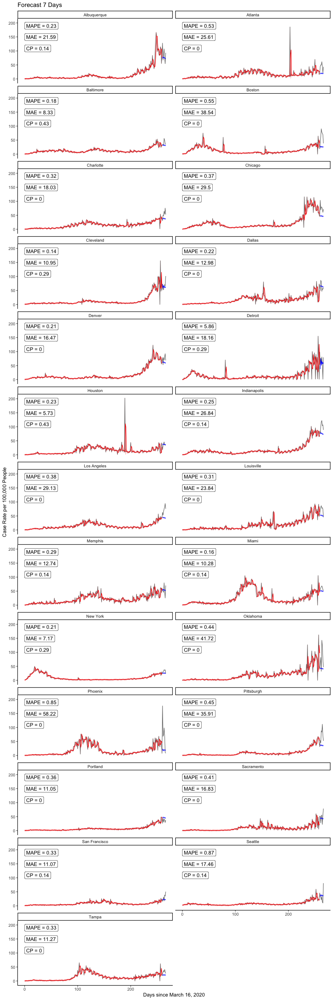
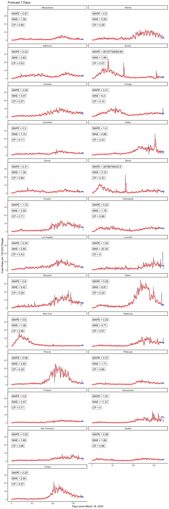

# Downloading and getting data in shape

<br />

## Initial work

- First need to read in all.csv off Ken's GitHub page; to do this, load RCurl package to use getURL function w/in read.csv, as the csv file is embedded within an html file (typical for GitHub).


```r
alldata <-
  read.csv(text=getURL("https://raw.githubusercontent.com/kentranz/socialMobilityCOVID/master/data/all.csv"), 
           header=T)
## the above file has already been updated for standardized 
##    Apple mobility data, and various indicator variables for
##    dates of interest, as well as lagged cases variables, etc.
##    --> it has longitudinal data for 24 cities,
##          20 in US, and Toronto, Montreal, London, and Stockholm

str(alldata)
```

```
## 'data.frame':	6216 obs. of  43 variables:
##  $ city                   : Factor w/ 24 levels "Atlanta","Baltimore",..: 1 1 1 1 1 1 1 1 1 1 ...
##  $ date                   : Factor w/ 259 levels "2020-03-01","2020-03-02",..: 1 2 3 4 5 6 7 8 9 10 ...
##  $ newCases               : int  0 2 0 0 0 0 4 4 5 4 ...
##  $ casesTminus1           : int  0 0 2 0 0 0 0 4 4 5 ...
##  $ casesTminus2           : int  0 0 0 2 0 0 0 0 4 4 ...
##  $ drivingMinus7          : num  6.73 3.59 7.82 13.01 15.97 ...
##  $ transitMinus7          : num  4.81 -2.85 3.34 4.61 12.06 ...
##  $ walkingMinus7          : num  4.54 -11.14 4.76 8.71 27.63 ...
##  $ drivingMinus8          : num  12.09 6.73 3.59 7.82 13.01 ...
##  $ transitMinus8          : num  7.51 4.81 -2.85 3.34 4.61 ...
##  $ walkingMinus8          : num  23.44 4.54 -11.14 4.76 8.71 ...
##  $ drivingMinus9          : num  7.82 12.09 6.73 3.59 7.82 ...
##  $ transitMinus9          : num  2.84 7.51 4.81 -2.85 3.34 ...
##  $ walkingMinus9          : num  5.55 23.44 4.54 -11.14 4.76 ...
##  $ drivingMinus10         : num  3.31 7.82 12.09 6.73 3.59 ...
##  $ transitMinus10         : num  -1.88 2.84 7.51 4.81 -2.85 ...
##  $ walkingMinus10         : num  1.55 5.55 23.44 4.54 -11.14 ...
##  $ drivingMinus11         : num  7.4 3.31 7.82 12.09 6.73 ...
##  $ transitMinus11         : num  2.76 -1.88 2.84 7.51 4.81 ...
##  $ walkingMinus11         : num  2.39 1.55 5.55 23.44 4.54 ...
##  $ drivingMinus12         : num  4.48 7.4 3.31 7.82 12.09 ...
##  $ transitMinus12         : num  1.55 2.76 -1.88 2.84 7.51 ...
##  $ walkingMinus12         : num  -8.78 2.39 1.55 5.55 23.44 ...
##  $ drivingMinus13         : num  7.27 4.48 7.4 3.31 7.82 ...
##  $ transitMinus13         : num  5.24 1.55 2.76 -1.88 2.84 7.51 4.81 -2.85 3.34 4.61 ...
##  $ walkingMinus13         : num  6.26 -8.78 2.39 1.55 5.55 ...
##  $ drivingMinus14         : num  8.11 7.27 4.48 7.4 3.31 ...
##  $ transitMinus14         : num  4.49 5.24 1.55 2.76 -1.88 2.84 7.51 4.81 -2.85 3.34 ...
##  $ walkingMinus14         : num  19.55 6.26 -8.78 2.39 1.55 ...
##  $ driving                : num  16.99 8.03 3.64 8.07 8.83 ...
##  $ walking                : num  26.35 -3.94 -0.85 -5.03 6.17 ...
##  $ transit                : num  12.27 3.27 -2.91 -4.81 1.56 ...
##  $ anomalousWeekend       : int  0 0 0 0 0 0 0 0 0 0 ...
##  $ longWeekend            : int  0 0 0 0 0 0 0 0 0 0 ...
##  $ weekend                : int  1 0 0 0 0 0 1 1 0 0 ...
##  $ sumDrivingMinus7_14    : num  8.17 7.53 7.61 8.82 10.05 ...
##  $ sumTransitMinus7_14    : num  3.9 2.85 2.58 3.02 4.35 ...
##  $ sumWalkingMinus7_14    : num  7.79 3.4 3.19 5.69 9.29 ...
##  $ Population             : int  5950000 5950000 5950000 5950000 5950000 5950000 5950000 5950000 5950000 5950000 ...
##  $ LandAreakm             : int  21694 21694 21694 21694 21694 21694 21694 21694 21694 21694 ...
##  $ Poverty.rate           : num  13.9 13.9 13.9 13.9 13.9 13.9 13.9 13.9 13.9 13.9 ...
##  $ Median.age             : num  36.6 36.6 36.6 36.6 36.6 36.6 36.6 36.6 36.6 36.6 ...
##  $ Median.household.income: num  69464 69464 69464 69464 69464 ...
```

- Code to read in data and output from `str` call hidden from this output.  Most R code below for data manipulation will also be hidden from output, and only selective dataset elements will be displayed. Alternatively, R code for data analyses and resulting output will more generally be displayed.

- Will output variable names though:


```
##  [1] "city"                    "date"                   
##  [3] "newCases"                "casesTminus1"           
##  [5] "casesTminus2"            "drivingMinus7"          
##  [7] "transitMinus7"           "walkingMinus7"          
##  [9] "drivingMinus8"           "transitMinus8"          
## [11] "walkingMinus8"           "drivingMinus9"          
## [13] "transitMinus9"           "walkingMinus9"          
## [15] "drivingMinus10"          "transitMinus10"         
## [17] "walkingMinus10"          "drivingMinus11"         
## [19] "transitMinus11"          "walkingMinus11"         
## [21] "drivingMinus12"          "transitMinus12"         
## [23] "walkingMinus12"          "drivingMinus13"         
## [25] "transitMinus13"          "walkingMinus13"         
## [27] "drivingMinus14"          "transitMinus14"         
## [29] "walkingMinus14"          "driving"                
## [31] "walking"                 "transit"                
## [33] "anomalousWeekend"        "longWeekend"            
## [35] "weekend"                 "sumDrivingMinus7_14"    
## [37] "sumTransitMinus7_14"     "sumWalkingMinus7_14"    
## [39] "Population"              "LandAreakm"             
## [41] "Poverty.rate"            "Median.age"             
## [43] "Median.household.income"
```

- Here, *newCases* will be converted into a rate, and this, and the first two days of lagged case rate values, will serve as the primary response and two predictors, respectively.

- The time variable will be a converted version of *date*.  This, and the previous bullet point will be worked on in the next subsection.


<br />

## Additional data manipulation

- Creating a US city indicator variable, i.e., 1 if US city, 0 for non-US city.


### Play with dates

- First, note that not all 24 cities had counts available to us starting at earlier date in our dataset of March 1, 2019, while all cities had observations starting March 13th.  As of the November 14th end dataset (the one being worked on here), these earlier dates in March, for cities where they were not originally collected, were entered in original dataset as 0's.  This seems a reasonable choice given the very low or non-existent case counts in many cities at that time.  In addition, we will not be use data earlier than March 13th in our analyses, so those 0's are irrelevant for our work here.

- Dates are in character form, and need to change to numeric for modeling.

- Need to align all new day variable to min of observed dates, so day 0 will 2020-03-01, but will have a second new day variable that will be about 2 days after 2020-03-13 (make this the midpoint of March, i.e., March 16th), to allow for two days of lagged cases as predictors; the lagged 7-day mobility data is actually available since near Feb 1, if we ever need it.

- Aside from March 16th start date, we will make one for April 1st, and one that is based on a French study (Prague et al., 2020), which is dynamic based on specifically starting on the first day of cases for which it is followed by
at least 3 consecutive days of cases as well; this took longer to program.

- Will use *chron* package in R to help with dates and specifying initial origin at March 1st (day 0). As suggested on *chron* help page, use `options` argument to set default first day --- could do this twice to help create two sets of two columns, one where 03-01-20 is default and one for 03-16-20;
a 2nd option is to subset data when modeling such that all dates are
at least 03-16-20 when we want to have the later start/default date, which
will only affect the intercept interpretation; will take the 2nd approach
where day 15 (16th day), i.e., 03-16-20, will be first day w/ all complete data that accounts for two lagged cases days.


- Here is where French start day will be defined, which will be the 1st day that at least 4 consecutive days of cases start.  Code will identify sequences in a vector.  Output prints first day of French method in each city.


```
##         city.FM startdate.FM
## 1       Atlanta     03/07/20
## 2     Baltimore     03/13/20
## 3        Boston     03/05/20
## 4       Chicago     03/08/20
## 5     Cleveland     03/13/20
## 6        Dallas     03/09/20
## 7        Denver     03/09/20
## 8       Houston     03/12/20
## 9  Indianapolis     03/08/20
## 10       London     03/01/20
## 11  Los Angeles     03/03/20
## 12      Memphis     03/18/20
## 13        Miami     03/10/20
## 14     Montreal     03/08/20
## 15     New York     03/04/20
## 16     Oklahoma     03/15/20
## 17      Phoenix     03/16/20
## 18   Pittsburgh     03/13/20
## 19     Portland     03/12/20
## 20   Sacramento     03/12/20
## 21      Seattle     03/01/20
## 22    Stockholm     03/01/20
## 23        Tampa     03/15/20
## 24      Toronto     03/01/20
```

- Dec 17 2020:  The above all provided, it should be mentioned that the use of the French method and start dates other than 03-16-20 will be put off for potential future use.


### Creating case rates

- Making another column in dataset, which is a rate, i.e.,
    number of cases per 100000 people in population.  This will
    be the longitudinal response variable in our graphing and modeling.
    To do this, taking *newCases*, divide by Population (in city), and      multiplying by 100000; will do this for *caseTminus1* and *caseTminus2*         variables as well:


<br />

---

# Start longitudinal work

<br />

## Initial graphing

- Start with using *nlme* library, created so-called groupedData objects, which benefit both graphing and modeling using the `lme` function (and other modeling functions) within *nlme*.


- Create plots from groupedData objects; nlme generic plotting on these objects uses Trellis graphs here.

<!-- --><!-- -->


## Data Partition

- We used start date as 2020-03-16, because that was the first date that allowed for at least 2 lagged observerations in all cities.
- Train set used data until 2020-10-31
- Test sets: 
  - test7: first 7 days in November
  - test14: first 14 days in November
  


```r
cutOff <- as.Date("2020-10-31")

train <- alldata.groupedR %>% 
  filter(day031620 >= 0 & as.Date(date) <= cutOff)


test7 <- alldata.groupedR %>% 
  filter(day031620 >= 0 & as.Date(date) > cutOff & as.Date(date) <= (cutOff + 7)) %>%
  select(city, day031620, date, weekend, case.rate, casesTminus1.rate, casesTminus2.rate, walkingMinus7, walkingMinus14) %>%
  
  # retained lag case rates for first 2 days only, zero out the rest
  mutate(
    casesTminus1.rate = case_when(as.Date(date) == (cutOff + 1) ~ casesTminus1.rate
                                    , TRUE ~ 0
                                  ) 
    , casesTminus2.rate = case_when(as.Date(date) == (cutOff + 1) | as.Date(date) == (cutOff + 2) ~ casesTminus2.rate
                                    , TRUE ~ 0
                                  ) 
  )
  
  
test14 <- alldata.groupedR %>% 
  filter(day031620 >= 0 & as.Date(date) > cutOff) %>%
  select(city, day031620, date, weekend, case.rate, casesTminus1.rate, casesTminus2.rate, walkingMinus7, walkingMinus14) %>%
  
  # retained lag case rates for first 2 days only, zero out the rest
  mutate(
    casesTminus1.rate = case_when(as.Date(date) == (cutOff + 1) ~ casesTminus1.rate
                                    , TRUE ~ 0
                                  ) 
    , casesTminus2.rate = case_when(as.Date(date) == (cutOff + 1) | as.Date(date) == (cutOff + 2) ~ casesTminus2.rate
                                    , TRUE ~ 0
                                  ) 
  )


nrow(train)
```

```
## [1] 5520
```

```r
nrow(test7)
```

```
## [1] 168
```

```r
nrow(test14)
```

```
## [1] 336
```
  


## Automate extracting 95% CI for prediction band, metrics, and plotting

Predict one day at a time, feedforward the prediction as lag case.rate. 


```r
forecastLME <- function(model, test) # provide model obj and test set
{
  for (i in 1:nrow(test))
  {
    
    pred <- predict(model, newdata = test[i,])
    test[i, 'pred'] <- pred
    
    # if second day or later, use pred case.rate as lag-1
    if ( i <= (nrow(test)-1) & as.Date(test[i+1,'date']) > cutOff+1)
    {
      test[i+1, 'casesTminus1.rate'] <- pred
    }
    
    # if third day or later, use pred case.rate as lag-2
    if (i <= (nrow(test)-2) & as.Date(test[i+2,'date']) > (cutOff + 2))
    {
      test[i+2, 'casesTminus2.rate'] <- pred
    }
  
  }
  
  return(test)
}

#forecast(model = case.rate.lme20201031
#         , test = test14
#         )
```


Extract 95% CI for prediction band. References from the web:

- https://stackoverflow.com/questions/14358811/extract-prediction-band-from-lme-fit and 
- http://bbolker.github.io/mixedmodels-misc/glmmFAQ.html#predictions-andor-confidence-or-prediction-intervals-on-predictions

SE: This approach takes into account the uncertainty of the random effect in the prediction. 

SE2: This takes into account both random effect uncertainty and within-group error


```r
#model <- case.rate.lme20201031

metricsFuncLME <- function(model)
{
  results7 <- forecastLME(model, test = test7)
  
  # create design mateix
  # [-2] drops response from formula
  Designmat <- model.matrix(formula(model)[-2], results7)
  
  # compute XVX′ to get the variance-covariance matrix of the predictions
  # extract the diagonal of this matrix to get variances of predictions
  predvar <- diag(Designmat %*% vcov(model) %*% t(Designmat)) 
  results7$SE <- sqrt(predvar) 
  results7$SE2 <- sqrt(predvar + model$sigma^2) # sigma is the estimated within-group error standard deviation
  
  
  results14 <- forecastLME(model, test = test14)
  
  Designmat <- model.matrix(formula(model)[-2], results14)
  predvar <- diag(Designmat %*% vcov(model) %*% t(Designmat)) 
  results14$SE <- sqrt(predvar) 
  results14$SE2 <- sqrt(predvar + model$sigma^2)


  # CALCULATE MAE, MAPE, CP
  perform7 <- results7 %>% 
  group_by(city) %>% 
  summarize(MAE = round(mean(abs(case.rate - pred)) , 2)
            , MAPE = round(mean(abs(case.rate - pred)/case.rate) , 2)
            , CP = round(sum(case.rate >= (pred - 1.96*SE2) & case.rate <= (pred + 1.96*SE2) ) / n() , 2)
            ) #%>%
  #as.data.frame() %>%
  #print()


  perform14 <- results14 %>% 
    group_by(city) %>% 
    summarize(MAE = round(mean(abs(case.rate - pred)) , 2)
              , MAPE = round(mean(abs(case.rate - pred)/case.rate) , 2)
              , CP = round(sum(case.rate >= (pred - 1.96*SE2) & case.rate <= (pred + 1.96*SE2) ) / n() , 2)
              ) #%>%
    #as.data.frame() %>%
    #print()
  
  metrics <- perform7 %>%
    left_join(perform14 
              , by = "city"
              , suffix = c("_7d", "_14d")
              ) #%>%
    #as.data.frame() %>%
    #print()
  
  return(list(performMetrics = metrics
              , results7 = results7
              , results14 = results14))
}


plotFuncLME <- function(model
                     , forecastLength # only 7 or 14 as numeric arg
                     )
{
  
  if(forecastLength == 7)
  { results = output$results7
    
    perform <- output$performMetrics %>% 
      select(city, contains("7d"))
  }
  
  if(forecastLength == 14)
  { results = output$results14
    
    perform <- output$performMetrics %>% 
      select(city, contains("14d")) 
  }
  
  perform <- setNames(perform, gsub("_.*", "", names(perform)))
  
  perform <- perform %>%
    mutate(MAPE = paste0("MAPE = ", MAPE)
                      , MAE = paste0("MAE = ", MAE)
                      , CP = paste0("CP = ", CP)
                      )
  
  
  Designmat <- model.matrix(formula(model)[-2], train)
  predvar <- diag(Designmat %*% vcov(model) %*% t(Designmat)) 
  
  plotDF <- train %>% 
    select(city, day031620, case.rate) %>%
    mutate(city = as.character(city)
           , SE2 = sqrt(predvar + model$sigma^2)
           , upperCI.fitted = case.rate + 1.96*SE2
           , lowerCI.fitted = case.rate - 1.96*SE2
           , fitted = predict(model, data = train)
           ) %>%
    reshape::melt(id = c('city', 'day031620')) %>%
    
    # bring into forecasted case rates
    rbind(results %>% 
            select(city, day031620, case.rate, pred, SE2) %>% 
            #rename(case.rate = pred) %>% 
            mutate(upperCI.pred = pred + 1.96*SE2
                   , lowerCI.pred = pred - 1.96*SE2
                   ) %>%
            reshape2::melt(id = c('city', 'day031620'))
          ) 
      
  
  p <- ggplot(plotDF 
              , aes(day031620, value, group = variable, colour = variable)) +
    
    geom_line(data = filter(plotDF, variable == 'case.rate'), linetype = "solid", color = 'black', alpha = 0.6) + 
    geom_line(data = filter(plotDF, variable == 'fitted'), linetype = "solid", color = 'red') +
    geom_line(data = filter(plotDF, variable == 'pred'), linetype = "solid", color = 'blue') +
    
    # uncertainty band for fitted model
    geom_ribbon(data = filter(plotDF, variable == 'lowerCI.fitted')
      , aes(ymin = filter(plotDF, variable == 'lowerCI.fitted')$value
                    , ymax =  filter(plotDF, variable == 'upperCI.fitted')$value
                    )
                , alpha = 0.3
                , color = NA
                , fill = "red") +
    
    # prediction band for forecast
    geom_ribbon(data = filter(plotDF, variable == 'lowerCI.pred')
      , aes(ymin = filter(plotDF, variable == 'lowerCI.pred')$value
                    , ymax =  filter(plotDF, variable == 'upperCI.pred')$value
                    )
                , alpha = 0.3
                , color = NA
                , fill = "blue") +
    
    facet_wrap(. ~ city, ncol = 2) +
    ggtitle(paste0('Forecast ', forecastLength, ' Days')) +
    ylab('Case Rate per 100,000 People') +
    xlab('Days since March 16, 2020') +
    #ylim(-15,100) +
    
    # add performance metrics
    geom_label(data = perform 
               , aes(label = MAPE), 
              x = 0, y = max(filter(plotDF, variable == 'case.rate')$value), hjust="inward", vjust="inward",
              inherit.aes = FALSE) +
    geom_label(data = perform 
               , aes(label = MAE), 
              x = 0, y = max(filter(plotDF, variable == 'case.rate')$value)*4/5, hjust="inward", vjust="inward",
              inherit.aes = FALSE) +
    geom_label(data = perform 
                , aes(label = CP), 
               x = 0, y = max(filter(plotDF, variable == 'case.rate')$value)*3/5, hjust="inward", vjust="inward",
               inherit.aes = FALSE) +
     
    theme_classic() +
    theme(legend.position = 'none') 
    
  p
}
```


## Initial modeling, using `lme` function
- Aside from dealing with heteroskedasticity, the following was the best model from earlier runs, through June 30th end data at the time, starting with March 16th data.  This is a linear mixed effects model, with case rate as the response, the fixed effects being the first two lagged case rate variables and the weekend indicator variable, and the random effects being the time-varying lagged case rate variables; there is no random intercept, shown not to be needed due to the relatively low levels across all cities near March 16th. 


```r
case.rate.lme20201031 <- 
  lme(fixed = case.rate ~ casesTminus1.rate + casesTminus2.rate + weekend,
      random = ~ casesTminus1.rate + casesTminus2.rate - 1 | city,
      data = train
      )

summary(case.rate.lme20201031)
```

```
## Linear mixed-effects model fit by REML
##  Data: train 
##        AIC      BIC    logLik
##   36173.54 36226.46 -18078.77
## 
## Random effects:
##  Formula: ~casesTminus1.rate + casesTminus2.rate - 1 | city
##  Structure: General positive-definite, Log-Cholesky parametrization
##                   StdDev     Corr  
## casesTminus1.rate 0.07906328 cssT1.
## casesTminus2.rate 0.04288122 -0.435
## Residual          6.36425583       
## 
## Fixed effects: case.rate ~ casesTminus1.rate + casesTminus2.rate + weekend 
##                        Value  Std.Error   DF   t-value p-value
## (Intercept)        2.0832864 0.13890398 5493 14.998033       0
## casesTminus1.rate  0.4925348 0.02381341 5493 20.683084       0
## casesTminus2.rate  0.3444545 0.01836626 5493 18.754750       0
## weekend           -1.6611547 0.19088747 5493 -8.702272       0
##  Correlation: 
##                   (Intr) cssT1. cssT2.
## casesTminus1.rate -0.216              
## casesTminus2.rate -0.163 -0.613       
## weekend           -0.340 -0.010 -0.028
## 
## Standardized Within-Group Residuals:
##         Min          Q1         Med          Q3         Max 
## -10.4156308  -0.3069059  -0.1145507   0.1803790  30.2216519 
## 
## Number of Observations: 5520
## Number of Groups: 24
```


## Experiment with bootstrap prediction interval

Easy Method by Bolker + sigma

```r
test <- test14
model <- case.rate.lme20201031

for (i in 1:nrow(test))
{
  
  pred <- predict(model, newdata = test[i,])
  test[i, 'pred'] <- pred
  
  # if second day or later, use pred case.rate as lag-1
  if ( i <= (nrow(test)-1) & as.Date(test[i+1,'date']) > cutOff+1)
  {
    test[i+1, 'casesTminus1.rate'] <- pred
  }
  
  # if third day or later, use pred case.rate as lag-2
  if (i <= (nrow(test)-2) & as.Date(test[i+2,'date']) > (cutOff + 2))
  {
    test[i+2, 'casesTminus2.rate'] <- pred
  }
  
}

Designmat <- model.matrix(formula(model)[-2], test)
predvar <- diag(Designmat %*% vcov(model) %*% t(Designmat)) 
test$SE <- sqrt(predvar + model$sigma^2)
test <- test %>% 
  mutate(lowerCI = pred - SE
         , upperCI = pred + SE
         )

test %>% select(city, date, weekend, case.rate, pred, lowerCI, upperCI)
```

```
##             city       date weekend  case.rate      pred     lowerCI  upperCI
## 1        Atlanta 2020-11-01       1   9.764706 12.869217  6.49022083 19.24821
## 2        Atlanta 2020-11-02       0  32.453782 14.746485  8.37477515 21.11819
## 3        Atlanta 2020-11-03       0  15.126050 11.827310  5.45795649 18.19666
## 4        Atlanta 2020-11-04       0  31.915966 11.470158  5.10203336 17.83828
## 5        Atlanta 2020-11-05       0  19.798319 10.307952  3.94039048 16.67551
## 6        Atlanta 2020-11-06       0  25.647059  9.773413  3.40631077 16.14051
## 7        Atlanta 2020-11-07       1  16.504202  7.511925  1.14388281 13.87997
## 8        Atlanta 2020-11-08       1  14.991597  6.528772  0.16129066 12.89625
## 9        Atlanta 2020-11-09       0  14.840336  7.041753  0.67587813 13.40763
## 10       Atlanta 2020-11-10       0  43.983193  6.872467  0.50651236 13.23842
## 11       Atlanta 2020-11-11       0  19.680672  6.995303  0.62938450 13.36122
## 12       Atlanta 2020-11-12       0  25.226891  6.978258  0.61231590 13.34420
## 13       Atlanta 2020-11-13       0  22.941176  7.015912  0.64997237 13.38185
## 14       Atlanta 2020-11-14       1  28.201681  5.361911 -1.00532439 11.72915
## 15     Baltimore 2020-11-01       1  15.698649 13.888328  7.51700762 20.25965
## 16     Baltimore 2020-11-02       0  15.520255 14.435279  8.06613736 20.80442
## 17     Baltimore 2020-11-03       0  13.664960 14.048056  7.67886675 20.41724
## 18     Baltimore 2020-11-04       0  17.518265 14.043403  7.67438380 20.41242
## 19     Baltimore 2020-11-05       0  20.336886 13.907885  7.53890649 20.27686
## 20     Baltimore 2020-11-06       0  27.865102 13.838810  7.46990533 20.20772
## 21     Baltimore 2020-11-07       1  28.114853 12.096646  5.72666041 18.46663
## 22     Baltimore 2020-11-08       1  19.230845 11.205462  4.83626862 17.57465
## 23     Baltimore 2020-11-09       0  25.474625 11.823609  5.45612694 18.19109
## 24     Baltimore 2020-11-10       0  23.583652 11.824827  5.45714286 18.19251
## 25     Baltimore 2020-11-11       0  29.720396 12.038069  5.67035581 18.40578
## 26     Baltimore 2020-11-12       0  28.614355 12.144661  5.77685149 18.51247
## 27     Baltimore 2020-11-13       0  29.577681 12.271087  5.90321541 18.63896
## 28     Baltimore 2020-11-14       1  38.675762 10.709546  4.34043997 17.07865
## 29        Boston 2020-11-01       1  16.622139 16.850678 10.47658805 23.22477
## 30        Boston 2020-11-02       0  10.445270 17.134662 10.76325077 23.50607
## 31        Boston 2020-11-03       0  12.682077 16.530681 10.15949792 22.90186
## 32        Boston 2020-11-04       0  22.101289 16.302295  9.93148164 22.67311
## 33        Boston 2020-11-05       0  24.050799 15.988358  9.61777220 22.35894
## 34        Boston 2020-11-06       0  28.688581 15.749360  9.37900260 22.11972
## 35        Boston 2020-11-07       1  30.638091 13.861449  7.49019394 20.23270
## 36        Boston 2020-11-08       1  26.677507 12.787127  6.41690576 19.15735
## 37        Boston 2020-11-09       0  15.206179 13.276472  6.90813509 19.64481
## 38        Boston 2020-11-10       0  25.918224 13.191424  6.82294782 19.55990
## 39        Boston 2020-11-11       0  29.940372 13.303021  6.93455556 19.67149
## 40        Boston 2020-11-12       0  35.296394 13.334798  6.96628222 19.70331
## 41        Boston 2020-11-13       0  34.906492 13.387296  7.01875485 19.75584
## 42        Boston 2020-11-14       1  37.861539 11.764055  5.39434167 18.13377
## 43       Chicago 2020-11-01       1 115.905850 23.196265 16.77294782 29.61958
## 44       Chicago 2020-11-02       0  52.164504 16.411051 10.02963299 22.79247
## 45       Chicago 2020-11-03       0  53.824380 19.029923 12.65729540 25.40255
## 46       Chicago 2020-11-04       0  59.057747 17.886219 11.51354897 24.25889
## 47       Chicago 2020-11-05       0  76.544591 18.259340 11.88731625 24.63136
## 48       Chicago 2020-11-06       0 115.673256 18.031449 11.65932958 24.40357
## 49       Chicago 2020-11-07       1  91.726640 16.390075 10.01704456 22.76311
## 50       Chicago 2020-11-08       1  74.979867 15.462813  9.09088239 21.83474
## 51       Chicago 2020-11-09       0  85.827209 16.045085  9.67503006 22.41514
## 52       Chicago 2020-11-10       0  91.610343 16.004114  9.63380535 22.37442
## 53       Chicago 2020-11-11       0  85.552325 16.196715  9.82637744 22.56705
## 54       Chicago 2020-11-12       0 104.106987 16.280675  9.91021710 22.65113
## 55       Chicago 2020-11-13       0 110.249585 16.394501 10.02396872 22.76503
## 56       Chicago 2020-11-14       1  81.503074 14.822660  8.45096850 21.19435
## 57     Cleveland 2020-11-01       1  21.723753 16.610999 10.23693149 22.98507
## 58     Cleveland 2020-11-02       0  14.742862 16.186341  9.81526273 22.55742
## 59     Cleveland 2020-11-03       0  29.485723 15.380983  9.01046077 21.75150
## 60     Cleveland 2020-11-04       0  26.703130 14.859527  8.48954973 21.22950
## 61     Cleveland 2020-11-05       0  38.224042 14.336865  7.96729259 20.70644
## 62     Cleveland 2020-11-06       0  34.416283 13.912683  7.54346131 20.28190
## 63     Cleveland 2020-11-07       1  42.422340 11.872574  5.50251345 18.24263
## 64     Cleveland 2020-11-08       1  40.420826 10.778931  4.40980836 17.14805
## 65     Cleveland 2020-11-09       0  41.934166 11.221453  4.85414914 17.58876
## 66     Cleveland 2020-11-10       0  51.404746 11.045063  4.67766479 17.41246
## 67     Cleveland 2020-11-11       0  47.157630 11.117673  4.75032633 17.48502
## 68     Cleveland 2020-11-12       0  71.273437 11.089797  4.72243115 17.45716
## 69     Cleveland 2020-11-13       0  65.024807 11.102205  4.73484686 17.46956
## 70     Cleveland 2020-11-14       1  55.895949  9.437078  3.06852170 15.80563
## 71        Dallas 2020-11-01       1  23.236074 22.555865 16.15582071 28.95591
## 72        Dallas 2020-11-02       0  32.360743 25.975633 19.59299108 32.35828
## 73        Dallas 2020-11-03       0  27.785146 22.999934 16.61971343 29.38015
## 74        Dallas 2020-11-04       0  28.753316 22.862635 16.48487817 29.24039
## 75        Dallas 2020-11-05       0  22.214854 21.677345 15.30050364 28.05419
## 76        Dallas 2020-11-06       0  49.389920 21.058489 14.68274868 27.43423
## 77        Dallas 2020-11-07       1  16.684350 18.655235 12.27931931 25.03115
## 78        Dallas 2020-11-08       1  33.620690 17.272363 10.89837795 23.64635
## 79        Dallas 2020-11-09       0  44.045093 17.367561 10.99601423 23.73911
## 80        Dallas 2020-11-10       0  45.649867 16.892820 10.52142588 23.26421
## 81        Dallas 2020-11-11       0  39.708223 16.701459 10.33037727 23.07254
## 82        Dallas 2020-11-12       0  31.206897 16.431269 10.06037758 22.80216
## 83        Dallas 2020-11-13       0  42.625995 16.229976  9.85928624 22.60067
## 84        Dallas 2020-11-14       1  45.039788 14.370839  7.99923892 20.74244
## 85        Denver 2020-11-01       1  58.438164 45.826542 39.38459884 52.26849
## 86        Denver 2020-11-02       0  40.711247 46.775927 40.35131382 53.20054
## 87        Denver 2020-11-03       0  39.430595 43.975535 37.55542173 50.39565
## 88        Denver 2020-11-04       0  59.381802 42.758716 36.34365305 49.17378
## 89        Denver 2020-11-05       0  71.986112 41.106626 34.69521109 47.51804
## 90        Denver 2020-11-06       0  55.169132 39.767488 33.35958496 46.17539
## 91        Denver 2020-11-07       1  66.391686 36.788085 30.38270291 43.19347
## 92        Denver 2020-11-08       1  60.763558 34.672107 28.27202534 41.07219
## 93        Denver 2020-11-09       0  74.143000 34.121301 27.72621081 40.51639
## 94        Denver 2020-11-10       0  59.921024 33.076848 26.68335100 39.47035
## 95        Denver 2020-11-11       0  76.232484 32.306629 25.91480891 38.69845
## 96        Denver 2020-11-12       0  93.251673 31.515476 25.12507088 37.90588
## 97        Denver 2020-11-13       0 123.212185 30.808629 24.41953878 37.19772
## 98        Denver 2020-11-14       1  82.770549 28.479934 22.09128734 34.86858
## 99       Houston 2020-11-01       1   7.302430  9.207089  2.83778100 15.57640
## 100      Houston 2020-11-02       0  12.382997  9.718646  3.35162218 16.08567
## 101      Houston 2020-11-03       0   9.934701  8.695165  2.32840370 15.06193
## 102      Houston 2020-11-04       0  11.236685  8.513985  2.14751496 14.88045
## 103      Houston 2020-11-05       0  15.991756  8.094469  1.72810855 14.46083
## 104      Houston 2020-11-06       0  13.288724  7.884269  1.51802723 14.25051
## 105      Houston 2020-11-07       1  10.288501  6.003464 -0.36397276 12.37090
## 106      Houston 2020-11-08       1  12.354693  5.270475 -1.09664649 11.63760
## 107      Houston 2020-11-09       0  11.760309  6.020347 -0.34529867 12.38599
## 108      Houston 2020-11-10       0  19.246715  6.028522 -0.33724274 12.39429
## 109      Houston 2020-11-11       0  27.002009  6.292182 -0.07356890 12.65793
## 110      Houston 2020-11-12       0  27.893584  6.387531  0.02173177 12.75333
## 111      Houston 2020-11-13       0  20.138290  6.512681  0.14686480 12.87850
## 112      Houston 2020-11-14       1  15.071876  4.928596 -1.43854495 11.29574
## 113 Indianapolis 2020-11-01       1  25.740683 31.923944 25.52430332 38.32358
## 114 Indianapolis 2020-11-02       0  31.862531 31.638699 25.24675397 38.03064
## 115 Indianapolis 2020-11-03       0  28.343674 29.577632 23.18849246 35.96677
## 116 Indianapolis 2020-11-04       0  44.347245 28.395969 22.00954393 34.78239
## 117 Indianapolis 2020-11-05       0  49.505022 27.074042 20.68969844 33.45839
## 118 Indianapolis 2020-11-06       0  48.540952 25.976959 19.59447211 32.35945
## 119 Indianapolis 2020-11-07       1  60.350816 23.289425 16.90766449 29.67119
## 120 Indianapolis 2020-11-08       1  47.094846 21.502318 15.12343943 27.88120
## 121 Indianapolis 2020-11-09       0  42.515511 21.310123 14.93442306 27.68582
## 122 Indianapolis 2020-11-10       0  57.747825 20.602020 14.22687545 26.97716
## 123 Indianapolis 2020-11-11       0  63.821470 20.164054 13.78954918 26.53856
## 124 Indianapolis 2020-11-12       0  86.236110 19.693053 13.31903939 26.06707
## 125 Indianapolis 2020-11-13       0  67.243920 19.296411 12.92285209 25.66997
## 126 Indianapolis 2020-11-14       1 101.757645 17.266530 10.89236179 23.64070
## 127       London 2020-11-01       1  13.712048 15.683473  9.31093927 22.05601
## 128       London 2020-11-02       0  33.011330 15.450035  9.07993010 21.82014
## 129       London 2020-11-03       0  24.124102 15.304432  8.93447903 21.67439
## 130       London 2020-11-04       0  23.225137 15.150869  8.78102955 21.52071
## 131       London 2020-11-05       0  23.748585 15.022937  8.65320482 21.39267
## 132       London 2020-11-06       0  23.862378 14.905445  8.53580478 21.27509
## 133       London 2020-11-07       1  18.616524 13.140817  6.77015395 19.51148
## 134       London 2020-11-08       1  19.947901 12.196918  5.82714901 18.56669
## 135       London 2020-11-09       0  34.934430 12.777560  6.40956761 19.14555
## 136       London 2020-11-10       0  30.826505 12.755799  6.38761129 19.12399
## 137       London 2020-11-11       0  32.988571 12.941049  6.57283802 19.30926
## 138       London 2020-11-12       0  31.384091 13.028607  6.66030558 19.39691
## 139       London 2020-11-13       0  30.234782 13.136129  6.76777154 19.50449
## 140       London 2020-11-14       1  20.004798 11.559683  5.19011539 17.92925
## 141  Los Angeles 2020-11-01       1  13.742169 10.253657  3.88508433 16.62223
## 142  Los Angeles 2020-11-02       0  12.024398 11.220198  4.85315782 17.58724
## 143  Los Angeles 2020-11-03       0  11.161729 11.490986  5.12359790 17.85837
## 144  Los Angeles 2020-11-04       0  15.361565 11.953546  5.58601275 18.32108
## 145  Los Angeles 2020-11-05       0  18.123620 12.291625  5.92387084 18.65938
## 146  Los Angeles 2020-11-06       0  18.441446 12.625401  6.25746515 18.99334
## 147  Los Angeles 2020-11-07       1  20.053275 11.254931  4.88565043 17.62421
## 148  Los Angeles 2020-11-08       1  20.779733 10.625359  4.25662734 16.99409
## 149  Los Angeles 2020-11-09       0  13.076249 11.498218  5.13102808 17.86541
## 150  Los Angeles 2020-11-10       0  19.084664 11.762622  5.39510242 18.13014
## 151  Los Angeles 2020-11-11       0  18.418744 12.191057  5.82338980 18.55872
## 152  Los Angeles 2020-11-12       0  21.233770 12.508647  6.14076842 18.87653
## 153  Los Angeles 2020-11-13       0  23.049915 12.820199  6.45214565 19.18825
## 154  Los Angeles 2020-11-14       1  32.387931 11.431036  5.06165113 17.80042
## 155      Memphis 2020-11-01       1  14.932636 26.005855 19.62186729 32.38984
## 156      Memphis 2020-11-02       0  44.946491 24.233929 17.85358973 30.61427
## 157      Memphis 2020-11-03       0  13.521093 24.292201 17.91333002 30.67107
## 158      Memphis 2020-11-04       0  29.419522 23.599156 17.22065919 29.97765
## 159      Memphis 2020-11-05       0  42.420573 23.290356 16.91253709 29.66817
## 160      Memphis 2020-11-06       0  26.819311 22.860196 16.48282526 29.23757
## 161      Memphis 2020-11-07       1  39.003154 20.867005 14.48918993 27.24482
## 162      Memphis 2020-11-08       1  51.409871 19.735671 13.35965429 26.11169
## 163      Memphis 2020-11-09       0  68.868426 20.042995 13.66926816 26.41672
## 164      Memphis 2020-11-10       0  24.887727 19.730100 13.35632187 26.10388
## 165      Memphis 2020-11-11       0  47.398118 19.705029 13.33146129 26.07860
## 166      Memphis 2020-11-12       0  28.007979 19.565683 13.19218445 25.93918
## 167      Memphis 2020-11-13       0  42.494865 19.488625 13.11524287 25.86201
## 168      Memphis 2020-11-14       1  65.228131 17.733799 11.35949836 24.10810
## 169        Miami 2020-11-01       1  31.870968 18.466602 12.08700378 24.84620
## 170        Miami 2020-11-02       0  29.274194 17.100909 10.72833564 23.47348
## 171        Miami 2020-11-03       0  28.096774 18.587791 12.21638962 24.95919
## 172        Miami 2020-11-04       0  22.725806 18.969046 12.59673339 25.34136
## 173        Miami 2020-11-05       0  42.854839 19.718314 13.34556074 26.09107
## 174        Miami 2020-11-06       0  32.919355 20.289714 13.91630386 26.66312
## 175        Miami 2020-11-07       1  25.919355 19.226929 12.85195029 25.60191
## 176        Miami 2020-11-08       1  48.096774 18.810870 12.43665423 25.18509
## 177        Miami 2020-11-09       0  21.516129 19.852900 13.48017962 26.22562
## 178        Miami 2020-11-10       0  15.903226 20.311968 13.93845881 26.68548
## 179        Miami 2020-11-11       0  24.612903 20.948770 14.57474723 27.32279
## 180        Miami 2020-11-12       0  34.064516 21.482294 15.10765234 27.85694
## 181        Miami 2020-11-13       0  51.403226 22.018728 15.64351636 28.39394
## 182        Miami 2020-11-14       1  29.693548 20.859073 14.48233403 27.23581
## 183     Montreal 2020-11-01       1   5.708811  4.811886 -1.55519351 11.17896
## 184     Montreal 2020-11-02       0   4.830532  6.327011 -0.03859014 12.69261
## 185     Montreal 2020-11-03       0   5.977174  6.678672  0.31281210 13.04453
## 186     Montreal 2020-11-04       0   6.050364  7.359598  0.99372269 13.72547
## 187     Montreal 2020-11-05       0   7.977698  7.797480  1.43144800 14.16351
## 188     Montreal 2020-11-06       0   6.489503  8.234168  1.86802817 14.60031
## 189     Montreal 2020-11-07       1   6.635883  6.926257  0.55872795 13.29379
## 190     Montreal 2020-11-08       1   6.709073  6.464470  0.09721525 12.83173
## 191     Montreal 2020-11-09       0   6.709073  7.463946  1.09810748 13.82978
## 192     Montreal 2020-11-10       0   7.758128  7.773153  1.40708619 14.13922
## 193     Montreal 2020-11-11       0   8.563217  8.258396  1.89226265 14.62453
## 194     Montreal 2020-11-12       0   6.928643  8.590428  2.22415794 14.95670
## 195     Montreal 2020-11-13       0   8.099681  8.910955  2.54458307 15.27733
## 196     Montreal 2020-11-14       1   7.538558  7.512704  1.14497874 13.88043
## 197     New York 2020-11-01       1   8.622941  8.505596  2.13788375 14.87331
## 198     New York 2020-11-02       0   7.524908  9.457344  3.09099759 15.82369
## 199     New York 2020-11-03       0  11.292566 10.241478  3.87481244 16.60814
## 200     New York 2020-11-04       0  11.948263 11.000942  4.63397722 17.36791
## 201     New York 2020-11-05       0  11.115632 11.690135  5.32284544 18.05743
## 202     New York 2020-11-06       0  12.203257 12.331691  5.96407507 18.69931
## 203     New York 2020-11-07       1  17.042928 11.261758  4.89263835 17.63088
## 204     New York 2020-11-08       1  12.151217 10.879073  4.51037063 17.24778
## 205     New York 2020-11-09       0  11.922243 11.965628  5.59834385 18.33291
## 206     New York 2020-11-10       0  20.482737 12.444821  6.07707492 18.81257
## 207     New York 2020-11-11       0  18.349118 13.079032  6.71102146 19.44704
## 208     New York 2020-11-12       0  19.754184 13.595402  7.22704627 19.96376
## 209     New York 2020-11-13       0  19.759388 14.098040  7.72937553 20.46670
## 210     New York 2020-11-14       1  24.864461 12.892142  6.52203295 19.26225
## 211     Oklahoma 2020-11-01       1  34.706696 21.159724 14.78175002 27.53770
## 212     Oklahoma 2020-11-02       0  24.273395 20.787959 14.41300714 27.16291
## 213     Oklahoma 2020-11-03       0  25.338018 20.579504 14.20487178 26.95414
## 214     Oklahoma 2020-11-04       0  22.144150 20.343671 13.96927976 26.71806
## 215     Oklahoma 2020-11-05       0  57.418645 20.143807 13.76964913 26.51797
## 216     Oklahoma 2020-11-06       0  37.190816 19.955755 13.58180105 26.32971
## 217     Oklahoma 2020-11-07       1  63.380532 18.124613 11.74985740 24.49937
## 218     Oklahoma 2020-11-08       1  63.380532 17.024184 10.65080063 23.39757
## 219     Oklahoma 2020-11-09       0  64.303205 17.481845 11.11055600 23.85313
## 220     Oklahoma 2020-11-10       0  36.268143 17.394786 11.02333675 23.76623
## 221     Oklahoma 2020-11-11       0  57.773519 17.489712 11.11827284 23.86115
## 222     Oklahoma 2020-11-12       0  59.334966 17.516209 11.14471322 23.88770
## 223     Oklahoma 2020-11-13       0  67.780972 17.561229 11.18970305 23.93275
## 224     Oklahoma 2020-11-14       1  66.361475 15.934032  9.56142344 22.30664
## 225      Phoenix 2020-11-01       1  21.684640 20.933398 14.55445347 27.31234
## 226      Phoenix 2020-11-02       0  10.488656 22.061439 15.68591902 28.43696
## 227      Phoenix 2020-11-03       0  20.047682 21.577506 15.20175034 27.95326
## 228      Phoenix 2020-11-04       0  12.529801 21.695518 15.32003458 28.07100
## 229      Phoenix 2020-11-05       0  27.929331 21.594945 15.21944281 27.97045
## 230      Phoenix 2020-11-06       0  28.515402 21.579448 15.20401734 27.95488
## 231      Phoenix 2020-11-07       1  32.153087 19.875082 13.49872797 26.25144
## 232      Phoenix 2020-11-08       1  24.554369 18.919660 12.54469987 25.29462
## 233      Phoenix 2020-11-09       0  22.007990 19.462319 13.08940310 25.83523
## 234      Phoenix 2020-11-10       0  31.546806 19.436385 13.06319307 25.80958
## 235      Phoenix 2020-11-11       0  20.310404 19.608473 13.23523126 25.98172
## 236      Phoenix 2020-11-12       0  13.661525 19.695489 13.32211150 26.06887
## 237      Phoenix 2020-11-13       0  60.143046 19.803153 13.42968052 26.17663
## 238      Phoenix 2020-11-14       1  37.811707 18.231928 11.85735823 24.60650
## 239   Pittsburgh 2020-11-01       1  13.877778 14.186691  7.81472295 20.55866
## 240   Pittsburgh 2020-11-02       0  14.429494 14.405488  8.03605086 20.77493
## 241   Pittsburgh 2020-11-03       0  14.769011 13.677872  7.30867863 20.04706
## 242   Pittsburgh 2020-11-04       0  18.715902 13.414536  7.04571136 19.78336
## 243   Pittsburgh 2020-11-05       0  17.018315 13.041227  6.67261269 19.40984
## 244   Pittsburgh 2020-11-06       0  20.540809 12.776700  6.40829664 19.14510
## 245   Pittsburgh 2020-11-07       1  26.524805 10.863767  4.49437311 17.23316
## 246   Pittsburgh 2020-11-08       1  22.662793  9.882090  3.51346813 16.25071
## 247   Pittsburgh 2020-11-09       0  23.002311 10.427093  4.06018671 16.79400
## 248   Pittsburgh 2020-11-10       0  29.792661 10.342545  3.97550136 16.70959
## 249   Pittsburgh 2020-11-11       0  34.842984 10.490981  4.12395035 16.85801
## 250   Pittsburgh 2020-11-12       0  39.256711 10.530949  4.16386647 16.89803
## 251   Pittsburgh 2020-11-13       0  33.187836 10.600703  4.23359842 16.96781
## 252   Pittsburgh 2020-11-14       1  33.315155  8.985793  2.61745312 15.35413
## 253     Portland 2020-11-01       1   8.790323 10.255015  3.88600715 16.62402
## 254     Portland 2020-11-02       0  22.661290 10.284880  3.91785631 16.65190
## 255     Portland 2020-11-03       0  10.604839 10.107726  3.74072521 16.47473
## 256     Portland 2020-11-04       0  15.322581 10.040729  3.67379090 16.40767
## 257     Portland 2020-11-05       0  19.637097  9.950398  3.58349252 16.31730
## 258     Portland 2020-11-06       0  18.024194  9.887877  3.52100688 16.25475
## 259     Portland 2020-11-07       1  21.895161  8.168288  1.80022367 14.53635
## 260     Portland 2020-11-08       1  19.112903  7.396418  1.02881593 13.76402
## 261     Portland 2020-11-09       0  27.782258  8.127716  1.76164964 14.49378
## 262     Portland 2020-11-10       0  21.814516  8.180593  1.81435865 14.54683
## 263     Portland 2020-11-11       0  20.000000  8.455882  2.08963008 14.82213
## 264     Portland 2020-11-12       0  36.975806  8.594235  2.22790402 14.96057
## 265     Portland 2020-11-13       0  25.362903  8.749546  2.38317007 15.11592
## 266     Portland 2020-11-14       1  21.088710  7.203875  0.83619926 13.57155
## 267   Sacramento 2020-11-01       1   7.065105  4.446432 -1.92208421 10.81495
## 268   Sacramento 2020-11-02       0  21.745292  4.667374 -1.69841309 11.03316
## 269   Sacramento 2020-11-03       0  11.126482  5.568524 -0.79705232 11.93410
## 270   Sacramento 2020-11-04       0   9.857302  6.050574 -0.31513048 12.41628
## 271   Sacramento 2020-11-05       0  15.568614  6.542827  0.17706614 12.90859
## 272   Sacramento 2020-11-06       0  14.807106  6.914325  0.54847491 13.28017
## 273   Sacramento 2020-11-07       1   2.072995  5.571991 -0.79522920 11.93921
## 274   Sacramento 2020-11-08       1  13.622537  5.063678 -1.30334208 11.43070
## 275   Sacramento 2020-11-09       0  26.948932  6.088383 -0.27723165 12.45400
## 276   Sacramento 2020-11-10       0  25.637446  6.409143  0.04335521 12.77493
## 277   Sacramento 2020-11-11       0  18.826177  6.863945  0.49812334 13.22977
## 278   Sacramento 2020-11-12       0  25.764364  7.169874  0.80395850 13.53579
## 279   Sacramento 2020-11-13       0  20.518418  7.447220  1.08123820 13.81320
## 280   Sacramento 2020-11-14       1   3.342175  6.005654 -0.36167694 12.37298
## 281      Seattle 2020-11-01       1   6.834437 10.140457  3.77151394 16.50940
## 282      Seattle 2020-11-02       0  20.302298 10.197031  3.83005104 16.56401
## 283      Seattle 2020-11-03       0   7.161083 10.009215  3.64225204 16.37618
## 284      Seattle 2020-11-04       0  22.840085  9.947419  3.58052023 16.31432
## 285      Seattle 2020-11-05       0  21.533502  9.855670  3.48880198 16.22254
## 286      Seattle 2020-11-06       0  23.216985  9.794541  3.42770850 16.16137
## 287      Seattle 2020-11-07       1  16.382548  8.075162  1.70713157 14.44319
## 288      Seattle 2020-11-08       1  14.724192  7.309113  0.94153782 13.67669
## 289      Seattle 2020-11-09       0  23.820023  8.043551  1.67750750 14.40959
## 290      Seattle 2020-11-10       0  15.653876  8.096716  1.73050490 14.46293
## 291      Seattle 2020-11-11       0  16.256915  8.373834  2.00760738 14.74006
## 292      Seattle 2020-11-12       0  28.468445  8.512286  2.14597976 14.87859
## 293      Seattle 2020-11-13       0  31.785157  8.668140  2.30178906 15.03449
## 294      Seattle 2020-11-14       1  23.342618  7.122405  0.75475378 13.49006
## 295    Stockholm 2020-11-01       1  24.652084 21.176907 14.79706936 27.55674
## 296    Stockholm 2020-11-02       0  43.540796 21.087174 14.71131093 27.46304
## 297    Stockholm 2020-11-03       0  34.496090 19.867074 13.49218145 26.24197
## 298    Stockholm 2020-11-04       0  36.347100 19.222018 12.84814409 25.59589
## 299    Stockholm 2020-11-05       0  36.178826 18.484529 12.11138864 24.85767
## 300    Stockholm 2020-11-06       0  40.133256 17.894882 11.52240276 24.26736
## 301    Stockholm 2020-11-07       1  40.133256 15.687316  9.31435139 22.06028
## 302    Stockholm 2020-11-08       1  40.133256 14.375737  8.00422098 20.74725
## 303    Stockholm 2020-11-09       0  46.527653 14.629747  8.26039002 20.99910
## 304    Stockholm 2020-11-10       0  48.799347 14.314305  7.94496664 20.68364
## 305    Stockholm 2020-11-11       0  52.417229 14.241252  7.87206904 20.61044
## 306    Stockholm 2020-11-12       0  54.941334 14.097802  7.72869010 20.46691
## 307    Stockholm 2020-11-13       0  56.666138 14.000830  7.63180377 20.36986
## 308    Stockholm 2020-11-14       1  56.666138 12.242320  5.87223386 18.61241
## 309        Tampa 2020-11-01       1  23.193715 12.870799  6.49744113 19.24416
## 310        Tampa 2020-11-02       0  14.711263 12.037536  5.66906378 18.40601
## 311        Tampa 2020-11-03       0  15.243373 13.104136  6.73624083 19.47203
## 312        Tampa 2020-11-04       0  16.808401 13.408640  7.04028388 19.77700
## 313        Tampa 2020-11-05       0  24.602240 13.939730  7.57116476 20.30830
## 314        Tampa 2020-11-06       0  24.570940 14.336298  7.96742370 20.70517
## 315        Tampa 2020-11-07       1  17.903920 13.074674  6.70441262 19.44493
## 316        Tampa 2020-11-08       1  27.544493 12.513929  6.14426921 18.88359
## 317        Tampa 2020-11-09       0  17.152707 13.436277  7.06815311 19.80440
## 318        Tampa 2020-11-10       0  17.152707 13.754015  7.38546344 20.12257
## 319        Tampa 2020-11-11       0  22.567704 14.243289  7.87451584 20.61206
## 320        Tampa 2020-11-12       0  24.226634 14.621302  8.25223320 20.99037
## 321        Tampa 2020-11-13       0  22.692906 14.996361  8.62703833 21.36568
## 322        Tampa 2020-11-14       1  11.675109 13.670754  7.30006752 20.04144
## 323      Toronto 2020-11-01       1   6.123440  4.498336 -1.86862007 10.86529
## 324      Toronto 2020-11-02       0   7.523566  5.830155 -0.53540377 12.19571
## 325      Toronto 2020-11-03       0   8.181456  6.177600 -0.18816732 12.54337
## 326      Toronto 2020-11-04       0   7.945291  6.784123  0.41834352 13.14990
## 327      Toronto 2020-11-05       0   7.945291  7.168988  0.80308661 13.53489
## 328      Toronto 2020-11-06       0   7.439221  7.544768  1.17878556 13.91075
## 329      Toronto 2020-11-07       1   7.287400  6.179862 -0.18749324 12.54722
## 330      Toronto 2020-11-08       1   5.921013  5.708302 -0.65881224 12.07542
## 331      Toronto 2020-11-09       0   8.687526  6.697133  0.33142968 13.06284
## 332      Toronto 2020-11-10       0   7.405483  6.970835  0.60493819 13.33673
## 333      Toronto 2020-11-11       0   7.152448  7.428070  1.06213334 13.79401
## 334      Toronto 2020-11-12       0   6.460820  7.722218  1.35617323 14.08826
## 335      Toronto 2020-11-13       0   6.815069  8.007268  1.64114827 14.37339
## 336      Toronto 2020-11-14       1   5.701716  6.571587  0.20411933 12.93905
```

Using lmeresampler package. The problem currently is lower CI < prediction. Not sure why?


```r
## Define custom function to resample both fixed and random effects
mySumm <- function(.) { 
  c(beta = fixef(.)
    , random = ranef(.)
    #, sigma = as.numeric(.$sigma) # the estimated within-group error standard deviation.
    #, sig01 = as.numeric(VarCorr(.)[1,2]) #among city stdev
    )
}

set.seed(107)
lme_par_boot <- lmeresampler::bootstrap(case.rate.lme20201031
                           , fn = mySumm
                           #, fn = fixef
                           , type = "parametric"
                           , B = 200)


#t(apply(lme_par_boot$t , 2, quantile, c(0.025,0.975), na.rm=TRUE))

## Y_hat based on bootstrap fixed effects betas
## Has to be a for-loop because predictions are sequential, so can't use apply

test <- test14
model <- case.rate.lme20201031
bootSamp <- lme_par_boot$t %>% as.data.frame() # 200 bootstrap samples for coefficients


for (i in 1:nrow(test))
{
  
  pred <- lme_par_boot$t0$`beta.(Intercept)` + # access value within nested list
    lme_par_boot$t0$beta.casesTminus1.rate * test[i, 'casesTminus1.rate'] + 
    lme_par_boot$t0$beta.casesTminus2.rate * test[i, 'casesTminus2.rate'] +
    lme_par_boot$t0$beta.weekend * test[i, 'weekend'] +
    
    ## random effects
    ## extract the coef for the city
    (lme_par_boot$t0$random.casesTminus1.rate[as.integer(test[i, 'city'])] * test[i, 'casesTminus1.rate'] + 
       lme_par_boot$t0$random.casesTminus2.rate[as.integer(test[i, 'city'])] * test[i, 'casesTminus2.rate'])
  
  
  test[i, 'pred'] <- pred
  
  # if second day or later, use pred case.rate as lag-1
  if ( i <= (nrow(test)-1) & as.Date(test[i+1,'date']) > cutOff+1)
  {
    test[i+1, 'casesTminus1.rate'] <- pred
  }
  
  # if third day or later, use pred case.rate as lag-2
  if (i <= (nrow(test)-2) & as.Date(test[i+2,'date']) > (cutOff + 2))
  {
    test[i+2, 'casesTminus2.rate'] <- pred
  }
  
  ## Calculate yhat for each bootstrap iteration
  for (j in 1:nrow(bootSamp))
  {
    bootSamp[j, 'yHat'] <- 
      bootSamp[j,'beta.(Intercept)'][[1]] + # access coef value within nested list
      bootSamp[j,'beta.casesTminus1.rate'][[1]] * test[i, 'casesTminus1.rate'] + 
      bootSamp[j,'beta.casesTminus2.rate'][[1]] * test[i, 'casesTminus2.rate'] +
      bootSamp[j,'beta.weekend'][[1]] * test[i, 'weekend'] +
      
      ## random effects
      ## extract the coef for the city
      (bootSamp[j,'random.casesTminus1.rate'][[1]][as.integer(test[i, 'city'])] * test[i, 'casesTminus1.rate'] + 
         bootSamp[j,'random.casesTminus2.rate'][[1]][as.integer(test[i, 'city'])] * test[i, 'casesTminus2.rate']
       )
  }
  
  ## Bootstrap confidence interval of yhat
  test[i, 'lowerCI'] <- quantile(bootSamp$yHat, c(0.025))
  test[i, 'upperCI'] <- quantile(bootSamp$yHat, c(0.975))
}

test %>% select(city, date, weekend, case.rate, pred, lowerCI, upperCI)
```

```
##             city       date weekend  case.rate      pred   lowerCI   upperCI
## 1        Atlanta 2020-11-01       1   9.764706 12.869217 13.416271 19.012926
## 2        Atlanta 2020-11-02       0  32.453782 14.746485 14.484249 18.352064
## 3        Atlanta 2020-11-03       0  15.126050 11.827310 12.027388 15.595168
## 4        Atlanta 2020-11-04       0  31.915966 11.470158 11.551264 14.572218
## 5        Atlanta 2020-11-05       0  19.798319 10.307952 10.404319 13.325851
## 6        Atlanta 2020-11-06       0  25.647059  9.773413  9.833243 12.487913
## 7        Atlanta 2020-11-07       1  16.504202  7.511925  7.568369 10.127886
## 8        Atlanta 2020-11-08       1  14.991597  6.528772  6.505255  8.596303
## 9        Atlanta 2020-11-09       0  14.840336  7.041753  7.081862  8.787434
## 10       Atlanta 2020-11-10       0  43.983193  6.872467  6.943366  8.716228
## 11       Atlanta 2020-11-11       0  19.680672  6.995303  7.036523  8.815119
## 12       Atlanta 2020-11-12       0  25.226891  6.978258  7.026951  8.823056
## 13       Atlanta 2020-11-13       0  22.941176  7.015912  7.056627  8.859099
## 14       Atlanta 2020-11-14       1  28.201681  5.361911  5.381401  7.257372
## 15     Baltimore 2020-11-01       1  15.698649 13.888328 11.647771 15.756562
## 16     Baltimore 2020-11-02       0  15.520255 14.435279 12.500131 16.136821
## 17     Baltimore 2020-11-03       0  13.664960 14.048056 12.152022 15.865997
## 18     Baltimore 2020-11-04       0  17.518265 14.043403 12.158528 15.802784
## 19     Baltimore 2020-11-05       0  20.336886 13.907885 12.042021 15.668744
## 20     Baltimore 2020-11-06       0  27.865102 13.838810 11.986250 15.580262
## 21     Baltimore 2020-11-07       1  28.114853 12.096646 10.146920 13.745135
## 22     Baltimore 2020-11-08       1  19.230845 11.205462  9.483734 12.680703
## 23     Baltimore 2020-11-09       0  25.474625 11.823609 10.325217 13.186665
## 24     Baltimore 2020-11-10       0  23.583652 11.824827 10.309487 13.282470
## 25     Baltimore 2020-11-11       0  29.720396 12.038069 10.492981 13.491921
## 26     Baltimore 2020-11-12       0  28.614355 12.144661 10.578931 13.629474
## 27     Baltimore 2020-11-13       0  29.577681 12.271087 10.684846 13.770010
## 28     Baltimore 2020-11-14       1  38.675762 10.709546  8.988416 12.186037
## 29        Boston 2020-11-01       1  16.622139 16.850678 14.077161 19.201590
## 30        Boston 2020-11-02       0  10.445270 17.134662 14.755643 19.084650
## 31        Boston 2020-11-03       0  12.682077 16.530681 14.040796 18.521884
## 32        Boston 2020-11-04       0  22.101289 16.302295 13.914042 18.276347
## 33        Boston 2020-11-05       0  24.050799 15.988358 13.623254 17.913124
## 34        Boston 2020-11-06       0  28.688581 15.749360 13.428673 17.642465
## 35        Boston 2020-11-07       1  30.638091 13.861449 11.536951 15.808679
## 36        Boston 2020-11-08       1  26.677507 12.787127 10.730417 14.546971
## 37        Boston 2020-11-09       0  15.206179 13.276472 11.449503 14.817570
## 38        Boston 2020-11-10       0  25.918224 13.191424 11.221447 14.715919
## 39        Boston 2020-11-11       0  29.940372 13.303021 11.380791 14.853261
## 40        Boston 2020-11-12       0  35.296394 13.334798 11.384308 14.886031
## 41        Boston 2020-11-13       0  34.906492 13.387296 11.439734 14.947227
## 42        Boston 2020-11-14       1  37.861539 11.764055  9.769736 13.391234
## 43       Chicago 2020-11-01       1 115.905850 23.196265 18.481960 25.428821
## 44       Chicago 2020-11-02       0  52.164504 16.411051 12.310587 18.392455
## 45       Chicago 2020-11-03       0  53.824380 19.029923 15.829589 20.107928
## 46       Chicago 2020-11-04       0  59.057747 17.886219 14.629328 19.159295
## 47       Chicago 2020-11-05       0  76.544591 18.259340 15.184308 19.380598
## 48       Chicago 2020-11-06       0 115.673256 18.031449 14.866840 19.282850
## 49       Chicago 2020-11-07       1  91.726640 16.390075 13.132675 17.531254
## 50       Chicago 2020-11-08       1  74.979867 15.462813 12.576942 16.474160
## 51       Chicago 2020-11-09       0  85.827209 16.045085 13.399895 17.014346
## 52       Chicago 2020-11-10       0  91.610343 16.004114 13.225917 17.108488
## 53       Chicago 2020-11-11       0  85.552325 16.196715 13.455252 17.264389
## 54       Chicago 2020-11-12       0 104.106987 16.280675 13.491614 17.377690
## 55       Chicago 2020-11-13       0 110.249585 16.394501 13.596591 17.489813
## 56       Chicago 2020-11-14       1  81.503074 14.822660 11.838562 15.850302
## 57     Cleveland 2020-11-01       1  21.723753 16.610999 14.969005 19.063893
## 58     Cleveland 2020-11-02       0  14.742862 16.186341 14.667480 18.403514
## 59     Cleveland 2020-11-03       0  29.485723 15.380983 13.859638 17.593064
## 60     Cleveland 2020-11-04       0  26.703130 14.859527 13.439642 16.957558
## 61     Cleveland 2020-11-05       0  38.224042 14.336865 12.963363 16.379175
## 62     Cleveland 2020-11-06       0  34.416283 13.912683 12.596738 15.889377
## 63     Cleveland 2020-11-07       1  42.422340 11.872574 10.668841 13.783746
## 64     Cleveland 2020-11-08       1  40.420826 10.778931  9.757977 12.428889
## 65     Cleveland 2020-11-09       0  41.934166 11.221453 10.305919 12.729254
## 66     Cleveland 2020-11-10       0  51.404746 11.045063 10.009429 12.498595
## 67     Cleveland 2020-11-11       0  47.157630 11.117673 10.130247 12.593135
## 68     Cleveland 2020-11-12       0  71.273437 11.089797 10.082821 12.556534
## 69     Cleveland 2020-11-13       0  65.024807 11.102205 10.102984 12.572671
## 70     Cleveland 2020-11-14       1  55.895949  9.437078  8.489176 10.962196
## 71        Dallas 2020-11-01       1  23.236074 22.555865 17.601395 27.383645
## 72        Dallas 2020-11-02       0  32.360743 25.975633 21.967836 28.093712
## 73        Dallas 2020-11-03       0  27.785146 22.999934 18.901194 26.434322
## 74        Dallas 2020-11-04       0  28.753316 22.862635 19.101996 25.551285
## 75        Dallas 2020-11-05       0  22.214854 21.677345 18.006165 24.508364
## 76        Dallas 2020-11-06       0  49.389920 21.058489 17.560226 23.682629
## 77        Dallas 2020-11-07       1  16.684350 18.655235 15.290058 21.256863
## 78        Dallas 2020-11-08       1  33.620690 17.272363 14.157133 19.490083
## 79        Dallas 2020-11-09       0  44.045093 17.367561 14.578282 19.424921
## 80        Dallas 2020-11-10       0  45.649867 16.892820 14.133745 19.046403
## 81        Dallas 2020-11-11       0  39.708223 16.701459 13.995083 18.761391
## 82        Dallas 2020-11-12       0  31.206897 16.431269 13.775206 18.483997
## 83        Dallas 2020-11-13       0  42.625995 16.229976 13.616531 18.244022
## 84        Dallas 2020-11-14       1  45.039788 14.370839 11.739907 16.390224
## 85        Denver 2020-11-01       1  58.438164 45.826542 33.472535 49.201982
## 86        Denver 2020-11-02       0  40.711247 46.775927 36.035162 49.686018
## 87        Denver 2020-11-03       0  39.430595 43.975535 33.548517 46.835900
## 88        Denver 2020-11-04       0  59.381802 42.758716 32.802386 45.427201
## 89        Denver 2020-11-05       0  71.986112 41.106626 31.509385 43.699278
## 90        Denver 2020-11-06       0  55.169132 39.767488 30.514635 42.258108
## 91        Denver 2020-11-07       1  66.391686 36.788085 27.903591 39.276955
## 92        Denver 2020-11-08       1  60.763558 34.672107 26.361329 36.894031
## 93        Denver 2020-11-09       0  74.143000 34.121301 26.277947 36.214090
## 94        Denver 2020-11-10       0  59.921024 33.076848 25.443013 35.135006
## 95        Denver 2020-11-11       0  76.232484 32.306629 24.878419 34.300360
## 96        Denver 2020-11-12       0  93.251673 31.515476 24.274245 33.461468
## 97        Denver 2020-11-13       0 123.212185 30.808629 23.742701 32.705693
## 98        Denver 2020-11-14       1  82.770549 28.479934 21.628675 30.352770
## 99       Houston 2020-11-01       1   7.302430  9.207089  9.053502 12.579834
## 100      Houston 2020-11-02       0  12.382997  9.718646  9.448147 12.177238
## 101      Houston 2020-11-03       0   9.934701  8.695165  8.627352 11.233834
## 102      Houston 2020-11-04       0  11.236685  8.513985  8.362627 10.802213
## 103      Houston 2020-11-05       0  15.991756  8.094469  8.004761 10.322574
## 104      Houston 2020-11-06       0  13.288724  7.884269  7.784603 10.012952
## 105      Houston 2020-11-07       1  10.288501  6.003464  5.844203  8.152507
## 106      Houston 2020-11-08       1  12.354693  5.270475  5.083791  6.943071
## 107      Houston 2020-11-09       0  11.760309  6.020347  5.943857  7.437255
## 108      Houston 2020-11-10       0  19.246715  6.028522  6.007705  7.652555
## 109      Houston 2020-11-11       0  27.002009  6.292182  6.239549  7.900461
## 110      Houston 2020-11-12       0  27.893584  6.387531  6.343206  8.062661
## 111      Houston 2020-11-13       0  20.138290  6.512681  6.460205  8.210214
## 112      Houston 2020-11-14       1  15.071876  4.928596  4.797507  6.710943
## 113 Indianapolis 2020-11-01       1  25.740683 31.923944 26.080291 36.056669
## 114 Indianapolis 2020-11-02       0  31.862531 31.638699 26.843686 35.649597
## 115 Indianapolis 2020-11-03       0  28.343674 29.577632 24.774904 33.347759
## 116 Indianapolis 2020-11-04       0  44.347245 28.395969 23.855537 32.081531
## 117 Indianapolis 2020-11-05       0  49.505022 27.074042 22.751994 30.545178
## 118 Indianapolis 2020-11-06       0  48.540952 25.976959 21.858934 29.302207
## 119 Indianapolis 2020-11-07       1  60.350816 23.289425 19.355703 26.259771
## 120 Indianapolis 2020-11-08       1  47.094846 21.502318 18.023891 24.315203
## 121 Indianapolis 2020-11-09       0  42.515511 21.310123 18.056538 23.956006
## 122 Indianapolis 2020-11-10       0  57.747825 20.602020 17.435986 23.152498
## 123 Indianapolis 2020-11-11       0  63.821470 20.164054 17.091511 22.651666
## 124 Indianapolis 2020-11-12       0  86.236110 19.693053 16.699451 22.121222
## 125 Indianapolis 2020-11-13       0  67.243920 19.296411 16.376109 21.671941
## 126 Indianapolis 2020-11-14       1 101.757645 17.266530 14.395586 19.451551
## 127       London 2020-11-01       1  13.712048 15.683473 13.675402 17.450695
## 128       London 2020-11-02       0  33.011330 15.450035 13.448158 16.986475
## 129       London 2020-11-03       0  24.124102 15.304432 13.324518 16.822514
## 130       London 2020-11-04       0  23.225137 15.150869 13.192202 16.654371
## 131       London 2020-11-05       0  23.748585 15.022937 13.082585 16.512758
## 132       London 2020-11-06       0  23.862378 14.905445 12.981664 16.383325
## 133       London 2020-11-07       1  18.616524 13.140817 11.250832 14.534685
## 134       London 2020-11-08       1  19.947901 12.196918 10.484238 13.488265
## 135       London 2020-11-09       0  34.934430 12.777560 11.164948 14.014981
## 136       London 2020-11-10       0  30.826505 12.755799 11.113003 14.019729
## 137       London 2020-11-11       0  32.988571 12.941049 11.296767 14.213186
## 138       London 2020-11-12       0  31.384091 13.028607 11.370262 14.313916
## 139       London 2020-11-13       0  30.234782 13.136129 11.463182 14.430964
## 140       London 2020-11-14       1  20.004798 11.559683  9.910261 12.771045
## 141  Los Angeles 2020-11-01       1  13.742169 10.253657  8.128533 11.615515
## 142  Los Angeles 2020-11-02       0  12.024398 11.220198  9.321472 12.242246
## 143  Los Angeles 2020-11-03       0  11.161729 11.490986  9.379318 12.559186
## 144  Los Angeles 2020-11-04       0  15.361565 11.953546  9.821227 13.068181
## 145  Los Angeles 2020-11-05       0  18.123620 12.291625 10.077433 13.446760
## 146  Los Angeles 2020-11-06       0  18.441446 12.625401 10.358633 13.817579
## 147  Los Angeles 2020-11-07       1  20.053275 11.254931  8.802715 12.823511
## 148  Los Angeles 2020-11-08       1  20.779733 10.625359  8.459205 11.969105
## 149  Los Angeles 2020-11-09       0  13.076249 11.498218  9.534204 12.552566
## 150  Los Angeles 2020-11-10       0  19.084664 11.762622  9.610423 12.861041
## 151  Los Angeles 2020-11-11       0  18.418744 12.191057 10.013933 13.332822
## 152  Los Angeles 2020-11-12       0  21.233770 12.508647 10.256028 13.688306
## 153  Los Angeles 2020-11-13       0  23.049915 12.820199 10.518061 14.034485
## 154  Los Angeles 2020-11-14       1  32.387931 11.431036  8.945099 13.019096
## 155      Memphis 2020-11-01       1  14.932636 26.005855 20.762453 27.811570
## 156      Memphis 2020-11-02       0  44.946491 24.233929 19.575328 26.421762
## 157      Memphis 2020-11-03       0  13.521093 24.292201 19.711605 26.134505
## 158      Memphis 2020-11-04       0  29.419522 23.599156 19.058321 25.513846
## 159      Memphis 2020-11-05       0  42.420573 23.290356 18.856746 25.102469
## 160      Memphis 2020-11-06       0  26.819311 22.860196 18.494416 24.670920
## 161      Memphis 2020-11-07       1  39.003154 20.867005 16.758638 22.677730
## 162      Memphis 2020-11-08       1  51.409871 19.735671 15.889568 21.351089
## 163      Memphis 2020-11-09       0  68.868426 20.042995 16.320906 21.517002
## 164      Memphis 2020-11-10       0  24.887727 19.730100 15.988106 21.315141
## 165      Memphis 2020-11-11       0  47.398118 19.705029 16.005376 21.226438
## 166      Memphis 2020-11-12       0  28.007979 19.565683 15.878244 21.102796
## 167      Memphis 2020-11-13       0  42.494865 19.488625 15.824275 21.007382
## 168      Memphis 2020-11-14       1  65.228131 17.733799 14.265586 19.233259
## 169        Miami 2020-11-01       1  31.870968 18.466602 14.714106 19.108500
## 170        Miami 2020-11-02       0  29.274194 17.100909 12.741112 17.480068
## 171        Miami 2020-11-03       0  28.096774 18.587791 14.756062 18.877544
## 172        Miami 2020-11-04       0  22.725806 18.969046 14.647902 19.379794
## 173        Miami 2020-11-05       0  42.854839 19.718314 15.436577 20.090447
## 174        Miami 2020-11-06       0  32.919355 20.289714 15.809192 20.691709
## 175        Miami 2020-11-07       1  25.919355 19.226929 14.495910 19.809502
## 176        Miami 2020-11-08       1  48.096774 18.810870 14.343391 19.322037
## 177        Miami 2020-11-09       0  21.516129 19.852900 15.656130 20.200244
## 178        Miami 2020-11-10       0  15.903226 20.311968 15.771097 20.724967
## 179        Miami 2020-11-11       0  24.612903 20.948770 16.373995 21.359785
## 180        Miami 2020-11-12       0  34.064516 21.482294 16.753252 21.915205
## 181        Miami 2020-11-13       0  51.403226 22.018728 17.187854 22.463683
## 182        Miami 2020-11-14       1  29.693548 20.859073 15.757286 21.488046
## 183     Montreal 2020-11-01       1   5.708811  4.811886  4.226425  5.624781
## 184     Montreal 2020-11-02       0   4.830532  6.327011  5.893374  7.041194
## 185     Montreal 2020-11-03       0   5.977174  6.678672  6.137959  7.578441
## 186     Montreal 2020-11-04       0   6.050364  7.359598  6.795885  8.296439
## 187     Montreal 2020-11-05       0   7.977698  7.797480  7.166218  8.820100
## 188     Montreal 2020-11-06       0   6.489503  8.234168  7.564294  9.309485
## 189     Montreal 2020-11-07       1   6.635883  6.926257  6.120295  8.039270
## 190     Montreal 2020-11-08       1   6.709073  6.464470  5.785586  7.423822
## 191     Montreal 2020-11-09       0   6.709073  7.463946  6.913209  8.369956
## 192     Montreal 2020-11-10       0   7.758128  7.773153  7.132326  8.810371
## 193     Montreal 2020-11-11       0   8.563217  8.258396  7.590941  9.330015
## 194     Montreal 2020-11-12       0   6.928643  8.590428  7.879602  9.722857
## 195     Montreal 2020-11-13       0   8.099681  8.910955  8.170814 10.083510
## 196     Montreal 2020-11-14       1   7.538558  7.512704  6.646379  8.711777
## 197     New York 2020-11-01       1   8.622941  8.505596  6.871783  9.290075
## 198     New York 2020-11-02       0   7.524908  9.457344  7.887544 10.069521
## 199     New York 2020-11-03       0  11.292566 10.241478  8.492241 10.909319
## 200     New York 2020-11-04       0  11.948263 11.000942  9.081425 11.718352
## 201     New York 2020-11-05       0  11.115632 11.690135  9.614872 12.454038
## 202     New York 2020-11-06       0  12.203257 12.331691 10.111900 13.138312
## 203     New York 2020-11-07       1  17.042928 11.261758  8.896103 12.280647
## 204     New York 2020-11-08       1  12.151217 10.879073  8.622256 11.835958
## 205     New York 2020-11-09       0  11.922243 11.965628  9.838958 12.751444
## 206     New York 2020-11-10       0  20.482737 12.444821 10.195618 13.263834
## 207     New York 2020-11-11       0  18.349118 13.079032 10.692110 13.933896
## 208     New York 2020-11-12       0  19.754184 13.595402 11.090127 14.487157
## 209     New York 2020-11-13       0  19.759388 14.098040 11.480134 15.022520
## 210     New York 2020-11-14       1  24.864461 12.892142 10.197881 14.020061
## 211     Oklahoma 2020-11-01       1  34.706696 21.159724 17.785263 23.033557
## 212     Oklahoma 2020-11-02       0  24.273395 20.787959 17.245251 22.396300
## 213     Oklahoma 2020-11-03       0  25.338018 20.579504 17.107170 22.198530
## 214     Oklahoma 2020-11-04       0  22.144150 20.343671 16.904013 21.932948
## 215     Oklahoma 2020-11-05       0  57.418645 20.143807 16.744936 21.717868
## 216     Oklahoma 2020-11-06       0  37.190816 19.955755 16.590383 21.509686
## 217     Oklahoma 2020-11-07       1  63.380532 18.124613 14.902441 19.622007
## 218     Oklahoma 2020-11-08       1  63.380532 17.024184 14.093373 18.512909
## 219     Oklahoma 2020-11-09       0  64.303205 17.481845 14.665680 18.791000
## 220     Oklahoma 2020-11-10       0  36.268143 17.394786 14.473101 18.702743
## 221     Oklahoma 2020-11-11       0  57.773519 17.489712 14.591991 18.804153
## 222     Oklahoma 2020-11-12       0  59.334966 17.516209 14.598994 18.833981
## 223     Oklahoma 2020-11-13       0  67.780972 17.561229 14.640719 18.882769
## 224     Oklahoma 2020-11-14       1  66.361475 15.934032 13.099332 17.271509
## 225      Phoenix 2020-11-01       1  21.684640 20.933398 16.352683 22.366192
## 226      Phoenix 2020-11-02       0  10.488656 22.061439 18.018613 23.417193
## 227      Phoenix 2020-11-03       0  20.047682 21.577506 17.358898 23.023807
## 228      Phoenix 2020-11-04       0  12.529801 21.695518 17.563585 23.093125
## 229      Phoenix 2020-11-05       0  27.929331 21.594945 17.443068 22.999894
## 230      Phoenix 2020-11-06       0  28.515402 21.579448 17.446250 22.977856
## 231      Phoenix 2020-11-07       1  32.153087 19.875082 15.704930 21.148208
## 232      Phoenix 2020-11-08       1  24.554369 18.919660 15.004148 20.172875
## 233      Phoenix 2020-11-09       0  22.007990 19.462319 15.854289 20.681915
## 234      Phoenix 2020-11-10       0  31.546806 19.436385 15.729393 20.706481
## 235      Phoenix 2020-11-11       0  20.310404 19.608473 15.903373 20.865880
## 236      Phoenix 2020-11-12       0  13.661525 19.695489 15.957424 20.967656
## 237      Phoenix 2020-11-13       0  60.143046 19.803153 16.047362 21.079186
## 238      Phoenix 2020-11-14       1  37.811707 18.231928 14.398997 19.398176
## 239   Pittsburgh 2020-11-01       1  13.877778 14.186691 12.575952 16.419577
## 240   Pittsburgh 2020-11-02       0  14.429494 14.405488 12.984684 16.374250
## 241   Pittsburgh 2020-11-03       0  14.769011 13.677872 12.307254 15.631322
## 242   Pittsburgh 2020-11-04       0  18.715902 13.414536 12.102614 15.284657
## 243   Pittsburgh 2020-11-05       0  17.018315 13.041227 11.761162 14.866628
## 244   Pittsburgh 2020-11-06       0  20.540809 12.776700 11.530763 14.557084
## 245   Pittsburgh 2020-11-07       1  26.524805 10.863767  9.696619 12.605377
## 246   Pittsburgh 2020-11-08       1  22.662793  9.882090  8.955279 11.409885
## 247   Pittsburgh 2020-11-09       0  23.002311 10.427093  9.469388 11.820951
## 248   Pittsburgh 2020-11-10       0  29.792661 10.342545  9.334622 11.786870
## 249   Pittsburgh 2020-11-11       0  34.842984 10.490981  9.489847 11.927225
## 250   Pittsburgh 2020-11-12       0  39.256711 10.530949  9.515914 11.981827
## 251   Pittsburgh 2020-11-13       0  33.187836 10.600703  9.582225 12.058476
## 252   Pittsburgh 2020-11-14       1  33.315155  8.985793  8.075719 10.471552
## 253     Portland 2020-11-01       1   8.790323 10.255015  9.627133 11.943187
## 254     Portland 2020-11-02       0  22.661290 10.284880  9.822703 11.836290
## 255     Portland 2020-11-03       0  10.604839 10.107726  9.666640 11.658567
## 256     Portland 2020-11-04       0  15.322581 10.040729  9.602081 11.565311
## 257     Portland 2020-11-05       0  19.637097  9.950398  9.515301 11.463327
## 258     Portland 2020-11-06       0  18.024194  9.887877  9.455022 11.388190
## 259     Portland 2020-11-07       1  21.895161  8.168288  7.712339  9.701363
## 260     Portland 2020-11-08       1  19.112903  7.396418  6.982375  8.673211
## 261     Portland 2020-11-09       0  27.782258  8.127716  7.758333  9.287358
## 262     Portland 2020-11-10       0  21.814516  8.180593  7.787712  9.466058
## 263     Portland 2020-11-11       0  20.000000  8.455882  8.064417  9.729544
## 264     Portland 2020-11-12       0  36.975806  8.594235  8.195301  9.910955
## 265     Portland 2020-11-13       0  25.362903  8.749546  8.347907 10.079975
## 266     Portland 2020-11-14       1  21.088710  7.203875  6.788863  8.569151
## 267   Sacramento 2020-11-01       1   7.065105  4.446432  4.297596  5.863404
## 268   Sacramento 2020-11-02       0  21.745292  4.667374  4.299504  5.508386
## 269   Sacramento 2020-11-03       0  11.126482  5.568524  5.375065  6.556883
## 270   Sacramento 2020-11-04       0   9.857302  6.050574  5.798544  7.245952
## 271   Sacramento 2020-11-05       0  15.568614  6.542827  6.277155  7.850430
## 272   Sacramento 2020-11-06       0  14.807106  6.914325  6.635673  8.338346
## 273   Sacramento 2020-11-07       1   2.072995  5.571991  5.282614  7.107354
## 274   Sacramento 2020-11-08       1  13.622537  5.063678  4.841708  6.435443
## 275   Sacramento 2020-11-09       0  26.948932  6.088383  5.897323  7.235231
## 276   Sacramento 2020-11-10       0  25.637446  6.409143  6.126493  7.689932
## 277   Sacramento 2020-11-11       0  18.826177  6.863945  6.610634  8.269656
## 278   Sacramento 2020-11-12       0  25.764364  7.169874  6.885905  8.675226
## 279   Sacramento 2020-11-13       0  20.518418  7.447220  7.169945  9.039465
## 280   Sacramento 2020-11-14       1   3.342175  6.005654  5.711534  7.631399
## 281      Seattle 2020-11-01       1   6.834437 10.140457  9.529421 11.954392
## 282      Seattle 2020-11-02       0  20.302298 10.197031  9.704922 11.889667
## 283      Seattle 2020-11-03       0   7.161083 10.009215  9.505611 11.708318
## 284      Seattle 2020-11-04       0  22.840085  9.947419  9.451436 11.615488
## 285      Seattle 2020-11-05       0  21.533502  9.855670  9.365500 11.512530
## 286      Seattle 2020-11-06       0  23.216985  9.794541  9.309747 11.435810
## 287      Seattle 2020-11-07       1  16.382548  8.075162  7.516035  9.698751
## 288      Seattle 2020-11-08       1  14.724192  7.309113  6.839071  8.652748
## 289      Seattle 2020-11-09       0  23.820023  8.043551  7.713041  9.253948
## 290      Seattle 2020-11-10       0  15.653876  8.096716  7.748941  9.423181
## 291      Seattle 2020-11-11       0  16.256915  8.373834  8.015324  9.712708
## 292      Seattle 2020-11-12       0  28.468445  8.512286  8.141848  9.897609
## 293      Seattle 2020-11-13       0  31.785157  8.668140  8.283653 10.077880
## 294      Seattle 2020-11-14       1  23.342618  7.122405  6.605493  8.557618
## 295    Stockholm 2020-11-01       1  24.652084 21.176907 18.333794 24.116253
## 296    Stockholm 2020-11-02       0  43.540796 21.087174 18.382956 23.714327
## 297    Stockholm 2020-11-03       0  34.496090 19.867074 17.336716 22.406073
## 298    Stockholm 2020-11-04       0  36.347100 19.222018 16.829951 21.625586
## 299    Stockholm 2020-11-05       0  36.178826 18.484529 16.170637 20.809219
## 300    Stockholm 2020-11-06       0  40.133256 17.894882 15.667130 20.134044
## 301    Stockholm 2020-11-07       1  40.133256 15.687316 13.622688 17.840128
## 302    Stockholm 2020-11-08       1  40.133256 14.375737 12.475237 16.314839
## 303    Stockholm 2020-11-09       0  46.527653 14.629747 12.865788 16.387666
## 304    Stockholm 2020-11-10       0  48.799347 14.314305 12.543753 16.082979
## 305    Stockholm 2020-11-11       0  52.417229 14.241252 12.505373 15.977092
## 306    Stockholm 2020-11-12       0  54.941334 14.097802 12.371545 15.820734
## 307    Stockholm 2020-11-13       0  56.666138 14.000830 12.291143 15.706158
## 308    Stockholm 2020-11-14       1  56.666138 12.242320 10.609151 13.977501
## 309        Tampa 2020-11-01       1  23.193715 12.870799 10.830354 14.457465
## 310        Tampa 2020-11-02       0  14.711263 12.037536  9.552509 12.951506
## 311        Tampa 2020-11-03       0  15.243373 13.104136 10.781503 14.048470
## 312        Tampa 2020-11-04       0  16.808401 13.408640 10.805629 14.338009
## 313        Tampa 2020-11-05       0  24.602240 13.939730 11.305422 14.925194
## 314        Tampa 2020-11-06       0  24.570940 14.336298 11.594304 15.344982
## 315        Tampa 2020-11-07       1  17.903920 13.074674 10.371459 14.059233
## 316        Tampa 2020-11-08       1  27.544493 12.513929 10.103743 13.465456
## 317        Tampa 2020-11-09       0  17.152707 13.436277 11.012506 14.371974
## 318        Tampa 2020-11-10       0  17.152707 13.754015 11.083096 14.711615
## 319        Tampa 2020-11-11       0  22.567704 14.243289 11.546517 15.250190
## 320        Tampa 2020-11-12       0  24.226634 14.621302 11.827487 15.651353
## 321        Tampa 2020-11-13       0  22.692906 14.996361 12.141365 16.055818
## 322        Tampa 2020-11-14       1  11.675109 13.670754 10.850933 14.705346
## 323      Toronto 2020-11-01       1   6.123440  4.498336  4.332720  5.203771
## 324      Toronto 2020-11-02       0   7.523566  5.830155  5.685227  6.417660
## 325      Toronto 2020-11-03       0   8.181456  6.177600  6.046316  6.874300
## 326      Toronto 2020-11-04       0   7.945291  6.784123  6.606372  7.499098
## 327      Toronto 2020-11-05       0   7.945291  7.168988  6.999845  7.960872
## 328      Toronto 2020-11-06       0   7.439221  7.544768  7.360540  8.385964
## 329      Toronto 2020-11-07       1   7.287400  6.179862  6.013572  7.094892
## 330      Toronto 2020-11-08       1   5.921013  5.708302  5.530225  6.508333
## 331      Toronto 2020-11-09       0   8.687526  6.697133  6.539895  7.380771
## 332      Toronto 2020-11-10       0   7.405483  6.970835  6.824298  7.745788
## 333      Toronto 2020-11-11       0   7.152448  7.428070  7.239081  8.249434
## 334      Toronto 2020-11-12       0   6.460820  7.722218  7.540414  8.582872
## 335      Toronto 2020-11-13       0   6.815069  8.007268  7.817320  8.890720
## 336      Toronto 2020-11-14       1   5.701716  6.571587  6.388274  7.533830
```


```r
output <- metricsFuncLME(model = case.rate.lme20201031)

allMetrics <- output$performMetrics %>%
  rename_at(vars(-city), function(x) {paste0(x, "_lme")})

plotFuncLME(model = case.rate.lme20201031
         , forecastLength = 7)
```

<!-- -->

```r
plotFuncLME(model = case.rate.lme20201031
         , forecastLength = 14)
```

<!-- -->

## Weighted Residual LME

Use weights to account for within-group heteroskedasticity


```r
case.rate.lme20201031.reweighed <- 
  lme(fixed = case.rate ~ casesTminus1.rate + casesTminus2.rate + weekend
      , random = ~ casesTminus1.rate + casesTminus2.rate - 1 | city
      , data = train
      , weights = varPower(form = ~ fitted(.))
      , control = lmeControl(maxIter = 1e4) 
      )

summary(case.rate.lme20201031.reweighed)
```

```
## Linear mixed-effects model fit by REML
##  Data: train 
##        AIC      BIC    logLik
##   31729.13 31788.67 -15855.56
## 
## Random effects:
##  Formula: ~casesTminus1.rate + casesTminus2.rate - 1 | city
##  Structure: General positive-definite, Log-Cholesky parametrization
##                   StdDev     Corr  
## casesTminus1.rate 0.04657375 cssT1.
## casesTminus2.rate 0.05341980 -1    
## Residual          1.23431651       
## 
## Variance function:
##  Structure: Power of variance covariate
##  Formula: ~fitted(.) 
##  Parameter estimates:
##     power 
## 0.6615344 
## Fixed effects: case.rate ~ casesTminus1.rate + casesTminus2.rate + weekend 
##                        Value  Std.Error   DF   t-value p-value
## (Intercept)        0.6067771 0.05237126 5493 11.586069       0
## casesTminus1.rate  0.5251840 0.02241606 5493 23.428912       0
## casesTminus2.rate  0.4529136 0.02316685 5493 19.550074       0
## weekend           -0.6734462 0.06969851 5493 -9.662275       0
##  Correlation: 
##                   (Intr) cssT1. cssT2.
## casesTminus1.rate -0.118              
## casesTminus2.rate -0.085 -0.909       
## weekend           -0.638  0.065 -0.013
## 
## Standardized Within-Group Residuals:
##         Min          Q1         Med          Q3         Max 
## -3.53641049 -0.39252818 -0.09136324  0.25386495 30.15586818 
## 
## Number of Observations: 5520
## Number of Groups: 24
```

```r
output <- metricsFuncLME(model = case.rate.lme20201031.reweighed)

allMetrics <- allMetrics %>% left_join(
    output$performMetrics %>%
      rename_at(vars(-city), function(x) {paste0(x, "_lmeWt")})
    , by = "city"
    )


plotFuncLME(model = case.rate.lme20201031.reweighed
         , forecastLength = 7)
```

<!-- -->

```r
plotFuncLME(model = case.rate.lme20201031.reweighed
         , forecastLength = 14)
```

<!-- -->


<!-- ## LME Weighted Residual + Walking-7 -->
<!-- ```{r} -->
<!-- case.rate.lme20201031.reweighed.walking7 <-  -->
<!--   lme(fixed = case.rate ~ casesTminus1.rate + casesTminus2.rate + weekend + walkingMinus7 -->
<!--       , random = ~ casesTminus1.rate + casesTminus2.rate - 1 | city -->
<!--       , data = train -->
<!--       , weights = varPower(form = ~ fitted(.)) -->
<!--       , control = lmeControl(maxIter = 1e4)  -->
<!--       ) -->

<!-- summary(case.rate.lme20201031.reweighed.walking7) -->
<!-- ``` -->
<!-- ``` {r fig.width=10, fig.height=30} -->

<!-- output <- metricsFuncLME(model = case.rate.lme20201031.reweighed.walking7) -->

<!-- allMetrics <- allMetrics %>% left_join( -->
<!--     output$performMetrics %>% -->
<!--       rename_at(vars(-city), function(x) {paste0(x, "_lmeWtWk7")}) -->
<!--     , by = "city" -->
<!--     ) -->


<!-- plotFuncLME(model = case.rate.lme20201031.reweighed.walking7 -->
<!--          , forecastLength = 7) -->
<!-- ``` -->

<!-- ``` {r fig.width=10, fig.height=30} -->

<!-- plotFuncLME(model = case.rate.lme20201031.reweighed.walking7 -->
<!--          , forecastLength = 14) -->
<!-- ``` -->

## Naive Multiple Regression

Automate some functions specific to LM object

```r
forecastLM <- function(model, test) # provide model obj and test set
{
  for (i in 1:nrow(test))
  {
    
    pred <- predict(model, newdata = test[i,], interval = "prediction", level = 0.95) %>% as.data.frame()
    test[i, 'pred'] <- pred$fit
    test[i, 'lowerCI'] <- pred$lwr
    test[i, 'upperCI'] <- pred$upr
    
    
    # if second day or later, use pred case.rate as lag-1
    if ( i <= (nrow(test)-1) & as.Date(test[i+1,'date']) > cutOff+1)
    {
      test[i+1, 'casesTminus1.rate'] <- pred$fit
    }
    
    # if third day or later, use pred case.rate as lag-2
    if (i <= (nrow(test)-2) & as.Date(test[i+2,'date']) > (cutOff + 2))
    {
      test[i+2, 'casesTminus2.rate'] <- pred$fit
    }
  
  }
  
  return(test)
}

# 
# 
# temp <- forecastLM(model = case.rate.lm
#         , test = test14
#         )


metricsFuncLM <- function(model)
{
  results7 <- forecastLM(model, test = test7)
  
  results14 <- forecastLM(model, test = test14)
  
  metrics <- results7 %>% 
    group_by(city) %>% 
    summarize(MAE = round(mean(abs(case.rate - pred)) , 2)
              , MAPE = round(mean(abs(case.rate - pred)/case.rate) , 2)
              , CP = round(sum(case.rate >= lowerCI & case.rate <= upperCI ) / n() , 2)
              ) %>%
    left_join( results14 %>% 
                 group_by(city) %>% 
                 summarize(MAE = round(mean(abs(case.rate - pred)) , 2)
                           , MAPE = round(mean(abs(case.rate - pred)/case.rate) , 2)
                           , CP = round(sum(case.rate >= lowerCI & case.rate <= upperCI ) / n() , 2)
                           )
               , by = "city"
               , suffix = c("_7d", "_14d")
               ) 
  
  return(list(performMetrics = metrics
              , results7 = results7
              , results14 = results14))
}


plotFuncLM <- function(model, forecastLength)
{
  
  
  if(forecastLength == 7)
  { results = output$results7
    
    metrics <- output$performMetrics %>% 
      select(city, contains("7d"))
  }
  
  if(forecastLength == 14)
  { results = output$results14
    
    metrics <- output$performMetrics %>% 
      select(city, contains("14d")) 
  }
  
  metrics <- setNames(metrics, gsub("_.*", "", names(metrics)))

  pred <- predict(model, newdata = train, interval = "prediction", level = 0.95)

  plotDF <- train %>% 
    select(city, day031620, case.rate) %>%
    mutate(city = as.character(city)) %>%
    cbind(pred) %>%
    rename(fitted = fit
           , lowerCI.fitted = lwr
           , upperCI.fitted = upr
           ) %>%
    reshape::melt(id = c('city', 'day031620')) %>%
    
    # bring into forecasted case rates
    rbind(results %>% 
            select(city, day031620, case.rate, pred, upperCI, lowerCI) %>% 
            rename(upperCI.pred = upperCI
                   , lowerCI.pred = lowerCI
                   ) %>%
            reshape2::melt(id = c('city', 'day031620'))
          ) 
      
  
  p <- ggplot(plotDF 
              , aes(day031620, value, group = variable, colour = variable)) +
    
    geom_line(data = filter(plotDF, variable == 'case.rate'), linetype = "solid", color = 'black', alpha = 0.6) + 
    geom_line(data = filter(plotDF, variable == 'fitted'), linetype = "solid", color = 'red') +
    geom_line(data = filter(plotDF, variable == 'pred'), linetype = "solid", color = 'blue') +
    
    # uncertainty band for fitted model
    geom_ribbon(data = filter(plotDF, variable == 'lowerCI.fitted')
      , aes(ymin = filter(plotDF, variable == 'lowerCI.fitted')$value
                    , ymax =  filter(plotDF, variable == 'upperCI.fitted')$value
                    )
                , alpha = 0.3, color = NA
                , fill = "red") +
    
    # prediction band for forecast
    geom_ribbon(data = filter(plotDF, variable == 'lowerCI.pred')
      , aes(ymin = filter(plotDF, variable == 'lowerCI.pred')$value
                    , ymax =  filter(plotDF, variable == 'upperCI.pred')$value
                    )
                , alpha = 0.3, color = NA
                , fill = "blue") +
    
    facet_wrap(. ~ city, ncol = 2) +
    ggtitle('Forecast 7 Days') +
    ylab('Case Rate per 100,000 People') +
    xlab('Days since March 16, 2020') +
    #ylim(-15,100) +
    
    # add performance metrics
    geom_label(data = metrics %>% mutate(MAPE = paste0("MAPE = ", MAPE))
               , aes(label = MAPE), 
              x = 0, y = max(filter(plotDF, variable == 'case.rate')$value), hjust="inward", vjust="inward",
              inherit.aes = FALSE) +
    geom_label(data = metrics %>% mutate(MAE = paste0("MAE = ", MAE))
               , aes(label = MAE),
              x = 0, y = max(filter(plotDF, variable == 'case.rate')$value)*4/5, hjust="inward", vjust="inward",
              inherit.aes = FALSE) +
    geom_label(data = metrics %>% mutate(CP = paste0("CP = ", CP))
                , aes(label = CP),
               x = 0, y = max(filter(plotDF, variable == 'case.rate')$value)*3/5, hjust="inward", vjust="inward",
               inherit.aes = FALSE) +

    theme_classic() +
    theme(legend.position = 'none') 
  
  
  p
}
```


```r
case.rate.lm <- 
  lm( case.rate ~ casesTminus1.rate + casesTminus2.rate + weekend
       , data = train
       )

summary(case.rate.lm)
```

```
## 
## Call:
## lm(formula = case.rate ~ casesTminus1.rate + casesTminus2.rate + 
##     weekend, data = train)
## 
## Residuals:
##     Min      1Q  Median      3Q     Max 
## -92.542  -1.812  -0.682   1.141 190.769 
## 
## Coefficients:
##                   Estimate Std. Error t value Pr(>|t|)    
## (Intercept)        1.83578    0.12889  14.243   <2e-16 ***
## casesTminus1.rate  0.47969    0.01239  38.730   <2e-16 ***
## casesTminus2.rate  0.39510    0.01242  31.810   <2e-16 ***
## weekend           -1.67100    0.19383  -8.621   <2e-16 ***
## ---
## Signif. codes:  0 '***' 0.001 '**' 0.01 '*' 0.05 '.' 0.1 ' ' 1
## 
## Residual standard error: 6.473 on 5516 degrees of freedom
## Multiple R-squared:  0.6782,	Adjusted R-squared:  0.678 
## F-statistic:  3875 on 3 and 5516 DF,  p-value: < 2.2e-16
```

```r
output <- metricsFuncLM(model = case.rate.lm)

allMetrics <- allMetrics %>% left_join(
    output$performMetrics %>%
      rename_at(vars(-city), function(x) {paste0(x, "_lm")})
    , by = "city"
    )

plotFuncLM(model = case.rate.lm
         , forecastLength = 7)
```

<!-- -->


```r
plotFuncLM(model = case.rate.lm
         , forecastLength = 14)
```

<!-- -->


<!-- ## Naive Multiple Regression with Walking-7 -->

<!-- ```{r } -->
<!-- case.rate.lm.walking7 <- -->
<!--   lm( case.rate ~ casesTminus1.rate + casesTminus2.rate + weekend + walkingMinus7 -->
<!--        , data = train -->
<!--        ) -->

<!-- summary(case.rate.lm.walking7) -->


<!-- ``` -->


<!-- ```{r fig.width=10, fig.height=30} -->

<!-- output <- metricsFuncLM(model = case.rate.lm.walking7) -->

<!-- allMetrics <- allMetrics %>% left_join( -->
<!--     output$performMetrics %>% -->
<!--       rename_at(vars(-city), function(x) {paste0(x, "_lmWk7")}) -->
<!--     , by = "city" -->
<!--     ) -->

<!-- plotFuncLM(model = case.rate.lm.walking7 -->
<!--          , forecastLength = 7) -->


<!-- ``` -->


<!-- ```{r fig.width=10, fig.height=30} -->
<!-- plotFuncLM(model = case.rate.lm.walking7 -->
<!--          , forecastLength = 14) -->
<!-- ``` -->


## Summary Metrics

```r
allMetrics %>% select(city, starts_with("MAPE_7d")) %>%
  arrange(as.character(city)) %>%
  as.data.frame() %>%
  print()
```

```
##            city MAPE_7d_lme MAPE_7d_lmeWt MAPE_7d_lm
## 1       Atlanta        0.48          0.31       0.32
## 2     Baltimore        0.26          0.19       0.24
## 3        Boston        0.36          0.36       0.36
## 4       Chicago        0.75          0.71       0.76
## 5     Cleveland        0.46          0.35       0.41
## 6        Dallas        0.19          0.22       0.18
## 7        Denver        0.27          0.22       0.30
## 8       Houston        0.31          0.24       0.17
## 9  Indianapolis        0.31          0.28       0.31
## 10       London        0.35          0.27       0.33
## 11  Los Angeles        0.24          0.23       0.25
## 12      Memphis        0.47          0.45       0.48
## 13        Miami        0.36          0.35       0.46
## 14     Montreal        0.16          0.10       0.21
## 15     New York        0.12          0.19       0.18
## 16     Oklahoma        0.38          0.31       0.40
## 17      Phoenix        0.40          0.41       0.40
## 18   Pittsburgh        0.23          0.16       0.18
## 19     Portland        0.38          0.32       0.33
## 20   Sacramento        0.69          0.71       0.74
## 21      Seattle        0.51          0.50       0.49
## 22    Stockholm        0.46          0.32       0.42
## 23        Tampa        0.30          0.27       0.34
## 24      Toronto        0.16          0.19       0.12
```


```r
allMetrics %>% select(city, starts_with("MAE_7d")) %>%
  arrange(as.character(city)) %>% 
  as.data.frame() %>%
  print()
```

```
##            city MAE_7d_lme MAE_7d_lmeWt MAE_7d_lm
## 1       Atlanta      11.27         6.32      7.13
## 2     Baltimore       6.18         4.51      5.70
## 3        Boston       7.76         6.56      7.51
## 4       Chicago      62.24        58.81     62.57
## 5     Cleveland      15.35        11.25     13.65
## 6        Dallas       6.94         6.12      6.66
## 7        Denver      16.53        12.71     18.82
## 8       Houston       3.73         2.38      1.76
## 9  Indianapolis      15.09        11.95     14.90
## 10       London       8.51         6.55      8.14
## 11  Los Angeles       4.07         4.01      4.37
## 12      Memphis      12.80        10.90     13.69
## 13        Miami      11.61        11.35     14.63
## 14     Montreal       0.95         0.59      1.24
## 15     New York       1.50         2.45      2.27
## 16     Oklahoma      17.62        15.32     18.43
## 17      Phoenix       6.94         6.57      7.70
## 18   Pittsburgh       4.88         3.10      3.78
## 19     Portland       7.31         5.69      5.99
## 20   Sacramento       7.07         7.42      6.55
## 21      Seattle       8.94         7.44      7.74
## 22    Stockholm      17.44        12.36     16.17
## 23        Tampa       6.32         5.78      7.17
## 24      Toronto       1.21         1.43      0.90
```


```r
allMetrics %>% select(city, starts_with("CP_7d")) %>%
  arrange(as.character(city)) %>%
  as.data.frame() %>%
  print()
```

```
##            city CP_7d_lme CP_7d_lmeWt CP_7d_lm
## 1       Atlanta      0.57        0.14     0.71
## 2     Baltimore      0.71        0.57     0.71
## 3        Boston      0.71        0.14     0.86
## 4       Chicago      0.00        0.00     0.00
## 5     Cleveland      0.43        0.14     0.57
## 6        Dallas      0.86        0.43     0.86
## 7        Denver      0.43        0.00     0.29
## 8       Houston      1.00        0.43     1.00
## 9  Indianapolis      0.43        0.00     0.43
## 10       London      0.86        0.14     0.86
## 11  Los Angeles      1.00        0.29     1.00
## 12      Memphis      0.57        0.29     0.57
## 13        Miami      0.57        0.00     0.43
## 14     Montreal      1.00        1.00     1.00
## 15     New York      1.00        0.71     1.00
## 16     Oklahoma      0.43        0.29     0.43
## 17      Phoenix      1.00        0.14     0.86
## 18   Pittsburgh      0.86        0.43     0.86
## 19     Portland      0.86        0.14     1.00
## 20   Sacramento      0.86        0.14     0.86
## 21      Seattle      0.71        0.00     1.00
## 22    Stockholm      0.14        0.14     0.14
## 23        Tampa      1.00        0.14     1.00
## 24      Toronto      1.00        1.00     1.00
```


```r
allMetrics %>% select(city, starts_with("MAPE_14d")) %>%
  arrange(as.character(city)) %>%
  as.data.frame() %>%
  print()
```

```
##            city MAPE_14d_lme MAPE_14d_lmeWt MAPE_14d_lm
## 1       Atlanta         0.58           0.29        0.33
## 2     Baltimore         0.41           0.29        0.38
## 3        Boston         0.44           0.36        0.42
## 4       Chicago         0.79           0.74        0.80
## 5     Cleveland         0.62           0.48        0.57
## 6        Dallas         0.39           0.26        0.37
## 7        Denver         0.43           0.31        0.48
## 8       Houston         0.49           0.25        0.26
## 9  Indianapolis         0.49           0.37        0.49
## 10       London         0.44           0.32        0.43
## 11  Los Angeles         0.32           0.31        0.35
## 12      Memphis         0.50           0.41        0.54
## 13        Miami         0.35           0.36        0.49
## 14     Montreal         0.12           0.08        0.21
## 15     New York         0.19           0.30        0.29
## 16     Oklahoma         0.54           0.47        0.56
## 17      Phoenix         0.37           0.36        0.41
## 18   Pittsburgh         0.44           0.29        0.37
## 19     Portland         0.52           0.38        0.42
## 20   Sacramento         0.70           0.73        0.73
## 21      Seattle         0.56           0.43        0.47
## 22    Stockholm         0.59           0.43        0.55
## 23        Tampa         0.31           0.29        0.37
## 24      Toronto         0.15           0.17        0.22
```


```r
allMetrics %>% select(city, starts_with("MAE_14d")) %>%
  arrange(as.character(city)) %>% 
  as.data.frame() %>%
  print()
```

```
##            city MAE_14d_lme MAE_14d_lmeWt MAE_14d_lm
## 1       Atlanta       14.43          6.72       8.65
## 2     Baltimore       11.15          8.03      10.41
## 3        Boston       12.08          9.05      11.48
## 4       Chicago       68.45         64.14      69.37
## 5     Cleveland       28.91         22.34      26.48
## 6        Dallas       15.37          9.62      14.80
## 7        Denver       32.93         24.20      37.38
## 8       Houston        8.44          4.12       4.66
## 9  Indianapolis       30.87         22.67      30.67
## 10       London       12.25          8.90      11.75
## 11  Los Angeles        6.69          6.49       7.24
## 12      Memphis       20.14         15.70      21.91
## 13        Miami       12.22         12.54      16.71
## 14     Montreal        0.75          0.53       1.37
## 15     New York        3.50          5.20       5.16
## 16     Oklahoma       29.87         26.49      31.22
## 17      Phoenix        9.68          8.73      11.47
## 18   Pittsburgh       12.78          8.21      10.79
## 19     Portland       11.90          8.56       9.64
## 20   Sacramento       10.32         10.58       9.37
## 21      Seattle       11.46          8.16       9.24
## 22    Stockholm       27.17         19.93      25.59
## 23        Tampa        6.72          6.35       8.01
## 24      Toronto        1.05          1.24       1.49
```


```r
allMetrics %>% select(city, starts_with("CP_14d")) %>%
  arrange(as.character(city)) %>%
  as.data.frame() %>%
  print()
```

```
##            city CP_14d_lme CP_14d_lmeWt CP_14d_lm
## 1       Atlanta       0.43         0.14      0.71
## 2     Baltimore       0.50         0.29      0.57
## 3        Boston       0.43         0.07      0.57
## 4       Chicago       0.00         0.00      0.00
## 5     Cleveland       0.21         0.07      0.29
## 6        Dallas       0.43         0.21      0.43
## 7        Denver       0.21         0.00      0.14
## 8       Houston       0.71         0.43      0.86
## 9  Indianapolis       0.21         0.00      0.21
## 10       London       0.57         0.07      0.57
## 11  Los Angeles       0.93         0.21      0.93
## 12      Memphis       0.43         0.29      0.43
## 13        Miami       0.57         0.07      0.43
## 14     Montreal       1.00         1.00      1.00
## 15     New York       1.00         0.43      0.93
## 16     Oklahoma       0.21         0.14      0.21
## 17      Phoenix       0.86         0.29      0.71
## 18   Pittsburgh       0.43         0.21      0.57
## 19     Portland       0.57         0.07      0.79
## 20   Sacramento       0.64         0.07      0.71
## 21      Seattle       0.57         0.07      0.79
## 22    Stockholm       0.07         0.07      0.07
## 23        Tampa       0.93         0.07      0.93
## 24      Toronto       1.00         1.00      1.00
```


## Change training period to August 31st

```r
cutOff <- as.Date("2020-08-31")

train <- alldata.groupedR %>% 
  filter(day031620 >= 0 & as.Date(date) <= cutOff)


test7 <- alldata.groupedR %>% 
  filter(day031620 >= 0 & as.Date(date) > cutOff & as.Date(date) <= (cutOff + 7)) %>%
  select(city, day031620, date, weekend, case.rate, casesTminus1.rate, casesTminus2.rate, walkingMinus7, walkingMinus14) %>%
  
  # retained lag case rates for first 2 days only, zero out the rest
  mutate(
    casesTminus1.rate = case_when(as.Date(date) == (cutOff + 1) ~ casesTminus1.rate
                                    , TRUE ~ 0
                                  ) 
    , casesTminus2.rate = case_when(as.Date(date) == (cutOff + 1) | as.Date(date) == (cutOff + 2) ~ casesTminus2.rate
                                    , TRUE ~ 0
                                  ) 
  )
  
  
test14 <- alldata.groupedR %>% 
  filter(day031620 >= 0 & as.Date(date) > cutOff) %>%
  select(city, day031620, date, weekend, case.rate, casesTminus1.rate, casesTminus2.rate, walkingMinus7, walkingMinus14) %>%
  
  # retained lag case rates for first 2 days only, zero out the rest
  mutate(
    casesTminus1.rate = case_when(as.Date(date) == (cutOff + 1) ~ casesTminus1.rate
                                    , TRUE ~ 0
                                  ) 
    , casesTminus2.rate = case_when(as.Date(date) == (cutOff + 1) | as.Date(date) == (cutOff + 2) ~ casesTminus2.rate
                                    , TRUE ~ 0
                                  ) 
  )


nrow(train)
```

```
## [1] 4056
```

```r
nrow(test7)
```

```
## [1] 168
```

```r
nrow(test14)
```

```
## [1] 1800
```
  
### LME

```r
case.rate.lme20200831 <- 
  lme(fixed = case.rate ~ casesTminus1.rate + casesTminus2.rate + weekend,
      random = ~ casesTminus1.rate + casesTminus2.rate - 1 | city,
      data = train
      )

summary(case.rate.lme20200831)
```

```
## Linear mixed-effects model fit by REML
##  Data: train 
##       AIC      BIC   logLik
##   24409.4 24459.86 -12196.7
## 
## Random effects:
##  Formula: ~casesTminus1.rate + casesTminus2.rate - 1 | city
##  Structure: General positive-definite, Log-Cholesky parametrization
##                   StdDev     Corr  
## casesTminus1.rate 0.09659082 cssT1.
## casesTminus2.rate 0.08919340 -0.974
## Residual          4.86804404       
## 
## Fixed effects: case.rate ~ casesTminus1.rate + casesTminus2.rate + weekend 
##                        Value  Std.Error   DF   t-value p-value
## (Intercept)        1.3075430 0.11477329 4029 11.392398       0
## casesTminus1.rate  0.5669960 0.02838214 4029 19.977210       0
## casesTminus2.rate  0.3450539 0.02683415 4029 12.858758       0
## weekend           -1.6113678 0.17012810 4029 -9.471497       0
##  Correlation: 
##                   (Intr) cssT1. cssT2.
## casesTminus1.rate -0.123              
## casesTminus2.rate -0.066 -0.938       
## weekend           -0.380  0.001 -0.020
## 
## Standardized Within-Group Residuals:
##          Min           Q1          Med           Q3          Max 
## -10.02325439  -0.29425294  -0.09768708   0.21089519  10.59684973 
## 
## Number of Observations: 4056
## Number of Groups: 24
```


```r
output <- metricsFuncLME(model = case.rate.lme20200831)

allMetrics <- output$performMetrics %>%
  rename_at(vars(-city), function(x) {paste0(x, "_lme")})

plotFuncLME(model = case.rate.lme20200831
         , forecastLength = 7)
```

<!-- -->

```r
plotFuncLME(model = case.rate.lme20200831
         , forecastLength = 14)
```

<!-- -->

### Weighted Residual LME

Use weights to account for within-group heteroskedasticity


```r
case.rate.lme20200831.reweighed <- 
  lme(fixed = case.rate ~ casesTminus1.rate + casesTminus2.rate + weekend
      , random = ~ casesTminus1.rate + casesTminus2.rate - 1 | city
      , data = train
      , weights = varPower(form = ~ fitted(.))
      , control = lmeControl(maxIter = 1e4) 
      )

summary(case.rate.lme20200831.reweighed)
```

```
## Linear mixed-effects model fit by REML
##  Data: train 
##        AIC      BIC    logLik
##   20868.24 20925.01 -10425.12
## 
## Random effects:
##  Formula: ~casesTminus1.rate + casesTminus2.rate - 1 | city
##  Structure: General positive-definite, Log-Cholesky parametrization
##                   StdDev       Corr  
## casesTminus1.rate 2.582250e-05 cssT1.
## casesTminus2.rate 1.282276e-05 -0.003
## Residual          1.212886e+00       
## 
## Variance function:
##  Structure: Power of variance covariate
##  Formula: ~fitted(.) 
##  Parameter estimates:
##    power 
## 0.551427 
## Fixed effects: case.rate ~ casesTminus1.rate + casesTminus2.rate + weekend 
##                        Value  Std.Error   DF   t-value p-value
## (Intercept)        0.5750130 0.04935765 4029 11.649925       0
## casesTminus1.rate  0.5529429 0.01824573 4029 30.305323       0
## casesTminus2.rate  0.4146758 0.01807308 4029 22.944389       0
## weekend           -0.6637280 0.06834423 4029 -9.711544       0
##  Correlation: 
##                   (Intr) cssT1. cssT2.
## casesTminus1.rate -0.125              
## casesTminus2.rate -0.083 -0.896       
## weekend           -0.615  0.054 -0.011
## 
## Standardized Within-Group Residuals:
##        Min         Q1        Med         Q3        Max 
## -4.5543200 -0.4458081 -0.1089574  0.3079486 29.3634160 
## 
## Number of Observations: 4056
## Number of Groups: 24
```

```r
output <- metricsFuncLME(model = case.rate.lme20200831.reweighed)

allMetrics <- allMetrics %>% left_join(
    output$performMetrics %>%
      rename_at(vars(-city), function(x) {paste0(x, "_lmeWt")})
    , by = "city"
    )


plotFuncLME(model = case.rate.lme20200831.reweighed
         , forecastLength = 7)
```

<!-- -->

```r
plotFuncLME(model = case.rate.lme20200831.reweighed
         , forecastLength = 14)
```

<!-- -->


### Naive Multiple Regression


```r
case.rate.lm20200831 <- 
  lm( case.rate ~ casesTminus1.rate + casesTminus2.rate + weekend
       , data = train
       )

summary(case.rate.lm)
```

```
## 
## Call:
## lm(formula = case.rate ~ casesTminus1.rate + casesTminus2.rate + 
##     weekend, data = train)
## 
## Residuals:
##     Min      1Q  Median      3Q     Max 
## -92.542  -1.812  -0.682   1.141 190.769 
## 
## Coefficients:
##                   Estimate Std. Error t value Pr(>|t|)    
## (Intercept)        1.83578    0.12889  14.243   <2e-16 ***
## casesTminus1.rate  0.47969    0.01239  38.730   <2e-16 ***
## casesTminus2.rate  0.39510    0.01242  31.810   <2e-16 ***
## weekend           -1.67100    0.19383  -8.621   <2e-16 ***
## ---
## Signif. codes:  0 '***' 0.001 '**' 0.01 '*' 0.05 '.' 0.1 ' ' 1
## 
## Residual standard error: 6.473 on 5516 degrees of freedom
## Multiple R-squared:  0.6782,	Adjusted R-squared:  0.678 
## F-statistic:  3875 on 3 and 5516 DF,  p-value: < 2.2e-16
```

```r
output <- metricsFuncLM(model = case.rate.lm20200831)

allMetrics <- allMetrics %>% left_join(
    output$performMetrics %>%
      rename_at(vars(-city), function(x) {paste0(x, "_lm")})
    , by = "city"
    )

plotFuncLM(model = case.rate.lm20200831
         , forecastLength = 7)
```

<!-- -->


```r
plotFuncLM(model = case.rate.lm
         , forecastLength = 14)
```

<!-- -->


### Metrics for Mar-Aug

```r
allMetrics %>% select(city, starts_with("MAPE_7d")) %>%
  arrange(as.character(city)) %>%
  as.data.frame() %>%
  print()
```

```
##            city MAPE_7d_lme MAPE_7d_lmeWt MAPE_7d_lm
## 1       Atlanta        0.48          0.50       0.48
## 2     Baltimore        0.24          0.24       0.23
## 3        Boston         Inf           Inf        Inf
## 4       Chicago        0.39          0.41       0.40
## 5     Cleveland        0.30          0.28       0.33
## 6        Dallas        1.25          1.44       1.41
## 7        Denver        0.32          0.28       0.34
## 8       Houston        1.59          1.78       1.62
## 9  Indianapolis        0.20          0.22       0.21
## 10       London        0.25          0.21       0.23
## 11  Los Angeles        0.31          0.34       0.32
## 12      Memphis        0.55          0.63       0.57
## 13        Miami        0.28          0.28       0.28
## 14     Montreal        1.59          0.53       1.40
## 15     New York        0.96          0.38       0.76
## 16     Oklahoma        0.25          0.25       0.24
## 17      Phoenix        1.03          0.91       0.97
## 18   Pittsburgh        0.34          0.35       0.34
## 19     Portland        0.61          0.54       0.65
## 20   Sacramento        1.46          1.87       1.71
## 21      Seattle        0.62          0.51       0.66
## 22    Stockholm        1.99          1.11       1.83
## 23        Tampa        0.26          0.26       0.25
## 24      Toronto        1.95          0.79       1.74
```


```r
allMetrics %>% select(city, starts_with("MAE_7d")) %>%
  arrange(as.character(city)) %>% 
  as.data.frame() %>%
  print()
```

```
##            city MAE_7d_lme MAE_7d_lmeWt MAE_7d_lm
## 1       Atlanta       5.40         5.78      5.47
## 2     Baltimore       2.98         2.97      2.82
## 3        Boston       2.10         2.01      2.11
## 4       Chicago       6.08         6.20      6.08
## 5     Cleveland       1.78         1.67      1.88
## 6        Dallas       4.57         4.88      4.90
## 7        Denver       1.49         1.28      1.55
## 8       Houston       3.06         3.72      3.17
## 9  Indianapolis       1.65         1.81      1.74
## 10       London       0.79         0.78      0.73
## 11  Los Angeles       2.62         2.93      2.64
## 12      Memphis       4.81         5.85      5.03
## 13        Miami       8.70         8.87      8.90
## 14     Montreal       1.92         0.61      1.68
## 15     New York       2.21         0.83      1.75
## 16     Oklahoma       5.07         4.71      4.75
## 17      Phoenix       4.53         4.99      4.57
## 18   Pittsburgh       1.46         1.78      1.46
## 19     Portland       2.06         1.89      2.20
## 20   Sacramento       9.23        11.82     10.71
## 21      Seattle       2.03         1.65      2.18
## 22    Stockholm       2.63         1.46      2.41
## 23        Tampa       3.03         3.04      2.98
## 24      Toronto       2.13         0.85      1.91
```


```r
allMetrics %>% select(city, starts_with("CP_7d")) %>%
  arrange(as.character(city)) %>%
  as.data.frame() %>%
  print()
```

```
##            city CP_7d_lme CP_7d_lmeWt CP_7d_lm
## 1       Atlanta      1.00        0.00     1.00
## 2     Baltimore      1.00        0.43     1.00
## 3        Boston      1.00        0.71     1.00
## 4       Chicago      0.86        0.14     0.86
## 5     Cleveland      1.00        0.71     1.00
## 6        Dallas      1.00        0.29     0.86
## 7        Denver      1.00        0.86     1.00
## 8       Houston      0.86        0.71     0.86
## 9  Indianapolis      1.00        0.86     1.00
## 10       London      1.00        1.00     1.00
## 11  Los Angeles      1.00        0.43     1.00
## 12      Memphis      0.86        0.29     0.86
## 13        Miami      0.86        0.43     0.86
## 14     Montreal      1.00        1.00     1.00
## 15     New York      1.00        1.00     1.00
## 16     Oklahoma      0.86        0.57     0.86
## 17      Phoenix      0.86        0.14     0.86
## 18   Pittsburgh      1.00        0.86     1.00
## 19     Portland      1.00        0.71     1.00
## 20   Sacramento      0.43        0.00     0.14
## 21      Seattle      1.00        0.86     1.00
## 22    Stockholm      1.00        1.00     1.00
## 23        Tampa      1.00        0.57     1.00
## 24      Toronto      1.00        1.00     1.00
```


```r
allMetrics %>% select(city, starts_with("MAPE_14d")) %>%
  arrange(as.character(city)) %>%
  as.data.frame() %>%
  print()
```

```
##            city MAPE_14d_lme MAPE_14d_lmeWt MAPE_14d_lm
## 1       Atlanta         0.33           0.32        0.32
## 2     Baltimore         0.32           0.34        0.34
## 3        Boston          Inf            Inf         Inf
## 4       Chicago         0.48           0.47        0.47
## 5     Cleveland         0.64           0.66        0.73
## 6        Dallas         0.57           0.51        0.54
## 7        Denver         0.51           0.48        0.48
## 8       Houston         0.38           0.48        0.39
## 9  Indianapolis         0.49           0.49        0.49
## 10       London         0.54           0.43        0.51
## 11  Los Angeles         0.33           0.34        0.33
## 12      Memphis         0.50           0.48        0.49
## 13        Miami          Inf            Inf         Inf
## 14     Montreal         0.73           0.43        0.75
## 15     New York         1.16           0.60        0.90
## 16     Oklahoma         0.59           0.50        0.55
## 17      Phoenix          Inf            Inf         Inf
## 18   Pittsburgh          Inf            Inf         Inf
## 19     Portland         0.47           0.46        0.54
## 20   Sacramento         1.33           2.75        1.98
## 21      Seattle         0.53           0.51        0.61
## 22    Stockholm         1.05           0.69        1.00
## 23        Tampa          Inf            Inf         Inf
## 24      Toronto         0.94           0.56        0.98
```


```r
allMetrics %>% select(city, starts_with("MAE_14d")) %>%
  arrange(as.character(city)) %>% 
  as.data.frame() %>%
  print()
```

```
##            city MAE_14d_lme MAE_14d_lmeWt MAE_14d_lm
## 1       Atlanta        7.94          7.66       7.77
## 2     Baltimore        4.65          4.46       4.58
## 3        Boston        5.59          4.76       4.91
## 4       Chicago       21.96         21.07      21.76
## 5     Cleveland        9.08          8.65       9.05
## 6        Dallas       11.23          9.27      10.10
## 7        Denver       18.28         17.54      17.34
## 8       Houston        6.42          6.81       6.45
## 9  Indianapolis       13.96         12.71      13.33
## 10       London        7.52          7.16       7.03
## 11  Los Angeles        3.61          3.53       3.58
## 12      Memphis       13.11         11.37      12.78
## 13        Miami        7.03          7.63       8.11
## 14     Montreal        2.51          1.86       2.81
## 15     New York        4.78          2.92       3.87
## 16     Oklahoma       19.28         16.84      18.30
## 17      Phoenix        5.83          5.97       5.91
## 18   Pittsburgh        5.37          4.79       5.06
## 19     Portland        4.06          3.77       4.18
## 20   Sacramento        5.39          9.56       7.13
## 21      Seattle        4.06          3.79       4.26
## 22    Stockholm        9.37          8.49       9.10
## 23        Tampa        4.05          4.10       4.30
## 24      Toronto        3.25          2.24       3.64
```


```r
allMetrics %>% select(city, starts_with("CP_14d")) %>%
  arrange(as.character(city)) %>%
  as.data.frame() %>%
  print()
```

```
##            city CP_14d_lme CP_14d_lmeWt CP_14d_lm
## 1       Atlanta       0.84         0.37      0.84
## 2     Baltimore       0.87         0.40      0.88
## 3        Boston       0.83         0.52      0.87
## 4       Chicago       0.53         0.19      0.55
## 5     Cleveland       0.79         0.21      0.80
## 6        Dallas       0.59         0.25      0.60
## 7        Denver       0.57         0.29      0.60
## 8       Houston       0.89         0.39      0.89
## 9  Indianapolis       0.60         0.28      0.67
## 10       London       0.68         0.43      0.71
## 11  Los Angeles       0.91         0.49      0.91
## 12      Memphis       0.53         0.17      0.56
## 13        Miami       0.77         0.41      0.69
## 14     Montreal       1.00         0.65      1.00
## 15     New York       0.99         0.47      0.97
## 16     Oklahoma       0.20         0.08      0.24
## 17      Phoenix       0.83         0.31      0.79
## 18   Pittsburgh       0.88         0.47      0.89
## 19     Portland       0.87         0.48      0.89
## 20   Sacramento       0.84         0.08      0.69
## 21      Seattle       0.89         0.44      0.89
## 22    Stockholm       0.77         0.47      0.77
## 23        Tampa       0.85         0.45      0.84
## 24      Toronto       1.00         0.53      1.00
```
