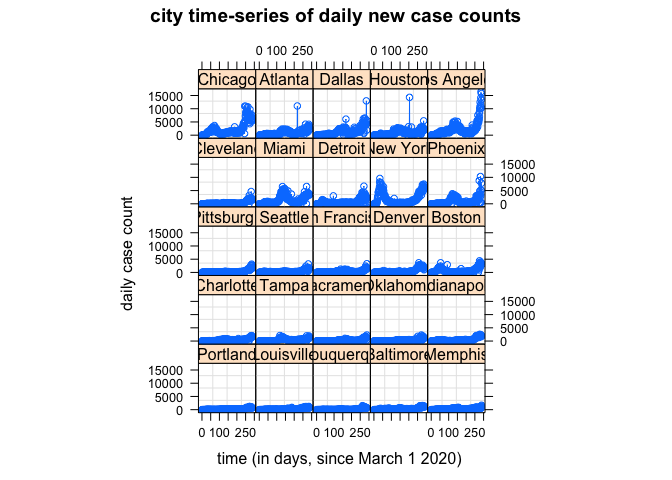
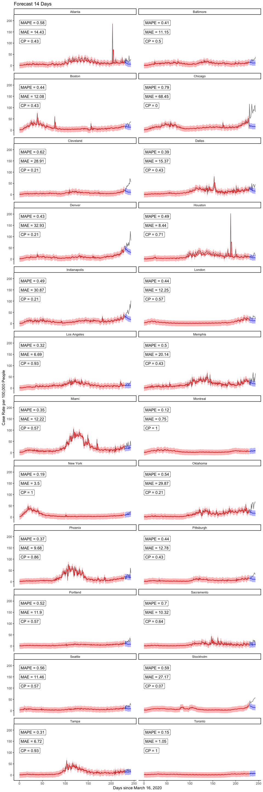
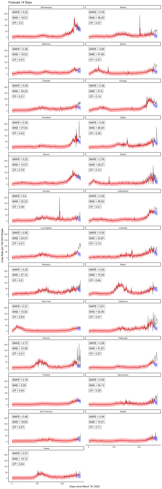
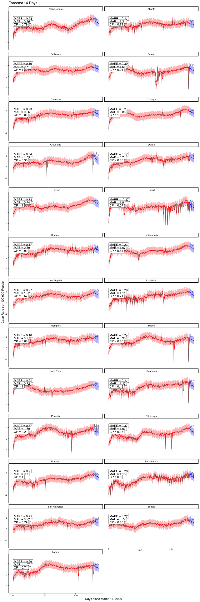
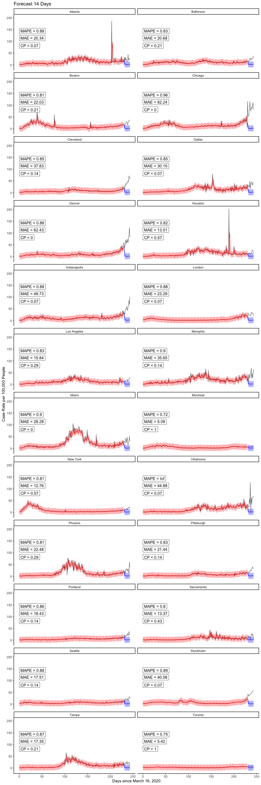

# Downloading and getting data in shape

<br />

## Initial work

- First need to read in all.csv off Ken's GitHub page; to do this, load RCurl package to use getURL function w/in read.csv, as the csv file is embedded within an html file (typical for GitHub).


```r
alldata <-
  read.csv(text=getURL("https://raw.githubusercontent.com/kentranz/socialMobilityCOVID/master/data/all.csv"), 
           header=T)
## the above file has already been updated for standardized 
##    Apple mobility data, and various indicator variables for
##    dates of interest, as well as lagged cases variables, etc.
##    --> it has longitudinal data for 24 cities,
##          20 in US, and Toronto, Montreal, London, and Stockholm

str(alldata)
```

```
## 'data.frame':	6216 obs. of  43 variables:
##  $ city                   : Factor w/ 24 levels "Atlanta","Baltimore",..: 1 1 1 1 1 1 1 1 1 1 ...
##  $ date                   : Factor w/ 259 levels "2020-03-01","2020-03-02",..: 1 2 3 4 5 6 7 8 9 10 ...
##  $ newCases               : int  0 2 0 0 0 0 4 4 5 4 ...
##  $ casesTminus1           : int  0 0 2 0 0 0 0 4 4 5 ...
##  $ casesTminus2           : int  0 0 0 2 0 0 0 0 4 4 ...
##  $ drivingMinus7          : num  6.73 3.59 7.82 13.01 15.97 ...
##  $ transitMinus7          : num  4.81 -2.85 3.34 4.61 12.06 ...
##  $ walkingMinus7          : num  4.54 -11.14 4.76 8.71 27.63 ...
##  $ drivingMinus8          : num  12.09 6.73 3.59 7.82 13.01 ...
##  $ transitMinus8          : num  7.51 4.81 -2.85 3.34 4.61 ...
##  $ walkingMinus8          : num  23.44 4.54 -11.14 4.76 8.71 ...
##  $ drivingMinus9          : num  7.82 12.09 6.73 3.59 7.82 ...
##  $ transitMinus9          : num  2.84 7.51 4.81 -2.85 3.34 ...
##  $ walkingMinus9          : num  5.55 23.44 4.54 -11.14 4.76 ...
##  $ drivingMinus10         : num  3.31 7.82 12.09 6.73 3.59 ...
##  $ transitMinus10         : num  -1.88 2.84 7.51 4.81 -2.85 ...
##  $ walkingMinus10         : num  1.55 5.55 23.44 4.54 -11.14 ...
##  $ drivingMinus11         : num  7.4 3.31 7.82 12.09 6.73 ...
##  $ transitMinus11         : num  2.76 -1.88 2.84 7.51 4.81 ...
##  $ walkingMinus11         : num  2.39 1.55 5.55 23.44 4.54 ...
##  $ drivingMinus12         : num  4.48 7.4 3.31 7.82 12.09 ...
##  $ transitMinus12         : num  1.55 2.76 -1.88 2.84 7.51 ...
##  $ walkingMinus12         : num  -8.78 2.39 1.55 5.55 23.44 ...
##  $ drivingMinus13         : num  7.27 4.48 7.4 3.31 7.82 ...
##  $ transitMinus13         : num  5.24 1.55 2.76 -1.88 2.84 7.51 4.81 -2.85 3.34 4.61 ...
##  $ walkingMinus13         : num  6.26 -8.78 2.39 1.55 5.55 ...
##  $ drivingMinus14         : num  8.11 7.27 4.48 7.4 3.31 ...
##  $ transitMinus14         : num  4.49 5.24 1.55 2.76 -1.88 2.84 7.51 4.81 -2.85 3.34 ...
##  $ walkingMinus14         : num  19.55 6.26 -8.78 2.39 1.55 ...
##  $ driving                : num  16.99 8.03 3.64 8.07 8.83 ...
##  $ walking                : num  26.35 -3.94 -0.85 -5.03 6.17 ...
##  $ transit                : num  12.27 3.27 -2.91 -4.81 1.56 ...
##  $ anomalousWeekend       : int  0 0 0 0 0 0 0 0 0 0 ...
##  $ longWeekend            : int  0 0 0 0 0 0 0 0 0 0 ...
##  $ weekend                : int  1 0 0 0 0 0 1 1 0 0 ...
##  $ sumDrivingMinus7_14    : num  8.17 7.53 7.61 8.82 10.05 ...
##  $ sumTransitMinus7_14    : num  3.9 2.85 2.58 3.02 4.35 ...
##  $ sumWalkingMinus7_14    : num  7.79 3.4 3.19 5.69 9.29 ...
##  $ Population             : int  5950000 5950000 5950000 5950000 5950000 5950000 5950000 5950000 5950000 5950000 ...
##  $ LandAreakm             : int  21694 21694 21694 21694 21694 21694 21694 21694 21694 21694 ...
##  $ Poverty.rate           : num  13.9 13.9 13.9 13.9 13.9 13.9 13.9 13.9 13.9 13.9 ...
##  $ Median.age             : num  36.6 36.6 36.6 36.6 36.6 36.6 36.6 36.6 36.6 36.6 ...
##  $ Median.household.income: num  69464 69464 69464 69464 69464 ...
```

- Code to read in data and output from `str` call hidden from this output.  Most R code below for data manipulation will also be hidden from output, and only selective dataset elements will be displayed. Alternatively, R code for data analyses and resulting output will more generally be displayed.

- Will output variable names though:


```
##  [1] "city"                    "date"                   
##  [3] "newCases"                "casesTminus1"           
##  [5] "casesTminus2"            "drivingMinus7"          
##  [7] "transitMinus7"           "walkingMinus7"          
##  [9] "drivingMinus8"           "transitMinus8"          
## [11] "walkingMinus8"           "drivingMinus9"          
## [13] "transitMinus9"           "walkingMinus9"          
## [15] "drivingMinus10"          "transitMinus10"         
## [17] "walkingMinus10"          "drivingMinus11"         
## [19] "transitMinus11"          "walkingMinus11"         
## [21] "drivingMinus12"          "transitMinus12"         
## [23] "walkingMinus12"          "drivingMinus13"         
## [25] "transitMinus13"          "walkingMinus13"         
## [27] "drivingMinus14"          "transitMinus14"         
## [29] "walkingMinus14"          "driving"                
## [31] "walking"                 "transit"                
## [33] "anomalousWeekend"        "longWeekend"            
## [35] "weekend"                 "sumDrivingMinus7_14"    
## [37] "sumTransitMinus7_14"     "sumWalkingMinus7_14"    
## [39] "Population"              "LandAreakm"             
## [41] "Poverty.rate"            "Median.age"             
## [43] "Median.household.income"
```

- Here, *newCases* will be converted into a rate, and this, and the first two days of lagged case rate values, will serve as the primary response and two predictors, respectively.

- The time variable will be a converted version of *date*.  This, and the previous bullet point will be worked on in the next subsection.


<br />

## Additional data manipulation

- Creating a US city indicator variable, i.e., 1 if US city, 0 for non-US city.


### Play with dates

- First, note that not all 24 cities had counts available to us starting at earlier date in our dataset of March 1, 2019, while all cities had observations starting March 13th.  As of the November 14th end dataset (the one being worked on here), these earlier dates in March, for cities where they were not originally collected, were entered in original dataset as 0's.  This seems a reasonable choice given the very low or non-existent case counts in many cities at that time.  In addition, we will not be use data earlier than March 13th in our analyses, so those 0's are irrelevant for our work here.

- Dates are in character form, and need to change to numeric for modeling.

- Need to align all new day variable to min of observed dates, so day 0 will 2020-03-01, but will have a second new day variable that will be about 2 days after 2020-03-13 (make this the midpoint of March, i.e., March 16th), to allow for two days of lagged cases as predictors; the lagged 7-day mobility data is actually available since near Feb 1, if we ever need it.

- Aside from March 16th start date, we will make one for April 1st, and one that is based on a French study (Prague et al., 2020), which is dynamic based on specifically starting on the first day of cases for which it is followed by
at least 3 consecutive days of cases as well; this took longer to program.

- Will use *chron* package in R to help with dates and specifying initial origin at March 1st (day 0). As suggested on *chron* help page, use `options` argument to set default first day --- could do this twice to help create two sets of two columns, one where 03-01-20 is default and one for 03-16-20;
a 2nd option is to subset data when modeling such that all dates are
at least 03-16-20 when we want to have the later start/default date, which
will only affect the intercept interpretation; will take the 2nd approach
where day 15 (16th day), i.e., 03-16-20, will be first day w/ all complete data that accounts for two lagged cases days.


- Here is where French start day will be defined, which will be the 1st day that at least 4 consecutive days of cases start.  Code will identify sequences in a vector.  Output prints first day of French method in each city.


```
##         city.FM startdate.FM
## 1       Atlanta     03/07/20
## 2     Baltimore     03/13/20
## 3        Boston     03/05/20
## 4       Chicago     03/08/20
## 5     Cleveland     03/13/20
## 6        Dallas     03/09/20
## 7        Denver     03/09/20
## 8       Houston     03/12/20
## 9  Indianapolis     03/08/20
## 10       London     03/01/20
## 11  Los Angeles     03/03/20
## 12      Memphis     03/18/20
## 13        Miami     03/10/20
## 14     Montreal     03/08/20
## 15     New York     03/04/20
## 16     Oklahoma     03/15/20
## 17      Phoenix     03/16/20
## 18   Pittsburgh     03/13/20
## 19     Portland     03/12/20
## 20   Sacramento     03/12/20
## 21      Seattle     03/01/20
## 22    Stockholm     03/01/20
## 23        Tampa     03/15/20
## 24      Toronto     03/01/20
```

- Dec 17 2020:  The above all provided, it should be mentioned that the use of the French method and start dates other than 03-16-20 will be put off for potential future use.


### Creating case rates

- Making another column in dataset, which is a rate, i.e.,
    number of cases per 100000 people in population.  This will
    be the longitudinal response variable in our graphing and modeling.
    To do this, taking *newCases*, divide by Population (in city), and      multiplying by 100000; will do this for *caseTminus1* and *caseTminus2*         variables as well:


<br />

---

# Start longitudinal work

<br />

## Initial graphing

- Start with using *nlme* library, created so-called groupedData objects, which benefit both graphing and modeling using the `lme` function (and other modeling functions) within *nlme*.


- Create plots from groupedData objects; nlme generic plotting on these objects uses Trellis graphs here.

<!-- --><!-- -->


## Data Partition

- We used start date as 2020-03-16, because that was the first date that allowed for at least 2 lagged observerations in all cities.
- Train set used data until 2020-10-31
- Test sets: 
  - test7: first 7 days in November
  - test14: first 14 days in November
  


```r
train <- alldata.groupedR %>% 
  filter(day031620 >= 0 & as.Date(date) <= as.Date("2020-10-31"))
test7 <- alldata.groupedR %>% 
  filter(day031620 >= 0 & as.Date(date) > as.Date("2020-10-31") & as.Date(date) <= as.Date("2020-11-07"))
test14 <- alldata.groupedR %>% 
  filter(day031620 >= 0 & as.Date(date) > as.Date("2020-10-31"))

nrow(train)
```

```
## [1] 5520
```

```r
nrow(test7)
```

```
## [1] 168
```

```r
nrow(test14)
```

```
## [1] 336
```
  

## Automate extracting 95% CI for prediction band, metrics, and plotting

Extract 95% CI for prediction band. References from the web:

- https://stackoverflow.com/questions/14358811/extract-prediction-band-from-lme-fit and 
- http://bbolker.github.io/mixedmodels-misc/glmmFAQ.html#predictions-andor-confidence-or-prediction-intervals-on-predictions

SE: This approach takes into account the uncertainty of the random effect in the prediction. 

SE2: This takes into account both random effect uncertainty and within-group error


```r
metricsFunc <- function(model)
{
  # store all X and y in a new dataframe, filtering out unwanted dates
  results7 <- test7 %>%
    select(city, day031620, case.rate, casesTminus1.rate, casesTminus2.rate, weekend, walkingMinus7)
    
  results7$pred <- predict(model, newdata = results7)
  
  # create design mateix
  # [-2] drops response from formula
  Designmat <- model.matrix(formula(model)[-2], results7)
  
  # compute XVX′ to get the variance-covariance matrix of the predictions
  # extract the diagonal of this matrix to get variances of predictions
  predvar <- diag(Designmat %*% vcov(model) %*% t(Designmat)) 
  results7$SE <- sqrt(predvar) 
  results7$SE2 <- sqrt(predvar + model$sigma^2) # sigma is the estimated within-group error standard deviation
  
  
  results14 <- test14 %>%
    select(city, day031620, case.rate, casesTminus1.rate, casesTminus2.rate, weekend, walkingMinus7)
    
  results14$pred <- predict(model, newdata = results14)
  Designmat <- model.matrix(formula(model)[-2], results14)
  predvar <- diag(Designmat %*% vcov(model) %*% t(Designmat)) 
  results14$SE <- sqrt(predvar) 
  results14$SE2 <- sqrt(predvar + model$sigma^2)


  # CALCULATE MAE, MAPE, CP
  perform7 <- results7 %>% 
  group_by(city) %>% 
  summarize(MAE = round(mean(abs(case.rate - pred)) , 2)
            , MAPE = round(mean(abs(case.rate - pred)/case.rate) , 2)
            , CP = round(sum(case.rate >= (pred - 1.96*SE2) & case.rate <= (pred + 1.96*SE2) ) / n() , 2)
            ) #%>%
  #as.data.frame() %>%
  #print()


  perform14 <- results14 %>% 
    group_by(city) %>% 
    summarize(MAE = round(mean(abs(case.rate - pred)) , 2)
              , MAPE = round(mean(abs(case.rate - pred)/case.rate) , 2)
              , CP = round(sum(case.rate >= (pred - 1.96*SE2) & case.rate <= (pred + 1.96*SE2) ) / n() , 2)
              ) #%>%
    #as.data.frame() %>%
    #print()
  
  metrics <- perform7 %>%
    left_join(perform14 
              , by = "city"
              , suffix = c("_7d", "_14d")
              ) #%>%
    #as.data.frame() %>%
    #print()
  
  return(list(performMetrics = metrics
              , results7 = results7
              , results14 = results14))
}


plotFunc <- function(model
                     , forecastLength # only 7 or 14 as numeric arg
                     )
{
  
  if(forecastLength == 7)
  { results = output$results7
    
    perform <- output$performMetrics %>% 
      select(city, contains("7d"))
  }
  
  if(forecastLength == 14)
  { results = output$results14
    
    perform <- output$performMetrics %>% 
      select(city, contains("14d")) 
  }
  
  perform <- setNames(perform, gsub("_.*", "", names(perform)))
  
  perform <- perform %>%
    mutate(MAPE = paste0("MAPE = ", MAPE)
                      , MAE = paste0("MAE = ", MAE)
                      , CP = paste0("CP = ", CP)
                      )
  
  
  Designmat <- model.matrix(formula(model)[-2], train)
  predvar <- diag(Designmat %*% vcov(model) %*% t(Designmat)) 
  
  plotDF <- train %>% 
    select(city, day031620, case.rate) %>%
    mutate(city = as.character(city)
           , SE2 = sqrt(predvar + model$sigma^2)
           , upperCI.fitted = case.rate + 1.96*SE2
           , lowerCI.fitted = case.rate - 1.96*SE2
           , fitted = predict(model, data = train)
           ) %>%
    reshape::melt(id = c('city', 'day031620')) %>%
    
    # bring into forecasted case rates
    rbind(results %>% 
            select(city, day031620, case.rate, pred, SE2) %>% 
            #rename(case.rate = pred) %>% 
            mutate(upperCI.pred = pred + 1.96*SE2
                   , lowerCI.pred = pred - 1.96*SE2
                   ) %>%
            reshape2::melt(id = c('city', 'day031620'))
          ) 
      
  
  p <- ggplot(plotDF 
              , aes(day031620, value, group = variable, colour = variable)) +
    
    geom_line(data = filter(plotDF, variable == 'case.rate'), linetype = "solid", color = 'black', alpha = 0.6) + 
    geom_line(data = filter(plotDF, variable == 'fitted'), linetype = "solid", color = 'red') +
    geom_line(data = filter(plotDF, variable == 'pred'), linetype = "dashed", color = 'blue') +
    
    # uncertainty band for fitted model
    geom_ribbon(data = filter(plotDF, variable == 'lowerCI.fitted')
      , aes(ymin = filter(plotDF, variable == 'lowerCI.fitted')$value
                    , ymax =  filter(plotDF, variable == 'upperCI.fitted')$value
                    )
                , alpha = 0.3
                , color = NA
                , fill = "red") +
    
    # prediction band for forecast
    geom_ribbon(data = filter(plotDF, variable == 'lowerCI.pred')
      , aes(ymin = filter(plotDF, variable == 'lowerCI.pred')$value
                    , ymax =  filter(plotDF, variable == 'upperCI.pred')$value
                    )
                , alpha = 0.3
                , color = NA
                , fill = "blue") +
    
    facet_wrap(. ~ city, ncol = 2) +
    ggtitle(paste0('Forecast ', forecastLength, ' Days')) +
    ylab('Case Rate per 100,000 People') +
    xlab('Days since March 16, 2020') +
    #ylim(-15,100) +
    
    # add performance metrics
    geom_label(data = perform 
               , aes(label = MAPE), 
              x = 0, y = 155, hjust="inward", vjust="inward",
              inherit.aes = FALSE) +
    geom_label(data = perform 
               , aes(label = MAE), 
              x = 0, y = 100, hjust="inward", vjust="inward",
              inherit.aes = FALSE) +
    geom_label(data = perform 
                , aes(label = CP), 
               x = 0, y = 70, hjust="inward", vjust="inward",
               inherit.aes = FALSE) +
     
    theme_classic() +
    theme(legend.position = 'none') 
    
  p
}
```


## Initial modeling, using `lme` function
- Aside from dealing with heteroskedasticity, the following was the best model from earlier runs, through June 30th end data at the time, starting with March 16th data.  This is a linear mixed effects model, with case rate as the response, the fixed effects being the first two lagged case rate variables and the weekend indicator variable, and the random effects being the time-varying lagged case rate variables; there is no random intercept, shown not to be needed due to the relatively low levels across all cities near March 16th. 


```r
case.rate.lme20201031 <- 
  lme(fixed = case.rate ~ casesTminus1.rate + casesTminus2.rate + weekend,
      random = ~ casesTminus1.rate + casesTminus2.rate - 1 | city,
      data = train
      )

summary(case.rate.lme20201031)
```

```
## Linear mixed-effects model fit by REML
##  Data: train 
##        AIC      BIC    logLik
##   36173.54 36226.46 -18078.77
## 
## Random effects:
##  Formula: ~casesTminus1.rate + casesTminus2.rate - 1 | city
##  Structure: General positive-definite, Log-Cholesky parametrization
##                   StdDev     Corr  
## casesTminus1.rate 0.07907325 cssT1.
## casesTminus2.rate 0.04288684 -0.435
## Residual          6.36425308       
## 
## Fixed effects: case.rate ~ casesTminus1.rate + casesTminus2.rate + weekend 
##                        Value  Std.Error   DF  t-value p-value
## (Intercept)        2.0832962 0.13890453 5493 14.99804       0
## casesTminus1.rate  0.4925352 0.02381526 5493 20.68150       0
## casesTminus2.rate  0.3444521 0.01836728 5493 18.75357       0
## weekend           -1.6611538 0.19088742 5493 -8.70227       0
##  Correlation: 
##                   (Intr) cssT1. cssT2.
## casesTminus1.rate -0.216              
## casesTminus2.rate -0.163 -0.613       
## weekend           -0.340 -0.010 -0.028
## 
## Standardized Within-Group Residuals:
##         Min          Q1         Med          Q3         Max 
## -10.4155607  -0.3069076  -0.1145516   0.1803768  30.2216669 
## 
## Number of Observations: 5520
## Number of Groups: 24
```


```r
output <- metricsFunc(model = case.rate.lme20201031)

allMetrics <- output$performMetrics %>%
  rename_at(vars(-city), function(x) {paste0(x, "_lme")})

plotFunc(model = case.rate.lme20201031
         , forecastLength = 7)
```

```
## Warning: attributes are not identical across measure variables; they will be
## dropped
```

<!-- -->

```r
plotFunc(model = case.rate.lme20201031
         , forecastLength = 14)
```

```
## Warning: attributes are not identical across measure variables; they will be
## dropped
```

<!-- -->

## Weighted Residual LME

Use weights to account for within-group heteroskedasticity


```r
case.rate.lme20201031.reweighed <- 
  lme(fixed = case.rate ~ casesTminus1.rate + casesTminus2.rate + weekend
      , random = ~ casesTminus1.rate + casesTminus2.rate - 1 | city
      , data = train
      , weights = varPower(form = ~ fitted(.))
      , control = lmeControl(maxIter = 1e4) 
      )

summary(case.rate.lme20201031.reweighed)
```

```
## Linear mixed-effects model fit by REML
##  Data: train 
##        AIC      BIC    logLik
##   31729.12 31788.66 -15855.56
## 
## Random effects:
##  Formula: ~casesTminus1.rate + casesTminus2.rate - 1 | city
##  Structure: General positive-definite, Log-Cholesky parametrization
##                   StdDev     Corr  
## casesTminus1.rate 0.04656959 cssT1.
## casesTminus2.rate 0.05341711 -1    
## Residual          1.23431392       
## 
## Variance function:
##  Structure: Power of variance covariate
##  Formula: ~fitted(.) 
##  Parameter estimates:
##     power 
## 0.6615351 
## Fixed effects: case.rate ~ casesTminus1.rate + casesTminus2.rate + weekend 
##                        Value  Std.Error   DF   t-value p-value
## (Intercept)        0.6067788 0.05237130 5493 11.586095       0
## casesTminus1.rate  0.5251835 0.02241559 5493 23.429382       0
## casesTminus2.rate  0.4529133 0.02316650 5493 19.550361       0
## weekend           -0.6734468 0.06969857 5493 -9.662276       0
##  Correlation: 
##                   (Intr) cssT1. cssT2.
## casesTminus1.rate -0.118              
## casesTminus2.rate -0.085 -0.909       
## weekend           -0.638  0.065 -0.013
## 
## Standardized Within-Group Residuals:
##         Min          Q1         Med          Q3         Max 
## -3.53641943 -0.39252666 -0.09136161  0.25386552 30.15583085 
## 
## Number of Observations: 5520
## Number of Groups: 24
```

```r
output <- metricsFunc(model = case.rate.lme20201031.reweighed)

allMetrics <- allMetrics %>% left_join(
    output$performMetrics %>%
      rename_at(vars(-city), function(x) {paste0(x, "_lmeWeighted")})
    , by = "city"
    )


plotFunc(model = case.rate.lme20201031.reweighed
         , forecastLength = 7)
```

```
## Warning: attributes are not identical across measure variables; they will be
## dropped
```

<!-- -->

```r
plotFunc(model = case.rate.lme20201031.reweighed
         , forecastLength = 14)
```

```
## Warning: attributes are not identical across measure variables; they will be
## dropped
```

<!-- -->


## LME Weighted Residual + Walking-7

```r
case.rate.lme20201031.reweighed.walking7 <- 
  lme(fixed = case.rate ~ casesTminus1.rate + casesTminus2.rate + weekend + walkingMinus7
      , random = ~ casesTminus1.rate + casesTminus2.rate - 1 | city
      , data = train
      , weights = varPower(form = ~ fitted(.))
      , control = lmeControl(maxIter = 1e4) 
      )

summary(case.rate.lme20201031.reweighed.walking7)
```

```
## Linear mixed-effects model fit by REML
##  Data: train 
##        AIC      BIC    logLik
##   31699.57 31765.72 -15839.78
## 
## Random effects:
##  Formula: ~casesTminus1.rate + casesTminus2.rate - 1 | city
##  Structure: General positive-definite, Log-Cholesky parametrization
##                   StdDev       Corr  
## casesTminus1.rate 5.228944e-05 cssT1.
## casesTminus2.rate 3.819776e-06 0     
## Residual          1.209377e+00       
## 
## Variance function:
##  Structure: Power of variance covariate
##  Formula: ~fitted(.) 
##  Parameter estimates:
##     power 
## 0.6704094 
## Fixed effects: case.rate ~ casesTminus1.rate + casesTminus2.rate + weekend +      walkingMinus7 
##                        Value  Std.Error   DF   t-value p-value
## (Intercept)        0.6707064 0.05589632 5492 11.999115   0e+00
## casesTminus1.rate  0.5166564 0.01955352 5492 26.422681   0e+00
## casesTminus2.rate  0.4551779 0.01951942 5492 23.319233   0e+00
## weekend           -0.6332936 0.07090597 5492 -8.931457   0e+00
## walkingMinus7      0.0038909 0.00112549 5492  3.457094   6e-04
##  Correlation: 
##                   (Intr) cssT1. cssT2. weeknd
## casesTminus1.rate -0.156                     
## casesTminus2.rate -0.108 -0.870              
## weekend           -0.506  0.056 -0.023       
## walkingMinus7      0.367 -0.058 -0.057  0.186
## 
## Standardized Within-Group Residuals:
##         Min          Q1         Med          Q3         Max 
## -3.53352791 -0.39377854 -0.08448579  0.25238647 30.29984024 
## 
## Number of Observations: 5520
## Number of Groups: 24
```

```r
output <- metricsFunc(model = case.rate.lme20201031.reweighed.walking7)

allMetrics <- allMetrics %>% left_join(
    output$performMetrics %>%
      rename_at(vars(-city), function(x) {paste0(x, "_lmeWeightedWalking7")})
    , by = "city"
    )


plotFunc(model = case.rate.lme20201031.reweighed.walking7
         , forecastLength = 7)
```

```
## Warning: attributes are not identical across measure variables; they will be
## dropped
```

<!-- -->


```r
plotFunc(model = case.rate.lme20201031.reweighed.walking7
         , forecastLength = 14)
```

```
## Warning: attributes are not identical across measure variables; they will be
## dropped
```

<!-- -->

## Naive Multiple Regression


```r
case.rate.lm <- 
  lm( case.rate ~ casesTminus1.rate + casesTminus2.rate + weekend
       , data = train
       )

summary(case.rate.lm)
```

```
## 
## Call:
## lm(formula = case.rate ~ casesTminus1.rate + casesTminus2.rate + 
##     weekend, data = train)
## 
## Residuals:
##     Min      1Q  Median      3Q     Max 
## -92.542  -1.812  -0.682   1.141 190.769 
## 
## Coefficients:
##                   Estimate Std. Error t value Pr(>|t|)    
## (Intercept)        1.83578    0.12889  14.243   <2e-16 ***
## casesTminus1.rate  0.47969    0.01239  38.730   <2e-16 ***
## casesTminus2.rate  0.39510    0.01242  31.810   <2e-16 ***
## weekend           -1.67100    0.19383  -8.621   <2e-16 ***
## ---
## Signif. codes:  0 '***' 0.001 '**' 0.01 '*' 0.05 '.' 0.1 ' ' 1
## 
## Residual standard error: 6.473 on 5516 degrees of freedom
## Multiple R-squared:  0.6782,	Adjusted R-squared:  0.678 
## F-statistic:  3875 on 3 and 5516 DF,  p-value: < 2.2e-16
```


```r
model <- case.rate.lm

results7 <- test7 %>% select(city, day031620, case.rate, casesTminus1.rate, casesTminus2.rate, weekend) 
pred <- predict(model, newdata = results7, interval = "prediction", level = 0.95) %>% as.data.frame()
results7$pred <- pred$fit
results7$upperCI <- pred$upr
results7$lowerCI <- pred$lwr

results14 <- test14 %>% select(city, day031620, case.rate, casesTminus1.rate, casesTminus2.rate, weekend)
pred <- predict(model, newdata = results14, interval = "prediction", level = 0.95) %>% as.data.frame()
results14$pred <- pred$fit
results14$upperCI <- pred$upr
results14$lowerCI <- pred$lwr

metrics <- results7 %>% 
  group_by(city) %>% 
  summarize(MAE = round(mean(abs(case.rate - pred)) , 2)
            , MAPE = round(mean(abs(case.rate - pred)/case.rate) , 2)
            , CP = round(sum(case.rate >= lowerCI & case.rate <= upperCI ) / n() , 2)
            ) %>%
  left_join( results14 %>% 
               group_by(city) %>% 
               summarize(MAE = round(mean(abs(case.rate - pred)) , 2)
                         , MAPE = round(mean(abs(case.rate - pred)/case.rate) , 2)
                         , CP = round(sum(case.rate >= lowerCI & case.rate <= upperCI ) / n() , 2)
                         )
             , by = "city"
             , suffix = c("_7d", "_14d")
             ) 
#metrics %>% arrange(as.character(city)) %>% as.data.frame() %>% print()


allMetrics <- allMetrics %>% left_join(
    metrics %>%
      rename_at(vars(-city), function(x) {paste0(x, "_lm")})
    , by = "city"
    )
```


```r
pred <- predict(model, newdata = train, interval = "prediction", level = 0.95) 

plotDF <- train %>% 
  select(city, day031620, case.rate) %>%
  mutate(city = as.character(city)) %>%
  cbind(pred) %>%
  rename(fitted = fit
         , lowerCI.fitted = lwr
         , upperCI.fitted = upr
         ) %>%
  reshape::melt(id = c('city', 'day031620')) %>%
  
  # bring into forecasted case rates
  rbind(results7 %>% 
          select(city, day031620, case.rate, pred, upperCI, lowerCI) %>% 
          rename(upperCI.pred = upperCI
                 , lowerCI.pred = lowerCI
                 ) %>%
          reshape2::melt(id = c('city', 'day031620'))
        ) 
    

p <- ggplot(plotDF 
            , aes(day031620, value, group = variable, colour = variable)) +
  
  geom_line(data = filter(plotDF, variable == 'case.rate'), linetype = "solid", color = 'black', alpha = 0.6) + 
  geom_line(data = filter(plotDF, variable == 'fitted'), linetype = "solid", color = 'red') +
  geom_line(data = filter(plotDF, variable == 'pred'), linetype = "dashed", color = 'blue') +
  
  # uncertainty band for fitted model
  geom_ribbon(data = filter(plotDF, variable == 'lowerCI.fitted')
    , aes(ymin = filter(plotDF, variable == 'lowerCI.fitted')$value
                  , ymax =  filter(plotDF, variable == 'upperCI.fitted')$value
                  )
              , alpha = 0.3, color = NA
              , fill = "red") +
  
  # prediction band for forecast
  geom_ribbon(data = filter(plotDF, variable == 'lowerCI.pred')
    , aes(ymin = filter(plotDF, variable == 'lowerCI.pred')$value
                  , ymax =  filter(plotDF, variable == 'upperCI.pred')$value
                  )
              , alpha = 0.3, color = NA
              , fill = "blue") +
  
  facet_wrap(. ~ city, ncol = 2) +
  ggtitle('Forecast 7 Days') +
  ylab('Case Rate per 100,000 People') +
  xlab('Days since March 16, 2020') +
  #ylim(-15,100) +
  
  # add performance metrics
  geom_label(data = metrics %>% mutate(MAPE_7d = paste0("MAPE = ", MAPE_7d))
             , aes(label = MAPE_7d), 
            x = 0, y = 155, hjust="inward", vjust="inward",
            inherit.aes = FALSE) +
  geom_label(data = metrics %>% mutate(MAE_7d = paste0("MAE = ", MAE_7d))
             , aes(label = MAE_7d), 
            x = 0, y = 125, hjust="inward", vjust="inward",
            inherit.aes = FALSE) +
  geom_label(data = metrics %>% mutate(CP_7d = paste0("CP = ", CP_7d))
              , aes(label = CP_7d), 
             x = 0, y = 70, hjust="inward", vjust="inward",
             inherit.aes = FALSE) +
   
  theme_classic() +
  theme(legend.position = 'none') 
  
p
```

<!-- -->

```r
plotDF <- train %>% 
  select(city, day031620, case.rate) %>%
  mutate(city = as.character(city)) %>%
  cbind(pred) %>%
  rename(fitted = fit
         , lowerCI.fitted = lwr
         , upperCI.fitted = upr
         ) %>%
  reshape::melt(id = c('city', 'day031620')) %>%
  
  # bring into forecasted case rates
  rbind(results14 %>% 
          select(city, day031620, case.rate, pred, upperCI, lowerCI) %>% 
          rename(upperCI.pred = upperCI
                 , lowerCI.pred = lowerCI
                 ) %>%
          reshape2::melt(id = c('city', 'day031620'))
        ) 
    

p <- ggplot(plotDF 
            , aes(day031620, value, group = variable, colour = variable)) +
  
  geom_line(data = filter(plotDF, variable == 'case.rate'), linetype = "solid", color = 'black', alpha = 0.6) + 
  geom_line(data = filter(plotDF, variable == 'fitted'), linetype = "solid", color = 'red') +
  geom_line(data = filter(plotDF, variable == 'pred'), linetype = "dashed", color = 'blue') +
  
  # uncertainty band for fitted model
  geom_ribbon(data = filter(plotDF, variable == 'lowerCI.fitted')
    , aes(ymin = filter(plotDF, variable == 'lowerCI.fitted')$value
                  , ymax =  filter(plotDF, variable == 'upperCI.fitted')$value
                  )
              , alpha = 0.3, color = NA
              , fill = "red") +
  
  # prediction band for forecast
  geom_ribbon(data = filter(plotDF, variable == 'lowerCI.pred')
    , aes(ymin = filter(plotDF, variable == 'lowerCI.pred')$value
                  , ymax =  filter(plotDF, variable == 'upperCI.pred')$value
                  )
              , alpha = 0.3, color = NA
              , fill = "blue") +
  
  facet_wrap(. ~ city, ncol = 2) +
  ggtitle('Forecast 14 Days') +
  ylab('Case Rate per 100,000 People') +
  xlab('Days since March 16, 2020') +
  #ylim(-15,100) +
  
  # add performance metrics
  geom_label(data = metrics %>% mutate(MAPE_14d = paste0("MAPE = ", MAPE_14d))
             , aes(label = MAPE_14d), 
            x = 0, y = 155, hjust="inward", vjust="inward",
            inherit.aes = FALSE) +
  geom_label(data = metrics %>% mutate(MAE_14d = paste0("MAE = ", MAE_14d))
             , aes(label = MAE_14d), 
            x = 0, y = 125, hjust="inward", vjust="inward",
            inherit.aes = FALSE) +
  geom_label(data = metrics %>% mutate(CP_14d = paste0("CP = ", CP_14d))
              , aes(label = CP_14d), 
             x = 0, y = 70, hjust="inward", vjust="inward",
             inherit.aes = FALSE) +
   
  theme_classic() +
  theme(legend.position = 'none') 
  
p
```

<!-- -->

## Naive Multiple Regression with Walking-7


```r
case.rate.lm.walking7 <-
  lm( case.rate ~ casesTminus1.rate + casesTminus2.rate + weekend + walkingMinus7
       , data = train
       )

summary(case.rate.lm.walking7)
```

```
## 
## Call:
## lm(formula = case.rate ~ casesTminus1.rate + casesTminus2.rate + 
##     weekend + walkingMinus7, data = train)
## 
## Residuals:
##     Min      1Q  Median      3Q     Max 
## -92.169  -1.811  -0.622   1.093 190.565 
## 
## Coefficients:
##                    Estimate Std. Error t value Pr(>|t|)    
## (Intercept)        1.890943   0.129546  14.597  < 2e-16 ***
## casesTminus1.rate  0.476399   0.012400  38.418  < 2e-16 ***
## casesTminus2.rate  0.391947   0.012433  31.524  < 2e-16 ***
## weekend           -1.619760   0.194059  -8.347  < 2e-16 ***
## walkingMinus7      0.008028   0.002107   3.810 0.000141 ***
## ---
## Signif. codes:  0 '***' 0.001 '**' 0.01 '*' 0.05 '.' 0.1 ' ' 1
## 
## Residual standard error: 6.465 on 5515 degrees of freedom
## Multiple R-squared:  0.679,	Adjusted R-squared:  0.6788 
## F-statistic:  2917 on 4 and 5515 DF,  p-value: < 2.2e-16
```


```r
model <- case.rate.lm.walking7

results7 <- test7 %>% select(city, day031620, case.rate, casesTminus1.rate, casesTminus2.rate, weekend, walkingMinus7)
pred <- predict(model, newdata = results7, interval = "prediction", level = 0.95) %>% as.data.frame()
results7$pred <- pred$fit
results7$upperCI <- pred$upr
results7$lowerCI <- pred$lwr

results14 <- test14 %>% select(city, day031620, case.rate, casesTminus1.rate, casesTminus2.rate, weekend, walkingMinus7)
pred <- predict(model, newdata = results14, interval = "prediction", level = 0.95) %>% as.data.frame()
results14$pred <- pred$fit
results14$upperCI <- pred$upr
results14$lowerCI <- pred$lwr

metrics <- results7 %>%
  group_by(city) %>%
  summarize(MAE = round(mean(abs(case.rate - pred)) , 2)
            , MAPE = round(mean(abs(case.rate - pred)/case.rate) , 2)
            , CP = round(sum(case.rate >= lowerCI & case.rate <= upperCI ) / n() , 2)
            ) %>%
  left_join( results14 %>%
               group_by(city) %>%
               summarize(MAE = round(mean(abs(case.rate - pred)) , 2)
                         , MAPE = round(mean(abs(case.rate - pred)/case.rate) , 2)
                         , CP = round(sum(case.rate >= lowerCI & case.rate <= upperCI ) / n() , 2)
                         )
             , by = "city"
             , suffix = c("_7d", "_14d")
             )
#metrics %>% arrange(as.character(city)) %>% as.data.frame() %>% print()

allMetrics <- allMetrics %>% left_join(
    metrics %>%
      rename_at(vars(-city), function(x) {paste0(x, "_lmWalking7")})
    , by = "city"
    )
```


```r
pred <- predict(model, newdata = train, interval = "prediction", level = 0.95)

plotDF <- train %>%
  select(city, day031620, case.rate) %>%
  mutate(city = as.character(city)) %>%
  cbind(pred) %>%
  rename(fitted = fit
         , lowerCI.fitted = lwr
         , upperCI.fitted = upr
         ) %>%
  reshape::melt(id = c('city', 'day031620')) %>%

  # bring into forecasted case rates
  rbind(results7 %>%
          select(city, day031620, case.rate, pred, upperCI, lowerCI) %>%
          rename(upperCI.pred = upperCI
                 , lowerCI.pred = lowerCI
                 ) %>%
          reshape2::melt(id = c('city', 'day031620'))
        )


p <- ggplot(plotDF
            , aes(day031620, value, group = variable, colour = variable)) +

  geom_line(data = filter(plotDF, variable == 'case.rate'), linetype = "solid", color = 'black', alpha = 0.6) +
  geom_line(data = filter(plotDF, variable == 'fitted'), linetype = "solid", color = 'red') +
  geom_line(data = filter(plotDF, variable == 'pred'), linetype = "dashed", color = 'blue') +

  # uncertainty band for fitted model
  geom_ribbon(data = filter(plotDF, variable == 'lowerCI.fitted')
    , aes(ymin = filter(plotDF, variable == 'lowerCI.fitted')$value
                  , ymax =  filter(plotDF, variable == 'upperCI.fitted')$value
                  )
              , alpha = 0.3, color = NA
              , fill = "red") +

  # prediction band for forecast
  geom_ribbon(data = filter(plotDF, variable == 'lowerCI.pred')
    , aes(ymin = filter(plotDF, variable == 'lowerCI.pred')$value
                  , ymax =  filter(plotDF, variable == 'upperCI.pred')$value
                  )
              , alpha = 0.3, color = NA
              , fill = "blue") +

  facet_wrap(. ~ city, ncol = 2) +
  ggtitle('Forecast 7 Days') +
  ylab('Case Rate per 100,000 People') +
  xlab('Days since March 16, 2020') +
  #ylim(-15,100) +

  # add performance metrics
  geom_label(data = metrics %>% mutate(MAPE_7d = paste0("MAPE = ", MAPE_7d))
             , aes(label = MAPE_7d),
            x = 0, y = 155, hjust="inward", vjust="inward",
            inherit.aes = FALSE) +
  geom_label(data = metrics %>% mutate(MAE_7d = paste0("MAE = ", MAE_7d))
             , aes(label = MAE_7d),
            x = 0, y = 125, hjust="inward", vjust="inward",
            inherit.aes = FALSE) +
  geom_label(data = metrics %>% mutate(CP_7d = paste0("CP = ", CP_7d))
              , aes(label = CP_7d),
             x = 0, y = 70, hjust="inward", vjust="inward",
             inherit.aes = FALSE) +

  theme_classic() +
  theme(legend.position = 'none')

p
```

<!-- -->


```r
plotDF <- train %>%
  select(city, day031620, case.rate) %>%
  mutate(city = as.character(city)) %>%
  cbind(pred) %>%
  rename(fitted = fit
         , lowerCI.fitted = lwr
         , upperCI.fitted = upr
         ) %>%
  reshape::melt(id = c('city', 'day031620')) %>%

  # bring into forecasted case rates
  rbind(results14 %>%
          select(city, day031620, case.rate, pred, upperCI, lowerCI) %>%
          rename(upperCI.pred = upperCI
                 , lowerCI.pred = lowerCI
                 ) %>%
          reshape2::melt(id = c('city', 'day031620'))
        )


p <- ggplot(plotDF
            , aes(day031620, value, group = variable, colour = variable)) +

  geom_line(data = filter(plotDF, variable == 'case.rate'), linetype = "solid", color = 'black', alpha = 0.6) +
  geom_line(data = filter(plotDF, variable == 'fitted'), linetype = "solid", color = 'red') +
  geom_line(data = filter(plotDF, variable == 'pred'), linetype = "dashed", color = 'blue') +

  # uncertainty band for fitted model
  geom_ribbon(data = filter(plotDF, variable == 'lowerCI.fitted')
    , aes(ymin = filter(plotDF, variable == 'lowerCI.fitted')$value
                  , ymax =  filter(plotDF, variable == 'upperCI.fitted')$value
                  )
              , alpha = 0.3, color = NA
              , fill = "red") +

  # prediction band for forecast
  geom_ribbon(data = filter(plotDF, variable == 'lowerCI.pred')
    , aes(ymin = filter(plotDF, variable == 'lowerCI.pred')$value
                  , ymax =  filter(plotDF, variable == 'upperCI.pred')$value
                  )
              , alpha = 0.3, color = NA
              , fill = "blue") +

  facet_wrap(. ~ city, ncol = 2) +
  ggtitle('Forecast 14 Days') +
  ylab('Case Rate per 100,000 People') +
  xlab('Days since March 16, 2020') +
  #ylim(-15,100) +

  # add performance metrics
  geom_label(data = metrics %>% mutate(MAPE_14d = paste0("MAPE = ", MAPE_14d))
             , aes(label = MAPE_14d),
            x = 0, y = 155, hjust="inward", vjust="inward",
            inherit.aes = FALSE) +
  geom_label(data = metrics %>% mutate(MAE_14d = paste0("MAE = ", MAE_14d))
             , aes(label = MAE_14d),
            x = 0, y = 125, hjust="inward", vjust="inward",
            inherit.aes = FALSE) +
  geom_label(data = metrics %>% mutate(CP_14d = paste0("CP = ", CP_14d))
              , aes(label = CP_14d),
             x = 0, y = 70, hjust="inward", vjust="inward",
             inherit.aes = FALSE) +

  theme_classic() +
  theme(legend.position = 'none')

p
```

<!-- -->


```r
allMetrics %>% select(city, starts_with("MAPE_7d")) %>%
  arrange(as.character(city)) %>%
  as.data.frame() %>%
  print()
```

```
##            city MAPE_7d_lme MAPE_7d_lmeWeighted MAPE_7d_lmeWeightedWalking7
## 1       Atlanta        0.24                0.36                        0.38
## 2     Baltimore        0.18                0.15                        0.14
## 3        Boston        0.26                0.28                        0.28
## 4       Chicago        0.33                0.33                        0.33
## 5     Cleveland        0.28                0.21                        0.21
## 6        Dallas        0.28                0.30                        0.31
## 7        Denver        0.24                0.24                        0.24
## 8       Houston        0.19                0.24                        0.25
## 9  Indianapolis        0.21                0.18                        0.18
## 10       London        0.15                0.19                        0.19
## 11  Los Angeles        0.18                0.16                        0.15
## 12      Memphis        0.51                0.53                        0.54
## 13        Miami        0.25                0.26                        0.25
## 14     Montreal        0.16                0.12                        0.12
## 15     New York        0.15                0.15                        0.15
## 16     Oklahoma        0.30                0.30                        0.30
## 17      Phoenix        0.37                0.36                        0.35
## 18   Pittsburgh        0.15                0.13                        0.13
## 19     Portland        0.29                0.30                        0.29
## 20   Sacramento        1.01                1.21                        1.23
## 21      Seattle        0.42                0.48                        0.48
## 22    Stockholm        0.17                0.10                        0.10
## 23        Tampa        0.23                0.23                        0.23
## 24      Toronto        0.12                0.10                        0.11
##    MAPE_7d_lm MAPE_7d_lmWalking7
## 1        0.34               0.34
## 2        0.17               0.17
## 3        0.28               0.28
## 4        0.33               0.33
## 5        0.25               0.24
## 6        0.28               0.28
## 7        0.24               0.23
## 8        0.20               0.22
## 9        0.21               0.20
## 10       0.16               0.17
## 11       0.18               0.17
## 12       0.51               0.51
## 13       0.23               0.23
## 14       0.16               0.15
## 15       0.16               0.16
## 16       0.28               0.28
## 17       0.37               0.37
## 18       0.13               0.13
## 19       0.28               0.28
## 20       1.12               1.15
## 21       0.45               0.45
## 22       0.15               0.16
## 23       0.22               0.23
## 24       0.12               0.12
```


```r
allMetrics %>% select(city, starts_with("MAE_7d")) %>%
  arrange(as.character(city)) %>% 
  as.data.frame() %>%
  print()
```

```
##            city MAE_7d_lme MAE_7d_lmeWeighted MAE_7d_lmeWeightedWalking7
## 1       Atlanta       6.17               6.88                       7.18
## 2     Baltimore       4.02               3.25                       3.18
## 3        Boston       5.35               5.25                       5.34
## 4       Chicago      30.44              29.38                      29.36
## 5     Cleveland       8.46               5.96                       5.87
## 6        Dallas       7.87               7.95                       7.99
## 7        Denver      13.37              13.12                      13.13
## 8       Houston       2.30               2.48                       2.58
## 9  Indianapolis       9.19               7.55                       7.46
## 10       London       4.12               4.59                       4.63
## 11  Los Angeles       2.74               2.41                       2.36
## 12      Memphis      13.23              12.97                      13.21
## 13        Miami       7.83               7.92                       7.85
## 14     Montreal       0.92               0.73                       0.75
## 15     New York       1.84               1.89                       1.88
## 16     Oklahoma      21.09              20.37                      19.94
## 17      Phoenix       6.64               6.27                       6.22
## 18   Pittsburgh       3.19               2.65                       2.58
## 19     Portland       5.12               4.72                       4.70
## 20   Sacramento       6.21               6.79                       6.76
## 21      Seattle       6.30               6.45                       6.46
## 22    Stockholm       6.77               4.22                       4.23
## 23        Tampa       4.74               4.71                       4.76
## 24      Toronto       0.82               0.75                       0.77
##    MAE_7d_lm MAE_7d_lmWalking7
## 1       6.87              6.96
## 2       3.86              3.67
## 3       5.52              5.51
## 4      30.56             30.55
## 5       7.43              7.10
## 6       7.74              7.79
## 7      13.67             13.62
## 8       2.14              2.32
## 9       9.18              8.98
## 10      4.30              4.35
## 11      2.84              2.74
## 12     13.34             13.23
## 13      7.58              7.61
## 14      0.93              0.90
## 15      1.98              2.00
## 16     20.19             20.08
## 17      6.94              6.85
## 18      2.82              2.65
## 19      4.74              4.68
## 20      6.43              6.40
## 21      6.18              6.19
## 22      6.02              6.08
## 23      4.70              4.74
## 24      0.84              0.87
```


```r
allMetrics %>% select(city, starts_with("CP_7d")) %>%
  arrange(as.character(city)) %>%
  as.data.frame() %>%
  print()
```

```
##            city CP_7d_lme CP_7d_lmeWeighted CP_7d_lmeWeightedWalking7 CP_7d_lm
## 1       Atlanta      0.71              0.14                      0.14     0.86
## 2     Baltimore      1.00              0.43                      0.43     1.00
## 3        Boston      1.00              0.29                      0.29     1.00
## 4       Chicago      0.43              0.00                      0.14     0.43
## 5     Cleveland      0.57              0.29                      0.29     1.00
## 6        Dallas      0.71              0.43                      0.43     0.71
## 7        Denver      0.57              0.00                      0.00     0.57
## 8       Houston      1.00              0.57                      0.57     1.00
## 9  Indianapolis      0.57              0.43                      0.43     0.57
## 10       London      0.86              0.43                      0.43     0.86
## 11  Los Angeles      1.00              0.57                      0.57     1.00
## 12      Memphis      0.57              0.14                      0.14     0.57
## 13        Miami      0.71              0.14                      0.29     0.71
## 14     Montreal      1.00              1.00                      1.00     1.00
## 15     New York      1.00              0.71                      0.71     1.00
## 16     Oklahoma      0.57              0.00                      0.00     0.57
## 17      Phoenix      1.00              0.14                      0.14     1.00
## 18   Pittsburgh      1.00              0.57                      0.57     1.00
## 19     Portland      0.86              0.29                      0.29     1.00
## 20   Sacramento      0.86              0.29                      0.29     0.86
## 21      Seattle      1.00              0.14                      0.14     1.00
## 22    Stockholm      0.86              0.57                      0.57     0.86
## 23        Tampa      1.00              0.29                      0.29     1.00
## 24      Toronto      1.00              1.00                      1.00     1.00
##    CP_7d_lmWalking7
## 1              0.86
## 2              1.00
## 3              1.00
## 4              0.43
## 5              1.00
## 6              0.71
## 7              0.57
## 8              1.00
## 9              0.57
## 10             0.86
## 11             1.00
## 12             0.57
## 13             0.71
## 14             1.00
## 15             1.00
## 16             0.57
## 17             1.00
## 18             1.00
## 19             1.00
## 20             0.86
## 21             1.00
## 22             0.86
## 23             1.00
## 24             1.00
```


```r
allMetrics %>% select(city, starts_with("MAPE_14d")) %>%
  arrange(as.character(city)) %>%
  as.data.frame() %>%
  print()
```

```
##            city MAPE_14d_lme MAPE_14d_lmeWeighted MAPE_14d_lmeWeightedWalking7
## 1       Atlanta         0.24                 0.33                         0.33
## 2     Baltimore         0.18                 0.15                         0.15
## 3        Boston         0.27                 0.27                         0.27
## 4       Chicago         0.25                 0.25                         0.25
## 5     Cleveland         0.24                 0.17                         0.17
## 6        Dallas         0.26                 0.26                         0.26
## 7        Denver         0.22                 0.21                         0.21
## 8       Houston         0.23                 0.26                         0.26
## 9  Indianapolis         0.21                 0.20                         0.20
## 10       London         0.16                 0.18                         0.18
## 11  Los Angeles         0.20                 0.18                         0.18
## 12      Memphis         0.48                 0.48                         0.49
## 13        Miami         0.39                 0.40                         0.39
## 14     Montreal         0.13                 0.10                         0.10
## 15     New York         0.15                 0.16                         0.16
## 16     Oklahoma          Inf                  Inf                          Inf
## 17      Phoenix         0.37                 0.37                         0.37
## 18   Pittsburgh         0.16                 0.13                         0.13
## 19     Portland         0.23                 0.26                         0.26
## 20   Sacramento         0.95                 1.14                         1.16
## 21      Seattle         0.32                 0.39                         0.39
## 22    Stockholm         0.18                 0.09                         0.09
## 23        Tampa         0.27                 0.28                         0.28
## 24      Toronto         0.11                 0.12                         0.12
##    MAPE_14d_lm MAPE_14d_lmWalking7
## 1         0.30                0.30
## 2         0.17                0.17
## 3         0.27                0.27
## 4         0.25                0.25
## 5         0.21                0.21
## 6         0.25                0.26
## 7         0.22                0.22
## 8         0.23                0.24
## 9         0.21                0.20
## 10        0.17                0.17
## 11        0.21                0.21
## 12        0.48                0.48
## 13        0.37                0.37
## 14        0.13                0.13
## 15        0.16                0.16
## 16         Inf                 Inf
## 17        0.36                0.35
## 18        0.13                0.13
## 19        0.24                0.24
## 20        1.05                1.08
## 21        0.35                0.35
## 22        0.16                0.16
## 23        0.26                0.26
## 24        0.13                0.13
```


```r
allMetrics %>% select(city, starts_with("MAE_14d")) %>%
  arrange(as.character(city)) %>% 
  as.data.frame() %>%
  print()
```

```
##            city MAE_14d_lme MAE_14d_lmeWeighted MAE_14d_lmeWeightedWalking7
## 1       Atlanta        6.86                7.50                        7.60
## 2     Baltimore        4.76                3.68                        3.61
## 3        Boston        6.22                5.68                        5.74
## 4       Chicago       23.14               21.88                       21.89
## 5     Cleveland        9.97                6.80                        6.77
## 6        Dallas        8.72                8.21                        8.21
## 7        Denver       15.86               15.08                       15.10
## 8       Houston        4.09                4.05                        4.07
## 9  Indianapolis       12.46               11.30                       11.20
## 10       London        4.56                4.52                        4.53
## 11  Los Angeles        3.82                3.34                        3.30
## 12      Memphis       16.03               15.22                       15.47
## 13        Miami       11.46               11.60                       11.57
## 14     Montreal        0.85                0.66                        0.68
## 15     New York        2.40                2.45                        2.47
## 16     Oklahoma       21.90               19.66                       18.95
## 17      Phoenix        8.96                8.97                        8.92
## 18   Pittsburgh        4.43                3.46                        3.41
## 19     Portland        5.20                5.43                        5.40
## 20   Sacramento        7.28                7.74                        7.74
## 21      Seattle        5.98                6.60                        6.59
## 22    Stockholm        8.00                4.18                        4.30
## 23        Tampa        5.08                5.16                        5.19
## 24      Toronto        0.79                0.87                        0.88
##    MAE_14d_lm MAE_14d_lmWalking7
## 1        7.29               7.27
## 2        4.48               4.30
## 3        6.20               6.23
## 4       23.42              23.52
## 5        8.59               8.39
## 6        8.60               8.54
## 7       16.32              16.33
## 8        3.73               3.85
## 9       12.36              12.23
## 10       4.54               4.70
## 11       3.92               3.87
## 12      16.25              16.11
## 13      11.24              11.25
## 14       0.85               0.86
## 15       2.65               2.69
## 16      20.46              20.37
## 17       9.11               9.01
## 18       3.65               3.54
## 19       5.12               5.09
## 20       7.40               7.38
## 21       6.14               6.13
## 22       7.02               7.22
## 23       5.04               5.08
## 24       0.95               0.94
```


```r
allMetrics %>% select(city, starts_with("CP_14d")) %>%
  arrange(as.character(city)) %>%
  as.data.frame() %>%
  print()
```

```
##            city CP_14d_lme CP_14d_lmeWeighted CP_14d_lmeWeightedWalking7
## 1       Atlanta       0.79               0.21                       0.21
## 2     Baltimore       0.93               0.50                       0.50
## 3        Boston       1.00               0.29                       0.29
## 4       Chicago       0.36               0.07                       0.14
## 5     Cleveland       0.57               0.29                       0.29
## 6        Dallas       0.79               0.29                       0.29
## 7        Denver       0.43               0.07                       0.07
## 8       Houston       0.93               0.43                       0.43
## 9  Indianapolis       0.50               0.21                       0.21
## 10       London       0.86               0.50                       0.50
## 11  Los Angeles       0.93               0.50                       0.57
## 12      Memphis       0.50               0.14                       0.14
## 13        Miami       0.50               0.07                       0.14
## 14     Montreal       1.00               1.00                       1.00
## 15     New York       1.00               0.64                       0.64
## 16     Oklahoma       0.43               0.07                       0.07
## 17      Phoenix       0.93               0.14                       0.14
## 18   Pittsburgh       1.00               0.50                       0.50
## 19     Portland       0.86               0.29                       0.29
## 20   Sacramento       0.79               0.21                       0.21
## 21      Seattle       0.93               0.07                       0.07
## 22    Stockholm       0.93               0.43                       0.43
## 23        Tampa       1.00               0.21                       0.21
## 24      Toronto       1.00               1.00                       1.00
##    CP_14d_lm CP_14d_lmWalking7
## 1       0.86              0.86
## 2       0.93              1.00
## 3       1.00              1.00
## 4       0.43              0.43
## 5       0.86              0.86
## 6       0.79              0.79
## 7       0.43              0.43
## 8       1.00              1.00
## 9       0.50              0.50
## 10      0.86              0.86
## 11      0.93              0.93
## 12      0.50              0.50
## 13      0.50              0.50
## 14      1.00              1.00
## 15      1.00              1.00
## 16      0.50              0.50
## 17      0.93              0.93
## 18      1.00              1.00
## 19      0.93              0.93
## 20      0.79              0.79
## 21      1.00              0.93
## 22      0.93              0.93
## 23      1.00              1.00
## 24      1.00              1.00
```
