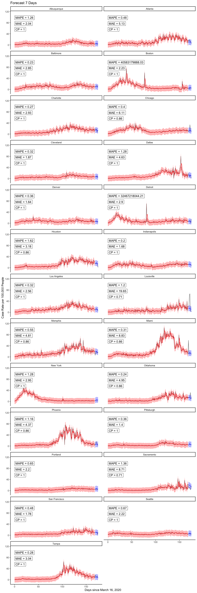

# Downloading and getting data in shape

<br />

## Initial work

- First need to read in all.csv off Ken's GitHub page; to do this, load RCurl package to use getURL function w/in read.csv, as the csv file is embedded within an html file (typical for GitHub).


```r
alldata <-
  read.csv(text=getURL("https://raw.githubusercontent.com/kentranz/socialMobilityCOVID/master/data/all.csv"), 
           header=T)
## the above file has already been updated for standardized 
##    Apple mobility data, and various indicator variables for
##    dates of interest, as well as lagged cases variables, etc.
##    --> it has longitudinal data for 24 cities,
##          20 in US, and Toronto, Montreal, London, and Stockholm

str(alldata)
```

```
## 'data.frame':	7225 obs. of  43 variables:
##  $ city                   : Factor w/ 25 levels "Albuquerque",..: 1 1 1 1 1 1 1 1 1 1 ...
##  $ date                   : Factor w/ 289 levels "2020-03-01","2020-03-02",..: 1 2 3 4 5 6 7 8 9 10 ...
##  $ newCases               : int  0 0 0 0 0 0 0 0 0 0 ...
##  $ casesTminus1           : int  0 0 0 0 0 0 0 0 0 0 ...
##  $ casesTminus2           : int  0 0 0 0 0 0 0 0 0 0 ...
##  $ drivingMinus7          : num  10.63 17.33 8.43 10 13.26 ...
##  $ transitMinus7          : num  4.82 7.39 -16.17 2.54 9.04 ...
##  $ walkingMinus7          : num  -2.09 14.1 0.84 4.02 12.07 ...
##  $ drivingMinus8          : num  8.61 10.63 17.33 8.43 10 ...
##  $ transitMinus8          : num  1.18 4.82 7.39 -16.17 2.54 ...
##  $ walkingMinus8          : num  11.64 -2.09 14.1 0.84 4.02 ...
##  $ drivingMinus9          : num  11.38 8.61 10.63 17.33 8.43 ...
##  $ transitMinus9          : num  11.47 1.18 4.82 7.39 -16.17 ...
##  $ walkingMinus9          : num  1.44 11.64 -2.09 14.1 0.84 ...
##  $ drivingMinus10         : num  10 11.38 8.61 10.63 17.33 ...
##  $ transitMinus10         : num  19.53 11.47 1.18 4.82 7.39 ...
##  $ walkingMinus10         : num  10.96 1.44 11.64 -2.09 14.1 ...
##  $ drivingMinus11         : num  4.87 10 11.38 8.61 10.63 ...
##  $ transitMinus11         : num  3.02 19.53 11.47 1.18 4.82 ...
##  $ walkingMinus11         : num  2.22 10.96 1.44 11.64 -2.09 ...
##  $ drivingMinus12         : num  7.53 4.87 10 11.38 8.61 ...
##  $ transitMinus12         : num  4.45 3.02 19.53 11.47 1.18 ...
##  $ walkingMinus12         : num  8.9 2.22 10.96 1.44 11.64 ...
##  $ drivingMinus13         : num  9.69 7.53 4.87 10 11.38 ...
##  $ transitMinus13         : num  12.16 4.45 3.02 19.53 11.47 ...
##  $ walkingMinus13         : num  17.65 8.9 2.22 10.96 1.44 ...
##  $ drivingMinus14         : num  21.58 9.69 7.53 4.87 10 ...
##  $ transitMinus14         : num  12.38 12.16 4.45 3.02 19.53 ...
##  $ walkingMinus14         : num  21.86 17.65 8.9 2.22 10.96 ...
##  $ driving                : num  19.75 11.94 13.82 8.62 13.86 ...
##  $ walking                : num  7.8 15.76 15.1 5.41 14.15 ...
##  $ transit                : num  -1.43 5.46 0 0.32 19.43 ...
##  $ anomalousWeekend       : int  0 0 0 0 0 0 0 0 0 0 ...
##  $ longWeekend            : int  0 0 0 0 0 0 0 0 0 0 ...
##  $ weekend                : int  1 0 0 0 0 0 1 1 0 0 ...
##  $ sumDrivingMinus7_14    : num  12 11.4 11.3 11.6 12.8 ...
##  $ sumTransitMinus7_14    : num  9.86 9.15 5.1 4.83 5.69 ...
##  $ sumWalkingMinus7_14    : num  10.37 9.26 6.86 6.16 7.57 ...
##  $ Population             : int  915927 915927 915927 915927 915927 915927 915927 915927 915927 915927 ...
##  $ LandAreakm             : int  NA NA NA NA NA NA NA NA NA NA ...
##  $ Poverty.rate           : num  NA NA NA NA NA NA NA NA NA NA ...
##  $ Median.age             : num  NA NA NA NA NA NA NA NA NA NA ...
##  $ Median.household.income: int  NA NA NA NA NA NA NA NA NA NA ...
```

- Code to read in data and output from `str` call hidden from this output.  Most R code below for data manipulation will also be hidden from output, and only selective dataset elements will be displayed. Alternatively, R code for data analyses and resulting output will more generally be displayed.

- Will output variable names though:


```
##  [1] "city"                    "date"                   
##  [3] "newCases"                "casesTminus1"           
##  [5] "casesTminus2"            "drivingMinus7"          
##  [7] "transitMinus7"           "walkingMinus7"          
##  [9] "drivingMinus8"           "transitMinus8"          
## [11] "walkingMinus8"           "drivingMinus9"          
## [13] "transitMinus9"           "walkingMinus9"          
## [15] "drivingMinus10"          "transitMinus10"         
## [17] "walkingMinus10"          "drivingMinus11"         
## [19] "transitMinus11"          "walkingMinus11"         
## [21] "drivingMinus12"          "transitMinus12"         
## [23] "walkingMinus12"          "drivingMinus13"         
## [25] "transitMinus13"          "walkingMinus13"         
## [27] "drivingMinus14"          "transitMinus14"         
## [29] "walkingMinus14"          "driving"                
## [31] "walking"                 "transit"                
## [33] "anomalousWeekend"        "longWeekend"            
## [35] "weekend"                 "sumDrivingMinus7_14"    
## [37] "sumTransitMinus7_14"     "sumWalkingMinus7_14"    
## [39] "Population"              "LandAreakm"             
## [41] "Poverty.rate"            "Median.age"             
## [43] "Median.household.income"
```

- Here, *newCases* will be converted into a rate, and this, and the first two days of lagged case rate values, will serve as the primary response and two predictors, respectively.

- The time variable will be a converted version of *date*.  This, and the previous bullet point will be worked on in the next subsection.


<br />

## Additional data manipulation

- Creating a US city indicator variable, i.e., 1 if US city, 0 for non-US city.


### Play with dates

- First, note that not all 24 cities had counts available to us starting at earlier date in our dataset of March 1, 2019, while all cities had observations starting March 13th.  As of the November 14th end dataset (the one being worked on here), these earlier dates in March, for cities where they were not originally collected, were entered in original dataset as 0's.  This seems a reasonable choice given the very low or non-existent case counts in many cities at that time.  In addition, we will not be use data earlier than March 13th in our analyses, so those 0's are irrelevant for our work here.

- Dates are in character form, and need to change to numeric for modeling.

- Need to align all new day variable to min of observed dates, so day 0 will 2020-03-01, but will have a second new day variable that will be about 2 days after 2020-03-13 (make this the midpoint of March, i.e., March 16th), to allow for two days of lagged cases as predictors; the lagged 7-day mobility data is actually available since near Feb 1, if we ever need it.

- Aside from March 16th start date, we will make one for April 1st, and one that is based on a French study (Prague et al., 2020), which is dynamic based on specifically starting on the first day of cases for which it is followed by
at least 3 consecutive days of cases as well; this took longer to program.

- Will use *chron* package in R to help with dates and specifying initial origin at March 1st (day 0). As suggested on *chron* help page, use `options` argument to set default first day --- could do this twice to help create two sets of two columns, one where 03-01-20 is default and one for 03-16-20;
a 2nd option is to subset data when modeling such that all dates are
at least 03-16-20 when we want to have the later start/default date, which
will only affect the intercept interpretation; will take the 2nd approach
where day 15 (16th day), i.e., 03-16-20, will be first day w/ all complete data that accounts for two lagged cases days.


- Here is where French start day will be defined, which will be the 1st day that at least 4 consecutive days of cases start.  Code will identify sequences in a vector.  Output prints first day of French method in each city.


```
##          city.FM startdate.FM
## 1    Albuquerque     03/11/20
## 2        Atlanta     03/07/20
## 3      Baltimore     03/13/20
## 4         Boston     03/05/20
## 5      Charlotte     03/17/20
## 6        Chicago     03/08/20
## 7      Cleveland     03/13/20
## 8         Dallas     03/09/20
## 9         Denver     03/09/20
## 10       Detroit     03/12/20
## 11       Houston     03/12/20
## 12  Indianapolis     03/08/20
## 13   Los Angeles     03/03/20
## 14    Louisville     03/14/20
## 15       Memphis     03/18/20
## 16         Miami     03/10/20
## 17      New York     03/04/20
## 18      Oklahoma     03/15/20
## 19       Phoenix     03/16/20
## 20    Pittsburgh     03/13/20
## 21      Portland     03/12/20
## 22    Sacramento     03/12/20
## 23 San Francisco     03/05/20
## 24       Seattle     03/01/20
## 25         Tampa     03/15/20
```

- Dec 17 2020:  The above all provided, it should be mentioned that the use of the French method and start dates other than 03-16-20 will be put off for potential future use.


### Creating case rates

- Making another column in dataset, which is a rate, i.e.,
    number of cases per 100000 people in population.  This will
    be the longitudinal response variable in our graphing and modeling.
    To do this, taking *newCases*, divide by Population (in city), and      multiplying by 100000; will do this for *caseTminus1* and *caseTminus2*         variables as well:


<br />

---

# Start longitudinal work

<br />

## Initial graphing

- Start with using *nlme* library, created so-called groupedData objects, which benefit both graphing and modeling using the `lme` function (and other modeling functions) within *nlme*.


- Create plots from groupedData objects; nlme generic plotting on these objects uses Trellis graphs here.

<!-- --><!-- -->


## Data Partition

- We used start date as 2020-03-16, because that was the first date that allowed for at least 2 lagged observerations in all cities.
- Train set used data until 2020-11-30
- Test sets: 
  - test7: first 7 days in December
  - test14: first 14 days in December
  


```r
cutOff <- as.Date("2020-11-30")

train <- alldata.groupedR %>% 
  filter(day031620 >= 0 & as.Date(date) <= cutOff)


test7 <- alldata.groupedR %>% 
  filter(day031620 >= 0 & as.Date(date) > cutOff & as.Date(date) <= (cutOff + 7)) %>%
  select(city, day031620, date, weekend, case.rate, casesTminus1.rate, casesTminus2.rate, walkingMinus7, walkingMinus14) %>%
  
  # retained lag case rates for first 2 days only, zero out the rest
  mutate(
    casesTminus1.rate = case_when(as.Date(date) == (cutOff + 1) ~ casesTminus1.rate
                                    , TRUE ~ 0
                                  ) 
    , casesTminus2.rate = case_when(as.Date(date) == (cutOff + 1) | as.Date(date) == (cutOff + 2) ~ casesTminus2.rate
                                    , TRUE ~ 0
                                  ) 
  )
  
  
test14 <- alldata.groupedR %>% 
  filter(day031620 >= 0 & as.Date(date) > cutOff) %>%
  select(city, day031620, date, weekend, case.rate, casesTminus1.rate, casesTminus2.rate, walkingMinus7, walkingMinus14) %>%
  
  # retained lag case rates for first 2 days only, zero out the rest
  mutate(
    casesTminus1.rate = case_when(as.Date(date) == (cutOff + 1) ~ casesTminus1.rate
                                    , TRUE ~ 0
                                  ) 
    , casesTminus2.rate = case_when(as.Date(date) == (cutOff + 1) | as.Date(date) == (cutOff + 2) ~ casesTminus2.rate
                                    , TRUE ~ 0
                                  ) 
  )


nrow(train)
```

```
## [1] 6500
```

```r
nrow(test7)
```

```
## [1] 175
```

```r
nrow(test14)
```

```
## [1] 350
```
  


## Automate extracting 95% CI for prediction band, metrics, and plotting

Predict one day at a time, feedforward the prediction as lag case.rate. 


```r
forecastLME <- function(model, test) # provide model obj and test set
{
  for (i in 1:nrow(test))
  {
    
    pred <- predict(model, newdata = test[i,])
    test[i, 'pred'] <- pred
    
    # if second day or later, use pred case.rate as lag-1
    if ( i <= (nrow(test)-1) & as.Date(test[i+1,'date']) > cutOff+1)
    {
      test[i+1, 'casesTminus1.rate'] <- pred
    }
    
    # if third day or later, use pred case.rate as lag-2
    if (i <= (nrow(test)-2) & as.Date(test[i+2,'date']) > (cutOff + 2))
    {
      test[i+2, 'casesTminus2.rate'] <- pred
    }
  
  }
  
  return(test)
}

#forecast(model = case.rate.lme20201031
#         , test = test14
#         )
```


Extract 95% CI for prediction band. References from the web:

- https://stackoverflow.com/questions/14358811/extract-prediction-band-from-lme-fit and 
- http://bbolker.github.io/mixedmodels-misc/glmmFAQ.html#predictions-andor-confidence-or-prediction-intervals-on-predictions

SE: This approach takes into account the uncertainty of the random effect in the prediction. 

SE2: This takes into account both random effect uncertainty and within-group error


```r
#model <- case.rate.lme20201031

metricsFuncLME <- function(model)
{
  results7 <- forecastLME(model, test = test7)
  
  # create design mateix
  # [-2] drops response from formula
  Designmat <- model.matrix(formula(model)[-2], results7)
  
  # compute XVX′ to get the variance-covariance matrix of the predictions
  # extract the diagonal of this matrix to get variances of predictions
  predvar <- diag(Designmat %*% vcov(model) %*% t(Designmat)) 
  results7$SE <- sqrt(predvar) 
  results7$SE2 <- sqrt(predvar + model$sigma^2) # sigma is the estimated within-group error standard deviation
  
  
  results14 <- forecastLME(model, test = test14)
  
  Designmat <- model.matrix(formula(model)[-2], results14)
  predvar <- diag(Designmat %*% vcov(model) %*% t(Designmat)) 
  results14$SE <- sqrt(predvar) 
  results14$SE2 <- sqrt(predvar + model$sigma^2)


  # CALCULATE MAE, MAPE, CP
  perform7 <- results7 %>% 
  group_by(city) %>% 
  summarize(MAE = round(mean(abs(case.rate - pred)) , 2)
            , MAPE = round(mean(abs(case.rate - pred)/case.rate) , 2)
            , CP = round(sum(case.rate >= (pred - 1.96*SE2) & case.rate <= (pred + 1.96*SE2) ) / n() , 2)
            ) #%>%
  #as.data.frame() %>%
  #print()


  perform14 <- results14 %>% 
    group_by(city) %>% 
    summarize(MAE = round(mean(abs(case.rate - pred)) , 2)
              , MAPE = round(mean(abs(case.rate - pred)/case.rate) , 2)
              , CP = round(sum(case.rate >= (pred - 1.96*SE2) & case.rate <= (pred + 1.96*SE2) ) / n() , 2)
              ) #%>%
    #as.data.frame() %>%
    #print()
  
  metrics <- perform7 %>%
    left_join(perform14 
              , by = "city"
              , suffix = c("_7d", "_14d")
              ) #%>%
    #as.data.frame() %>%
    #print()
  
  return(list(performMetrics = metrics
              , results7 = results7
              , results14 = results14))
}


plotFuncLME <- function(model
                     , forecastLength # only 7 or 14 as numeric arg
                     )
{
  
  if(forecastLength == 7)
  { results = output$results7
    
    perform <- output$performMetrics %>% 
      select(city, contains("7d"))
  }
  
  if(forecastLength == 14)
  { results = output$results14
    
    perform <- output$performMetrics %>% 
      select(city, contains("14d")) 
  }
  
  perform <- setNames(perform, gsub("_.*", "", names(perform)))
  
  perform <- perform %>%
    mutate(MAPE = paste0("MAPE = ", MAPE)
                      , MAE = paste0("MAE = ", MAE)
                      , CP = paste0("CP = ", CP)
                      )
  
  
  Designmat <- model.matrix(formula(model)[-2], train)
  predvar <- diag(Designmat %*% vcov(model) %*% t(Designmat)) 
  
  plotDF <- train %>% 
    select(city, day031620, case.rate) %>%
    mutate(city = as.character(city)
           , SE2 = sqrt(predvar + model$sigma^2)
           , upperCI.fitted = case.rate + 1.96*SE2
           , lowerCI.fitted = case.rate - 1.96*SE2
           , fitted = predict(model, data = train)
           ) %>%
    reshape::melt(id = c('city', 'day031620')) %>%
    
    # bring into forecasted case rates
    rbind(results %>% 
            select(city, day031620, case.rate, pred, SE2) %>% 
            #rename(case.rate = pred) %>% 
            mutate(upperCI.pred = pred + 1.96*SE2
                   , lowerCI.pred = pred - 1.96*SE2
                   ) %>%
            reshape2::melt(id = c('city', 'day031620'))
          ) 
      
  
  p <- ggplot(plotDF 
              , aes(day031620, value, group = variable, colour = variable)) +
    
    geom_line(data = filter(plotDF, variable == 'case.rate'), linetype = "solid", color = 'black', alpha = 0.6) + 
    geom_line(data = filter(plotDF, variable == 'fitted'), linetype = "solid", color = 'red') +
    geom_line(data = filter(plotDF, variable == 'pred'), linetype = "solid", color = 'blue') +
    
    # uncertainty band for fitted model
    geom_ribbon(data = filter(plotDF, variable == 'lowerCI.fitted')
      , aes(ymin = filter(plotDF, variable == 'lowerCI.fitted')$value
                    , ymax =  filter(plotDF, variable == 'upperCI.fitted')$value
                    )
                , alpha = 0.3
                , color = NA
                , fill = "red") +
    
    # prediction band for forecast
    geom_ribbon(data = filter(plotDF, variable == 'lowerCI.pred')
      , aes(ymin = filter(plotDF, variable == 'lowerCI.pred')$value
                    , ymax =  filter(plotDF, variable == 'upperCI.pred')$value
                    )
                , alpha = 0.3
                , color = NA
                , fill = "blue") +
    
    facet_wrap(. ~ city, ncol = 2) +
    ggtitle(paste0('Forecast ', forecastLength, ' Days')) +
    ylab('Case Rate per 100,000 People') +
    xlab('Days since March 16, 2020') +
    #ylim(-15,100) +
    
    # add performance metrics
    geom_label(data = perform 
               , aes(label = MAPE), 
              x = 0, y = max(filter(plotDF, variable == 'case.rate')$value), hjust="inward", vjust="inward",
              inherit.aes = FALSE) +
    geom_label(data = perform 
               , aes(label = MAE), 
              x = 0, y = max(filter(plotDF, variable == 'case.rate')$value)*4/5, hjust="inward", vjust="inward",
              inherit.aes = FALSE) +
    geom_label(data = perform 
                , aes(label = CP), 
               x = 0, y = max(filter(plotDF, variable == 'case.rate')$value)*3/5, hjust="inward", vjust="inward",
               inherit.aes = FALSE) +
     
    theme_classic() +
    theme(legend.position = 'none') 
    
  p
}
```


## Initial modeling, using `lme` function
- Aside from dealing with heteroskedasticity, the following was the best model from earlier runs, through June 30th end data at the time, starting with March 16th data.  This is a linear mixed effects model, with case rate as the response, the fixed effects being the first two lagged case rate variables and the weekend indicator variable, and the random effects being the time-varying lagged case rate variables; there is no random intercept, shown not to be needed due to the relatively low levels across all cities near March 16th. 


```r
case.rate.lme20201031 <- 
  lme(fixed = case.rate ~ casesTminus1.rate + casesTminus2.rate + weekend,
      random = ~ casesTminus1.rate + casesTminus2.rate - 1 | city,
      data = train
      )

summary(case.rate.lme20201031)
```

```
## Linear mixed-effects model fit by REML
##  Data: train 
##        AIC      BIC    logLik
##   47269.95 47324.19 -23626.98
## 
## Random effects:
##  Formula: ~casesTminus1.rate + casesTminus2.rate - 1 | city
##  Structure: General positive-definite, Log-Cholesky parametrization
##                   StdDev    Corr  
## casesTminus1.rate 0.1438000 cssT1.
## casesTminus2.rate 0.1326527 -0.889
## Residual          9.1019203       
## 
## Fixed effects: case.rate ~ casesTminus1.rate + casesTminus2.rate + weekend 
##                        Value  Std.Error   DF  t-value p-value
## (Intercept)        2.6593509 0.17071515 6472 15.57771       0
## casesTminus1.rate  0.5058003 0.03304868 6472 15.30470       0
## casesTminus2.rate  0.3650833 0.03113203 6472 11.72693       0
## weekend           -2.3750627 0.25151010 6472 -9.44321       0
##  Correlation: 
##                   (Intr) cssT1. cssT2.
## casesTminus1.rate -0.087              
## casesTminus2.rate -0.080 -0.879       
## weekend           -0.372 -0.006 -0.013
## 
## Standardized Within-Group Residuals:
##         Min          Q1         Med          Q3         Max 
## -10.1203178  -0.2994759  -0.1122991   0.1646436  21.0431283 
## 
## Number of Observations: 6500
## Number of Groups: 25
```


## Experiment with bootstrap prediction interval

Easy Method by Bolker + sigma

```r
test <- test14
model <- case.rate.lme20201031

for (i in 1:nrow(test))
{
  
  pred <- predict(model, newdata = test[i,])
  test[i, 'pred'] <- pred
  
  # if second day or later, use pred case.rate as lag-1
  if ( i <= (nrow(test)-1) & as.Date(test[i+1,'date']) > cutOff+1)
  {
    test[i+1, 'casesTminus1.rate'] <- pred
  }
  
  # if third day or later, use pred case.rate as lag-2
  if (i <= (nrow(test)-2) & as.Date(test[i+2,'date']) > (cutOff + 2))
  {
    test[i+2, 'casesTminus2.rate'] <- pred
  }
  
}

Designmat <- model.matrix(formula(model)[-2], test)
predvar <- diag(Designmat %*% vcov(model) %*% t(Designmat)) 
test$SE <- sqrt(predvar + model$sigma^2)
test <- test %>% 
  mutate(lowerCI = pred - SE
         , upperCI = pred + SE
         )

test %>% select(city, date, weekend, case.rate, pred, lowerCI, upperCI)
```

```
##              city       date weekend   case.rate      pred    lowerCI  upperCI
## 1     Albuquerque 2020-12-01       0 127.8486168 82.931377 73.6894516 92.17330
## 2     Albuquerque 2020-12-02       0  67.2542681 80.998059 71.8031871 90.19293
## 3     Albuquerque 2020-12-03       0  89.5267854 78.867572 69.6803347 88.05481
## 4     Albuquerque 2020-12-04       0 107.1046055 76.884335 67.7014552 86.06722
## 5     Albuquerque 2020-12-05       1  75.1151566 72.634749 63.4556472 81.81385
## 6     Albuquerque 2020-12-06       1  54.4803243 68.839460 59.6668902 78.01203
## 7     Albuquerque 2020-12-07       0  93.4572297 67.612488 58.4478973 76.77708
## 8     Albuquerque 2020-12-08       0  57.7556945 66.240393 57.0798129 75.40097
## 9     Albuquerque 2020-12-09       0  84.3953721 64.964688 55.8064333 74.12294
## 10    Albuquerque 2020-12-10       0  90.0726805 63.758768 54.6027604 72.91478
## 11    Albuquerque 2020-12-11       0  86.9064893 62.620645 53.4667071 71.77458
## 12    Albuquerque 2020-12-12       1  85.7055202 59.171279 50.0186014 68.32396
## 13    Albuquerque 2020-12-13       1  63.1054658 56.131101 46.9824493 65.27975
## 14    Albuquerque 2020-12-14       0  68.3460581 55.616908 46.4738399 64.75998
## 15        Atlanta 2020-12-01       0  44.5210084 16.013082  6.9055159 25.12065
## 16        Atlanta 2020-12-02       0  50.3529412 16.079987  6.9733712 25.18660
## 17        Atlanta 2020-12-03       0  49.4621849 14.563027  5.4575410 23.66851
## 18        Atlanta 2020-12-04       0  61.4453782 14.039752  4.9345443 23.14496
## 19        Atlanta 2020-12-05       1  45.1932773 10.898748  1.7923846 20.00511
## 20        Atlanta 2020-12-06       1  22.0840336  9.563676  0.4574788 18.66987
## 21        Atlanta 2020-12-07       0  43.3109244 10.261786  1.1578345 19.36574
## 22        Atlanta 2020-12-08       0  59.6470588 10.006784  0.9028267 19.11074
## 23        Atlanta 2020-12-09       0  49.1764706 10.179928  1.0760146 19.28384
## 24        Atlanta 2020-12-10       0  69.0756303 10.145619  1.0416875 19.24955
## 25        Atlanta 2020-12-11       0  53.7983193 10.199029  1.0950997 19.30296
## 26        Atlanta 2020-12-12       1  58.7731092  7.830243 -1.2752419 16.93573
## 27        Atlanta 2020-12-13       1  48.5882353  6.993719 -2.1117475 16.09918
## 28        Atlanta 2020-12-14       0  34.9747899  8.165716 -0.9378202 17.26925
## 29      Baltimore 2020-12-01       0  34.1088823 30.095009 20.9808720 39.20915
## 30      Baltimore 2020-12-02       0  34.2515972 29.595288 20.4818327 38.70874
## 31      Baltimore 2020-12-03       0  31.5756912 28.766458 19.6536717 37.87925
## 32      Baltimore 2020-12-04       0  56.0513117 28.158632 19.0463604 37.27090
## 33      Baltimore 2020-12-05       1  49.3793860 25.171641 16.0586023 34.28468
## 34      Baltimore 2020-12-06       1  38.0335444 23.409931 14.2980192 32.52184
## 35      Baltimore 2020-12-07       0  34.7867785 23.801235 14.6920906 32.91038
## 36      Baltimore 2020-12-08       0  33.6450585 23.370226 14.2612815 32.47917
## 37      Baltimore 2020-12-09       0  42.5290666 23.288182 14.1793740 32.39699
## 38      Baltimore 2020-12-10       0  52.2693646 23.090883 13.9821717 32.19959
## 39      Baltimore 2020-12-11       0  39.3893368 22.959460 13.8508401 32.06808
## 40      Baltimore 2020-12-12       1  52.6261520 20.445585 11.3357124 29.55546
## 41      Baltimore 2020-12-13       1  41.1019167 19.099539  9.9903416 28.20874
## 42      Baltimore 2020-12-14       0  32.7887686 19.875641 10.7687641 28.98252
## 43         Boston 2020-12-01       0  39.2569781 26.215109 17.0859489 35.34427
## 44         Boston 2020-12-02       0  63.6155944 22.406104 13.2939184 31.51829
## 45         Boston 2020-12-03       0  90.3546651 23.233660 14.1242270 32.34309
## 46         Boston 2020-12-04       0  78.2266599 22.225972 13.1173624 31.33458
## 47         Boston 2020-12-05       1  73.7735683 19.668031 10.5583912 28.77767
## 48         Boston 2020-12-06       1  69.6077729 18.053702  8.9448447 27.16256
## 49         Boston 2020-12-07       0  38.4156105 18.698817  9.5923190 27.80531
## 50         Boston 2020-12-08       0  54.1553398 18.414615  9.3081585 27.52107
## 51         Boston 2020-12-09       0  77.4878982 18.515373  9.4089722 27.62177
## 52         Boston 2020-12-10       0  74.7791051 18.459121  9.3527145 27.56553
## 53         Boston 2020-12-11       0  78.9859428 18.469100  9.3627034 27.57550
## 54         Boston 2020-12-12       1  71.8035370 16.078066  6.9702626 25.18587
## 55         Boston 2020-12-13       1  71.5778042 14.921284  5.8139041 24.02866
## 56         Boston 2020-12-14       0  56.7820483 15.850223  6.7449734 24.95547
## 57      Charlotte 2020-12-01       0  30.6818182 36.504397 27.3844481 45.62435
## 58      Charlotte 2020-12-02       0  50.8712121 35.572831 26.4540137 44.69165
## 59      Charlotte 2020-12-03       0  48.5227273 34.459989 25.3422618 43.57772
## 60      Charlotte 2020-12-04       0  64.1666667 33.551362 24.4345546 42.66817
## 61      Charlotte 2020-12-05       1  53.8636364 30.290107 21.1729865 39.40723
## 62      Charlotte 2020-12-06       1  75.5681818 28.373534 19.2580440 37.48902
## 63      Charlotte 2020-12-07       0  52.8030303 28.504911 19.3925850 37.61724
## 64      Charlotte 2020-12-08       0  52.0075758 27.781908 18.6700048 36.89381
## 65      Charlotte 2020-12-09       0  70.6060606 27.493367 18.3817987 36.60494
## 66      Charlotte 2020-12-10       0  51.3257576 27.060522 17.9492350 36.17181
## 67      Charlotte 2020-12-11       0  78.1439394 26.737341 17.6263124 35.84837
## 68      Charlotte 2020-12-12       1  63.5227273 24.031906 14.9198403 33.14397
## 69      Charlotte 2020-12-13       1  69.7727273 22.618388 13.5072608 31.72951
## 70      Charlotte 2020-12-14       0  55.9848485 23.215695 14.1070848 32.32431
## 71        Chicago 2020-12-01       0 103.4092052 47.877590 38.7466940 57.00849
## 72        Chicago 2020-12-02       0  68.9007044 46.118902 36.9888187 55.24898
## 73        Chicago 2020-12-03       0  80.0969367 46.445848 37.3168320 55.57486
## 74        Chicago 2020-12-04       0  78.5533580 45.703010 36.5743534 54.83167
## 75        Chicago 2020-12-05       1  73.3411365 43.173931 34.0448799 52.30298
## 76        Chicago 2020-12-06       1  60.6013254 41.717866 32.5908873 50.84484
## 77        Chicago 2020-12-07       0  71.6283984 42.199722 33.0757961 51.32365
## 78        Chicago 2020-12-08       0  56.3829150 41.675146 32.5512952 50.79900
## 79        Chicago 2020-12-09       0  59.5229348 41.692372 32.5688221 50.81592
## 80        Chicago 2020-12-10       0  82.2748630 41.436412 32.3129937 50.55983
## 81        Chicago 2020-12-11       0  62.7369618 41.335436 32.2122156 50.45866
## 82        Chicago 2020-12-12       1  67.1879663 38.788635 29.6645373 47.91273
## 83        Chicago 2020-12-13       1  56.7423785 37.647196 28.5247491 46.76964
## 84        Chicago 2020-12-14       0  59.0366017 38.254904 29.1351978 47.37461
## 85      Cleveland 2020-12-01       0  72.7379593 73.041754 63.8337346 82.24977
## 86      Cleveland 2020-12-02       0  55.7494963 53.610027 44.4240664 62.79599
## 87      Cleveland 2020-12-03       0  52.1858245 65.150514 55.9861024 74.31493
## 88      Cleveland 2020-12-04       0  68.1979390 54.018517 44.8605474 63.17649
## 89      Cleveland 2020-12-05       1  70.5411753 57.344011 48.1945018 66.49352
## 90      Cleveland 2020-12-06       1  66.2452421 50.267260 41.1237890 59.41073
## 91      Cleveland 2020-12-07       0 101.3937862 53.461360 44.3230357 62.59968
## 92      Cleveland 2020-12-08       0 227.0010139 49.192500 40.0552886 58.32971
## 93      Cleveland 2020-12-09       0  86.9926466 50.517399 41.3830377 59.65176
## 94      Cleveland 2020-12-10       0  92.4113805 47.814200 38.6807239 56.94768
## 95      Cleveland 2020-12-11       0  78.5472326 48.165252 39.0336814 57.29682
## 96      Cleveland 2020-12-12       1  93.3389115 43.974555 34.8429160 53.10619
## 97      Cleveland 2020-12-13       1 101.5890559 43.327930 34.1990488 52.45681
## 98      Cleveland 2020-12-14       0  64.4878149 42.634754 33.5093801 51.76013
## 99         Dallas 2020-12-01       0  49.6286472 61.563264 52.4014697 70.72506
## 100        Dallas 2020-12-02       0  86.1936340 57.322082 48.1709502 66.47321
## 101        Dallas 2020-12-03       0  81.6843501 54.147017 45.0012805 63.29275
## 102        Dallas 2020-12-04       0  46.9363395 51.032347 41.8920562 60.17264
## 103        Dallas 2020-12-05       1  56.6843501 45.913396 36.7766016 55.05019
## 104        Dallas 2020-12-06       1  54.0981432 42.068830 32.9369989 51.20066
## 105        Dallas 2020-12-07       0  59.6551724 40.677684 31.5521079 49.80326
## 106        Dallas 2020-12-08       0  57.3474801 38.685056 29.5622487 47.80786
## 107        Dallas 2020-12-09       0  58.7798408 37.132003 28.0109597 46.25305
## 108        Dallas 2020-12-10       0  66.5251989 35.634385 26.5150170 44.75375
## 109        Dallas 2020-12-11       0 172.0689655 34.306705 25.1887324 43.42468
## 110        Dallas 2020-12-12       1  54.7347480 30.716429 21.5985536 39.83430
## 111        Dallas 2020-12-13       1  25.1989390 28.290851 19.1748677 37.40683
## 112        Dallas 2020-12-14       0  73.2891247 28.175749 19.0632852 37.28821
## 113        Denver 2020-12-01       0  78.7263850 63.187910 54.0273750 72.34844
## 114        Denver 2020-12-02       0  53.0459461 63.406550 54.2519041 72.56120
## 115        Denver 2020-12-03       0  78.7263850 62.627865 53.4751604 71.78057
## 116        Denver 2020-12-04       0  69.5259128 62.140992 52.9891374 71.29285
## 117        Denver 2020-12-05       1  82.3661323 59.231808 50.0802095 68.38341
## 118        Denver 2020-12-06       1  92.4428400 57.085694 47.9373263 66.23406
## 119        Denver 2020-12-07       0  68.6159760 57.237671 48.0937509 66.38159
## 120        Denver 2020-12-08       0  56.2138742 56.804865 47.6617872 65.94794
## 121        Denver 2020-12-09       0  52.3382174 56.541896 47.3992387 65.68455
## 122        Denver 2020-12-10       0  67.2679215 56.250340 47.1081352 65.39254
## 123        Denver 2020-12-11       0  71.6490987 55.981513 46.8397237 65.12330
## 124        Denver 2020-12-12       1  70.8065646 53.346264 44.2040971 62.48843
## 125        Denver 2020-12-13       1  32.9936348 51.445444 42.3058308 60.58506
## 126        Denver 2020-12-14       0  41.4526771 51.836813 42.7010044 60.97262
## 127       Detroit 2020-12-01       0  55.4883721 40.663300 31.0145577 50.31204
## 128       Detroit 2020-12-02       0  77.0697674 57.321409 48.0095262 66.63329
## 129       Detroit 2020-12-03       0  60.5116279 40.627999 31.4760361 49.77996
## 130       Detroit 2020-12-04       0  80.9069767 40.921516 31.7803725 50.06266
## 131       Detroit 2020-12-05       1  53.5116279 32.009388 22.8858018 41.13297
## 132       Detroit 2020-12-06       1   1.4883721 28.741023 19.6195940 37.86245
## 133       Detroit 2020-12-07       0  79.3720930 26.325128 17.2119568 35.43830
## 134       Detroit 2020-12-08       0  70.0000000 24.105745 14.9946096 33.21688
## 135       Detroit 2020-12-09       0  46.3255814 22.300525 13.1908292 31.41022
## 136       Detroit 2020-12-10       0  58.0930233 20.730891 11.6223382 29.83944
## 137       Detroit 2020-12-11       0  44.2558140 19.415693 10.3080058 28.52338
## 138       Detroit 2020-12-12       1  42.3255814 15.915908  6.8075191 25.02430
## 139       Detroit 2020-12-13       1   0.9302326 14.062708  4.9549743 23.17044
## 140       Detroit 2020-12-14       0  56.2790698 14.339959  5.2348268 23.44509
## 141       Houston 2020-12-01       0  18.1004030 30.521379 21.3998916 39.64287
## 142       Houston 2020-12-02       0  32.6203511 26.249998 17.1349687 35.36503
## 143       Houston 2020-12-03       0  40.6303809 23.173763 14.0617550 32.28577
## 144       Houston 2020-12-04       0  45.8666194 20.529985 11.4204780 29.63949
## 145       Houston 2020-12-05       1  35.1818623 16.088025  6.9787412 25.19731
## 146       Houston 2020-12-06       1  34.9695824 13.486596  4.3783499 22.59484
## 147       Houston 2020-12-07       0  34.8280624 13.339563  4.2343863 22.44474
## 148       Houston 2020-12-08       0  24.9641212 12.385920  3.2812637 21.49058
## 149       Houston 2020-12-09       0  39.5972851 11.972552  2.8680599 21.07704
## 150       Houston 2020-12-10       0  30.2428157 11.486271  2.3819403 20.59060
## 151       Houston 2020-12-11       0  76.7887309 11.158709  2.0544836 20.26294
## 152       Houston 2020-12-12       1  24.1291534  8.491278 -0.6143930 17.59695
## 153       Houston 2020-12-13       1  28.8134641  7.363932 -1.7416981 16.46956
## 154       Houston 2020-12-14       0  34.2478306  8.389805 -0.7138023 17.49341
## 155  Indianapolis 2020-12-01       0  76.3061830 75.668619 66.4640522 84.87319
## 156  Indianapolis 2020-12-02       0 100.2633359 77.867291 68.6831670 87.05142
## 157  Indianapolis 2020-12-03       0 117.6648091 75.642928 66.4642843 84.82157
## 158  Indianapolis 2020-12-04       0 122.1477371 75.196665 66.0202995 84.37303
## 159  Indianapolis 2020-12-05       1 103.9268039 71.730375 62.5555586 80.90519
## 160  Indianapolis 2020-12-06       1 107.1082367 69.579642 60.4094636 78.74982
## 161  Indianapolis 2020-12-07       0  88.8873035 69.421649 60.2569509 78.58635
## 162  Indianapolis 2020-12-08       0  80.4516863 68.523009 59.3597294 77.68629
## 163  Indianapolis 2020-12-09       0  83.8741367 67.949532 58.7875068 77.11156
## 164  Indianapolis 2020-12-10       0 111.3019435 67.283740 58.1229066 76.44457
## 165  Indianapolis 2020-12-11       0 113.0854740 66.687333 57.5276315 75.84703
## 166  Indianapolis 2020-12-12       1 106.5779979 63.720865 54.5616490 72.88008
## 167  Indianapolis 2020-12-13       1  99.3956724 61.799650 52.6440560 70.95524
## 168  Indianapolis 2020-12-14       0  80.9337216 61.960796 52.8096754 71.11192
## 169   Los Angeles 2020-12-01       0  62.5889202 42.170062 33.0436398 51.29648
## 170   Los Angeles 2020-12-02       0  52.9557809 40.676503 31.5519450 49.80106
## 171   Los Angeles 2020-12-03       0  66.6147098 39.241440 30.1185932 48.36429
## 172   Los Angeles 2020-12-04       0  75.2716708 37.948737 28.8273718 47.07010
## 173   Los Angeles 2020-12-05       1  81.6811516 34.376909 25.2557936 43.49802
## 174   Los Angeles 2020-12-06       1  94.3563349 32.032838 22.9139002 41.15178
## 175   Los Angeles 2020-12-07       0  75.6197654 31.888523 22.7732777 41.00377
## 176   Los Angeles 2020-12-08       0  76.5808091 30.968252 21.8538099 40.08269
## 177   Los Angeles 2020-12-09       0  87.5079523 30.432299 21.3183881 39.54621
## 178   Los Angeles 2020-12-10       0 107.2207001 29.818944 20.7055342 38.93235
## 179   Los Angeles 2020-12-11       0 124.0427493 29.303323 20.1903478 38.41630
## 180   Los Angeles 2020-12-12       1 100.8717575 26.436154 17.3223524 35.54996
## 181   Los Angeles 2020-12-13       1 119.1315888 24.742581 15.6299387 33.85522
## 182   Los Angeles 2020-12-14       0  79.4336713 25.194192 16.0842965 34.30409
## 183    Louisville 2020-12-01       0  71.8515731 50.281735 41.1425674 59.42090
## 184    Louisville 2020-12-02       0  81.8902418 48.604546 39.4687102 57.74038
## 185    Louisville 2020-12-03       0  86.5538752 46.527204 37.3951880 55.65922
## 186    Louisville 2020-12-04       0  77.3056530 44.754467 35.6248074 53.88413
## 187    Louisville 2020-12-05       1  79.6769920 40.726719 31.5983433 49.85509
## 188    Louisville 2020-12-06       1  74.6181354 37.609830 28.4845810 46.73508
## 189    Louisville 2020-12-07       0  45.3716204 36.997827 27.8772733 46.11838
## 190    Louisville 2020-12-08       0  67.2669843 35.907689 26.7887587 45.02662
## 191    Louisville 2020-12-09       0  40.8660763 35.035458 25.9173809 44.15354
## 192    Louisville 2020-12-10       0  96.5134992 34.207566 25.0903316 43.32480
## 193    Louisville 2020-12-11       0  84.6568040 33.456940 24.3404346 42.57345
## 194    Louisville 2020-12-12       1  76.4361620 30.393281 21.2762805 39.51028
## 195    Louisville 2020-12-13       1  68.2945646 28.151887 19.0364179 37.26736
## 196    Louisville 2020-12-14       0  53.9084410 28.342700 19.2304069 37.45499
## 197       Memphis 2020-12-01       0  52.3013718 49.726387 40.5715924 58.88118
## 198       Memphis 2020-12-02       0  50.0726202 52.049264 42.9071740 61.19135
## 199       Memphis 2020-12-03       0  45.6151169 48.235364 39.1000125 57.37072
## 200       Memphis 2020-12-04       0  79.6407252 47.602261 38.4694524 56.73507
## 201       Memphis 2020-12-05       1  47.8438685 43.217189 34.0859370 52.34844
## 202       Memphis 2020-12-06       1  25.4820604 40.990624 31.8624530 50.11879
## 203       Memphis 2020-12-07       0  70.1313849 40.391848 31.2683503 49.51535
## 204       Memphis 2020-12-08       0  58.7647515 39.117044 29.9948065 48.23928
## 205       Memphis 2020-12-09       0  81.1265597 38.281629 29.1604481 47.40281
## 206       Memphis 2020-12-10       0  38.1116530 37.333891 28.2136779 46.45410
## 207       Memphis 2020-12-11       0  98.8822811 36.535786 27.4164402 45.65513
## 208       Memphis 2020-12-12       1  42.7920315 33.377846 24.2581903 42.49750
## 209       Memphis 2020-12-13       1  95.3905702 31.619158 22.5012884 40.73703
## 210       Memphis 2020-12-14       0 123.8442994 31.783945 22.6692621 40.89863
## 211         Miami 2020-12-01       0  56.5806452 50.019682 40.8853241 59.15404
## 212         Miami 2020-12-02       0  61.5967742 49.394955 40.2615312 58.52838
## 213         Miami 2020-12-03       0  65.9677419 48.741305 39.6087359 57.87387
## 214         Miami 2020-12-04       0  68.5000000 48.150581 39.0188263 57.28234
## 215         Miami 2020-12-05       1  64.2419355 45.195957 36.0640559 54.32786
## 216         Miami 2020-12-06       1  55.4032258 43.671777 34.5422897 52.80126
## 217         Miami 2020-12-07       0  52.0161290 43.900713 34.7746247 53.02680
## 218         Miami 2020-12-08       0  54.2419355 43.213152 34.0873926 52.33891
## 219         Miami 2020-12-09       0  58.0806452 43.046493 33.9212314 52.17175
## 220         Miami 2020-12-10       0  64.3387097 42.624780 33.4998600 51.74970
## 221         Miami 2020-12-11       0  61.8064516 42.364976 33.2404414 51.48951
## 222         Miami 2020-12-12       1  56.9677419 39.666133 30.5409209 48.79135
## 223         Miami 2020-12-13       1  57.9516129 38.417478 29.2940883 47.54087
## 224         Miami 2020-12-14       0  53.6451613 38.891538 29.7710541 48.01202
## 225      New York 2020-12-01       0  28.2678422 25.302805 16.1907540 34.41486
## 226      New York 2020-12-02       0  30.8229803 24.306101 15.1962319 33.41597
## 227      New York 2020-12-03       0  32.7588488 24.624664 15.5152145 33.73411
## 228      New York 2020-12-04       0  37.6089277 24.467695 15.3582751 33.57711
## 229      New York 2020-12-05       1  35.4701054 22.112189 13.0014970 31.22288
## 230      New York 2020-12-06       1  37.4059738 20.752161 11.6422026 29.86212
## 231      New York 2020-12-07       0  24.0162172 21.583466 12.4758228 30.69111
## 232      New York 2020-12-08       0  36.0217238 21.589426 12.4816664 30.69719
## 233      New York 2020-12-09       0  30.2869738 21.871136 12.7633218 30.97895
## 234      New York 2020-12-10       0  33.8152501 22.029500 12.9215696 31.13743
## 235      New York 2020-12-11       0  27.9556053 22.211746 13.1037246 31.31977
## 236      New York 2020-12-12       1  38.8110396 19.990877 10.8814163 29.10034
## 237      New York 2020-12-13       1  31.1872567 18.819182  9.7102940 27.92807
## 238      New York 2020-12-14       0  32.3269211 19.800116 10.6933991 28.90683
## 239      Oklahoma 2020-12-01       0  61.3222613 39.961042 30.8329211 49.08916
## 240      Oklahoma 2020-12-02       0  81.6210653 36.625355 27.5037649 45.74695
## 241      Oklahoma 2020-12-03       0  32.2225771 35.106790 25.9870495 44.22653
## 242      Oklahoma 2020-12-04       0 142.9433266 33.135756 24.0182457 42.25327
## 243      Oklahoma 2020-12-05       1 124.0640193 29.250038 20.1329036 38.36717
## 244      Oklahoma 2020-12-06       1  75.8721033 26.653069 17.5380076 35.76813
## 245      Oklahoma 2020-12-07       0  46.9853437 26.335238 17.2238144 35.44666
## 246      Oklahoma 2020-12-08       0  66.2195252 25.215018 16.1044759 34.32556
## 247      Oklahoma 2020-12-09       0  58.8381419 24.559658 15.4496384 33.66968
## 248      Oklahoma 2020-12-10       0  59.3349658 23.828048 14.7185239 32.93757
## 249      Oklahoma 2020-12-11       0 113.2048689 23.233146 14.1240278 32.34226
## 250      Oklahoma 2020-12-12       1  91.6994925 20.300286 11.1902018 29.41037
## 251      Oklahoma 2020-12-13       1  98.2291778 18.672890  9.5636027 27.78218
## 252      Oklahoma 2020-12-14       0  66.5743994 19.174891 10.0681295 28.28165
## 253       Phoenix 2020-12-01       0 176.9329189 20.209767 11.0491809 29.37035
## 254       Phoenix 2020-12-02       0  68.1257418 16.444436  7.3301998 25.55867
## 255       Phoenix 2020-12-03       0  73.1174529 18.442499  9.3358600 27.54914
## 256       Phoenix 2020-12-04       0  98.3993583 18.320664  9.2142366 27.42709
## 257       Phoenix 2020-12-05       1  71.0763079 16.532830  7.4250741 25.64059
## 258       Phoenix 2020-12-06       1  11.3980772 15.497309  6.3899391 24.60468
## 259       Phoenix 2020-12-07       0   7.9624866 16.709579  7.6041618 25.81500
## 260       Phoenix 2020-12-08       0 208.5807716 17.045147  7.9394425 26.15085
## 261       Phoenix 2020-12-09       0  56.5861991 17.629460  8.5236417 26.73528
## 262       Phoenix 2020-12-10       0  72.8749407 18.064859  8.9588276 27.17089
## 263       Phoenix 2020-12-11       0 105.7555642 18.498886  9.3926806 27.60509
## 264       Phoenix 2020-12-12       1 101.6732741 16.508264  7.4004701 25.61606
## 265       Phoenix 2020-12-13       1  10.8322153 15.542060  6.4346459 24.64947
## 266       Phoenix 2020-12-14       0 157.1681679 16.726445  7.6210248 25.83187
## 267    Pittsburgh 2020-12-01       0  53.5588861 34.926808 25.8005258 44.05309
## 268    Pittsburgh 2020-12-02       0  44.6041120 33.306200 24.1893498 42.42305
## 269    Pittsburgh 2020-12-03       0  88.2321111 33.229610 24.1136084 42.34561
## 270    Pittsburgh 2020-12-04       0  83.3091073 32.732660 23.6171544 41.84817
## 271    Pittsburgh 2020-12-05       1 111.4466204 30.024604 20.9082477 39.14096
## 272    Pittsburgh 2020-12-06       1  71.2562360 28.187964 19.0729333 37.30300
## 273    Pittsburgh 2020-12-07       0  52.2432558 28.660635 19.5484672 37.77280
## 274    Pittsburgh 2020-12-08       0  61.3677887 28.448442 19.3364740 37.56041
## 275    Pittsburgh 2020-12-09       0  63.6595318 28.446243 19.3343235 37.55816
## 276    Pittsburgh 2020-12-10       0 108.3909629 28.386087 19.2742041 37.49797
## 277    Pittsburgh 2020-12-11       0 132.7937834 28.347737 19.2358863 37.45959
## 278    Pittsburgh 2020-12-12       1 119.7223596 25.931951 16.8188874 35.04502
## 279    Pittsburgh 2020-12-13       1  82.5451930 24.405706 15.2935653 33.51785
## 280    Pittsburgh 2020-12-14       0  63.2775747 25.154071 16.0444246 34.26372
## 281      Portland 2020-12-01       0  26.2903226 44.636279 35.5067174 53.76584
## 282      Portland 2020-12-02       0  43.5483871 43.261418 34.1338286 52.38901
## 283      Portland 2020-12-03       0  30.6854839 41.654117 32.5285479 50.77969
## 284      Portland 2020-12-04       0  41.2096774 40.313882 31.1899622 49.43780
## 285      Portland 2020-12-05       1  38.5887097 36.644825 27.5213848 45.76827
## 286      Portland 2020-12-06       1  29.0322581 34.273869 25.1528506 43.39489
## 287      Portland 2020-12-07       0  37.5806452 34.043675 24.9265467 43.16080
## 288      Portland 2020-12-08       0  30.2419355 33.019387 23.9031716 42.13560
## 289      Portland 2020-12-09       0  34.9596774 32.412604 23.2970365 41.52817
## 290      Portland 2020-12-10       0  39.1935484 31.713204 22.5982433 40.82816
## 291      Portland 2020-12-11       0  39.9193548 31.126751 22.0123213 40.24118
## 292      Portland 2020-12-12       1  35.6451613 28.186967 19.0718296 37.30211
## 293      Portland 2020-12-13       1  22.1774194 26.473869 17.3600379 35.58770
## 294      Portland 2020-12-14       0  30.0403226 26.855991 17.7450125 35.96697
## 295    Sacramento 2020-12-01       0  52.2479302 37.434182 28.2814663 46.58690
## 296    Sacramento 2020-12-02       0  27.1604625 35.424091 26.2924018 44.55578
## 297    Sacramento 2020-12-03       0  51.9940941 31.070500 21.9525151 40.18849
## 298    Sacramento 2020-12-04       0  55.8862476 28.207634 19.0920829 37.32318
## 299    Sacramento 2020-12-05       1  22.2952706 23.214037 14.1002263 32.32785
## 300    Sacramento 2020-12-06       1  55.9285536 19.795035 10.6831797 28.90689
## 301    Sacramento 2020-12-07       0  78.7314964 19.092827  9.9849171 28.20074
## 302    Sacramento 2020-12-08       0  72.0048398 17.879821  8.7730744 26.98657
## 303    Sacramento 2020-12-09       0  47.8057985 17.047657  7.9413229 26.15399
## 304    Sacramento 2020-12-10       0  73.9086105 16.299252  7.1933145 25.40519
## 305    Sacramento 2020-12-11       0  57.2400401 15.688986  6.5833368 24.79463
## 306    Sacramento 2020-12-12       1   7.6150829 12.799345  3.6924790 21.90621
## 307    Sacramento 2020-12-13       1  60.7937455 11.074879  1.9683270 20.18143
## 308    Sacramento 2020-12-14       0  96.3307992 11.807783  2.7034603 20.91211
## 309 San Francisco 2020-12-01       0  15.8290614 19.999579 10.8897719 29.10939
## 310 San Francisco 2020-12-02       0  23.1835518 20.368232 11.2602447 29.47622
## 311 San Francisco 2020-12-03       0  31.3833860 19.374063 10.2668645 28.48126
## 312 San Francisco 2020-12-04       0  17.5408824 19.024966  9.9180436 28.13189
## 313 San Francisco 2020-12-05       1  38.5054069 16.137350  7.0292875 25.24541
## 314 San Francisco 2020-12-06       1  34.5745586 14.630592  5.5230233 23.73816
## 315 San Francisco 2020-12-07       0  50.6360895 15.280453  6.1752268 24.38568
## 316 San Francisco 2020-12-08       0  32.0385274 15.069339  5.9641332 24.17454
## 317 San Francisco 2020-12-09       0  27.5793392 15.193582  6.0884114 24.29875
## 318 San Francisco 2020-12-10       0  27.3468697 15.179929  6.0747401 24.28512
## 319 San Francisco 2020-12-11       0  40.8512358 15.216498  6.1113061 24.32169
## 320 San Francisco 2020-12-12       1  41.5909115 12.854244  3.7475793 21.96091
## 321 San Francisco 2020-12-13       1  24.3881666 11.733428  2.6270273 20.83983
## 322 San Francisco 2020-12-14       0  69.6563234 12.750818  3.6464583 21.85518
## 323       Seattle 2020-12-01       0  31.9107905 31.420324 22.2644041 40.57624
## 324       Seattle 2020-12-02       0  31.2323721 34.853365 25.7257748 43.98096
## 325       Seattle 2020-12-03       0  20.9304634 30.825658 21.7088633 39.94245
## 326       Seattle 2020-12-04       0  34.2224383 30.319515 21.2043589 39.43467
## 327       Seattle 2020-12-05       1  13.2165951 26.145686 17.0311613 35.26021
## 328       Seattle 2020-12-06       1  10.0003895 24.039875 14.9267584 33.15299
## 329       Seattle 2020-12-07       0  80.8825469 23.827718 14.7181010 32.93734
## 330       Seattle 2020-12-08       0  31.9359171 22.911264 13.8022357 32.02029
## 331       Seattle 2020-12-09       0  39.0467468 22.409577 13.3009280 31.51823
## 332       Seattle 2020-12-10       0  44.6499801 21.823520 12.7152164 30.93182
## 333       Seattle 2020-12-11       0  41.0317487 21.360273 12.2522580 30.46829
## 334       Seattle 2020-12-12       1  31.4333850 18.545298  9.4361803 27.65442
## 335       Seattle 2020-12-13       1  29.8504087 17.077637  7.9691707 26.18610
## 336       Seattle 2020-12-14       0  39.1221266 17.686099  8.5800246 26.79217
## 337         Tampa 2020-12-01       0  26.0733666 21.060204 11.9521805 30.16823
## 338         Tampa 2020-12-02       0  32.3334787 20.198651 11.0910678 29.30623
## 339         Tampa 2020-12-03       0  37.4041694 20.714038 11.6067659 29.82131
## 340         Tampa 2020-12-04       0  32.1143748 20.591663 11.4843115 29.69901
## 341         Tampa 2020-12-05       1  41.0663350 18.375203  9.2664858 27.48392
## 342         Tampa 2020-12-06       1  33.4602988 17.306203  8.1980117 26.41439
## 343         Tampa 2020-12-07       0  27.0123834 18.266489  9.1604107 27.37257
## 344         Tampa 2020-12-08       0  35.7452397 18.261989  9.1557076 27.36827
## 345         Tampa 2020-12-09       0  28.5461109 18.660159  9.5538483 27.76647
## 346         Tampa 2020-12-10       0  56.4975111 18.841159  9.7347104 27.94761
## 347         Tampa 2020-12-11       0  59.1580588 19.090243  9.9837071 28.19678
## 348         Tampa 2020-12-12       1  47.7020537 16.905021  7.7969822 26.01306
## 349         Tampa 2020-12-13       1  36.9972621 16.005189  6.8975770 25.11280
## 350         Tampa 2020-12-14       0  34.8688240 17.056191  7.9506224 26.16176
```

Using lmeresampler package. The problem currently is lower CI < prediction. Not sure why?


```r
## Define custom function to resample both fixed and random effects
mySumm <- function(.) { 
  c(beta = fixef(.)
    , random = ranef(.)
    #, sigma = as.numeric(.$sigma) # the estimated within-group error standard deviation.
    #, sig01 = as.numeric(VarCorr(.)[1,2]) #among city stdev
    )
}

set.seed(107)
lme_par_boot <- lmeresampler::bootstrap(case.rate.lme20201031
                           , fn = mySumm
                           #, fn = fixef
                           , type = "parametric"
                           , B = 200)


#t(apply(lme_par_boot$t , 2, quantile, c(0.025,0.975), na.rm=TRUE))

## Y_hat based on bootstrap fixed effects betas
## Has to be a for-loop because predictions are sequential, so can't use apply

test <- test14
model <- case.rate.lme20201031
bootSamp <- lme_par_boot$t %>% as.data.frame() # 200 bootstrap samples for coefficients


for (i in 1:nrow(test))
{
  
  pred <- lme_par_boot$t0$`beta.(Intercept)` + # access value within nested list
    lme_par_boot$t0$beta.casesTminus1.rate * test[i, 'casesTminus1.rate'] + 
    lme_par_boot$t0$beta.casesTminus2.rate * test[i, 'casesTminus2.rate'] +
    lme_par_boot$t0$beta.weekend * test[i, 'weekend'] +
    
    ## random effects
    ## extract the coef for the city
    (lme_par_boot$t0$random.casesTminus1.rate[as.integer(test[i, 'city'])] * test[i, 'casesTminus1.rate'] + 
       lme_par_boot$t0$random.casesTminus2.rate[as.integer(test[i, 'city'])] * test[i, 'casesTminus2.rate'])
  
  
  test[i, 'pred'] <- pred
  
  # if second day or later, use pred case.rate as lag-1
  if ( i <= (nrow(test)-1) & as.Date(test[i+1,'date']) > cutOff+1)
  {
    test[i+1, 'casesTminus1.rate'] <- pred
  }
  
  # if third day or later, use pred case.rate as lag-2
  if (i <= (nrow(test)-2) & as.Date(test[i+2,'date']) > (cutOff + 2))
  {
    test[i+2, 'casesTminus2.rate'] <- pred
  }
  
  ## Calculate yhat for each bootstrap iteration
  for (j in 1:nrow(bootSamp))
  {
    bootSamp[j, 'yHat'] <- 
      bootSamp[j,'beta.(Intercept)'][[1]] + # access coef value within nested list
      bootSamp[j,'beta.casesTminus1.rate'][[1]] * test[i, 'casesTminus1.rate'] + 
      bootSamp[j,'beta.casesTminus2.rate'][[1]] * test[i, 'casesTminus2.rate'] +
      bootSamp[j,'beta.weekend'][[1]] * test[i, 'weekend'] +
      
      ## random effects
      ## extract the coef for the city
      (bootSamp[j,'random.casesTminus1.rate'][[1]][as.integer(test[i, 'city'])] * test[i, 'casesTminus1.rate'] + 
         bootSamp[j,'random.casesTminus2.rate'][[1]][as.integer(test[i, 'city'])] * test[i, 'casesTminus2.rate']
       )
  }
  
  ## Confidence interval of yhat
  test[i, 'lowerCI'] <- quantile(bootSamp$yHat, c(0.025))
  test[i, 'upperCI'] <- quantile(bootSamp$yHat, c(0.975))
}

test %>% select(city, date, weekend, case.rate, pred, lowerCI, upperCI)
```

```
##              city       date weekend   case.rate      pred   lowerCI   upperCI
## 1     Albuquerque 2020-12-01       0 127.8486168 82.931377 52.421089 80.317799
## 2     Albuquerque 2020-12-02       0  67.2542681 80.998059 65.193298 86.233293
## 3     Albuquerque 2020-12-03       0  89.5267854 78.867572 63.209035 83.049485
## 4     Albuquerque 2020-12-04       0 107.1046055 76.884335 61.649165 81.055016
## 5     Albuquerque 2020-12-05       1  75.1151566 72.634749 57.580242 76.715157
## 6     Albuquerque 2020-12-06       1  54.4803243 68.839460 54.744942 73.236158
## 7     Albuquerque 2020-12-07       0  93.4572297 67.612488 54.415524 71.822028
## 8     Albuquerque 2020-12-08       0  57.7556945 66.240393 53.121852 69.592199
## 9     Albuquerque 2020-12-09       0  84.3953721 64.964688 52.119925 68.316525
## 10    Albuquerque 2020-12-10       0  90.0726805 63.758768 51.154285 67.020161
## 11    Albuquerque 2020-12-11       0  86.9064893 62.620645 50.244614 65.804868
## 12    Albuquerque 2020-12-12       1  85.7055202 59.171279 46.817696 62.373901
## 13    Albuquerque 2020-12-13       1  63.1054658 56.131101 44.585824 59.707146
## 14    Albuquerque 2020-12-14       0  68.3460581 55.616908 44.826222 59.044030
## 15        Atlanta 2020-12-01       0  44.5210084 16.013082 16.255711 21.216322
## 16        Atlanta 2020-12-02       0  50.3529412 16.079987 15.572758 20.257452
## 17        Atlanta 2020-12-03       0  49.4621849 14.563027 14.623943 18.596838
## 18        Atlanta 2020-12-04       0  61.4453782 14.039752 13.995762 17.802624
## 19        Atlanta 2020-12-05       1  45.1932773 10.898748 10.815827 14.438191
## 20        Atlanta 2020-12-06       1  22.0840336  9.563676  9.231840 12.380473
## 21        Atlanta 2020-12-07       0  43.3109244 10.261786 10.175156 12.721443
## 22        Atlanta 2020-12-08       0  59.6470588 10.006784 10.062397 12.615522
## 23        Atlanta 2020-12-09       0  49.1764706 10.179928 10.250114 12.795072
## 24        Atlanta 2020-12-10       0  69.0756303 10.145619 10.208552 12.717202
## 25        Atlanta 2020-12-11       0  53.7983193 10.199029 10.265260 12.797938
## 26        Atlanta 2020-12-12       1  58.7731092  7.830243  7.753615 10.472443
## 27        Atlanta 2020-12-13       1  48.5882353  6.993719  6.664386  9.070214
## 28        Atlanta 2020-12-14       0  34.9747899  8.165716  8.142705 10.001499
## 29      Baltimore 2020-12-01       0  34.1088823 30.095009 26.712402 33.203952
## 30      Baltimore 2020-12-02       0  34.2515972 29.595288 26.370279 32.922199
## 31      Baltimore 2020-12-03       0  31.5756912 28.766458 25.587730 32.079568
## 32      Baltimore 2020-12-04       0  56.0513117 28.158632 25.064183 31.382829
## 33      Baltimore 2020-12-05       1  49.3793860 25.171641 22.146766 28.191442
## 34      Baltimore 2020-12-06       1  38.0335444 23.409931 20.746906 26.127459
## 35      Baltimore 2020-12-07       0  34.7867785 23.801235 21.278198 26.354918
## 36      Baltimore 2020-12-08       0  33.6450585 23.370226 20.828546 25.840267
## 37      Baltimore 2020-12-09       0  42.5290666 23.288182 20.780270 25.923677
## 38      Baltimore 2020-12-10       0  52.2693646 23.090883 20.596996 25.659008
## 39      Baltimore 2020-12-11       0  39.3893368 22.959460 20.485085 25.543942
## 40      Baltimore 2020-12-12       1  52.6261520 20.445585 17.897380 22.841798
## 41      Baltimore 2020-12-13       1  41.1019167 19.099539 16.829068 21.350497
## 42      Baltimore 2020-12-14       0  32.7887686 19.875641 17.813615 21.965238
## 43         Boston 2020-12-01       0  39.2569781 26.215109 21.131341 31.997004
## 44         Boston 2020-12-02       0  63.6155944 22.406104 19.191964 26.742876
## 45         Boston 2020-12-03       0  90.3546651 23.233660 20.346558 27.063120
## 46         Boston 2020-12-04       0  78.2266599 22.225972 19.505547 26.033398
## 47         Boston 2020-12-05       1  73.7735683 19.668031 17.083588 23.220749
## 48         Boston 2020-12-06       1  69.6077729 18.053702 15.509672 21.379285
## 49         Boston 2020-12-07       0  38.4156105 18.698817 16.532111 21.842140
## 50         Boston 2020-12-08       0  54.1553398 18.414615 16.237304 21.488918
## 51         Boston 2020-12-09       0  77.4878982 18.515373 16.506728 21.625301
## 52         Boston 2020-12-10       0  74.7791051 18.459121 16.382492 21.573342
## 53         Boston 2020-12-11       0  78.9859428 18.469100 16.421924 21.592885
## 54         Boston 2020-12-12       1  71.8035370 16.078066 13.935744 19.039909
## 55         Boston 2020-12-13       1  71.5778042 14.921284 12.788803 17.657875
## 56         Boston 2020-12-14       0  56.7820483 15.850223 14.030464 18.454515
## 57      Charlotte 2020-12-01       0  30.6818182 36.504397 30.829103 40.032053
## 58      Charlotte 2020-12-02       0  50.8712121 35.572831 29.918970 39.083950
## 59      Charlotte 2020-12-03       0  48.5227273 34.459989 29.132594 37.793642
## 60      Charlotte 2020-12-04       0  64.1666667 33.551362 28.334102 36.796114
## 61      Charlotte 2020-12-05       1  53.8636364 30.290107 25.355833 33.862088
## 62      Charlotte 2020-12-06       1  75.5681818 28.373534 23.486308 31.625415
## 63      Charlotte 2020-12-07       0  52.8030303 28.504911 24.101789 31.299076
## 64      Charlotte 2020-12-08       0  52.0075758 27.781908 23.472938 30.416996
## 65      Charlotte 2020-12-09       0  70.6060606 27.493367 23.339677 30.078952
## 66      Charlotte 2020-12-10       0  51.3257576 27.060522 22.974213 29.592319
## 67      Charlotte 2020-12-11       0  78.1439394 26.737341 22.740385 29.230624
## 68      Charlotte 2020-12-12       1  63.5227273 24.031906 20.235287 26.861088
## 69      Charlotte 2020-12-13       1  69.7727273 22.618388 18.728274 25.234076
## 70      Charlotte 2020-12-14       0  55.9848485 23.215695 19.743662 25.437246
## 71        Chicago 2020-12-01       0 103.4092052 47.877590 37.950438 49.660349
## 72        Chicago 2020-12-02       0  68.9007044 46.118902 36.294899 48.305507
## 73        Chicago 2020-12-03       0  80.0969367 46.445848 36.626209 48.253619
## 74        Chicago 2020-12-04       0  78.5533580 45.703010 35.920780 47.462494
## 75        Chicago 2020-12-05       1  73.3411365 43.173931 33.735680 44.957950
## 76        Chicago 2020-12-06       1  60.6013254 41.717866 32.616291 43.508075
## 77        Chicago 2020-12-07       0  71.6283984 42.199722 33.317467 43.804073
## 78        Chicago 2020-12-08       0  56.3829150 41.675146 32.780893 43.339504
## 79        Chicago 2020-12-09       0  59.5229348 41.692372 32.824814 43.237042
## 80        Chicago 2020-12-10       0  82.2748630 41.436412 32.581941 42.948134
## 81        Chicago 2020-12-11       0  62.7369618 41.335436 32.520247 42.853398
## 82        Chicago 2020-12-12       1  67.1879663 38.788635 30.368024 40.544739
## 83        Chicago 2020-12-13       1  56.7423785 37.647196 29.477933 39.254247
## 84        Chicago 2020-12-14       0  59.0366017 38.254904 30.239877 39.668947
## 85      Cleveland 2020-12-01       0  72.7379593 73.041754 48.390938 69.332606
## 86      Cleveland 2020-12-02       0  55.7494963 53.610027 48.960829 68.045333
## 87      Cleveland 2020-12-03       0  52.1858245 65.150514 48.061314 63.567581
## 88      Cleveland 2020-12-04       0  68.1979390 54.018517 47.371870 63.096527
## 89      Cleveland 2020-12-05       1  70.5411753 57.344011 44.449115 58.070585
## 90      Cleveland 2020-12-06       1  66.2452421 50.267260 42.560969 55.972384
## 91      Cleveland 2020-12-07       0 101.3937862 53.461360 42.808073 55.022037
## 92      Cleveland 2020-12-08       0 227.0010139 49.192500 41.785919 54.761656
## 93      Cleveland 2020-12-09       0  86.9926466 50.517399 41.146936 52.908026
## 94      Cleveland 2020-12-10       0  92.4113805 47.814200 40.284917 52.329028
## 95      Cleveland 2020-12-11       0  78.5472326 48.165252 39.629598 50.775275
## 96      Cleveland 2020-12-12       1  93.3389115 43.974555 36.648387 47.597727
## 97      Cleveland 2020-12-13       1 101.5890559 43.327930 35.021499 45.276204
## 98      Cleveland 2020-12-14       0  64.4878149 42.634754 35.619891 45.684626
## 99         Dallas 2020-12-01       0  49.6286472 61.563264 54.889562 69.840311
## 100        Dallas 2020-12-02       0  86.1936340 57.322082 50.312948 64.224850
## 101        Dallas 2020-12-03       0  81.6843501 54.147017 47.806793 60.760075
## 102        Dallas 2020-12-04       0  46.9363395 51.032347 44.913939 57.165826
## 103        Dallas 2020-12-05       1  56.6843501 45.913396 40.128477 51.989520
## 104        Dallas 2020-12-06       1  54.0981432 42.068830 36.974710 47.761031
## 105        Dallas 2020-12-07       0  59.6551724 40.677684 36.119190 45.752787
## 106        Dallas 2020-12-08       0  57.3474801 38.685056 34.043068 43.236086
## 107        Dallas 2020-12-09       0  58.7798408 37.132003 32.750278 41.555638
## 108        Dallas 2020-12-10       0  66.5251989 35.634385 31.411586 39.846720
## 109        Dallas 2020-12-11       0 172.0689655 34.306705 30.254975 38.360714
## 110        Dallas 2020-12-12       1  54.7347480 30.716429 26.785569 34.699484
## 111        Dallas 2020-12-13       1  25.1989390 28.290851 24.885928 32.112591
## 112        Dallas 2020-12-14       0  73.2891247 28.175749 25.051677 31.601355
## 113        Denver 2020-12-01       0  78.7263850 63.187910 47.839270 64.026318
## 114        Denver 2020-12-02       0  53.0459461 63.406550 50.863664 67.082645
## 115        Denver 2020-12-03       0  78.7263850 62.627865 49.785717 65.402157
## 116        Denver 2020-12-04       0  69.5259128 62.140992 49.521689 65.126678
## 117        Denver 2020-12-05       1  82.3661323 59.231808 46.695858 61.890033
## 118        Denver 2020-12-06       1  92.4428400 57.085694 45.500799 60.210382
## 119        Denver 2020-12-07       0  68.6159760 57.237671 45.832592 60.330612
## 120        Denver 2020-12-08       0  56.2138742 56.804865 45.219813 59.345799
## 121        Denver 2020-12-09       0  52.3382174 56.541896 45.082681 59.207742
## 122        Denver 2020-12-10       0  67.2679215 56.250340 44.833509 58.864183
## 123        Denver 2020-12-11       0  71.6490987 55.981513 44.625746 58.590522
## 124        Denver 2020-12-12       1  70.8065646 53.346264 42.073558 55.650302
## 125        Denver 2020-12-13       1  32.9936348 51.445444 41.058408 54.215238
## 126        Denver 2020-12-14       0  41.4526771 51.836813 41.561236 54.642374
## 127       Detroit 2020-12-01       0  55.4883721 40.663300 22.702980 79.764869
## 128       Detroit 2020-12-02       0  77.0697674 57.321409 45.086407 73.580581
## 129       Detroit 2020-12-03       0  60.5116279 40.627999 38.083085 54.723543
## 130       Detroit 2020-12-04       0  80.9069767 40.921516 37.837587 50.940376
## 131       Detroit 2020-12-05       1  53.5116279 32.009388 30.758338 40.505133
## 132       Detroit 2020-12-06       1   1.4883721 28.741023 26.590161 35.862825
## 133       Detroit 2020-12-07       0  79.3720930 26.325128 25.494474 32.694721
## 134       Detroit 2020-12-08       0  70.0000000 24.105745 23.280814 29.866990
## 135       Detroit 2020-12-09       0  46.3255814 22.300525 21.544940 27.548199
## 136       Detroit 2020-12-10       0  58.0930233 20.730891 20.003925 25.526967
## 137       Detroit 2020-12-11       0  44.2558140 19.415693 18.755635 23.835493
## 138       Detroit 2020-12-12       1  42.3255814 15.915908 15.161761 20.042800
## 139       Detroit 2020-12-13       1   0.9302326 14.062708 12.983271 17.700810
## 140       Detroit 2020-12-14       0  56.2790698 14.339959 13.849697 17.330259
## 141       Houston 2020-12-01       0  18.1004030 30.521379 31.217575 40.360080
## 142       Houston 2020-12-02       0  32.6203511 26.249998 26.973945 34.309488
## 143       Houston 2020-12-03       0  40.6303809 23.173763 23.659922 30.345269
## 144       Houston 2020-12-04       0  45.8666194 20.529985 21.040594 26.641044
## 145       Houston 2020-12-05       1  35.1818623 16.088025 16.628397 21.383869
## 146       Houston 2020-12-06       1  34.9695824 13.486596 13.710844 18.459293
## 147       Houston 2020-12-07       0  34.8280624 13.339563 13.493980 17.125588
## 148       Houston 2020-12-08       0  24.9641212 12.385920 12.826828 15.750034
## 149       Houston 2020-12-09       0  39.5972851 11.972552 12.240319 15.183054
## 150       Houston 2020-12-10       0  30.2428157 11.486271 11.826432 14.524447
## 151       Houston 2020-12-11       0  76.7887309 11.158709 11.460907 14.078673
## 152       Houston 2020-12-12       1  24.1291534  8.491278  8.830618 11.450271
## 153       Houston 2020-12-13       1  28.8134641  7.363932  7.404539 10.106787
## 154       Houston 2020-12-14       0  34.2478306  8.389805  8.388609 10.514404
## 155  Indianapolis 2020-12-01       0  76.3061830 75.668619 57.849884 79.182598
## 156  Indianapolis 2020-12-02       0 100.2633359 77.867291 61.062447 81.542642
## 157  Indianapolis 2020-12-03       0 117.6648091 75.642928 59.308735 78.981959
## 158  Indianapolis 2020-12-04       0 122.1477371 75.196665 58.972866 78.563716
## 159  Indianapolis 2020-12-05       1 103.9268039 71.730375 55.879166 75.185426
## 160  Indianapolis 2020-12-06       1 107.1082367 69.579642 54.218559 72.938687
## 161  Indianapolis 2020-12-07       0  88.8873035 69.421649 54.495162 72.528436
## 162  Indianapolis 2020-12-08       0  80.4516863 68.523009 53.793856 71.612248
## 163  Indianapolis 2020-12-09       0  83.8741367 67.949532 53.350920 71.004262
## 164  Indianapolis 2020-12-10       0 111.3019435 67.283740 52.833967 70.312133
## 165  Indianapolis 2020-12-11       0 113.0854740 66.687333 52.371767 69.687690
## 166  Indianapolis 2020-12-12       1 106.5779979 63.720865 49.669508 66.800074
## 167  Indianapolis 2020-12-13       1  99.3956724 61.799650 48.185364 64.792558
## 168  Indianapolis 2020-12-14       0  80.9337216 61.960796 48.710024 64.732901
## 169   Los Angeles 2020-12-01       0  62.5889202 42.170062 36.163600 45.971244
## 170   Los Angeles 2020-12-02       0  52.9557809 40.676503 35.005456 44.319424
## 171   Los Angeles 2020-12-03       0  66.6147098 39.241440 33.709161 42.747969
## 172   Los Angeles 2020-12-04       0  75.2716708 37.948737 32.610258 41.324160
## 173   Los Angeles 2020-12-05       1  81.6811516 34.376909 29.335997 37.749531
## 174   Los Angeles 2020-12-06       1  94.3563349 32.032838 27.546506 35.318484
## 175   Los Angeles 2020-12-07       0  75.6197654 31.888523 27.655850 34.611721
## 176   Los Angeles 2020-12-08       0  76.5808091 30.968252 26.519574 33.628951
## 177   Los Angeles 2020-12-09       0  87.5079523 30.432299 26.180017 33.041729
## 178   Los Angeles 2020-12-10       0 107.2207001 29.818944 25.609262 32.358666
## 179   Los Angeles 2020-12-11       0 124.0427493 29.303323 25.190940 31.792869
## 180   Los Angeles 2020-12-12       1 100.8717575 26.436154 22.557940 29.051672
## 181   Los Angeles 2020-12-13       1 119.1315888 24.742581 21.300574 27.279539
## 182   Los Angeles 2020-12-14       0  79.4336713 25.194192 21.929775 27.295934
## 183    Louisville 2020-12-01       0  71.8515731 50.281735 41.338059 54.136405
## 184    Louisville 2020-12-02       0  81.8902418 48.604546 42.224903 54.010207
## 185    Louisville 2020-12-03       0  86.5538752 46.527204 40.263918 51.552064
## 186    Louisville 2020-12-04       0  77.3056530 44.754467 38.789731 49.609160
## 187    Louisville 2020-12-05       1  79.6769920 40.726719 34.765161 45.367753
## 188    Louisville 2020-12-06       1  74.6181354 37.609830 32.630176 42.041941
## 189    Louisville 2020-12-07       0  45.3716204 36.997827 32.286337 41.062710
## 190    Louisville 2020-12-08       0  67.2669843 35.907689 31.019607 39.707694
## 191    Louisville 2020-12-09       0  40.8660763 35.035458 30.410796 38.768429
## 192    Louisville 2020-12-10       0  96.5134992 34.207566 29.649400 37.837043
## 193    Louisville 2020-12-11       0  84.6568040 33.456940 29.001112 37.001677
## 194    Louisville 2020-12-12       1  76.4361620 30.393281 25.904839 33.843309
## 195    Louisville 2020-12-13       1  68.2945646 28.151887 24.441349 31.492577
## 196    Louisville 2020-12-14       0  53.9084410 28.342700 24.877775 31.409742
## 197       Memphis 2020-12-01       0  52.3013718 49.726387 41.730499 57.493423
## 198       Memphis 2020-12-02       0  50.0726202 52.049264 42.496037 56.765367
## 199       Memphis 2020-12-03       0  45.6151169 48.235364 40.884630 52.883533
## 200       Memphis 2020-12-04       0  79.6407252 47.602261 40.007602 51.429084
## 201       Memphis 2020-12-05       1  47.8438685 43.217189 36.015401 47.426235
## 202       Memphis 2020-12-06       1  25.4820604 40.990624 34.195283 45.015065
## 203       Memphis 2020-12-07       0  70.1313849 40.391848 34.094581 43.756050
## 204       Memphis 2020-12-08       0  58.7647515 39.117044 33.153481 42.459442
## 205       Memphis 2020-12-09       0  81.1265597 38.281629 32.485287 41.534572
## 206       Memphis 2020-12-10       0  38.1116530 37.333891 31.697902 40.491432
## 207       Memphis 2020-12-11       0  98.8822811 36.535786 31.047371 39.617364
## 208       Memphis 2020-12-12       1  42.7920315 33.377846 27.813591 36.617368
## 209       Memphis 2020-12-13       1  95.3905702 31.619158 26.333623 34.650615
## 210       Memphis 2020-12-14       0 123.8442994 31.783945 26.899931 34.384879
## 211         Miami 2020-12-01       0  56.5806452 50.019682 41.951456 53.936774
## 212         Miami 2020-12-02       0  61.5967742 49.394955 41.399481 53.234830
## 213         Miami 2020-12-03       0  65.9677419 48.741305 40.884942 52.548065
## 214         Miami 2020-12-04       0  68.5000000 48.150581 40.389042 51.904031
## 215         Miami 2020-12-05       1  64.2419355 45.195957 37.412839 48.655167
## 216         Miami 2020-12-06       1  55.4032258 43.671777 35.833512 46.865037
## 217         Miami 2020-12-07       0  52.0161290 43.900713 36.694086 47.174283
## 218         Miami 2020-12-08       0  54.2419355 43.213152 36.460211 46.680681
## 219         Miami 2020-12-09       0  58.0806452 43.046493 36.145774 46.370727
## 220         Miami 2020-12-10       0  64.3387097 42.624780 35.895810 45.988566
## 221         Miami 2020-12-11       0  61.8064516 42.364976 35.631148 45.671222
## 222         Miami 2020-12-12       1  56.9677419 39.666133 32.884630 42.712283
## 223         Miami 2020-12-13       1  57.9516129 38.417478 31.455257 41.184342
## 224         Miami 2020-12-14       0  53.6451613 38.891538 32.589059 41.788786
## 225      New York 2020-12-01       0  28.2678422 25.302805 22.236053 28.268132
## 226      New York 2020-12-02       0  30.8229803 24.306101 20.797963 26.563989
## 227      New York 2020-12-03       0  32.7588488 24.624664 21.338712 27.136927
## 228      New York 2020-12-04       0  37.6089277 24.467695 21.132116 26.881865
## 229      New York 2020-12-05       1  35.4701054 22.112189 18.981817 24.515276
## 230      New York 2020-12-06       1  37.4059738 20.752161 17.826395 23.130418
## 231      New York 2020-12-07       0  24.0162172 21.583466 18.802706 23.763885
## 232      New York 2020-12-08       0  36.0217238 21.589426 18.660659 23.637542
## 233      New York 2020-12-09       0  30.2869738 21.871136 18.923887 24.002125
## 234      New York 2020-12-10       0  33.8152501 22.029500 19.049923 24.162181
## 235      New York 2020-12-11       0  27.9556053 22.211746 19.208607 24.373121
## 236      New York 2020-12-12       1  38.8110396 19.990877 17.092649 22.126525
## 237      New York 2020-12-13       1  31.1872567 18.819182 16.165435 20.964333
## 238      New York 2020-12-14       0  32.3269211 19.800116 17.279818 21.761580
## 239      Oklahoma 2020-12-01       0  61.3222613 39.961042 35.240954 45.500563
## 240      Oklahoma 2020-12-02       0  81.6210653 36.625355 32.094314 41.842514
## 241      Oklahoma 2020-12-03       0  32.2225771 35.106790 31.115996 39.849051
## 242      Oklahoma 2020-12-04       0 142.9433266 33.135756 29.229545 37.677359
## 243      Oklahoma 2020-12-05       1 124.0640193 29.250038 25.753257 33.688479
## 244      Oklahoma 2020-12-06       1  75.8721033 26.653069 23.489071 30.802126
## 245      Oklahoma 2020-12-07       0  46.9853437 26.335238 23.426228 29.820465
## 246      Oklahoma 2020-12-08       0  66.2195252 25.215018 22.234430 28.646990
## 247      Oklahoma 2020-12-09       0  58.8381419 24.559658 21.742219 27.825259
## 248      Oklahoma 2020-12-10       0  59.3349658 23.828048 21.062128 27.020424
## 249      Oklahoma 2020-12-11       0 113.2048689 23.233146 20.552724 26.328420
## 250      Oklahoma 2020-12-12       1  91.6994925 20.300286 17.852353 23.461792
## 251      Oklahoma 2020-12-13       1  98.2291778 18.672890 16.426171 21.686803
## 252      Oklahoma 2020-12-14       0  66.5743994 19.174891 17.113769 21.669649
## 253       Phoenix 2020-12-01       0 176.9329189 20.209767 14.380427 29.253323
## 254       Phoenix 2020-12-02       0  68.1257418 16.444436 11.977580 19.860845
## 255       Phoenix 2020-12-03       0  73.1174529 18.442499 16.177461 20.905729
## 256       Phoenix 2020-12-04       0  98.3993583 18.320664 15.710993 20.352619
## 257       Phoenix 2020-12-05       1  71.0763079 16.532830 14.028856 18.503721
## 258       Phoenix 2020-12-06       1  11.3980772 15.497309 13.322492 17.414398
## 259       Phoenix 2020-12-07       0   7.9624866 16.709579 14.550844 18.500316
## 260       Phoenix 2020-12-08       0 208.5807716 17.045147 14.746302 18.815691
## 261       Phoenix 2020-12-09       0  56.5861991 17.629460 15.325677 19.548653
## 262       Phoenix 2020-12-10       0  72.8749407 18.064859 15.671076 19.988843
## 263       Phoenix 2020-12-11       0 105.7555642 18.498886 16.040890 20.488703
## 264       Phoenix 2020-12-12       1 101.6732741 16.508264 13.922475 18.482574
## 265       Phoenix 2020-12-13       1  10.8322153 15.542060 13.344668 17.497304
## 266       Phoenix 2020-12-14       0 157.1681679 16.726445 14.571352 18.506549
## 267    Pittsburgh 2020-12-01       0  53.5588861 34.926808 30.527485 40.145177
## 268    Pittsburgh 2020-12-02       0  44.6041120 33.306200 27.996872 35.468627
## 269    Pittsburgh 2020-12-03       0  88.2321111 33.229610 29.137409 36.218701
## 270    Pittsburgh 2020-12-04       0  83.3091073 32.732660 28.398665 35.430386
## 271    Pittsburgh 2020-12-05       1 111.4466204 30.024604 25.851613 32.797144
## 272    Pittsburgh 2020-12-06       1  71.2562360 28.187964 24.648181 31.046704
## 273    Pittsburgh 2020-12-07       0  52.2432558 28.660635 25.211972 31.208866
## 274    Pittsburgh 2020-12-08       0  61.3677887 28.448442 24.633585 30.663156
## 275    Pittsburgh 2020-12-09       0  63.6595318 28.446243 24.805288 30.805443
## 276    Pittsburgh 2020-12-10       0 108.3909629 28.386087 24.701158 30.696195
## 277    Pittsburgh 2020-12-11       0 132.7937834 28.347737 24.683389 30.666685
## 278    Pittsburgh 2020-12-12       1 119.7223596 25.931951 22.289195 28.235525
## 279    Pittsburgh 2020-12-13       1  82.5451930 24.405706 21.376759 26.874906
## 280    Pittsburgh 2020-12-14       0  63.2775747 25.154071 22.177394 27.328443
## 281      Portland 2020-12-01       0  26.2903226 44.636279 39.226474 48.328631
## 282      Portland 2020-12-02       0  43.5483871 43.261418 38.032304 46.948016
## 283      Portland 2020-12-03       0  30.6854839 41.654117 36.619352 45.135903
## 284      Portland 2020-12-04       0  41.2096774 40.313882 35.457859 43.689601
## 285      Portland 2020-12-05       1  38.5887097 36.644825 32.048374 39.850504
## 286      Portland 2020-12-06       1  29.0322581 34.273869 30.008251 37.414674
## 287      Portland 2020-12-07       0  37.5806452 34.043675 30.018836 36.902325
## 288      Portland 2020-12-08       0  30.2419355 33.019387 29.095016 35.685951
## 289      Portland 2020-12-09       0  34.9596774 32.412604 28.579894 35.042981
## 290      Portland 2020-12-10       0  39.1935484 31.713204 27.965372 34.255123
## 291      Portland 2020-12-11       0  39.9193548 31.126751 27.456990 33.621699
## 292      Portland 2020-12-12       1  35.6451613 28.186967 24.667544 30.514994
## 293      Portland 2020-12-13       1  22.1774194 26.473869 23.215902 28.891356
## 294      Portland 2020-12-14       0  30.0403226 26.855991 23.760561 29.029722
## 295    Sacramento 2020-12-01       0  52.2479302 37.434182 30.195384 45.525401
## 296    Sacramento 2020-12-02       0  27.1604625 35.424091 35.371298 45.046958
## 297    Sacramento 2020-12-03       0  51.9940941 31.070500 30.805939 37.632105
## 298    Sacramento 2020-12-04       0  55.8862476 28.207634 28.198908 34.812635
## 299    Sacramento 2020-12-05       1  22.2952706 23.214037 23.195338 28.727689
## 300    Sacramento 2020-12-06       1  55.9285536 19.795035 19.776976 24.766117
## 301    Sacramento 2020-12-07       0  78.7314964 19.092827 19.034512 23.523968
## 302    Sacramento 2020-12-08       0  72.0048398 17.879821 17.692180 21.346297
## 303    Sacramento 2020-12-09       0  47.8057985 17.047657 16.936354 20.378783
## 304    Sacramento 2020-12-10       0  73.9086105 16.299252 16.136590 19.437431
## 305    Sacramento 2020-12-11       0  57.2400401 15.688986 15.525735 18.689926
## 306    Sacramento 2020-12-12       1   7.6150829 12.799345 12.656625 15.744755
## 307    Sacramento 2020-12-13       1  60.7937455 11.074879 11.011755 13.885921
## 308    Sacramento 2020-12-14       0  96.3307992 11.807783 11.807467 14.165554
## 309 San Francisco 2020-12-01       0  15.8290614 19.999579 18.560083 23.329073
## 310 San Francisco 2020-12-02       0  23.1835518 20.368232 19.405953 23.359457
## 311 San Francisco 2020-12-03       0  31.3833860 19.374063 18.533478 22.081273
## 312 San Francisco 2020-12-04       0  17.5408824 19.024966 18.133820 21.656886
## 313 San Francisco 2020-12-05       1  38.5054069 16.137350 15.265858 18.836341
## 314 San Francisco 2020-12-06       1  34.5745586 14.630592 13.758497 17.161056
## 315 San Francisco 2020-12-07       0  50.6360895 15.280453 14.638437 17.354692
## 316 San Francisco 2020-12-08       0  32.0385274 15.069339 14.385612 17.101914
## 317 San Francisco 2020-12-09       0  27.5793392 15.193582 14.519192 17.178234
## 318 San Francisco 2020-12-10       0  27.3468697 15.179929 14.524117 17.188577
## 319 San Francisco 2020-12-11       0  40.8512358 15.216498 14.563492 17.221164
## 320 San Francisco 2020-12-12       1  41.5909115 12.854244 12.143885 14.999322
## 321 San Francisco 2020-12-13       1  24.3881666 11.733428 11.059302 13.779885
## 322 San Francisco 2020-12-14       0  69.6563234 12.750818 12.243586 14.407216
## 323       Seattle 2020-12-01       0  31.9107905 31.420324 25.634239 39.045507
## 324       Seattle 2020-12-02       0  31.2323721 34.853365 31.587842 39.069866
## 325       Seattle 2020-12-03       0  20.9304634 30.825658 27.993305 34.987177
## 326       Seattle 2020-12-04       0  34.2224383 30.319515 28.065327 33.991743
## 327       Seattle 2020-12-05       1  13.2165951 26.145686 23.788679 29.823783
## 328       Seattle 2020-12-06       1  10.0003895 24.039875 21.931629 27.038731
## 329       Seattle 2020-12-07       0  80.8825469 23.827718 22.157956 26.630228
## 330       Seattle 2020-12-08       0  31.9359171 22.911264 21.179174 25.732129
## 331       Seattle 2020-12-09       0  39.0467468 22.409577 20.740496 25.082922
## 332       Seattle 2020-12-10       0  44.6499801 21.823520 20.219532 24.436011
## 333       Seattle 2020-12-11       0  41.0317487 21.360273 19.788386 23.898195
## 334       Seattle 2020-12-12       1  31.4333850 18.545298 16.883304 21.081006
## 335       Seattle 2020-12-13       1  29.8504087 17.077637 15.555575 19.248781
## 336       Seattle 2020-12-14       0  39.1221266 17.686099 16.454667 19.627224
## 337         Tampa 2020-12-01       0  26.0733666 21.060204 17.895754 23.371869
## 338         Tampa 2020-12-02       0  32.3334787 20.198651 17.689970 22.815499
## 339         Tampa 2020-12-03       0  37.4041694 20.714038 18.004996 23.043664
## 340         Tampa 2020-12-04       0  32.1143748 20.591663 17.998853 23.054152
## 341         Tampa 2020-12-05       1  41.0663350 18.375203 15.482943 20.691838
## 342         Tampa 2020-12-06       1  33.4602988 17.306203 14.487042 19.352958
## 343         Tampa 2020-12-07       0  27.0123834 18.266489 15.899689 20.244107
## 344         Tampa 2020-12-08       0  35.7452397 18.261989 16.027689 20.440059
## 345         Tampa 2020-12-09       0  28.5461109 18.660159 16.260859 20.797737
## 346         Tampa 2020-12-10       0  56.4975111 18.841159 16.492436 21.041570
## 347         Tampa 2020-12-11       0  59.1580588 19.090243 16.680628 21.303284
## 348         Tampa 2020-12-12       1  47.7020537 16.905021 14.249342 19.026025
## 349         Tampa 2020-12-13       1  36.9972621 16.005189 13.359884 17.856365
## 350         Tampa 2020-12-14       0  34.8688240 17.056191 14.875743 18.888089
```


```r
output <- metricsFuncLME(model = case.rate.lme20201031)

allMetrics <- output$performMetrics %>%
  rename_at(vars(-city), function(x) {paste0(x, "_lme")})

plotFuncLME(model = case.rate.lme20201031
         , forecastLength = 7)
```

<!-- -->

```r
plotFuncLME(model = case.rate.lme20201031
         , forecastLength = 14)
```

<!-- -->

## Weighted Residual LME

Use weights to account for within-group heteroskedasticity


```r
case.rate.lme20201031.reweighed <- 
  lme(fixed = case.rate ~ casesTminus1.rate + casesTminus2.rate + weekend
      , random = ~ casesTminus1.rate + casesTminus2.rate - 1 | city
      , data = train
      , weights = varPower(form = ~ fitted(.))
      , control = lmeControl(maxIter = 1e4) 
      )

summary(case.rate.lme20201031.reweighed)
```

```
## Linear mixed-effects model fit by REML
##  Data: train 
##        AIC      BIC    logLik
##   41595.47 41656.48 -20788.73
## 
## Random effects:
##  Formula: ~casesTminus1.rate + casesTminus2.rate - 1 | city
##  Structure: General positive-definite, Log-Cholesky parametrization
##                   StdDev     Corr  
## casesTminus1.rate 0.09554643 cssT1.
## casesTminus2.rate 0.09728010 -1    
## Residual          1.32152529       
## 
## Variance function:
##  Structure: Power of variance covariate
##  Formula: ~fitted(.) 
##  Parameter estimates:
##    power 
## 0.674625 
## Fixed effects: case.rate ~ casesTminus1.rate + casesTminus2.rate + weekend 
##                        Value  Std.Error   DF   t-value p-value
## (Intercept)        0.9520479 0.06802497 6472  13.99556       0
## casesTminus1.rate  0.4975345 0.02583252 6472  19.26001       0
## casesTminus2.rate  0.4798991 0.02619555 6472  18.31987       0
## weekend           -0.9910298 0.09279589 6472 -10.67967       0
##  Correlation: 
##                   (Intr) cssT1. cssT2.
## casesTminus1.rate -0.092              
## casesTminus2.rate -0.076 -0.940       
## weekend           -0.606  0.030  0.003
## 
## Standardized Within-Group Residuals:
##        Min         Q1        Med         Q3        Max 
## -3.6056641 -0.4411622 -0.1069974  0.2841726 27.0673038 
## 
## Number of Observations: 6500
## Number of Groups: 25
```

```r
output <- metricsFuncLME(model = case.rate.lme20201031.reweighed)

allMetrics <- allMetrics %>% left_join(
    output$performMetrics %>%
      rename_at(vars(-city), function(x) {paste0(x, "_lmeWt")})
    , by = "city"
    )


plotFuncLME(model = case.rate.lme20201031.reweighed
         , forecastLength = 7)
```

<!-- -->

```r
plotFuncLME(model = case.rate.lme20201031.reweighed
         , forecastLength = 14)
```

<!-- -->


<!-- ## LME Weighted Residual + Walking-7 -->
<!-- ```{r} -->
<!-- case.rate.lme20201031.reweighed.walking7 <-  -->
<!--   lme(fixed = case.rate ~ casesTminus1.rate + casesTminus2.rate + weekend + walkingMinus7 -->
<!--       , random = ~ casesTminus1.rate + casesTminus2.rate - 1 | city -->
<!--       , data = train -->
<!--       , weights = varPower(form = ~ fitted(.)) -->
<!--       , control = lmeControl(maxIter = 1e4)  -->
<!--       ) -->

<!-- summary(case.rate.lme20201031.reweighed.walking7) -->
<!-- ``` -->
<!-- ``` {r fig.width=10, fig.height=30} -->

<!-- output <- metricsFuncLME(model = case.rate.lme20201031.reweighed.walking7) -->

<!-- allMetrics <- allMetrics %>% left_join( -->
<!--     output$performMetrics %>% -->
<!--       rename_at(vars(-city), function(x) {paste0(x, "_lmeWtWk7")}) -->
<!--     , by = "city" -->
<!--     ) -->


<!-- plotFuncLME(model = case.rate.lme20201031.reweighed.walking7 -->
<!--          , forecastLength = 7) -->
<!-- ``` -->

<!-- ``` {r fig.width=10, fig.height=30} -->

<!-- plotFuncLME(model = case.rate.lme20201031.reweighed.walking7 -->
<!--          , forecastLength = 14) -->
<!-- ``` -->

## Naive Multiple Regression

Automate some functions specific to LM object

```r
forecastLM <- function(model, test) # provide model obj and test set
{
  for (i in 1:nrow(test))
  {
    
    pred <- predict(model, newdata = test[i,], interval = "prediction", level = 0.95) %>% as.data.frame()
    test[i, 'pred'] <- pred$fit
    test[i, 'lowerCI'] <- pred$lwr
    test[i, 'upperCI'] <- pred$upr
    
    
    # if second day or later, use pred case.rate as lag-1
    if ( i <= (nrow(test)-1) & as.Date(test[i+1,'date']) > cutOff+1)
    {
      test[i+1, 'casesTminus1.rate'] <- pred$fit
    }
    
    # if third day or later, use pred case.rate as lag-2
    if (i <= (nrow(test)-2) & as.Date(test[i+2,'date']) > (cutOff + 2))
    {
      test[i+2, 'casesTminus2.rate'] <- pred$fit
    }
  
  }
  
  return(test)
}

# 
# 
# temp <- forecastLM(model = case.rate.lm
#         , test = test14
#         )


metricsFuncLM <- function(model)
{
  results7 <- forecastLM(model, test = test7)
  
  results14 <- forecastLM(model, test = test14)
  
  metrics <- results7 %>% 
    group_by(city) %>% 
    summarize(MAE = round(mean(abs(case.rate - pred)) , 2)
              , MAPE = round(mean(abs(case.rate - pred)/case.rate) , 2)
              , CP = round(sum(case.rate >= lowerCI & case.rate <= upperCI ) / n() , 2)
              ) %>%
    left_join( results14 %>% 
                 group_by(city) %>% 
                 summarize(MAE = round(mean(abs(case.rate - pred)) , 2)
                           , MAPE = round(mean(abs(case.rate - pred)/case.rate) , 2)
                           , CP = round(sum(case.rate >= lowerCI & case.rate <= upperCI ) / n() , 2)
                           )
               , by = "city"
               , suffix = c("_7d", "_14d")
               ) 
  
  return(list(performMetrics = metrics
              , results7 = results7
              , results14 = results14))
}


plotFuncLM <- function(model, forecastLength)
{
  
  
  if(forecastLength == 7)
  { results = output$results7
    
    metrics <- output$performMetrics %>% 
      select(city, contains("7d"))
  }
  
  if(forecastLength == 14)
  { results = output$results14
    
    metrics <- output$performMetrics %>% 
      select(city, contains("14d")) 
  }
  
  metrics <- setNames(metrics, gsub("_.*", "", names(metrics)))

  pred <- predict(model, newdata = train, interval = "prediction", level = 0.95)

  plotDF <- train %>% 
    select(city, day031620, case.rate) %>%
    mutate(city = as.character(city)) %>%
    cbind(pred) %>%
    rename(fitted = fit
           , lowerCI.fitted = lwr
           , upperCI.fitted = upr
           ) %>%
    reshape::melt(id = c('city', 'day031620')) %>%
    
    # bring into forecasted case rates
    rbind(results %>% 
            select(city, day031620, case.rate, pred, upperCI, lowerCI) %>% 
            rename(upperCI.pred = upperCI
                   , lowerCI.pred = lowerCI
                   ) %>%
            reshape2::melt(id = c('city', 'day031620'))
          ) 
      
  
  p <- ggplot(plotDF 
              , aes(day031620, value, group = variable, colour = variable)) +
    
    geom_line(data = filter(plotDF, variable == 'case.rate'), linetype = "solid", color = 'black', alpha = 0.6) + 
    geom_line(data = filter(plotDF, variable == 'fitted'), linetype = "solid", color = 'red') +
    geom_line(data = filter(plotDF, variable == 'pred'), linetype = "solid", color = 'blue') +
    
    # uncertainty band for fitted model
    geom_ribbon(data = filter(plotDF, variable == 'lowerCI.fitted')
      , aes(ymin = filter(plotDF, variable == 'lowerCI.fitted')$value
                    , ymax =  filter(plotDF, variable == 'upperCI.fitted')$value
                    )
                , alpha = 0.3, color = NA
                , fill = "red") +
    
    # prediction band for forecast
    geom_ribbon(data = filter(plotDF, variable == 'lowerCI.pred')
      , aes(ymin = filter(plotDF, variable == 'lowerCI.pred')$value
                    , ymax =  filter(plotDF, variable == 'upperCI.pred')$value
                    )
                , alpha = 0.3, color = NA
                , fill = "blue") +
    
    facet_wrap(. ~ city, ncol = 2) +
    ggtitle('Forecast 7 Days') +
    ylab('Case Rate per 100,000 People') +
    xlab('Days since March 16, 2020') +
    #ylim(-15,100) +
    
    # add performance metrics
    geom_label(data = metrics %>% mutate(MAPE = paste0("MAPE = ", MAPE))
               , aes(label = MAPE), 
              x = 0, y = max(filter(plotDF, variable == 'case.rate')$value), hjust="inward", vjust="inward",
              inherit.aes = FALSE) +
    geom_label(data = metrics %>% mutate(MAE = paste0("MAE = ", MAE))
               , aes(label = MAE),
              x = 0, y = max(filter(plotDF, variable == 'case.rate')$value)*4/5, hjust="inward", vjust="inward",
              inherit.aes = FALSE) +
    geom_label(data = metrics %>% mutate(CP = paste0("CP = ", CP))
                , aes(label = CP),
               x = 0, y = max(filter(plotDF, variable == 'case.rate')$value)*3/5, hjust="inward", vjust="inward",
               inherit.aes = FALSE) +

    theme_classic() +
    theme(legend.position = 'none') 
  
  
  p
}
```


```r
case.rate.lm <- 
  lm( case.rate ~ casesTminus1.rate + casesTminus2.rate + weekend
       , data = train
       )

summary(case.rate.lm)
```

```
## 
## Call:
## lm(formula = case.rate ~ casesTminus1.rate + casesTminus2.rate + 
##     weekend, data = train)
## 
## Residuals:
##      Min       1Q   Median       3Q      Max 
## -103.429   -2.656   -0.960    1.579  189.875 
## 
## Coefficients:
##                   Estimate Std. Error t value Pr(>|t|)    
## (Intercept)        2.40357    0.16714  14.380   <2e-16 ***
## casesTminus1.rate  0.47278    0.01135  41.671   <2e-16 ***
## casesTminus2.rate  0.42343    0.01141  37.104   <2e-16 ***
## weekend           -2.42876    0.25597  -9.488   <2e-16 ***
## ---
## Signif. codes:  0 '***' 0.001 '**' 0.01 '*' 0.05 '.' 0.1 ' ' 1
## 
## Residual standard error: 9.29 on 6496 degrees of freedom
## Multiple R-squared:  0.703,	Adjusted R-squared:  0.7029 
## F-statistic:  5125 on 3 and 6496 DF,  p-value: < 2.2e-16
```

```r
output <- metricsFuncLM(model = case.rate.lm)

allMetrics <- allMetrics %>% left_join(
    output$performMetrics %>%
      rename_at(vars(-city), function(x) {paste0(x, "_lm")})
    , by = "city"
    )

plotFuncLM(model = case.rate.lm
         , forecastLength = 7)
```

<!-- -->


```r
plotFuncLM(model = case.rate.lm
         , forecastLength = 14)
```

<!-- -->


<!-- ## Naive Multiple Regression with Walking-7 -->

<!-- ```{r } -->
<!-- case.rate.lm.walking7 <- -->
<!--   lm( case.rate ~ casesTminus1.rate + casesTminus2.rate + weekend + walkingMinus7 -->
<!--        , data = train -->
<!--        ) -->

<!-- summary(case.rate.lm.walking7) -->


<!-- ``` -->


<!-- ```{r fig.width=10, fig.height=30} -->

<!-- output <- metricsFuncLM(model = case.rate.lm.walking7) -->

<!-- allMetrics <- allMetrics %>% left_join( -->
<!--     output$performMetrics %>% -->
<!--       rename_at(vars(-city), function(x) {paste0(x, "_lmWk7")}) -->
<!--     , by = "city" -->
<!--     ) -->

<!-- plotFuncLM(model = case.rate.lm.walking7 -->
<!--          , forecastLength = 7) -->


<!-- ``` -->


<!-- ```{r fig.width=10, fig.height=30} -->
<!-- plotFuncLM(model = case.rate.lm.walking7 -->
<!--          , forecastLength = 14) -->
<!-- ``` -->


## Summary Metrics

```r
allMetrics %>% select(city, starts_with("MAPE_7d")) %>%
  arrange(as.character(city)) %>%
  as.data.frame() %>%
  print()
```

```
##             city MAPE_7d_lme MAPE_7d_lmeWt MAPE_7d_lm
## 1    Albuquerque        0.22          0.23       0.27
## 2        Atlanta        0.70          0.53       0.56
## 3      Baltimore        0.29          0.18       0.27
## 4         Boston        0.63          0.55       0.60
## 5      Charlotte        0.40          0.32       0.39
## 6        Chicago        0.41          0.37       0.47
## 7      Cleveland        0.20          0.14       0.25
## 8         Dallas        0.25          0.22       0.22
## 9         Denver        0.22          0.21       0.32
## 10       Detroit        2.96          5.86       4.62
## 11       Houston        0.52          0.23       0.29
## 12  Indianapolis        0.26          0.25       0.38
## 13   Los Angeles        0.47          0.38       0.46
## 14    Louisville        0.39          0.31       0.39
## 15       Memphis        0.24          0.29       0.24
## 16         Miami        0.22          0.16       0.30
## 17      New York        0.26          0.21       0.26
## 18      Oklahoma        0.52          0.44       0.49
## 19       Phoenix        0.78          0.85       0.79
## 20    Pittsburgh        0.52          0.45       0.52
## 21      Portland        0.20          0.36       0.20
## 22    Sacramento        0.42          0.41       0.42
## 23 San Francisco        0.39          0.33       0.36
## 24       Seattle        0.54          0.87       0.66
## 25         Tampa        0.39          0.33       0.38
```


```r
allMetrics %>% select(city, starts_with("MAE_7d")) %>%
  arrange(as.character(city)) %>% 
  as.data.frame() %>%
  print()
```

```
##             city MAE_7d_lme MAE_7d_lmeWt MAE_7d_lm
## 1    Albuquerque      20.32        21.58     27.40
## 2        Atlanta      32.14        25.61     26.53
## 3      Baltimore      12.74         8.33     11.79
## 4         Boston      43.25        38.53     41.08
## 5      Charlotte      22.98        18.03     22.52
## 6        Chicago      31.90        29.50     36.88
## 7      Cleveland      15.24        10.94     19.62
## 8         Dallas      16.32        12.98     14.27
## 9         Denver      17.04        16.46     24.92
## 10       Detroit      28.03        18.16     18.12
## 11       Houston      17.66         5.73      8.20
## 12  Indianapolis      28.74        26.83     39.98
## 13   Los Angeles      35.82        29.12     35.18
## 14    Louisville      30.25        23.84     30.34
## 15       Memphis      12.73        12.74     12.80
## 16         Miami      13.60        10.28     18.29
## 17      New York       9.03         7.16      8.98
## 18      Oklahoma      49.10        41.72     46.22
## 19       Phoenix      58.65        58.22     57.96
## 20    Pittsburgh      40.51        35.90     40.74
## 21      Portland       5.89        11.06      5.83
## 22    Sacramento      24.05        16.83     20.12
## 23 San Francisco      14.02        11.06     12.32
## 24       Seattle      14.56        17.46     15.36
## 25         Tampa      13.28        11.27     12.92
```


```r
allMetrics %>% select(city, starts_with("CP_7d")) %>%
  arrange(as.character(city)) %>%
  as.data.frame() %>%
  print()
```

```
##             city CP_7d_lme CP_7d_lmeWt CP_7d_lm
## 1    Albuquerque      0.57        0.14     0.43
## 2        Atlanta      0.14        0.00     0.14
## 3      Baltimore      0.71        0.43     0.71
## 4         Boston      0.14        0.00     0.29
## 5      Charlotte      0.43        0.00     0.43
## 6        Chicago      0.00        0.00     0.00
## 7      Cleveland      0.86        0.29     0.57
## 8         Dallas      0.57        0.00     0.71
## 9         Denver      0.71        0.00     0.29
## 10       Detroit      0.14        0.29     0.57
## 11       Houston      0.43        0.43     0.86
## 12  Indianapolis      0.14        0.14     0.14
## 13   Los Angeles      0.14        0.00     0.14
## 14    Louisville      0.14        0.00     0.14
## 15       Memphis      0.71        0.14     0.71
## 16         Miami      0.71        0.14     0.43
## 17      New York      1.00        0.29     1.00
## 18      Oklahoma      0.14        0.00     0.29
## 19       Phoenix      0.29        0.00     0.29
## 20    Pittsburgh      0.14        0.00     0.29
## 21      Portland      0.86        0.00     0.86
## 22    Sacramento      0.43        0.00     0.71
## 23 San Francisco      0.57        0.14     0.71
## 24       Seattle      0.86        0.14     0.71
## 25         Tampa      0.86        0.00     0.86
```


```r
allMetrics %>% select(city, starts_with("MAPE_14d")) %>%
  arrange(as.character(city)) %>%
  as.data.frame() %>%
  print()
```

```
##             city MAPE_14d_lme MAPE_14d_lmeWt MAPE_14d_lm
## 1    Albuquerque         0.22           0.19        0.34
## 2        Atlanta         0.76           0.56        0.61
## 3      Baltimore         0.38           0.21        0.35
## 4         Boston         0.69           0.58        0.65
## 5      Charlotte         0.49           0.36        0.48
## 6        Chicago         0.38           0.32        0.50
## 7      Cleveland         0.35           0.25        0.43
## 8         Dallas         0.35           0.28        0.32
## 9         Denver         0.22           0.23        0.31
## 10       Detroit         2.76           7.27        4.98
## 11       Houston         0.60           0.26        0.27
## 12  Indianapolis         0.29           0.25        0.45
## 13   Los Angeles         0.59           0.47        0.58
## 14    Louisville         0.45           0.31        0.45
## 15       Memphis         0.34           0.33        0.35
## 16         Miami         0.25           0.16        0.37
## 17      New York         0.31           0.21        0.32
## 18      Oklahoma         0.61           0.45        0.55
## 19       Phoenix         0.77           0.82        0.78
## 20    Pittsburgh         0.59           0.51        0.61
## 21      Portland         0.18           0.37        0.18
## 22    Sacramento         0.59           0.67        0.63
## 23 San Francisco         0.48           0.32        0.40
## 24       Seattle         0.49           0.50        0.47
## 25         Tampa         0.47           0.39        0.46
```


```r
allMetrics %>% select(city, starts_with("MAE_14d")) %>%
  arrange(as.character(city)) %>% 
  as.data.frame() %>%
  print()
```

```
##             city MAE_14d_lme MAE_14d_lmeWt MAE_14d_lm
## 1    Albuquerque       19.07         16.80      30.13
## 2        Atlanta       38.25         29.17      31.08
## 3      Baltimore       16.53          9.58      15.26
## 4         Boston       47.69         40.82      44.93
## 5      Charlotte       30.23         22.01      29.63
## 6        Chicago       27.60         23.62      34.99
## 7      Cleveland       37.53         28.48      44.75
## 8         Dallas       28.24         19.13      25.26
## 9         Denver       14.07         14.18      21.85
## 10       Detroit       29.27         16.76      16.89
## 11       Houston       22.23          8.61      10.12
## 12  Indianapolis       29.92         26.40      46.24
## 13   Los Angeles       53.47         43.25      52.71
## 14    Louisville       33.87         23.76      33.68
## 15       Memphis       27.14         22.26      27.95
## 16         Miami       15.29          9.78      22.28
## 17      New York       10.52          7.12      10.70
## 18      Oklahoma       53.06         40.24      48.57
## 19       Phoenix       72.39         71.28      71.93
## 20    Pittsburgh       51.87         45.39      52.88
## 21      Portland        5.55         11.28       5.47
## 22    Sacramento       35.13         21.99      28.12
## 23 San Francisco       18.83         12.84      15.47
## 24       Seattle       15.51         11.06      13.00
## 25         Tampa       19.12         15.86      18.63
```


```r
allMetrics %>% select(city, starts_with("CP_14d")) %>%
  arrange(as.character(city)) %>%
  as.data.frame() %>%
  print()
```

```
##             city CP_14d_lme CP_14d_lmeWt CP_14d_lm
## 1    Albuquerque       0.50         0.14      0.29
## 2        Atlanta       0.07         0.00      0.14
## 3      Baltimore       0.57         0.36      0.64
## 4         Boston       0.07         0.00      0.14
## 5      Charlotte       0.21         0.00      0.21
## 6        Chicago       0.14         0.00      0.00
## 7      Cleveland       0.43         0.14      0.29
## 8         Dallas       0.36         0.00      0.57
## 9         Denver       0.79         0.00      0.43
## 10       Detroit       0.14         0.29      0.57
## 11       Houston       0.36         0.29      0.86
## 12  Indianapolis       0.21         0.07      0.07
## 13   Los Angeles       0.07         0.00      0.07
## 14    Louisville       0.14         0.00      0.14
## 15       Memphis       0.50         0.07      0.50
## 16         Miami       0.64         0.07      0.21
## 17      New York       0.93         0.21      0.93
## 18      Oklahoma       0.07         0.00      0.14
## 19       Phoenix       0.21         0.00      0.21
## 20    Pittsburgh       0.07         0.00      0.14
## 21      Portland       0.93         0.00      0.93
## 22    Sacramento       0.29         0.00      0.43
## 23 San Francisco       0.57         0.14      0.64
## 24       Seattle       0.71         0.14      0.86
## 25         Tampa       0.64         0.00      0.64
```


## Change training period to August 31st

```r
cutOff <- as.Date("2020-08-31")

train <- alldata.groupedR %>% 
  filter(day031620 >= 0 & as.Date(date) <= cutOff)


test7 <- alldata.groupedR %>% 
  filter(day031620 >= 0 & as.Date(date) > cutOff & as.Date(date) <= (cutOff + 7)) %>%
  select(city, day031620, date, weekend, case.rate, casesTminus1.rate, casesTminus2.rate, walkingMinus7, walkingMinus14) %>%
  
  # retained lag case rates for first 2 days only, zero out the rest
  mutate(
    casesTminus1.rate = case_when(as.Date(date) == (cutOff + 1) ~ casesTminus1.rate
                                    , TRUE ~ 0
                                  ) 
    , casesTminus2.rate = case_when(as.Date(date) == (cutOff + 1) | as.Date(date) == (cutOff + 2) ~ casesTminus2.rate
                                    , TRUE ~ 0
                                  ) 
  )
  
  
test14 <- alldata.groupedR %>% 
  filter(day031620 >= 0 & as.Date(date) > cutOff & as.Date(date) <= (cutOff + 14)) %>%
  select(city, day031620, date, weekend, case.rate, casesTminus1.rate, casesTminus2.rate, walkingMinus7, walkingMinus14) %>%
  
  # retained lag case rates for first 2 days only, zero out the rest
  mutate(
    casesTminus1.rate = case_when(as.Date(date) == (cutOff + 1) ~ casesTminus1.rate
                                    , TRUE ~ 0
                                  ) 
    , casesTminus2.rate = case_when(as.Date(date) == (cutOff + 1) | as.Date(date) == (cutOff + 2) ~ casesTminus2.rate
                                    , TRUE ~ 0
                                  ) 
  )


nrow(train)
```

```
## [1] 4225
```

```r
nrow(test7)
```

```
## [1] 175
```

```r
nrow(test14)
```

```
## [1] 350
```
  
### LME

```r
case.rate.lme20200831 <- 
  lme(fixed = case.rate ~ casesTminus1.rate + casesTminus2.rate + weekend,
      random = ~ casesTminus1.rate + casesTminus2.rate - 1 | city,
      data = train
      )

summary(case.rate.lme20200831)
```

```
## Linear mixed-effects model fit by REML
##  Data: train 
##        AIC      BIC    logLik
##   25991.64 26042.43 -12987.82
## 
## Random effects:
##  Formula: ~casesTminus1.rate + casesTminus2.rate - 1 | city
##  Structure: General positive-definite, Log-Cholesky parametrization
##                   StdDev     Corr  
## casesTminus1.rate 0.09815224 cssT1.
## casesTminus2.rate 0.08061339 -0.948
## Residual          5.20127586       
## 
## Fixed effects: case.rate ~ casesTminus1.rate + casesTminus2.rate + weekend 
##                        Value  Std.Error   DF   t-value p-value
## (Intercept)        1.6412112 0.12535408 4197 13.092603       0
## casesTminus1.rate  0.5370104 0.02655367 4197 20.223582       0
## casesTminus2.rate  0.3498791 0.02340716 4197 14.947522       0
## weekend           -1.7815450 0.17832506 4197 -9.990436       0
##  Correlation: 
##                   (Intr) cssT1. cssT2.
## casesTminus1.rate -0.149              
## casesTminus2.rate -0.094 -0.898       
## weekend           -0.348 -0.016 -0.013
## 
## Standardized Within-Group Residuals:
##        Min         Q1        Med         Q3        Max 
## -9.3473822 -0.3530025 -0.1114346  0.2555329 12.5508542 
## 
## Number of Observations: 4225
## Number of Groups: 25
```


```r
output <- metricsFuncLME(model = case.rate.lme20200831)

allMetrics <- output$performMetrics %>%
  rename_at(vars(-city), function(x) {paste0(x, "_lme")})

plotFuncLME(model = case.rate.lme20200831
         , forecastLength = 7)
```

<!-- -->

```r
plotFuncLME(model = case.rate.lme20200831
         , forecastLength = 14)
```

<!-- -->

### Weighted Residual LME

Use weights to account for within-group heteroskedasticity


```r
case.rate.lme20200831.reweighed <- 
  lme(fixed = case.rate ~ casesTminus1.rate + casesTminus2.rate + weekend
      , random = ~ casesTminus1.rate + casesTminus2.rate - 1 | city
      , data = train
      , weights = varPower(form = ~ fitted(.))
      , control = lmeControl(maxIter = 1e4) 
      )

summary(case.rate.lme20200831.reweighed)
```

```
## Linear mixed-effects model fit by REML
##  Data: train 
##        AIC      BIC    logLik
##   23301.33 23358.46 -11641.66
## 
## Random effects:
##  Formula: ~casesTminus1.rate + casesTminus2.rate - 1 | city
##  Structure: General positive-definite, Log-Cholesky parametrization
##                   StdDev     Corr  
## casesTminus1.rate 0.06852649 cssT1.
## casesTminus2.rate 0.06668453 -1    
## Residual          1.32656344       
## 
## Variance function:
##  Structure: Power of variance covariate
##  Formula: ~fitted(.) 
##  Parameter estimates:
##     power 
## 0.5527338 
## Fixed effects: case.rate ~ casesTminus1.rate + casesTminus2.rate + weekend 
##                        Value  Std.Error   DF   t-value p-value
## (Intercept)        0.8459345 0.06310030 4197 13.406188       0
## casesTminus1.rate  0.5354756 0.02316015 4197 23.120559       0
## casesTminus2.rate  0.4140599 0.02277953 4197 18.176841       0
## weekend           -0.8787764 0.09039718 4197 -9.721281       0
##  Correlation: 
##                   (Intr) cssT1. cssT2.
## casesTminus1.rate -0.115              
## casesTminus2.rate -0.084 -0.922       
## weekend           -0.542  0.024 -0.008
## 
## Standardized Within-Group Residuals:
##        Min         Q1        Med         Q3        Max 
## -4.1119091 -0.4901584 -0.1268015  0.3505706 22.1203831 
## 
## Number of Observations: 4225
## Number of Groups: 25
```

```r
output <- metricsFuncLME(model = case.rate.lme20200831.reweighed)

allMetrics <- allMetrics %>% left_join(
    output$performMetrics %>%
      rename_at(vars(-city), function(x) {paste0(x, "_lmeWt")})
    , by = "city"
    )


plotFuncLME(model = case.rate.lme20200831.reweighed
         , forecastLength = 7)
```

<!-- -->

```r
plotFuncLME(model = case.rate.lme20200831.reweighed
         , forecastLength = 14)
```

<!-- -->


### Naive Multiple Regression


```r
case.rate.lm20200831 <- 
  lm( case.rate ~ casesTminus1.rate + casesTminus2.rate + weekend
       , data = train
       )

summary(case.rate.lm)
```

```
## 
## Call:
## lm(formula = case.rate ~ casesTminus1.rate + casesTminus2.rate + 
##     weekend, data = train)
## 
## Residuals:
##      Min       1Q   Median       3Q      Max 
## -103.429   -2.656   -0.960    1.579  189.875 
## 
## Coefficients:
##                   Estimate Std. Error t value Pr(>|t|)    
## (Intercept)        2.40357    0.16714  14.380   <2e-16 ***
## casesTminus1.rate  0.47278    0.01135  41.671   <2e-16 ***
## casesTminus2.rate  0.42343    0.01141  37.104   <2e-16 ***
## weekend           -2.42876    0.25597  -9.488   <2e-16 ***
## ---
## Signif. codes:  0 '***' 0.001 '**' 0.01 '*' 0.05 '.' 0.1 ' ' 1
## 
## Residual standard error: 9.29 on 6496 degrees of freedom
## Multiple R-squared:  0.703,	Adjusted R-squared:  0.7029 
## F-statistic:  5125 on 3 and 6496 DF,  p-value: < 2.2e-16
```

```r
output <- metricsFuncLM(model = case.rate.lm20200831)

allMetrics <- allMetrics %>% left_join(
    output$performMetrics %>%
      rename_at(vars(-city), function(x) {paste0(x, "_lm")})
    , by = "city"
    )

plotFuncLM(model = case.rate.lm20200831
         , forecastLength = 7)
```

<!-- -->


```r
plotFuncLM(model = case.rate.lm
         , forecastLength = 14)
```

<!-- -->


### Metrics for Mar-Aug

```r
allMetrics %>% select(city, starts_with("MAPE_7d")) %>%
  arrange(as.character(city)) %>%
  as.data.frame() %>%
  print()
```

```
##             city MAPE_7d_lme MAPE_7d_lmeWt MAPE_7d_lm
## 1    Albuquerque        1.26          0.97       1.25
## 2        Atlanta        0.48          0.50       0.48
## 3      Baltimore        0.23          0.23       0.22
## 4         Boston         Inf           Inf        Inf
## 5      Charlotte        0.27          0.28       0.28
## 6        Chicago        0.40          0.41       0.40
## 7      Cleveland        0.32          0.30       0.36
## 8         Dallas        1.28          1.40       1.43
## 9         Denver        0.36          0.31       0.38
## 10       Detroit         Inf           Inf        Inf
## 11       Houston        1.62          1.73       1.62
## 12  Indianapolis        0.20          0.22       0.22
## 13   Los Angeles        0.32          0.34       0.32
## 14    Louisville        1.20          1.54       1.47
## 15       Memphis        0.55          0.60       0.57
## 16         Miami        0.31          0.28       0.28
## 17      New York        1.28          0.60       0.93
## 18      Oklahoma        0.24          0.25       0.23
## 19       Phoenix        1.16          0.98       1.04
## 20    Pittsburgh        0.36          0.37       0.35
## 21      Portland        0.65          0.60       0.72
## 22    Sacramento        1.36          1.81       1.68
## 23 San Francisco        0.48          0.53       0.53
## 24       Seattle        0.67          0.58       0.74
## 25         Tampa        0.28          0.25       0.26
```


```r
allMetrics %>% select(city, starts_with("MAE_7d")) %>%
  arrange(as.character(city)) %>% 
  as.data.frame() %>%
  print()
```

```
##             city MAE_7d_lme MAE_7d_lmeWt MAE_7d_lm
## 1    Albuquerque       2.04         1.58      2.01
## 2        Atlanta       5.13         5.59      5.32
## 3      Baltimore       2.85         2.83      2.65
## 4         Boston       2.23         1.98      2.21
## 5      Charlotte       2.93         3.07      3.07
## 6        Chicago       6.11         6.20      6.12
## 7      Cleveland       1.87         1.74      2.03
## 8         Dallas       4.63         4.86      4.97
## 9         Denver       1.64         1.38      1.74
## 10       Detroit       2.90         3.15      2.58
## 11       Houston       3.18         3.55      3.16
## 12  Indianapolis       1.68         1.78      1.81
## 13   Los Angeles       2.56         2.85      2.58
## 14    Louisville      19.65        20.34     19.80
## 15       Memphis       4.81         5.42      5.00
## 16         Miami       8.83         8.87      8.82
## 17      New York       2.95         1.36      2.15
## 18      Oklahoma       4.95         4.77      4.67
## 19       Phoenix       4.37         4.84      4.44
## 20    Pittsburgh       1.40         1.71      1.40
## 21      Portland       2.20         2.07      2.50
## 22    Sacramento       8.71        11.37     10.56
## 23 San Francisco       1.78         1.69      1.85
## 24       Seattle       2.22         1.86      2.49
## 25         Tampa       3.04         2.94      3.01
```


```r
allMetrics %>% select(city, starts_with("CP_7d")) %>%
  arrange(as.character(city)) %>%
  as.data.frame() %>%
  print()
```

```
##             city CP_7d_lme CP_7d_lmeWt CP_7d_lm
## 1    Albuquerque      1.00        0.86     1.00
## 2        Atlanta      1.00        0.29     1.00
## 3      Baltimore      1.00        0.43     1.00
## 4         Boston      1.00        0.57     1.00
## 5      Charlotte      1.00        0.57     1.00
## 6        Chicago      0.86        0.14     0.86
## 7      Cleveland      1.00        0.71     1.00
## 8         Dallas      1.00        0.43     0.86
## 9         Denver      1.00        0.86     1.00
## 10       Detroit      1.00        0.43     1.00
## 11       Houston      0.86        0.71     0.86
## 12  Indianapolis      1.00        0.86     1.00
## 13   Los Angeles      1.00        0.43     1.00
## 14    Louisville      0.71        0.00     0.57
## 15       Memphis      0.86        0.29     0.86
## 16         Miami      0.86        0.43     0.86
## 17      New York      1.00        0.86     1.00
## 18      Oklahoma      0.86        0.57     0.86
## 19       Phoenix      0.86        0.29     0.86
## 20    Pittsburgh      1.00        0.86     1.00
## 21      Portland      1.00        0.71     1.00
## 22    Sacramento      0.71        0.00     0.43
## 23 San Francisco      1.00        0.86     1.00
## 24       Seattle      1.00        0.86     1.00
## 25         Tampa      1.00        0.57     1.00
```


```r
allMetrics %>% select(city, starts_with("MAPE_14d")) %>%
  arrange(as.character(city)) %>%
  as.data.frame() %>%
  print()
```

```
##             city MAPE_14d_lme MAPE_14d_lmeWt MAPE_14d_lm
## 1    Albuquerque         1.61           1.22        1.65
## 2        Atlanta         0.34           0.35        0.34
## 3      Baltimore         0.27           0.26        0.28
## 4         Boston          Inf            Inf         Inf
## 5      Charlotte         0.29           0.29        0.28
## 6        Chicago         0.31           0.33        0.32
## 7      Cleveland         0.60           0.60        0.73
## 8         Dallas         0.85           0.95        0.96
## 9         Denver         0.44           0.39        0.51
## 10       Detroit          Inf            Inf         Inf
## 11       Houston         0.93           0.99        0.93
## 12  Indianapolis         0.38           0.46        0.45
## 13   Los Angeles         0.40           0.39        0.38
## 14    Louisville         1.34           1.70        1.62
## 15       Memphis         0.67           0.78        0.70
## 16         Miami         0.41           0.23        0.22
## 17      New York         2.00           1.03        1.45
## 18      Oklahoma         0.31           0.27        0.28
## 19       Phoenix         1.63           1.20        1.37
## 20    Pittsburgh          Inf            Inf         Inf
## 21      Portland         0.74           0.70        0.87
## 22    Sacramento         1.41           2.21        1.96
## 23 San Francisco         0.37           0.48        0.49
## 24       Seattle         0.73           0.67        0.86
## 25         Tampa         0.34           0.25        0.27
```


```r
allMetrics %>% select(city, starts_with("MAE_14d")) %>%
  arrange(as.character(city)) %>% 
  as.data.frame() %>%
  print()
```

```
##             city MAE_14d_lme MAE_14d_lmeWt MAE_14d_lm
## 1    Albuquerque        3.06          2.32       3.18
## 2        Atlanta        3.67          4.05       3.80
## 3      Baltimore        2.54          2.44       2.53
## 4         Boston        2.48          2.08       2.48
## 5      Charlotte        2.93          3.01       2.98
## 6        Chicago        4.09          4.29       4.14
## 7      Cleveland        2.56          2.55       3.12
## 8         Dallas        4.17          4.36       4.41
## 9         Denver        1.90          1.65       2.23
## 10       Detroit        3.30          3.45       2.96
## 11       Houston        3.97          4.07       3.98
## 12  Indianapolis        3.72          4.06       4.08
## 13   Los Angeles        2.65          2.69       2.56
## 14    Louisville       13.02         12.99      12.58
## 15       Memphis        5.22          5.94       5.43
## 16         Miami        6.85          5.24       5.12
## 17      New York        4.55          2.31       3.29
## 18      Oklahoma        6.27          5.48       5.72
## 19       Phoenix        3.88          3.53       3.57
## 20    Pittsburgh        2.16          2.11       2.23
## 21      Portland        2.53          2.41       3.06
## 22    Sacramento        7.42         11.11       9.84
## 23 San Francisco        1.81          2.31       2.49
## 24       Seattle        2.67          2.40       3.18
## 25         Tampa        3.04          2.47       2.53
```


```r
allMetrics %>% select(city, starts_with("CP_14d")) %>%
  arrange(as.character(city)) %>%
  as.data.frame() %>%
  print()
```

```
##             city CP_14d_lme CP_14d_lmeWt CP_14d_lm
## 1    Albuquerque       1.00         0.64      1.00
## 2        Atlanta       1.00         0.43      1.00
## 3      Baltimore       1.00         0.57      1.00
## 4         Boston       1.00         0.50      1.00
## 5      Charlotte       1.00         0.57      1.00
## 6        Chicago       0.93         0.43      0.93
## 7      Cleveland       1.00         0.50      1.00
## 8         Dallas       1.00         0.36      0.93
## 9         Denver       1.00         0.79      1.00
## 10       Detroit       1.00         0.43      1.00
## 11       Houston       0.79         0.57      0.79
## 12  Indianapolis       0.93         0.57      0.93
## 13   Los Angeles       1.00         0.50      1.00
## 14    Louisville       0.71         0.14      0.71
## 15       Memphis       0.86         0.21      0.86
## 16         Miami       0.93         0.64      0.93
## 17      New York       1.00         0.43      1.00
## 18      Oklahoma       0.79         0.36      0.86
## 19       Phoenix       0.93         0.50      0.93
## 20    Pittsburgh       1.00         0.79      1.00
## 21      Portland       1.00         0.64      1.00
## 22    Sacramento       0.86         0.07      0.43
## 23 San Francisco       1.00         0.64      1.00
## 24       Seattle       1.00         0.57      1.00
## 25         Tampa       1.00         0.64      1.00
```
